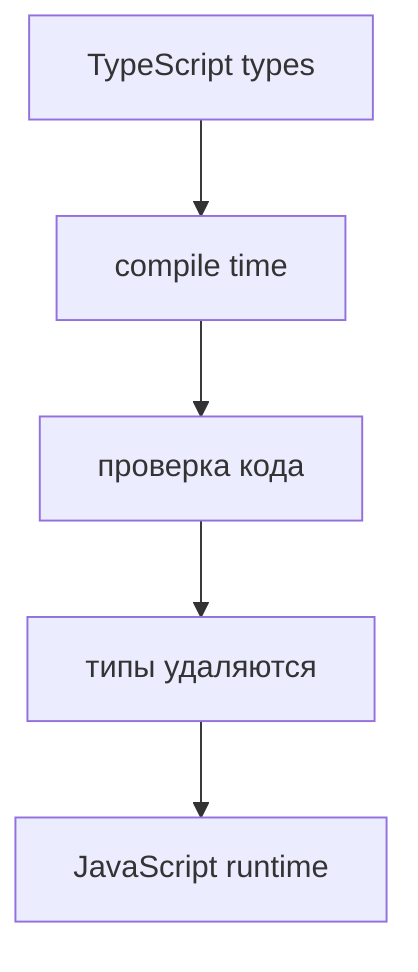
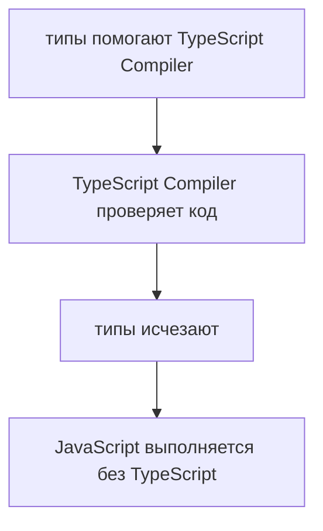

# Type Erasure

## Связь с предыдущей главой

Предыдущая глава разделила compile time и runtime.

Теперь важно понять, что происходит с типами между этими этапами.

## Главный вопрос

> Почему типы исчезают после компиляции?

Короткий ответ: TypeScript-типы нужны компилятору TypeScript для проверки кода, но JavaScript runtime их не выполняет.

## Мотивация

TypeScript добавляет в код информацию для проверки:

```typescript
const timeoutMs: number = 5000;
```

Но JavaScript не знает синтаксис TypeScript-типов.

Перед запуском компилятор TypeScript должен создать обычный JavaScript:

```javascript
const timeoutMs = 5000;
```

Именно поэтому типы удаляются.

## Теория

Type erasure — это удаление TypeScript-типов при генерации JavaScript.



Типы помогают на этапе разработки.

Они не становятся runtime-объектами и не проверяют данные во время выполнения.

## Внутренний механизм

Компилятор TypeScript использует типы как подсказки для анализа.

Например:

```typescript
const baseUrl: string = 'https://api.example.test';
```

После компиляции остается:

```javascript
const baseUrl = 'https://api.example.test';
```

Runtime видит только значение.

Он не знает, что разработчик указывал `string`.

## Главная ментальная модель



TypeScript-типы — это инструмент проверки до запуска, а не часть выполняемой программы.

## Практические примеры

Примеры находятся в:

```text
examples/02-typescript/chapter-99/
```

`01-source-types.ts` показывает TypeScript-код с типами.

`02-after-type-erasure.js` показывает JavaScript после удаления типов.

`03-runtime-validation-needed.js` показывает, что runtime-проверки для внешних данных все еще нужны.

## Automation QA

В API-тестах TypeScript может помочь описать ожидаемую форму данных в коде.

Но реальный ответ сервера приходит во время выполнения.

Если API вернул неожиданную форму, TypeScript сам не остановит runtime.

Поэтому в Automation QA остаются нужны:

* assertions;
* response validation;
* проверки обязательных полей;
* понятные ошибки в helper-функциях.

## Распространённые ошибки

### Ошибка 1. Думать, что типы существуют в runtime

После компиляции TypeScript-типы удаляются.

### Ошибка 2. Проверять внешние данные только типами

Данные из API, файлов и окружения приходят в runtime.

### Ошибка 3. Думать, что TypeScript создает новый язык выполнения

После compilation выполняется JavaScript.

## Практика

Практика находится в:

```text
practice/02-typescript/99-type-erasure.md
```

Решения находятся в:

```text
solutions/02-typescript/99-type-erasure.md
```

## Краткие итоги

Главное:

* TypeScript-типы существуют для проверки кода;
* после компиляции типы удаляются;
* runtime выполняет JavaScript;
* внешние данные требуют runtime-проверок;
* Type Erasure помогает понять реальные границы TypeScript.

## Переход к следующей теме

Мы поняли, что компилятор TypeScript проверяет код и удаляет типы.

Теперь нужно понять, откуда компилятор TypeScript берет правила проекта.
