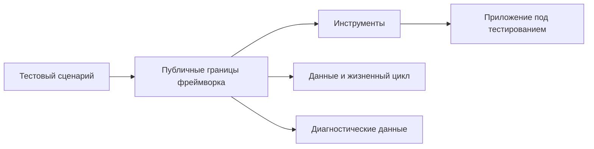

# Что такое Automation QA Framework

## Связь с предыдущей главой

Главы 156–159 показали, как TypeScript помогает поддерживать конфигурацию, тестовые данные и публичные границы большого тестового проекта. Теперь типы считаются известным инструментом, а внимание переходит к устройству самого проекта автоматизации.

## Цель главы

Научиться отличать поддерживаемый Automation QA Framework от отдельного скрипта, библиотеки автоматизации и тестового раннера.

## Главный вопрос

Чем поддерживаемый Automation QA Framework отличается от набора тестовых скриптов?

## Мотивация

Один скрипт может открыть приложение, выполнить действие и проверить результат. Для небольшой одноразовой проверки этого достаточно. Сложность появляется, когда сценариев становится много: им нужны одинаковая конфигурация, подготовка данных, авторизация, очистка, диагностика и единый способ запуска.

Копирование этих механизмов в каждый файл ускоряет первый результат, но делает последующие изменения дорогими. Фреймворк появляется не ради количества папок, а ради согласованных решений, контролируемых изменений и понятной диагностики.

## Теория

### Фреймворк — это система решений

Automation QA Framework — согласованная система правил, границ и переиспользуемой инфраструктуры, внутри которой создаются и выполняются автотесты.

Ключевое слово — **решения**. Фреймворк отвечает на вопросы, которые иначе каждый автор теста решает заново: откуда берётся конфигурация, кто владеет тестовыми данными, когда освобождаются ресурсы, что сохраняется при падении.

Набор файлов с тестами фреймворком не является, даже если их много.

### Чем он отличается от соседних понятий

| Понятие | Ответственность |
| --- | --- |
| Отдельный скрипт | Выполняет конкретную проверку |
| Инструмент автоматизации | Управляет браузером или другим техническим интерфейсом |
| Тестовый раннер | Находит, запускает и завершает тесты |
| Приложение под тестированием | Предоставляет поведение, которое проверяется |
| Automation QA Framework | Соединяет сценарии, инструменты, данные, правила жизненного цикла и диагностику |

Playwright может быть важным инструментом внутри фреймворка, но не заменяет архитектурные решения проекта.

### Признак, что фреймворк нужен

Полезный вопрос: **что произойдёт при изменении одного технического решения?**

Если смена адреса окружения требует правок в тридцати файлах, а добавление нового теста — копирования сорока строк подготовки, значит решения размазаны по сценариям. Это и есть момент, когда инфраструктура начинает окупаться.

Обратный признак тоже важен: если проект состоит из десяти стабильных тестов, которые меняются раз в полгода, слой абстракций принесёт больше работы, чем пользы.

### Цена абстракции

Каждая абстракция требует имени, документации, изменений и отладки. Она добавляет уровень, через который придётся проходить при каждом расследовании падения.

Поэтому архитектура должна расти из **подтверждённых** потребностей: из второго и третьего потребителя, а не из предположения, что они появятся.

### Фреймворк не делает тесты хорошими

Важная граница, которую легко потерять. Фреймворк отвечает за согласованность, предсказуемость и диагностируемость. Он не отвечает за то, **что именно** проверяется.

Плохо выбранная проверка, хрупкое ожидание, неясное бизнес-намерение останутся такими же внутри самой продуманной архитектуры. Более того, большой объём инфраструктуры умеет скрывать слабые сценарии: набор выглядит солидно, а проверяет мало.

### Мера качества

Ценность фреймворка измеряется не количеством слоёв, а ответами на практические вопросы: насколько быстро команда добавляет сценарий, насколько предсказуемо его меняет и насколько быстро понимает причину падения.

Если все три ответа хорошие при трёх модулях — фреймворк хороший. Если плохие при тридцати — количество слоёв ничего не исправило.

## Внутренний механизм

Фреймворк принимает повторяющиеся обязанности и назначает им владельцев. Конфигурация загружается одним механизмом, данные готовятся по общей стратегии, ресурсы освобождаются предсказуемо, а падения оставляют диагностические данные.



Схема показывает не структуру папок, а распределение ответственности.

## Главная ментальная модель

Фреймворк — это система дорог и правил движения. Инструменты являются транспортом, а тестовые сценарии задают маршрут. Сам по себе быстрый транспорт не устраняет хаос в маршрутах.

## Практические примеры

Изолированный скрипт знает слишком много деталей:

```ts
async function verifyOrder(): Promise<void> {
  const environmentUrl = "https://staging.example.test";
  const orderId = "order-42";

  console.log(`Проверка ${orderId} в ${environmentUrl}`);
}
```

Минимальная граница отделяет сценарий от источника конфигурации:

```ts
type TestContext = {
  environmentUrl: string;
  orderId: string;
};

async function verifyOrder(context: TestContext): Promise<void> {
  console.log(`Проверка ${context.orderId} в ${context.environmentUrl}`);
}
```

Это ещё не полноценный фреймворк, но уже пример ответственности, которую можно централизованно контролировать.

```text
examples/03-automation-qa/chapter-160/
```

## Automation QA

В реальном проекте переиспользуемая инфраструктура может отвечать за окружение, авторизацию, данные, клиенты, очистку, журналы и отчёт о выполнении. Её ценность измеряется не количеством абстракций, а согласованностью тестов и тем, насколько предсказуемо команда изменяет и диагностирует их.

Фреймворк не гарантирует хорошие сценарии. Плохо выбранные проверки, хрупкие ожидания и неясное бизнес-намерение останутся плохими даже внутри сложной архитектуры.

## Концептуальные границы и компромиссы

Каждая абстракция имеет цену: её нужно назвать, документировать, изменять и отлаживать. Повторение в двух местах не всегда требует общего вспомогательного компонента. Архитектура должна расти из подтверждённых потребностей проекта, а не из желания заранее предусмотреть всё.

## Распространённые ошибки

- Называть фреймворком любой набор тестовых файлов.
- Считать Playwright готовой архитектурой для любого проекта.
- Добавлять слои без нескольких реальных потребителей.
- Скрывать плохие тесты за большим количеством инфраструктуры.
- Строить сложный фреймворк для маленькой и стабильной задачи.

## Распространённые мифы

**Миф: фреймворк — это набор тестовых файлов и папок.**
Это система решений об ответственности. Структура папок сама по себе ничего не решает.

**Миф: Playwright — готовая архитектура.**
Он закрывает роли инструмента, раннера и проверок. Решения о данных, владельцах и границах остаются за командой.

**Миф: чем больше абстракций, тем зрелее проект.**
Каждая абстракция стоит времени при изменении и при расследовании падения.

**Миф: хороший фреймворк исправляет плохие тесты.**
Он может их скрыть. Качество проверок определяет автор сценария.

## Частые вопросы

**Когда пора вводить инфраструктуру?**
Когда изменение одного технического решения требует правок во многих файлах.

**Нужен ли фреймворк небольшому набору тестов?**
Часто достаточно возможностей раннера и нескольких понятных модулей.

**Как понять, что абстракция преждевременна?**
У неё меньше двух реальных потребителей.

**Чем измерять качество фреймворка?**
Скоростью добавления сценария, предсказуемостью изменений и временем поиска причины падения.

## Проверьте себя

1. Чем фреймворк отличается от набора тестовых файлов?
2. Какие роли закрывает Playwright и какие решения оставляет команде?
3. По какому признаку понять, что инфраструктура начала окупаться?
4. Какова цена каждой абстракции?
5. Чем измеряется качество фреймворка?

## Практика

```text
practice/03-automation-qa/160-what-is-automation-qa-framework.md
```

## Краткие итоги

- Фреймворк объединяет сценарии, инструменты, данные, жизненный цикл и диагностику.
- Библиотека и тестовый раннер решают отдельные задачи внутри проекта.
- Переиспользование полезно при ясной ответственности.
- Абстракции имеют стоимость.
- Размер фреймворка должен соответствовать потребностям проекта.

## Переход к следующей главе

Мы определили фреймворк как целую систему. Следующая глава распределит роли между инструментами и покажет, почему один инструмент не обязан решать все задачи проекта.
