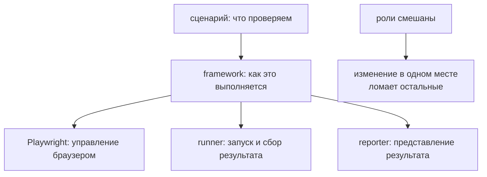

# Инструменты и роли в Automation QA

## Связь с предыдущей главой

Фреймворк объединяет несколько обязанностей. Чтобы не превратить его в монолит, нужно понять, какую роль выполняет каждый участник системы.

## Цель главы

Научиться разделять инструмент, его ответственность и архитектурное решение проекта.

## Главный вопрос

Какую задачу решает каждый инструмент внутри Automation QA проекта?

## Мотивация

Когда инструмент автоматизации браузера называют фреймворком, а тестовый раннер — всей системой автоматизации, границы становятся неясными. Команда начинает ожидать от одного инструмента авторизацию, данные, отчётность, CI и архитектуру одновременно.

## Теория

### Роль — это ответственность, а не пакет

Роль описывает, **за что отвечает** участник процесса. Один продукт может закрывать несколько ролей, а одна роль может распределяться между инструментами.

Различать роли нужно не ради схемы, а ради скорости расследования: при падении первый вопрос — чья это ответственность.

### Кто за что отвечает

| Участник | За что отвечает | За что не обязан отвечать |
| --- | --- | --- |
| Приложение под тестированием | Реализует проверяемое бизнес-поведение | Организовывать тестовый проект |
| Тестовое окружение | Предоставляет доступные сервисы и данные | Определять намерение сценария |
| Инструмент автоматизации браузера | Управляет браузером | Проектировать слои фреймворка |
| Тестовый раннер | Обнаруживает и запускает тесты | Владеть бизнес-данными приложения |
| Система проверок | Сравнивает ожидаемое и фактическое | Готовить окружение |
| API-клиент | Инкапсулирует HTTP-взаимодействие | Управлять UI |
| gRPC-клиент | Выполняет вызовы | Владеть соединениями с базой данных |
| Слой доступа к базе данных | Выполняет контролируемые операции с данными | Описывать пользовательский сценарий |
| Средство отчётности | Представляет результаты и диагностику | Исправлять нестабильность теста |
| Система CI | Запускает команды в воспроизводимой среде | Определять архитектуру кода |
| Фреймворк | Согласует роли и границы | Заменять все инструменты своей реализацией |

### Что делает Playwright

Playwright закрывает автоматизацию браузера. Playwright Test добавляет роли раннера, фикстур и системы проверок.

Даже вместе они не решают за команду: откуда берутся тестовые данные, кто их удаляет, как устроены клиенты к API и базе, что считать диагностикой падения. Это и есть граница между инструментом и фреймворком.

### Зачем разделять роли

Главная практическая выгода — **локализация проблемы**.

При падении REST-сценария возможны минимум четыре разных причины: окружение недоступно, клиент сформировал неверный запрос, проверка использует неверное ожидание, приложение нарушило контракт. Это четыре разных владельца и четыре разных действия.

Если роли смешаны, расследование превращается в чтение всего репозитория. Если разделены — начинается с одного вопроса и сужается за минуты.

### Один инструмент, несколько ролей

Совмещение ролей нормально, пока **логические ответственности остаются различимыми**. Playwright Test совмещает раннер и проверки, и это удобно.

Проблема начинается, когда роли смешиваются в собственном коде: клиент API сам решает, какой статус считать успешным, или средство отчётности пытается чинить нестабильность повторным запуском.

### Признак смешения

Практический тест: возьмите модуль и попробуйте описать его одним предложением без союза «и».

«Клиент отправляет запросы к API» — роль ясна. «Клиент отправляет запросы, готовит данные, проверяет ответ и пишет в отчёт» — четыре роли в одном месте, и любое падение внутри потребует разбираться со всеми четырьмя.

Инструменты распределены по ролям, а не свалены в один слой:



## Внутренний механизм

Каждый инструмент предоставляет техническую возможность. Фреймворк определяет, где она используется, кто ею владеет и через какую публичную границу к ней обращаются тесты.

## Главная ментальная модель

Automation QA проект похож на съёмочную площадку: у каждой роли своя работа, а фреймворк задаёт согласованный процесс. Камера важна, но не является всем производством.

## Практические примеры

Если тест не может подключиться к окружению, это не проблема системы проверок. Если проверка сравнила неверное бизнес-значение, CI лишь честно покажет падение. Правильная классификация сокращает область расследования.

## Automation QA

При падении REST-сценария команда сначала определяет владельца проблемы: тестовое окружение недоступно, API-клиент сформировал неверный запрос, проверка использует неверное ожидание или приложение нарушило контракт. Смешивание ролей превращает такое расследование в поиск по всему репозиторию.

## Концептуальные границы и компромиссы

Один продукт может совмещать несколько ролей. Это удобно, пока логические ответственности остаются различимыми. Разделение ролей не требует отдельной библиотеки или класса для каждой строки таблицы.

## Распространённые ошибки

- Ожидать, что средство отчётности устранит причину нестабильного теста.
- Помещать бизнес-решения в сценарии CI.
- Считать API-клиент владельцем всего жизненного цикла тестовых данных.
- Создавать собственный инструмент там, где готовый уже решает задачу.

## Распространённые мифы

**Миф: роль — это отдельная библиотека или класс.**
Роль — это ответственность. Один продукт может закрывать несколько.

**Миф: Playwright Test решает всё.**
Он закрывает раннер, фикстуры и проверки. Данные, клиенты и диагностика остаются за командой.

**Миф: средство отчётности может уменьшить нестабильность.**
Оно показывает результат. Причину устраняет тот, кто владеет ею.

**Миф: совмещение ролей всегда плохо.**
Оно допустимо, пока ответственности различимы.

## Частые вопросы

**Зачем вообще различать роли?**
Чтобы расследование падения начиналось с одного вопроса, а не с чтения всего репозитория.

**Кто владеет тестовыми данными?**
Не API-клиент. Обычно фикстура или отдельный слой данных с явной очисткой.

**Можно ли принимать бизнес-решения в сценариях CI?**
Нет: CI воспроизводимо запускает команды, а не определяет логику проверок.

**Как понять, что роли смешались?**
Модуль не описывается одним предложением без союза «и».

## Проверьте себя

1. Что такое роль и чем она не является?
2. Какие роли закрывает Playwright Test?
3. Назовите четыре возможных владельца падения REST-сценария.
4. При каком условии совмещение ролей допустимо?
5. Какой простой тест выявляет смешение ответственностей?

## Практика

```text
practice/03-automation-qa/161-tools-and-roles-in-automation-qa.md
```

## Краткие итоги

- Инструмент предоставляет техническую возможность, фреймворк назначает ей место и владельца.
- Один продукт может совмещать роли, но ответственности всё равно различаются.
- Приложение под тестированием и тестовое окружение находятся за границей тестового кода.
- Классификация ответственности помогает диагностике.

## Переход к следующей главе

Теперь роли известны. Следующий вопрос — как объединить их в слои с понятным потоком зависимостей.
