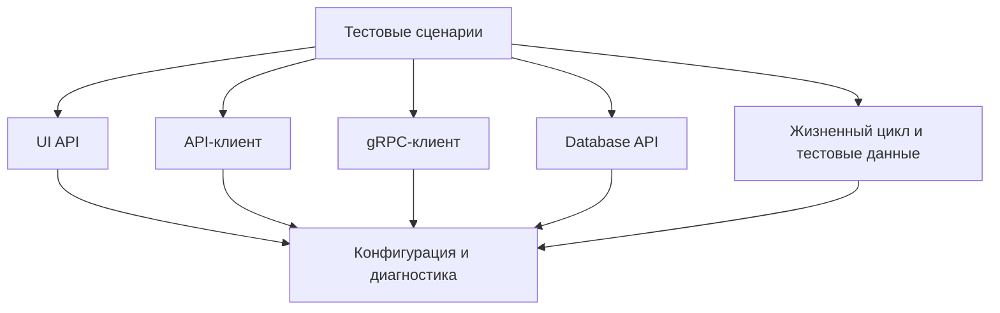

# Архитектурные слои и поток зависимостей

## Связь с предыдущей главой

Мы разделили роли инструментов. Теперь нужно определить границы, через которые эти роли взаимодействуют.

## Цель главы

Научиться проектировать слои и направлять зависимости без универсальной схемы папок.

## Главный вопрос

Как разделить UI, API, gRPC, доступ к базе данных и общую инфраструктуру без циклических зависимостей?

## Мотивация

Если тест напрямую знает селекторы, HTTP-заголовки, gRPC metadata, SQL и формат журналов, изменение любой детали затрагивает сценарий. Если клиенты импортируют тесты или друг друга по кругу, невозможно понять порядок создания компонентов.

## Теория

### Слой — это одна устойчивая ответственность

Архитектурный слой объединяет код, который меняется по одной причине: слой сценариев, UI-абстракции, клиенты API и gRPC, доступ к базе, жизненный цикл, конфигурация, диагностика.

Не каждому проекту нужны все слои. Слой оправдан, когда у соответствующей ответственности действительно есть отдельный владелец и своя причина изменения.

### Публичная граница

Граница показывает, что слой **разрешает** использовать. Всё остальное — внутренняя деталь, которую можно менять, не трогая потребителей.



Стрелка означает зависимость: верхний компонент использует публичную границу нижнего. Это один допустимый вариант, а не обязательный шаблон.

### Направление зависимостей важнее списка слоёв

Слои можно называть как угодно и группировать по-разному. Что действительно определяет качество архитектуры — **односторонность** зависимостей.

Пока стрелки идут в одну сторону, у каждого изменения есть предсказуемая область влияния. Появление обратной стрелки ломает это свойство: теперь изменение внизу может потребовать правок наверху и наоборот.

### Почему циклы смертельны

Циклическая зависимость не просто неудобна — она делает невозможным ответ на вопрос «кто от кого зависит».

Практические последствия: модуль нельзя протестировать отдельно, нельзя заменить реализацию, нельзя определить порядок инициализации. В JavaScript циклический импорт вдобавок даёт частично инициализированный модуль — ошибку, которая проявляется как необъяснимый `undefined`.

Поэтому цикл — не стилистическая претензия, а сигнал, что границы проведены неверно.

### Кто оркестрирует

Сценарий может подготовить данные через API, выполнить действие в UI и проверить результат в базе. Это **не** означает, что UI-слой должен импортировать API-клиент.

Оркестрация принадлежит слою сценариев: именно он видит публичные границы нужных слоёв и соединяет их. Слои друг о друге не знают.

Правило простое: **знание о последовательности живёт наверху**, знание о способе выполнения — внизу.

### Composition Root

Точка сборки создаёт конкретные компоненты и связывает их в одном месте:

```ts
function createOrderReader(diagnostics: Diagnostics): OrderReader {
  return {
    async readStatus(orderId) {
      diagnostics.record(`Чтение статуса ${orderId}`);
      return "created";
    },
  };
}
```

Остальные модули получают готовые зависимости через параметры. Контейнер внедрения зависимостей для этого не нужен — его стоит вводить только если ручная сборка действительно стала проблемой.

## Внутренний механизм

Точка сборки зависимостей (Composition Root) создаёт конкретные компоненты и связывает их. Остальные модули получают готовые зависимости через параметры или явно определённые фабрики. Для этого не нужен контейнер внедрения зависимостей.

```ts
type Diagnostics = {
  record(message: string): void;
};

type OrderReader = {
  readStatus(orderId: string): Promise<string>;
};

function createOrderReader(diagnostics: Diagnostics): OrderReader {
  return {
    async readStatus(orderId) {
      diagnostics.record(`Чтение статуса ${orderId}`);
      return "created";
    },
  };
}
```

Фабрика связывает зависимости в одном месте. `OrderReader` не знает о тестовом раннере и не импортирует тест.

```text
examples/03-automation-qa/chapter-162/
```

## Главная ментальная модель

Поток зависимостей — это карта односторонних дорог. Публичные границы являются въездами, а циклическая дорога не позволяет определить, кто от кого зависит.

## Практические примеры

Нарушение границы: UI-сценарий сам формирует SQL для проверки. Более ясная граница: сценарий вызывает `ordersDatabase.readOrder(orderId)`, а слой доступа к базе данных владеет SQL.

## Automation QA

Сценарий может использовать API для подготовки данных, UI для действия и базу данных для проверки. Это не означает, что UI-слой должен импортировать API-клиент или слой доступа к базе данных. Оркестрация принадлежит слою тестовых сценариев, который видит публичные API нужных слоёв.

## Концептуальные границы и компромиссы

Структура по слоям удобна при устойчивых технических границах. Структура по функциональности группирует код по бизнес-возможностям. Оба варианта допустимы. Важнее направление зависимостей, понятные владельцы и отсутствие утечки технических деталей.

## Распространённые ошибки

- Требовать каждый возможный слой в маленьком проекте.
- Считать структуру папок архитектурой сама по себе.
- Разрешать циклические импорты ради удобства.
- Делать публичными все внутренние функции.
- Вводить контейнер внедрения зависимостей до появления проблемы сборки компонентов.

## Распространённые мифы

**Миф: архитектура — это структура папок.**
Папки можно переименовать, не изменив ни одной зависимости. Архитектуру определяет направление связей.

**Миф: чем больше слоёв, тем лучше.**
Слой оправдан наличием отдельного владельца и своей причины изменения.

**Миф: циклический импорт — вопрос стиля.**
Он лишает возможности определить порядок инициализации и даёт частично готовые модули.

**Миф: если сценарий использует три слоя, они должны знать друг о друге.**
Их соединяет слой сценариев; сами слои остаются независимыми.

## Частые вопросы

**Как понять, что слой лишний?**
У него нет отдельного владельца, и он меняется всегда вместе с соседним.

**Кто должен соединять API, UI и базу в сценарии?**
Слой тестовых сценариев. Он видит публичные границы и задаёт последовательность.

**Нужен ли контейнер внедрения зависимостей?**
Только если ручная сборка в одной точке стала реальной проблемой.

**Что делать при обнаружении цикла?**
Не разрывать его техническим приёмом, а пересмотреть границы: цикл означает, что ответственность разделена неверно.

## Проверьте себя

1. Что объединяет код внутри одного слоя?
2. Почему направление зависимостей важнее списка слоёв?
3. Какие практические последствия у циклической зависимости?
4. Кто отвечает за оркестрацию сценария через несколько слоёв?
5. Зачем нужна точка сборки зависимостей?

## Практика

```text
practice/03-automation-qa/162-architectural-layers-and-dependency-flow.md
```

## Краткие итоги

- Слой объединяет одну устойчивую ответственность.
- Тесты используют публичные API слоёв.
- Технические детали взаимодействия не должны протекать в сценарии.
- Точка сборки зависимостей связывает компоненты.
- Набор слоёв зависит от потребностей проекта.

## Переход к следующей главе

Слои задают крупные границы. Далее мы проведём более тонкую границу между кодом бизнес-сценария и инфраструктурными механизмами.
