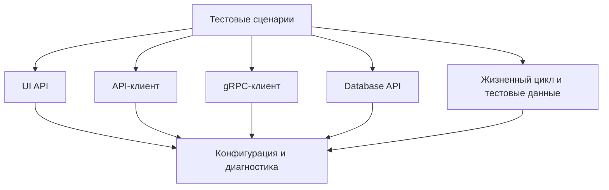

# Архитектурные слои и поток зависимостей

## Связь с предыдущей главой

Мы разделили роли инструментов. Теперь нужно определить границы, через которые эти роли взаимодействуют.

## Цель главы

Научиться проектировать слои и направлять зависимости без универсальной схемы папок.

## Главный вопрос

Как разделить UI, API, gRPC, доступ к базе данных и общую инфраструктуру без циклических зависимостей?

## Мотивация

Если тест напрямую знает селекторы, HTTP-заголовки, gRPC metadata, SQL и формат журналов, изменение любой детали затрагивает сценарий. Если клиенты импортируют тесты или друг друга по кругу, невозможно понять порядок создания компонентов.

## Теория

Архитектурный слой объединяет код с одной устойчивой ответственностью. Проект может содержать слой тестовых сценариев, UI-абстракции, API, gRPC, доступ к базе данных, управление жизненным циклом, конфигурацию, тестовые данные и диагностику. Не каждый проект нуждается во всех слоях.

Публичная граница показывает, что слой разрешает использовать. Внутренние детали взаимодействия остаются за ней.



Стрелка означает зависимость: верхний компонент использует публичную границу нижнего. Это один допустимый вариант, а не обязательный шаблон.

## Внутренний механизм

Точка сборки зависимостей (Composition Root) создаёт конкретные компоненты и связывает их. Остальные модули получают готовые зависимости через параметры или явно определённые фабрики. Для этого не нужен контейнер внедрения зависимостей.

```ts
type Diagnostics = {
  record(message: string): void;
};

type OrderReader = {
  readStatus(orderId: string): Promise<string>;
};

function createOrderReader(diagnostics: Diagnostics): OrderReader {
  return {
    async readStatus(orderId) {
      diagnostics.record(`Чтение статуса ${orderId}`);
      return "created";
    },
  };
}
```

Фабрика связывает зависимости в одном месте. `OrderReader` не знает о тестовом раннере и не импортирует тест.

```text
examples/03-automation-qa/chapter-162/
```

## Главная ментальная модель

Поток зависимостей — это карта односторонних дорог. Публичные границы являются въездами, а циклическая дорога не позволяет определить, кто от кого зависит.

## Практические примеры

Нарушение границы: UI-сценарий сам формирует SQL для проверки. Более ясная граница: сценарий вызывает `ordersDatabase.readOrder(orderId)`, а слой доступа к базе данных владеет SQL.

## Automation QA

Сценарий может использовать API для подготовки данных, UI для действия и базу данных для проверки. Это не означает, что UI-слой должен импортировать API-клиент или слой доступа к базе данных. Оркестрация принадлежит слою тестовых сценариев, который видит публичные API нужных слоёв.

## Концептуальные границы и компромиссы

Структура по слоям удобна при устойчивых технических границах. Структура по функциональности группирует код по бизнес-возможностям. Оба варианта допустимы. Важнее направление зависимостей, понятные владельцы и отсутствие утечки технических деталей.

## Распространённые ошибки

- Требовать каждый возможный слой в маленьком проекте.
- Считать структуру папок архитектурой сама по себе.
- Разрешать циклические импорты ради удобства.
- Делать публичными все внутренние функции.
- Вводить контейнер внедрения зависимостей до появления проблемы сборки компонентов.

## Практика

```text
practice/03-automation-qa/162-architectural-layers-and-dependency-flow.md
```

## Краткие итоги

- Слой объединяет одну устойчивую ответственность.
- Тесты используют публичные API слоёв.
- Технические детали взаимодействия не должны протекать в сценарии.
- Точка сборки зависимостей связывает компоненты.
- Набор слоёв зависит от потребностей проекта.

## Переход к следующей главе

Слои задают крупные границы. Далее мы проведём более тонкую границу между кодом бизнес-сценария и инфраструктурными механизмами.
