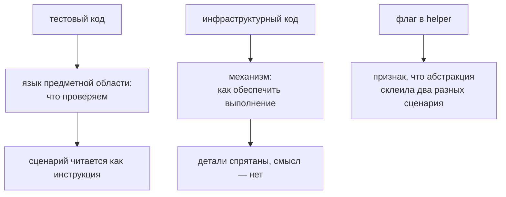

# Тестовый и инфраструктурный код

## Связь с предыдущей главой

Архитектурные слои определили направление зависимостей. Теперь нужно понять, какой код должен оставаться в сценарии, а какой принадлежит переиспользуемой инфраструктуре.

## Цель главы

Научиться сохранять читаемое намерение теста, не скрывая его за вспомогательными компонентами и техническими деталями.

## Главный вопрос

Где проходит граница между сценарием теста и механизмами фреймворка?

## Мотивация

Сценарий с настройкой соединения, заголовками, селекторами и очисткой данных трудно читать. Но сценарий из вызовов `doEverything()` и `checkResult()` не лучше: технические детали исчезли вместе со смыслом проверки.

## Теория

### Две разные задачи

Тестовый код отвечает на вопрос **что проверяется**: бизнес-сценарий, конкретные данные, действие, ожидаемое поведение.

Инфраструктурный код отвечает на вопрос **как это обеспечить**: подключение, конфигурация, клиенты, подготовка и очистка данных, журналы, отчётность, жизненный цикл ресурсов.

| Вопрос | Тестовый код | Инфраструктурный код |
| --- | --- | --- |
| Что проверяется? | Да | Нет |
| Как подключиться? | Нет | Да |
| Какое состояние ожидается? | Да | Поддерживает проверку |
| Кто освобождает ресурс? | Объявляет потребность | Реализует жизненный цикл |

### Язык предметной области должен оставаться видимым

Сравните две записи одного сценария:

```ts
await helper.run("admin", "order-42", true);
```

```ts
const order = await orders.createFor("admin");
await orders.cancel(order.id);
await orderChecks.expectStatus(order.id, "cancelled");
```

Второй вариант скрывает технические детали, но **сохраняет бизнес-действия**. Первый скрывает и то, и другое — и требует открыть реализацию, чтобы понять, что вообще происходит.

Критерий простой: из тела теста должно быть понятно, что делает пользователь и что должно произойти.

### Когда абстракция оправдана

Повторение само по себе не доказывает необходимость общего компонента. Нужны два условия одновременно:

1. У повторяющегося поведения есть **общий владелец** — тот, кто отвечает за его изменение.
2. У него **одна причина изменения** — при правке меняются все потребители сразу.

Если два куска кода похожи, но меняются по разным причинам, общий компонент сделает хуже: каждое изменение будет требовать параметров и условий, и через полгода функция обрастёт флагами.

### Флаги — признак неудачной абстракции

```ts
await helper.run(user, id, true, false, "full");
```

Логические параметры, меняющие поведение, почти всегда означают, что объединили несвязанное. Лучше две понятные функции, чем одна с переключателями.

### Что нельзя прятать

Два вида кода должны оставаться видимыми в тесте:

- **ключевые проверки** — иначе отчёт о падении укажет на подготовку, а не на нарушенное требование;
- **диагностика** — если абстракция глотает ошибку и бросает свою, расследование теряет причину.

Инфраструктура вправе скрывать «как», но не вправе скрывать «что пошло не так».

### Дублирование дешевле неправильной абстракции

Небольшое локальное повторение легко заметить и исправить. Неправильная абстракция расползается по проекту и закрепляется: её уже используют двадцать тестов, и переделка стоит дороже, чем исходное дублирование.

Практическое правило: сначала повторить, потом понять, что именно повторяется, и только затем обобщать.

Два вида кода отвечают на разные вопросы:



## Внутренний механизм

Переиспользуемый компонент становится оправданным, когда у повторяющегося поведения появляется общий владелец и единая причина изменения. Простое сходство строк ещё не доказывает необходимость абстракции.

## Главная ментальная модель

Сценарий — это инструкция «что проверить». Инфраструктура — механизм «как обеспечить выполнение». Хорошая граница оставляет инструкцию читаемой, а механизм — наблюдаемым.

## Практические примеры

Плохо читаемое намерение:

```ts
await helper.run("admin", "order-42", true);
```

Более ясная последовательность действий:

```ts
const order = await orders.createFor("admin");
await orders.cancel(order.id);
await orderChecks.expectStatus(order.id, "cancelled");
```

Второй вариант скрывает технические детали взаимодействия, но сохраняет бизнес-действия.

## Automation QA

API-аутентификация и формирование запроса принадлежат клиенту. Выбор проверяемого статуса принадлежит сценарию. Очистка данных может выполняться fixture или менеджером данных, но сценарий должен позволять понять, какие данные он создаёт и кому они принадлежат.

## Концептуальные границы и компромиссы

Небольшое локальное дублирование иногда дешевле преждевременного вспомогательного компонента. Общий компонент полезен, если его имя отражает ответственность, ошибки диагностируются, а потребители действительно используют одно поведение. При этом техническая деталь может остаться в тесте, если она важна для смысла конкретного сценария и не создаёт повторяемого инфраструктурного механизма.

## Распространённые ошибки

- Ставить целью нулевое дублирование.
- Создавать универсальный вспомогательный компонент с множеством логических параметров.
- Прятать проверки внутри подготовки данных без ясного имени.
- Терять журналы и причины ошибки внутри абстракции.
- Создавать общий код без владельца.

## Распространённые мифы

**Миф: цель — нулевое дублирование.**
Цель — понятный код. Неправильная абстракция обходится дороже повторения.

**Миф: чем короче тест, тем лучше.**
Тест, из которого исчезло бизнес-намерение, стал короче и бесполезнее.

**Миф: похожий код нужно объединять.**
Объединять нужно код с общим владельцем и одной причиной изменения.

**Миф: проверки можно унести в хелпер ради чистоты.**
Тогда отчёт о падении укажет на подготовку, а не на нарушенное требование.

## Частые вопросы

**Как понять, что абстракция преждевременна?**
У неё нет общего владельца либо потребители меняются по разным причинам.

**О чём говорят логические параметры в хелпере?**
О том, что объединили несвязанное поведение. Обычно лучше разделить.

**Что обязательно остаётся в тесте?**
Ключевые проверки и бизнес-действия.

**Почему абстракция не должна глотать ошибки?**
Расследование теряет исходную причину и начинается заново.

## Проверьте себя

1. На какие вопросы отвечают тестовый и инфраструктурный код?
2. Какие два условия оправдывают общий компонент?
3. Почему логические параметры — признак неудачной абстракции?
4. Что нельзя прятать внутри инфраструктуры и почему?
5. Почему дублирование бывает дешевле обобщения?

## Практика

```text
practice/03-automation-qa/163-test-code-and-infrastructure-code.md
```

## Краткие итоги

- Тестовый код выражает бизнес-намерение.
- Инфраструктурный код владеет техническими механизмами.
- Вспомогательный компонент не должен скрывать смысл сценария.
- Общая абстракция требует владельца и общей причины изменения.
- Наблюдаемость важнее внешней краткости.

## Переход к следующей главе

Мы разделили виды кода. Теперь рассмотрим временную последовательность: как инфраструктура сопровождает тест от загрузки конфигурации до очистки данных и формирования отчёта.
