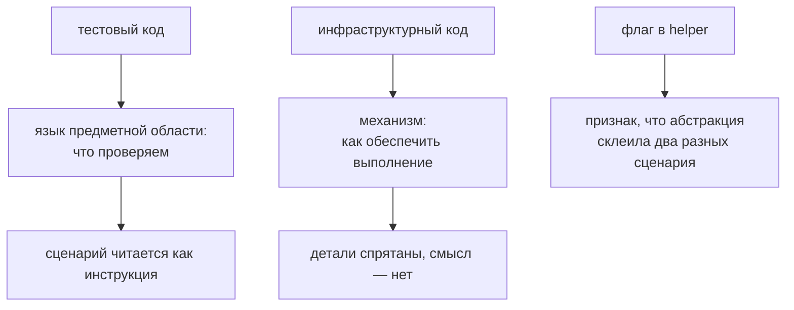

# Тестовый и инфраструктурный код

## Связь с предыдущей главой

Архитектурные слои определили направление зависимостей. Теперь нужно понять, какой код должен оставаться в сценарии, а какой принадлежит переиспользуемой инфраструктуре.

## Цель главы

Научиться сохранять читаемое намерение теста, не скрывая его за вспомогательными компонентами и техническими деталями.

## Главный вопрос

Где проходит граница между сценарием теста и механизмами фреймворка?

## Мотивация

Сценарий с настройкой соединения, заголовками, селекторами и очисткой данных трудно читать. Но сценарий из вызовов `doEverything()` и `checkResult()` не лучше: технические детали исчезли вместе со смыслом проверки.

## Теория

### Две разные задачи

Тестовый код отвечает на вопрос **что проверяется**: бизнес-сценарий, конкретные данные, действие, ожидаемое поведение.

Инфраструктурный код отвечает на вопрос **как это обеспечить**: подключение, конфигурация, клиенты, подготовка и очистка данных, журналы, отчётность, жизненный цикл ресурсов.

| Вопрос | Тестовый код | Инфраструктурный код |
| --- | --- | --- |
| Что проверяется? | Да | Нет |
| Как подключиться? | Нет | Да |
| Какое состояние ожидается? | Да | Поддерживает проверку |
| Кто освобождает ресурс? | Объявляет потребность | Реализует жизненный цикл |

### Язык предметной области должен оставаться видимым

Сравните две записи одного сценария:

```ts
await helper.run("admin", "order-42", true);
```

```ts
const order = await orders.createFor("admin");
await orders.cancel(order.id);
await orderChecks.expectStatus(order.id, "cancelled");
```

Второй вариант скрывает технические детали, но **сохраняет бизнес-действия**. Первый скрывает и то, и другое — и требует открыть реализацию, чтобы понять, что вообще происходит.

Критерий простой: из тела теста должно быть понятно, что делает пользователь и что должно произойти.

### Когда абстракция оправдана

Повторение само по себе не доказывает необходимость общего компонента. Нужны два условия одновременно:

1. У повторяющегося поведения есть **общий владелец** — тот, кто отвечает за его изменение.
2. У него **одна причина изменения** — при правке меняются все потребители сразу.

Если два куска кода похожи, но меняются по разным причинам, общий компонент сделает хуже: каждое изменение будет требовать параметров и условий, и через полгода функция обрастёт флагами.

### Флаги — признак неудачной абстракции

```ts
await helper.run(user, id, true, false, "full");
```

Логические параметры, меняющие поведение, почти всегда означают, что объединили несвязанное. Лучше две понятные функции, чем одна с переключателями.

### Что нельзя прятать

Два вида кода должны оставаться видимыми в тесте:

- **ключевые проверки** — иначе отчёт о падении укажет на подготовку, а не на нарушенное требование;
- **диагностика** — если абстракция глотает ошибку и бросает свою, расследование теряет причину.

Инфраструктура вправе скрывать «как», но не вправе скрывать «что пошло не так».

### Дублирование дешевле неправильной абстракции

Небольшое локальное повторение легко заметить и исправить. Неправильная абстракция расползается по проекту и закрепляется: её уже используют двадцать тестов, и переделка стоит дороже, чем исходное дублирование.

Практическое правило: сначала повторить, потом понять, что именно повторяется, и только затем обобщать.

Два вида кода отвечают на разные вопросы:


```mermaid
flowchart TD
    A["тестовый код"] --> B["язык предметной области:<br/>что проверяем"]
    C["инфраструктурный код"] --> D["механизм:<br/>как обеспечить выполнение"]
    B --> E["сценарий читается как инструкция"]
    D --> F["детали спрятаны, смысл — нет"]
    G["флаг в helper"] --> H["признак, что абстракция<br/>склеила два разных сценария"]
```

## Внутренний механизм

Переиспользуемый компонент становится оправданным, когда у повторяющегося поведения появляется общий владелец и единая причина изменения. Простое сходство строк ещё не доказывает необходимость абстракции.

### Два вида кода и разные требования к ним

| | Тестовый код | Инфраструктурный код |
| --- | --- | --- |
| что выражает | намерение проверки | способ обращения наружу |
| читают ли его при падении | всегда | только когда причина внутри |
| что в нём ценно | ясность и явность | переносимость и владение ресурсами |
| сколько потребителей | один сценарий | много сценариев |

Из третьей строки следует правило, которое чаще всего нарушают: в тестовом коде
повтор допустим, если он делает намерение видимым. Устранение дублирования там
оплачивается ясностью.

### Когда абстракция оправдана

```text
похожие строки              → ещё не основание
одна причина изменения      → основание
общий владелец              → основание
флаги в параметрах          → признак, что внутри несколько сценариев
```

Критерий не в сходстве кода, а в том, будут ли два места меняться по одному
поводу. Если поводы разные, общая функция разойдётся при первой же правке — и
получит параметр-флаг, который делает вызов нечитаемым.

### Что нельзя прятать

| Можно скрыть | Нельзя скрыть |
| --- | --- |
| сборку запроса и адреса | утверждение теста |
| преобразование ответа | причину ошибки: статус, тело, идентификатор |
| подготовку данных | ключевое действие проверяемого сценария |

Обёртка, выбрасывающая свою ошибку без `cause`, стирает правый столбец целиком —
и расследование начинается с нуля.

## Главная ментальная модель

Сценарий — это инструкция «что проверить». Инфраструктура — механизм «как обеспечить выполнение». Хорошая граница оставляет инструкцию читаемой, а механизм — наблюдаемым.

## Практические примеры

Полный пример границы — в файле ниже: объект страницы знает, **как** выполнить
вход, функция тестовых данных знает, **под кем** его выполнять, а сценарий не
знает ни того, ни другого и остаётся читаемым.

```text
examples/03-automation-qa/chapter-163/01-test-and-infrastructure.ts
```

Плохо читаемое намерение:

```ts
await helper.run("admin", "order-42", true);
```

Более ясная последовательность действий:

```ts
const order = await orders.createFor("admin");
await orders.cancel(order.id);
await orderChecks.expectStatus(order.id, "cancelled");
```

Второй вариант скрывает технические детали взаимодействия, но сохраняет бизнес-действия.

## Automation QA

Аутентификация в API и формирование запроса принадлежат клиенту. Выбор проверяемого статуса принадлежит сценарию. Очистка данных может выполняться фикстурой или менеджером данных, но сценарий должен позволять понять, какие данные он создаёт и кому они принадлежат.

## Концептуальные границы и компромиссы

Небольшое локальное дублирование иногда дешевле преждевременного вспомогательного компонента. Общий компонент полезен, если его имя отражает ответственность, ошибки диагностируются, а потребители действительно используют одно поведение. При этом техническая деталь может остаться в тесте, если она важна для смысла конкретного сценария и не создаёт повторяемого инфраструктурного механизма.

## Распространённые ошибки

- Ставить целью нулевое дублирование — два похожих теста часто проверяют разное. Их объединение даёт помощник с флагами, который читается хуже, чем исходный повтор.

- Создавать универсальный вспомогательный компонент с множеством логических параметров — вызов вида `setup(true, false, true)` не сообщает читателю ничего, а сами флаги почти всегда означают несколько разных сценариев внутри одной функции.

- Прятать проверки внутри подготовки данных без ясного имени — падение приходит из шага, который назывался подготовкой, и отчёт указывает не на проверяемое поведение.

- Терять журналы и причины ошибки внутри абстракции — обёртка, выбрасывающая свою ошибку без `cause`, стирает код статуса, тело ответа и идентификатор запроса. Расследование начинается с нуля.

- Создавать общий код без владельца — общий помощник без ответственного накапливает правки под частные случаи и через полгода не подходит никому.

## Распространённые мифы

**Миф: цель — нулевое дублирование.**
Цель — понятный код. Неправильная абстракция обходится дороже повторения.

**Миф: чем короче тест, тем лучше.**
Тест, из которого исчезло бизнес-намерение, стал короче и бесполезнее.

**Миф: похожий код нужно объединять.**
Объединять нужно код с общим владельцем и одной причиной изменения.

**Миф: проверки можно унести в хелпер ради чистоты.**
Тогда отчёт о падении укажет на подготовку, а не на нарушенное требование.

## Частые вопросы

**Как понять, что абстракция преждевременна?**
У неё нет общего владельца либо потребители меняются по разным причинам.

**О чём говорят логические параметры в хелпере?**
О том, что объединили несвязанное поведение. Обычно лучше разделить.

**Что обязательно остаётся в тесте?**
Ключевые проверки и бизнес-действия.

**Почему абстракция не должна глотать ошибки?**
Расследование теряет исходную причину и начинается заново.

## Проверьте себя

1. На какие вопросы отвечают тестовый и инфраструктурный код?
2. Какие два условия оправдывают общий компонент?
3. Почему логические параметры — признак неудачной абстракции?
4. Что нельзя прятать внутри инфраструктуры и почему?
5. Почему дублирование бывает дешевле обобщения?

### Ответы

1. Тестовый код отвечает на вопрос «что проверяется», инфраструктурный — «как это делается технически».
2. Одинаковая суть, а не одинаковый код, и общая причина для изменения. Случайное совпадение двух фрагментов общим компонентом не является.
3. Логический параметр означает, что функция делает две разные вещи. Вместо одного понятного действия получается развилка, которую надо помнить при каждом вызове.
4. Проверки и ожидаемые значения. Спрятанная проверка делает падение необъяснимым: по коду теста не видно, что именно не совпало.
5. Обобщение связывает места, которые изменились одинаково один раз. Если дальше они меняются по-разному, общий компонент обрастает флагами и ветками — это дороже, чем две независимые копии.

## Практика

```text
practice/03-automation-qa/163-test-code-and-infrastructure-code.md
```

## Краткие итоги

- Тестовый код выражает бизнес-намерение.
- Инфраструктурный код владеет техническими механизмами.
- Вспомогательный компонент не должен скрывать смысл сценария.
- Общая абстракция требует владельца и общей причины изменения.
- Наблюдаемость важнее внешней краткости.

## Переход к следующей главе

Мы разделили виды кода. Теперь рассмотрим временную последовательность: как инфраструктура сопровождает тест от загрузки конфигурации до очистки данных и формирования отчёта.
