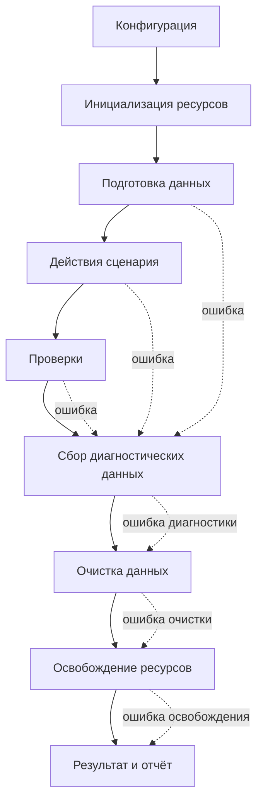

# Жизненный цикл автотеста

## Связь с предыдущей главой

Тестовый код описывает намерение, а инфраструктура обеспечивает выполнение. Жизненный цикл показывает, когда именно включается каждая ответственность.

## Цель главы

Понять нормальный и аварийный путь автотеста без привязки к API конкретного тестового раннера.

## Главный вопрос

Какие этапы проходит автотест от загрузки конфигурации до сохранения диагностических данных?

## Мотивация

Падение может произойти до первого бизнес-действия или после успешной проверки. Если проект считает тестом только тело сценария, ресурсы остаются открытыми, данные — неочищенными, а отчёт — неполным.

## Теория

Обобщённый жизненный цикл состоит из этапов:

1. Загрузка и проверка конфигурации.
2. Подготовка тестового окружения.
3. Инициализация ресурсов.
4. Подготовка тестовых данных.
5. Выполнение сценария.
6. Проверка результата.
7. Сбор диагностических данных.
8. Очистка данных.
9. Освобождение ресурсов.
10. Формирование результата и отчёта.



Попытка очистки следует после сбора диагностических данных независимо от успеха основных действий. Ошибка очистки фиксируется отдельно и не должна скрывать исходное падение.

## Внутренний механизм

Оркестрация жизненного цикла хранит состояние созданных ресурсов и выполняет завершающие действия независимо от результата сценария.

```ts
async function runScenario(
  execute: () => Promise<void>,
  cleanup: () => Promise<void>,
): Promise<void> {
  let executionFailed = false;
  let executionError: unknown;

  try {
    await execute();
  } catch (error) {
    executionFailed = true;
    executionError = error;
  }

  try {
    await cleanup();
  } catch (cleanupError) {
    if (executionFailed) {
      throw new AggregateError(
        [executionError, cleanupError],
        "Сценарий и очистка завершились с ошибками",
      );
    }

    throw cleanupError;
  }

  if (executionFailed) {
    throw executionError;
  }
}
```

Это упрощённая модель, а не реализация hooks или fixtures. Она показывает попытку очистки и сохранение обеих ошибок, если падают и сценарий, и очистка. `AggregateError` хранит обе причины в массиве `errors`, поэтому расследование не теряет ни исходное падение, ни ошибку очистки. Простой `await cleanup()` внутри `finally` гарантирует попытку очистки, но без дополнительной обработки ошибка очистки может заменить исходную.

Конкретный тестовый раннер может объединять этапы или называть их иначе. Эта модель описывает ответственности, а не обязательный набор доступных hooks.

```text
examples/03-automation-qa/chapter-164/
```

## Главная ментальная модель

Жизненный цикл — это рейс с подготовкой, маршрутом и обязательным возвращением оборудования. Авария на маршруте не отменяет учёт и возврат ресурсов.

## Практические примеры

- Ошибка подготовки: тестовые данные не созданы, сценарий не начинается, но открытое соединение освобождается.
- Ошибка действия: сохраняются бизнес-идентификатор и данные взаимодействия, затем запускается очистка.
- Ошибка проверки: фактический результат фиксируется до удаления данных.
- Ошибка очистки: основная ошибка не теряется, причина сбоя очистки добавляется отдельно.
- Ошибка отчётности: результат теста сохраняет исходный статус, а проблема отчёта регистрируется как отдельная диагностическая ошибка.

## Automation QA

UI-сессия, API-клиент и соединение с базой данных имеют разное время жизни. Статическая учётная запись может переживать тест, а созданный заказ принадлежит одному сценарию. Фреймворк должен явно определять область жизни и владельца каждого ресурса.

## Концептуальные границы и компромиссы

Не каждый этап требует отдельного модуля. Важно, чтобы аварийный путь был определён, очистка не зависела от успеха сценария, а вторичная ошибка не скрывала первоначальную причину.

## Распространённые ошибки

- Выполнять очистку только в конце успешного сценария.
- Перезаписывать основную ошибку ошибкой очистки.
- Собирать screenshot или response после удаления нужного состояния.
- Использовать один глобальный ресурс без контролируемого времени жизни.
- Смешивать подготовку данных и бизнес-проверку.

## Практика

```text
practice/03-automation-qa/164-automated-test-lifecycle.md
```

## Краткие итоги

- Жизненный цикл начинается до сценария и заканчивается после формирования отчёта.
- Подготовка, действие, проверка, очистка и отчётность могут завершаться с ошибками независимо друг от друга.
- Диагностические данные собираются до разрушения полезного состояния.
- Очистка должна запускаться и при падении сценария.
- У каждого ресурса есть область жизни и владелец.

## Переход к следующей главе

Жизненный цикл распределяет ответственность во времени. Последняя глава модуля закрепит её в границах файлов и публичных API проекта.
