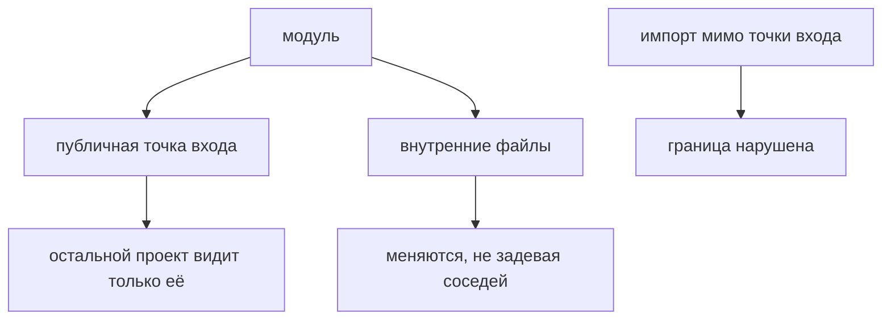

# Структура проекта и границы модулей

## Связь с предыдущей главой

Мы определили роли, слои, виды кода и жизненный цикл. Теперь можно организовать проект так, чтобы эти решения были видны в его модулях.

## Цель главы

Научиться выбирать структуру по ответственности, внутренней согласованности и потоку зависимостей, не копируя универсальный шаблон.

## Главный вопрос

Как структура проекта отражает ответственность модулей, а не случайный набор папок?

## Мотивация

Папки `helpers` и `utils` быстро превращаются в склад несвязанных функций. Обратная крайность — заранее создать десятки директорий для слоёв, которых в проекте ещё нет. Обе структуры скрывают реальные границы.

## Теория

### Граница модуля

Граница отделяет публичный API от внутренних деталей. Всё, что за границей, можно менять свободно; всё, что вынесено наружу, становится обязательством.

Два свойства описывают качество границы:

- **связность** — насколько элементы модуля объединены одной ответственностью;
- **связанность** — сколько знаний о других модулях нужно, чтобы изменить этот.

Хорошая граница даёт высокую связность и низкую связанность. Плохая — наоборот: модуль делает разное и при этом знает о половине проекта.

### Два способа группировки

**По слоям:** `ui`, `api`, `grpc`, `database`, `configuration`, `diagnostics`.
**По функциональности:** `orders`, `users`, а внутри — нужные технические части.

| | По слоям | По функциональности |
| --- | --- | --- |
| Легко найти | Техническую реализацию | Всё про одну возможность |
| Разносит | Одну возможность по папкам | Общую инфраструктуру |
| Подходит | Устойчивым техническим границам | Развитию по бизнес-возможностям |

Ни один вариант не универсален. Гибрид — общая инфраструктура плюс функциональные модули — встречается чаще всего.

### Публичная точка входа

Модуль экспортирует операции, а не устройство:

```ts
export type Orders = {
  read(orderId: string): Promise<OrderSummary>;
};
```

Формат ответа транспорта, разбор данных, детали диагностики остаются внутри. Тогда их изменение не требует правок в тестах.

Файлы реэкспорта для этого не обязательны: публичный API может быть выражен прямыми экспортами или документированной точкой входа.

### Проверка границ вопросом

Практический тест зрелости структуры: возьмите задачу «добавить сценарий про заказы» и попробуйте ответить, **не открывая репозиторий**:

- где публичный API работы с заказами;
- кто владеет тестовыми данными заказа;
- где искать диагностику при падении.

Если ответы известны — границы ясные. Если для ответа нужно изучить проект — дело не в названиях папок.

### Признаки плохих границ

- модуль `helpers`, в котором лежит несвязанное;
- импорт внутренних файлов чужого модуля в обход публичного API;
- изменение одной возможности требует правок в пяти папках;
- новый участник не может понять, куда класть код.

Последний признак самый честный: структура существует для людей, и непонятная структура не выполняет свою задачу.

### Переименование папок не меняет архитектуру

Можно разложить файлы по идеальным каталогам и сохранить все прежние зависимости — циклы, утечки деталей, модули без владельца.

Структура каталогов отражает архитектуру, но не создаёт её. Менять нужно направление связей и состав публичных границ; расположение файлов подстраивается следом.

Границу задаёт точка входа, а не имя папки:



## Внутренний механизм

Публичная точка входа экспортирует только устойчивые операции:

```ts
export type OrderSummary = {
  id: string;
  status: string;
};

export type Orders = {
  read(orderId: string): Promise<OrderSummary>;
};

export function createOrders(): Orders {
  return {
    async read(orderId) {
      return { id: orderId, status: "created" };
    },
  };
}
```

Формат ответа транспорта, разбор данных и диагностика могут оставаться внутренними деталями. Тогда их рефакторинг не требует менять каждый тестовый сценарий.

```text
examples/03-automation-qa/chapter-165/
```

## Главная ментальная модель

Структура проекта — карта ответственности. Название района важно меньше, чем понятные границы, входы и направление дорог между районами.

## Практические примеры

Допустимы разные организации:

```text
по слоям: tests | ui | api | database | configuration
по функциональности: orders | users | shared-infrastructure
```

Это не готовые каркасы. Они лишь показывают два критерия группировки. Реальный проект создаёт только необходимые модули.

## Automation QA

При добавлении сценария заказа команда должна понимать, где находится публичный API работы с заказами, кто владеет тестовыми данными и где искать диагностические данные. Если для ответа нужно изучить весь репозиторий, границы недостаточно ясны.

## Концептуальные границы и компромиссы

Организация по слоям облегчает поиск технической реализации, но может разнести одну функциональность по многим папкам. Организация по функциональности держит бизнес-контекст рядом, но требует дисциплины общей инфраструктуры. Файлы реэкспорта не обязательны: публичный API может быть выражен прямыми экспортами или документированной точкой входа.

## Распространённые ошибки

- Копировать дерево папок без анализа проекта.
- Экспортировать внутренние детали ради короткого импорта.
- Помещать несвязанный код в `helpers`.
- Создавать модуль на каждый файл.
- Считать переименование папок архитектурным исправлением без изменения зависимостей.

## Распространённые мифы

**Миф: правильная структура папок — это архитектура.**
Каталоги можно переименовать, не изменив ни одной зависимости.

**Миф: есть универсально правильная группировка.**
Выбор зависит от размера команды, частоты изменений и реальных ответственностей.

**Миф: модуль `helpers` — нормальное решение.**
Обычно это место, куда складывают несвязанное, потому что не решили, чьё оно.

**Миф: чем больше модулей, тем лучше изоляция.**
Модуль на каждый файл добавляет переходы при чтении и ничего не изолирует.

## Частые вопросы

**Как выбрать между группировкой по слоям и по функциональности?**
По тому, что меняется чаще: техническая реализация или бизнес-возможность. Часто выигрывает гибрид.

**Обязательны ли файлы реэкспорта?**
Нет. Публичный API можно выразить прямыми экспортами.

**Как быстро проверить качество границ?**
Попробовать ответить на три вопроса о новой задаче, не открывая репозиторий.

**Что делать, если модуль знает о половине проекта?**
Это высокая связанность: нужно пересмотреть его ответственность, а не расположение.

## Проверьте себя

1. Что описывают связность и связанность?
2. Чем группировка по слоям отличается от группировки по функциональности?
3. Что должно оставаться внутри модуля, а что выноситься наружу?
4. Какие три вопроса проверяют ясность границ?
5. Почему переименование папок не является архитектурным исправлением?

## Практика

```text
practice/03-automation-qa/165-project-structure-and-module-boundaries.md
```

## Краткие итоги

- Структура отражает реальные ответственности.
- Публичный API защищает внутреннее устройство.
- Высокая внутренняя согласованность и контролируемая связанность упрощают изменения.
- Организация по слоям, по функциональности и гибридный вариант имеют разные компромиссы.
- Универсального дерева папок не существует.

## Переход к следующей главе

Модель Automation QA Framework сформирована. В главе 166 начнётся отдельный модуль: Playwright и Playwright Test будут рассмотрены как конкретные инструменты внутри уже понятной архитектуры.
