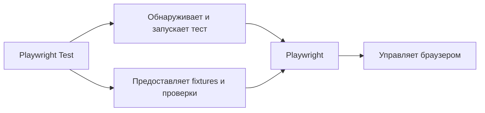

# Playwright и Playwright Test

## Связь с предыдущей главой

В главе 165 мы отделили тестовый код от инфраструктуры и определили границы модулей. Теперь рассмотрим конкретный инструмент UI-автоматизации и выясним, какие обязанности принадлежат библиотеке, а какие тестовому раннеру.

## Цель главы

Научиться различать Playwright и Playwright Test и понимать, как они совместно превращают браузерные команды в управляемый тестовый запуск.

## Главный вопрос

Чем библиотека управления браузером отличается от тестового раннера и как они работают вместе?

## Мотивация

Команда `page.click()` умеет взаимодействовать с браузером, но сама не объявляет тест, не создаёт для него окружение и не формирует результат запуска. Если считать библиотеку и тестовый раннер одним механизмом, становится непонятно, кто управляет ресурсами, ошибками и жизненным циклом.

## Теория

### Два пакета — две ответственности

Playwright — библиотека управления браузерами. Она предоставляет `Browser`, `BrowserContext`, `Page`, `Locator` и операции над ними. Её предмет — «как довести браузер до нужного состояния и что из него прочитать».

Playwright Test — тестовый раннер. Он обнаруживает тесты, запускает их, передаёт built-in fixtures, применяет проверки и ограничения времени, собирает результаты. Его предмет — «какие сценарии выполнить, в каком окружении и как сообщить об итоге».

Разделение видно даже в установке: библиотека живёт в пакете `playwright`, раннер — в `@playwright/test`. При этом раннер реэкспортирует API библиотеки, поэтому `import { chromium } from "@playwright/test"` даёт ровно тот же объект, что и импорт из `playwright`. Пакет один по ощущению, но ответственности внутри разные.



### Что делает только библиотека

Библиотека умеет запустить браузер, создать сессию, открыть страницу, найти элемент, выполнить действие и прочитать состояние. Всё это доступно в обычном скрипте без всякого теста:

```ts
const browser = await chromium.launch();
const context = await browser.newContext();
const page = await context.newPage();
await page.setContent("<h1>Заказ принят</h1>");
console.log(await page.getByRole("heading").textContent());
await browser.close();
```

Здесь нет ни теста, ни результата запуска — есть управление браузером и печать значения. Такой код уместен в служебных сценариях: снять состояние стенда, сгенерировать скриншот, проверить доступность страницы перед запуском набора.

### Что добавляет тестовый раннер

Раннер берёт на себя то, что в скрипте выше пришлось бы писать руками:

- **обнаружение**: находит файлы по `testDir` и `testMatch`, загружает их и собирает объявленные тесты;
- **окружение**: создаёт и уничтожает fixtures, поэтому в тело теста уже приходит готовая `page`;
- **ограничение времени**: отдельный бюджет у теста и отдельный — у проверки;
- **результат**: превращает исключение в неуспешный тест, собирает трассировку, формирует отчёт и код завершения;
- **режим запуска**: параллельность, повторные попытки, фильтры, проекты.

Ни одна из этих обязанностей не относится к браузеру. Именно поэтому их вынесли в отдельный слой.

### Конфигурация принадлежит раннеру, а не браузеру

Это практическое следствие, которое чаще всего удивляет. `playwright.config.ts` читает тестовый раннер. Скрипт, использующий библиотеку напрямую, конфигурацию не видит: ни `use.baseURL`, ни `timeout`, ни `projects` на него не влияют — все значения он задаёт сам.

Функция `expect` при этом работает и вне раннера: проверка с автоожиданием упадёт по своему таймауту. Но таймаут придётся передать в вызове, потому что блок `expect` из конфигурации применяет именно раннер.

### Цена самостоятельности

Запуск библиотеки напрямую означает, что владельцем ресурсов становитесь вы. Браузер нужно закрыть даже при ошибке, иначе процесс останется висеть. Упавшую проверку нужно самому превратить в понятный результат. Повторный запуск, изоляцию и отчёт нужно придумать заново.

Тестовый раннер делает всё это по умолчанию и одинаково для всех сценариев набора. Поэтому прямое обращение к библиотеке оправдано там, где теста нет: подготовка данных, служебные утилиты, разовые проверки окружения.

### Что эта среда не решает за команду

Готовая инфраструктура запуска не превращается в Automation QA Framework сама собой. Раннер не решит, как устроены слои проекта, где живут Page Objects, кто владеет тестовыми данными и как код обращается к стенду. Архитектура проекта, границы модулей и правила владения ресурсами остаются инженерными решениями команды — именно теми, о которых шли главы 160–165.

## Внутренний механизм

Тестовый раннер загружает тестовый файл, регистрирует вызовы `test()`, подготавливает окружение и вызывает тело выбранного теста. Встроенная fixture `page` уже связана с браузерной страницей. Команды `page` выполняет Playwright, а результат и ошибку обрабатывает Playwright Test.

```ts
import { expect, test } from "@playwright/test";

test("показывает статус заказа", async ({ page }) => {
  await page.setContent("<h1>Заказ принят</h1>");
  await expect(page.getByRole("heading", { name: "Заказ принят" })).toBeVisible();
});
```

```text
examples/03-automation-qa/chapter-166/01-minimal-test.spec.ts
```

## Главная ментальная модель

Playwright — набор средств управления браузером. Playwright Test — диспетчер тестового запуска, который выдаёт эти средства тесту и фиксирует результат.

## Практические примеры

Прямое использование библиотеки Playwright встречается в служебных браузерных сценариях, не являющихся тестами. Для набора проверок тестовый раннер полезнее: он даёт единый формат объявления, запуска и результата.

## Automation QA

В тестовом проекте важно разделение ответственности: `Page` взаимодействует с интерфейсом, `expect` описывает ожидаемое состояние, а тестовый раннер решает, какой тест выполнить и как представить его результат.

## Концептуальные границы и компромиссы

Playwright Test предоставляет много готовой инфраструктуры, поэтому курс использует его как основной путь. Прямое использование API библиотеки остаётся допустимым для узких инструментальных задач, но требует самостоятельно управлять запуском и ресурсами.

## Распространённые ошибки

- Называть Playwright и Playwright Test одним и тем же компонентом.
- Ожидать, что браузерная библиотека сама организует набор тестов.
- Создавать браузер вручную там, где тестовый раннер уже предоставляет fixture.
- Приписывать проверки объекту `Page`.

## Распространённые мифы

**Миф: Playwright и Playwright Test — одно и то же.**
Это два слоя с разными обязанностями. Библиотека управляет браузером, раннер управляет запуском. Общий импорт из `@playwright/test` скрывает границу, но не отменяет её.

**Миф: `playwright.config.ts` действует на любой код, использующий Playwright.**
Конфигурацию читает раннер. Скрипт, который сам запускает браузер, не получит ни `baseURL`, ни таймаутов из конфигурации.

**Миф: раз есть раннер, архитектура проекта уже задана.**
Раннер задаёт способ запуска, а не структуру кода. Слои, Page Objects и владение данными проектирует команда.

**Миф: `expect` работает только внутри теста.**
Проверка работает и в обычном скрипте, но таймаут придётся указать явно: значения из конфигурации применяет раннер.

## Частые вопросы

**Когда оправдано использовать библиотеку без раннера?**
Когда результат не является тестом: подготовка стенда, снятие скриншотов, служебная проверка доступности перед запуском набора.

**Почему у Playwright два пакета, если импорт один?**
`@playwright/test` зависит от библиотеки и реэкспортирует её API. Разделение сохраняется для сценариев, где раннер не нужен.

**Кто закрывает браузер?**
При работе через раннер — он сам, через жизненный цикл fixtures. При прямом использовании библиотеки — тот, кто его запустил, и обязательно в `finally`.

**Что произойдёт, если создать браузер вручную внутри теста?**
Тест получит второй браузер вдобавок к тому, что уже подготовил раннер. Ресурсы придётся освобождать самостоятельно, а изоляция и трассировка на этот браузер распространяться не будут.

## Проверьте себя

1. Какие обязанности относятся к библиотеке, а какие — к тестовому раннеру?
2. Почему `import { chromium }` работает из обоих пакетов?
3. Какой код не увидит `playwright.config.ts` и почему?
4. Что придётся написать самому, если отказаться от раннера?
5. Почему наличие раннера не означает наличия фреймворка?

## Практика

```text
practice/03-automation-qa/166-playwright-and-playwright-test.md
```

## Краткие итоги

- Playwright управляет браузером.
- Playwright Test управляет тестовым запуском.
- Fixtures, проверки, ограничения времени и результаты принадлежат среде тестового раннера.
- Разделение обязанностей помогает видеть границы фреймворка.

## Переход к следующей главе

Мы определили участников. В главе 167 разберём путь одного теста от объявления до результата выполнения.
