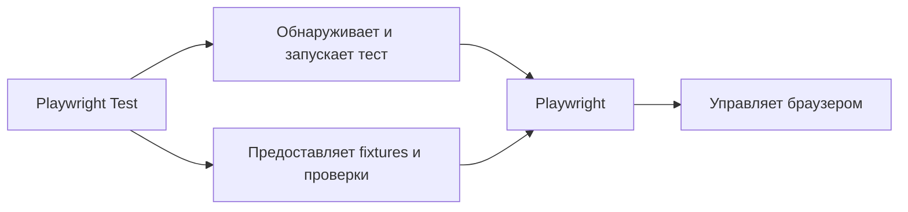

# Playwright и Playwright Test

## Связь с предыдущей главой

В главе 165 мы отделили тестовый код от инфраструктуры и определили границы модулей. Теперь рассмотрим конкретный инструмент UI-автоматизации и выясним, какие обязанности принадлежат библиотеке, а какие тестовому раннеру.

## Цель главы

Научиться различать Playwright и Playwright Test и понимать, как они совместно превращают браузерные команды в управляемый тестовый запуск.

## Главный вопрос

Чем библиотека управления браузером отличается от тестового раннера и как они работают вместе?

## Мотивация

Команда `page.click()` умеет взаимодействовать с браузером, но сама не объявляет тест, не создаёт для него окружение и не формирует результат запуска. Если считать библиотеку и тестовый раннер одним механизмом, становится непонятно, кто управляет ресурсами, ошибками и жизненным циклом.

## Теория

Playwright — библиотека управления браузерами. Она предоставляет `Browser`, `BrowserContext`, `Page`, `Locator` и операции над ними.

Playwright Test — тестовый раннер. Он обнаруживает тесты, запускает их, передаёт built-in fixtures, применяет проверки и ограничения времени, собирает результаты. Повторные попытки, параллельное выполнение и отчётность также относятся к среде выполнения, но подробно будут изучены позже.

Эта среда не создаёт полноценный Automation QA Framework автоматически. Архитектура проекта, границы слоёв и правила владения ресурсами по-прежнему остаются инженерными решениями команды.



## Внутренний механизм

Тестовый раннер загружает тестовый файл, регистрирует вызовы `test()`, подготавливает окружение и вызывает тело выбранного теста. Встроенная fixture `page` уже связана с браузерной страницей. Команды `page` выполняет Playwright, а результат и ошибку обрабатывает Playwright Test.

```ts
import { expect, test } from "@playwright/test";

test("показывает статус заказа", async ({ page }) => {
  await page.setContent("<h1>Заказ принят</h1>");
  await expect(page.getByRole("heading", { name: "Заказ принят" })).toBeVisible();
});
```

```text
examples/03-automation-qa/chapter-166/01-minimal-test.spec.ts
```

## Главная ментальная модель

Playwright — набор средств управления браузером. Playwright Test — диспетчер тестового запуска, который выдаёт эти средства тесту и фиксирует результат.

## Практические примеры

Прямое использование библиотеки Playwright встречается в служебных браузерных сценариях, не являющихся тестами. Для набора проверок тестовый раннер полезнее: он даёт единый формат объявления, запуска и результата.

## Automation QA

В тестовом проекте важно разделение ответственности: `Page` взаимодействует с интерфейсом, `expect` описывает ожидаемое состояние, а тестовый раннер решает, какой тест выполнить и как представить его результат.

## Концептуальные границы и компромиссы

Playwright Test предоставляет много готовой инфраструктуры, поэтому курс использует его как основной путь. Прямое использование API библиотеки остаётся допустимым для узких инструментальных задач, но требует самостоятельно управлять запуском и ресурсами.

## Распространённые ошибки

- Называть Playwright и Playwright Test одним и тем же компонентом.
- Ожидать, что браузерная библиотека сама организует набор тестов.
- Создавать браузер вручную там, где тестовый раннер уже предоставляет fixture.
- Приписывать проверки объекту `Page`.

## Практика

```text
practice/03-automation-qa/166-playwright-and-playwright-test.md
```

## Краткие итоги

- Playwright управляет браузером.
- Playwright Test управляет тестовым запуском.
- Fixtures, проверки, ограничения времени и результаты принадлежат среде тестового раннера.
- Разделение обязанностей помогает видеть границы фреймворка.

## Переход к следующей главе

Мы определили участников. В главе 167 разберём путь одного теста от объявления до результата выполнения.
