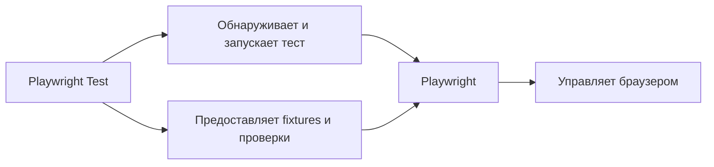

# Playwright и Playwright Test

## Связь с предыдущей главой

В главе 165 мы отделили тестовый код от инфраструктуры и определили границы модулей. Теперь рассмотрим конкретный инструмент UI-автоматизации и выясним, какие обязанности принадлежат библиотеке, а какие тестовому раннеру.

## Цель главы

Научиться различать Playwright и Playwright Test и понимать, как они совместно превращают браузерные команды в управляемый тестовый запуск.

## Главный вопрос

Чем библиотека управления браузером отличается от тестового раннера и как они работают вместе?

## Мотивация

Команда `page.click()` умеет взаимодействовать с браузером, но сама не объявляет тест, не создаёт для него окружение и не формирует результат запуска. Если считать библиотеку и тестовый раннер одним механизмом, становится непонятно, кто управляет ресурсами, ошибками и жизненным циклом.

## Теория

### Два пакета — две ответственности

Playwright — библиотека управления браузерами. Она предоставляет `Browser`, `BrowserContext`, `Page`, `Locator` и операции над ними. Её предмет — «как довести браузер до нужного состояния и что из него прочитать».

Playwright Test — раннер. Он обнаруживает тесты, запускает их, передаёт встроенные фикстуры, применяет проверки и ограничения времени, собирает результаты. Его предмет — «какие сценарии выполнить, в каком окружении и как сообщить об итоге».

Разделение видно даже в установке: библиотека живёт в пакете `playwright`, раннер — в `@playwright/test`. При этом раннер реэкспортирует API библиотеки, поэтому `import { chromium } from "@playwright/test"` даёт ровно тот же объект, что и импорт из `playwright`. Пакет один по ощущению, но ответственности внутри разные.


```mermaid
flowchart LR
    A[Playwright Test] --> B[Обнаруживает и запускает тест]
    A --> C[Предоставляет fixtures и проверки]
    B --> D[Playwright]
    C --> D
    D --> E[Управляет браузером]
```

### Что делает только библиотека

Библиотека умеет запустить браузер, создать сессию, открыть страницу, найти элемент, выполнить действие и прочитать состояние. Всё это доступно в обычном скрипте без всякого теста:

```ts
const browser = await chromium.launch();
const context = await browser.newContext();
const page = await context.newPage();
await page.setContent("<h1>Заказ принят</h1>");
console.log(await page.getByRole("heading").textContent());
await browser.close();
```

Здесь нет ни теста, ни результата запуска — есть управление браузером и печать значения. Такой код уместен в служебных сценариях: снять состояние стенда, сгенерировать скриншот, проверить доступность страницы перед запуском набора.

### Что добавляет тестовый раннер

Раннер берёт на себя то, что в скрипте выше пришлось бы писать руками:

- **обнаружение**: находит файлы по `testDir` и `testMatch`, загружает их и собирает объявленные тесты;
- **окружение**: создаёт и уничтожает фикстуры, поэтому в тело теста уже приходит готовая `page`;
- **ограничение времени**: отдельный бюджет у теста и отдельный — у проверки;
- **результат**: превращает исключение в неуспешный тест, собирает трассировку, формирует отчёт и код завершения;
- **режим запуска**: параллельность, повторные попытки, фильтры, проекты.

Ни одна из этих обязанностей не относится к браузеру. Именно поэтому их вынесли в отдельный слой.

### Конфигурация принадлежит раннеру, а не браузеру

Это практическое следствие, которое чаще всего удивляет. `playwright.config.ts` читает тестовый раннер. Скрипт, использующий библиотеку напрямую, конфигурацию не видит: ни `use.baseURL`, ни `timeout`, ни `projects` на него не влияют — все значения он задаёт сам.

Функция `expect` при этом работает и вне раннера: проверка с автоожиданием упадёт по своему сроку ожидания. Но срок придётся передать в вызове, потому что блок `expect` из конфигурации применяет именно раннер.

### Цена самостоятельности

Запуск библиотеки напрямую означает, что владельцем ресурсов становитесь вы. Браузер нужно закрыть даже при ошибке, иначе процесс останется висеть. Упавшую проверку нужно самому превратить в понятный результат. Повторный запуск, изоляцию и отчёт нужно придумать заново.

Тестовый раннер делает всё это по умолчанию и одинаково для всех сценариев набора. Поэтому прямое обращение к библиотеке оправдано там, где теста нет: подготовка данных, служебные утилиты, разовые проверки окружения.

### Что эта среда не решает за команду

Готовая инфраструктура запуска не превращается во фреймворк автоматизации сама собой. Раннер не решит, как устроены слои проекта, где живут объекты страниц, кто владеет тестовыми данными и как код обращается к стенду. Архитектура проекта, границы модулей и правила владения ресурсами остаются инженерными решениями команды — именно теми, о которых шли главы 160–165.

## Внутренний механизм

Раннер загружает тестовый файл, регистрирует вызовы `test()`, подготавливает окружение и вызывает тело выбранного теста. Встроенная фикстура `page` уже связана с браузерной страницей. Команды `page` выполняет Playwright, а результат и ошибку обрабатывает Playwright Test.

```ts
import { expect, test } from "@playwright/test";

test("показывает статус заказа", async ({ page }) => {
  await page.setContent("<h1>Заказ принят</h1>");
  await expect(page.getByRole("heading", { name: "Заказ принят" })).toBeVisible();
});
```

### Что делает раннер поверх библиотеки

```text
1. найти файлы по шаблону из конфигурации
2. загрузить каждый файл — выполняется его верхний уровень и тела describe
3. применить отбор: --grep, проекты, шарды
4. выдать выбранные тесты рабочим процессам
5. в процессе: подготовить фикстуры → выполнить тело → освободить фикстуры
6. собрать результаты, артефакты и код завершения
```

Шаги 1, 3, 4 и 6 библиотека не делает вовсе. Отсюда практическое следствие:
конфигурацию проекта читает **только раннер**. Скрипт на библиотеке
запускается и без него, но `baseURL`, таймауты, повторы и проекты в нём не
действуют.

### Один и тот же браузер, разные роли

Пакеты `playwright` и `@playwright/test` предоставляют один и тот же объект
`chromium` — раннер его реэкспортирует, а не подменяет. Поэтому код объектов
страниц и клиентов не обязан ничего знать о раннере.

Обратное тоже верно: `expect` из `@playwright/test` работает и вне раннера, но
таймаут ожидания там приходится передавать явно — значение из конфигурации
подставляет раннер.
```text
examples/03-automation-qa/chapter-166/01-minimal-test.spec.ts
```

## Главная ментальная модель

Playwright — набор средств управления браузером. Playwright Test — диспетчер тестового запуска, который выдаёт эти средства тесту и фиксирует результат.

## Практические примеры

Прямое использование библиотеки Playwright встречается в служебных браузерных сценариях, не являющихся тестами. Для набора проверок тестовый раннер полезнее: он даёт единый формат объявления, запуска и результата.

## Automation QA

В тестовом проекте важно разделение ответственности: `Page` взаимодействует с интерфейсом, `expect` описывает ожидаемое состояние, а тестовый раннер решает, какой тест выполнить и как представить его результат.

## Концептуальные границы и компромиссы

Playwright Test предоставляет много готовой инфраструктуры, поэтому курс использует его как основной путь. Прямое использование API библиотеки остаётся допустимым для узких инструментальных задач, но требует самостоятельно управлять запуском и ресурсами.

## Распространённые ошибки

- Называть Playwright и Playwright Test одним и тем же компонентом — библиотека управляет браузером, раннер даёт тесты, фикстуры, изоляцию, повторы и отчёт. Код на библиотеке запускается и без раннера, но конфигурацию проекта читает только раннер.

- Ожидать, что браузерная библиотека сама организует набор тестов — она не знает ни о параллельном запуске, ни о таймаутах теста, ни о повторах. Всё это добавляет раннер.

- Создавать браузер вручную там, где раннер уже предоставляет фикстуру — свой `chromium.launch()` внутри теста открывает второй браузер в дополнение к фикстуре `page`, а закрывать его придётся самому, включая путь с падением.

- Приписывать проверки объекту `Page` — `page` выполняет действия и даёт локаторы, а утверждения делает `expect`. Проверка «есть ли элемент» через `page.$()` даёт мгновенный снимок и лишается ожидания.

## Распространённые мифы

**Миф: Playwright и Playwright Test — одно и то же.**
Это два слоя с разными обязанностями. Библиотека управляет браузером, раннер управляет запуском. Общий импорт из `@playwright/test` скрывает границу, но не отменяет её.

**Миф: `playwright.config.ts` действует на любой код, использующий Playwright.**
Конфигурацию читает раннер. Скрипт, который сам запускает браузер, не получит ни `baseURL`, ни сроков ожидания из конфигурации.

**Миф: раз есть раннер, архитектура проекта уже задана.**
Раннер задаёт способ запуска, а не структуру кода. Слои, объекты страниц и владение данными проектирует команда.

**Миф: `expect` работает только внутри теста.**
Проверка работает и в обычном скрипте, но срок ожидания придётся указать явно: значения из конфигурации применяет раннер.

## Частые вопросы

**Когда оправдано использовать библиотеку без раннера?**
Когда результат не является тестом: подготовка стенда, снятие скриншотов, служебная проверка доступности перед запуском набора.

**Почему у Playwright два пакета, если импорт один?**
`@playwright/test` зависит от библиотеки и реэкспортирует её API. Разделение сохраняется для сценариев, где раннер не нужен.

**Кто закрывает браузер?**
При работе через раннер — он сам, через жизненный цикл фикстур. При прямом использовании библиотеки — тот, кто её запустил, и обязательно в `finally`.

**Что произойдёт, если создать браузер вручную внутри теста?**
Тест получит второй браузер вдобавок к тому, что уже подготовил раннер. Ресурсы придётся освобождать самостоятельно, а изоляция и трассировка на этот браузер распространяться не будут.

## Проверьте себя

1. Какие обязанности относятся к библиотеке, а какие — к тестовому раннеру?
2. Почему `import { chromium }` работает из обоих пакетов?
3. Какой код не увидит `playwright.config.ts` и почему?
4. Что придётся написать самому, если отказаться от раннера?
5. Почему наличие раннера не означает наличия фреймворка?

### Ответы

1. Библиотека отвечает за браузер, страницы, локаторы и действия. Раннер — за запуск, параллельность, фикстуры, проверки, повторы и отчёт.
2. Пакет с раннером включает библиотеку и реэкспортирует её. Это один и тот же код.
3. Код, запущенный напрямую через Node.js, а не через раннер: конфигурация читается именно раннером.
4. Запуск и параллельность, подготовку и очистку, проверки, повторы, отчёт и сбор артефактов падения.
5. Раннер закрывает запуск, но не отвечает за данные, подготовку состояния и структуру слоёв. Всё это остаётся решением команды.

## Практика

```text
practice/03-automation-qa/166-playwright-and-playwright-test.md
```

## Краткие итоги

- Playwright управляет браузером.
- Playwright Test управляет тестовым запуском.
- Фикстуры, проверки, ограничения времени и результаты принадлежат среде раннера.
- Разделение обязанностей помогает видеть границы фреймворка.

## Переход к следующей главе

Мы определили участников. В главе 167 разберём путь одного теста от объявления до результата выполнения.
