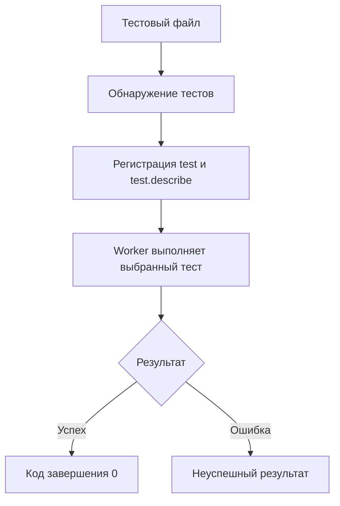

# Анатомия и модель выполнения теста

## Связь с предыдущей главой

Playwright Test отвечает за обнаружение и выполнение тестов. Теперь нужно увидеть, из каких частей состоит тест и в каком порядке тестовый раннер с ними работает.

## Цель главы

Научиться читать минимальный Playwright-тест и связывать его синтаксис с обнаружением, выполнением и результатом процесса.

## Главный вопрос

Как Playwright Test обнаруживает, группирует и выполняет тесты?

## Мотивация

Тестовый файл не является обычным скриптом, который последовательно выполняет всё при импорте. Вызов `test()` сначала объявляет сценарий, а тестовый раннер позже решает, когда и где выполнить его тело.

## Теория

### Объявление и выполнение — разные моменты

`test(title, body)` не запускает сценарий. Он **регистрирует** его: сообщает раннеру название и функцию, которую тот вызовет позже.

Разница заметна сразу, если поставить вывод на верхний уровень файла и внутрь теста:

```ts
console.log("загрузка файла");           // выполняется при обнаружении тестов

test("создаёт заказ", async ({ page }) => {
  console.log("тело теста");             // выполняется только при запуске этого теста
});
```

Первая строка печатается, даже если тест отфильтрован и выполняться не будет. Из этого следуют два практических правила: на верхнем уровне файла не должно быть ни подготовки данных, ни обращений к стенду, а состояние, общее для всех тестов файла, нельзя создавать при загрузке — файл загружается в каждом worker заново.

### `test.describe` группирует объявления

`test.describe()` тоже выполняется при загрузке: его тело нужно, чтобы зарегистрировать вложенные тесты и hooks. Сам по себе `describe` тестом не является и в результатах отдельной строкой не появляется.

Область группы задаёт, на какие тесты распространяются `test.beforeEach`, `test.afterEach` и настройки вроде `test.use`. Это её единственное назначение: группировка по предметной области, а не способ переиспользовать код.



### Arrange, Act, Assert как ориентир чтения

Удобная структура сценария — подготовить состояние, выполнить действие, проверить результат. Это ориентир для читаемости, а не требование делить каждый тест комментариями.

```ts
await page.setContent("<button>Сохранить</button>");            // Arrange
await page.getByRole("button", { name: "Сохранить" }).click();  // Act
await expect(page.getByText("Сохранено")).toBeVisible();        // Assert
```

Ценность формы в диагностике: по падению сразу видно, сломалась подготовка, действие или ожидание. Тест, в котором подготовка перемешана с проверками, заставляет читать его целиком, чтобы понять, что именно не сработало.

### Что происходит при падении

Упавшая проверка или отвергнутый Promise прерывают тело теста: оставшиеся строки не выполняются. Но этапы освобождения ресурсов выполняются — `afterEach` и teardown fixtures вызываются и после падения. Поэтому очистку нельзя писать последней строкой тела теста: именно до неё выполнение и не дойдёт.

Первая же ошибка завершает тест. Если в сценарии пять проверок и упала вторая, о состоянии остальных трёх вы ничего не узнаете, пока не почините первую причину.

### Почему `await` обязателен

Браузерные действия и проверки возвращают Promise. Без `await` тело теста продолжается, не дожидаясь результата, и раннер не может связать исход операции с нужным шагом.

Playwright Test это отслеживает. Действие, начатое и не дождавшееся завершения до конца теста, даёт явную ошибку:

```text
Error: locator.click: Test ended.
```

Сообщение точно указывает на пропущенный `await`. Но полагаться только на него не стоит: операция могла успеть завершиться сама, и тогда тест пройдёт — то стабильно, то нет, в зависимости от скорости стенда. Именно так и появляются флаки-тесты.

### Модель выполнения: worker и изоляция

Раннер запускает тесты в отдельных процессах-worker. Worker загружает тестовый файл, получает назначенный тест, готовит для него fixtures и выполняет тело. Файл при этом загружается в каждом worker независимо, поэтому модульные переменные не общие между процессами.

Результат теста складывается из трёх вещей: завершились ли ожидаемые Promises, прошли ли проверки и уложился ли тест во время. Ненулевой код завершения процесса — итог всего запуска, и в CI он и есть сигнал о неуспехе.

Annotations (`test.skip`, `test.fixme`, `test.slow`) позволяют помечать или изменять режим отдельных тестов; здесь достаточно понимать их место в модели выполнения.

## Внутренний механизм


Тестовый раннер загружает объявления, применяет фильтры и передаёт выбранный тест worker. Если ожидаемый Promise браузерного действия или проверки завершается ошибкой, оставшаяся часть тела теста обычно не выполняется, а Playwright Test переходит к применимым этапам освобождения ресурсов. Поэтому асинхронные операции нужно `await`: иначе тело может продолжиться до завершения действия, а тестовый раннер не свяжет его результат с правильным шагом.

Annotations позволяют помечать или изменять режим отдельных тестов, но здесь достаточно понимать их место в модели выполнения.

```text
examples/03-automation-qa/chapter-167/01-test-anatomy.spec.ts
```

## Главная ментальная модель

Объявление описывает тест тестовому раннеру, worker выполняет его тело, а завершённые Promises и проверки формируют результат.

## Практические примеры

Название `создаёт заказ с валидными данными` сообщает поведение лучше, чем `test 1`. Подготовка локального HTML относится к Arrange, нажатие кнопки — к Act, проверка статуса — к Assert.

## Automation QA

Понятная анатомия теста помогает отличить ошибку обнаружения от ошибки подготовки, действия или проверки. Это сокращает область расследования при падении CI-запуска.

## Концептуальные границы и компромиссы

Слишком строгая форма Arrange/Act/Assert может создавать искусственные блоки, а отсутствие видимого потока делает сценарий трудным для чтения. Группировка `describe` полезна при общей предметной области, но не должна создавать глубокую вложенность.

## Распространённые ошибки

- Забывать `await` перед браузерным действием или проверкой.
- Выполнять сценарий во время загрузки файла вместо объявления через `test()`.
- Использовать неинформативные названия.
- Считать `test.describe()` отдельным тестом.
- Игнорировать ненулевой exit code запуска.

## Распространённые мифы

**Миф: код на верхнем уровне файла выполняется перед «своими» тестами.**
Он выполняется при загрузке файла — то есть при обнаружении тестов, до любого запуска и даже для отфильтрованных тестов.

**Миф: `test.describe` — это тест.**
Это группировка объявлений. В результатах она отдельной строкой не появляется.

**Миф: забытый `await` всегда заметен.**
Раннер поймает его только если операция не успела завершиться. Иначе тест проходит нестабильно, и причина выглядит как «флаки».

**Миф: после падения тест доделывает очистку в теле.**
Оставшиеся строки тела не выполняются. Освобождение ресурсов должно жить в `afterEach` или в teardown fixture.

**Миф: модульная переменная общая для всего запуска.**
Файл загружается в каждом worker отдельно, поэтому у параллельных процессов свои копии.

## Частые вопросы

**Почему тест прошёл локально и упал в CI без изменений кода?**
Частая причина — пропущенный `await`: на быстрой машине операция успевает завершиться, на загруженной — нет.

**Где размещать подготовку данных?**
В `beforeEach` или в fixture, но не на верхнем уровне файла: там она выполнится при обнаружении тестов независимо от того, запустятся ли они.

**Что будет с проверками после первой упавшей?**
Они не выполнятся. Если нужно увидеть несколько независимых фактов, их разносят по отдельным тестам.

**Нужно ли `describe` в файле с одним тестом?**
Нет. Группа оправдана, когда объединяет тесты одной предметной области или общие hooks.

**Почему exit code важнее вывода в консоль?**
CI принимает решение по коду завершения. Вывод помогает расследовать, но ненулевой код — единственный надёжный признак неуспеха.

## Проверьте себя

1. Что выполняется при загрузке тестового файла, а что — при запуске теста?
2. Почему `test.describe` не появляется в результатах отдельной строкой?
3. Какое сообщение даёт раннер при незавершённом действии без `await`?
4. Почему очистку нельзя писать последней строкой тела теста?
5. Почему модульная переменная не общая для всех тестов запуска?

## Практика

```text
practice/03-automation-qa/167-test-anatomy-and-execution-model.md
```

## Краткие итоги

- `test()` регистрирует название и тело теста.
- Обнаружение тестов предшествует выполнению.
- Worker выполняет выбранные тесты.
- Необработанная ошибка или неуспешная проверка делает тест неуспешным.
- Асинхронные операции должны быть ожидаемыми.

## Переход к следующей главе

Тело теста получает браузерные ресурсы. В главе 168 разделим роли `Browser`, `BrowserContext` и `Page`.
