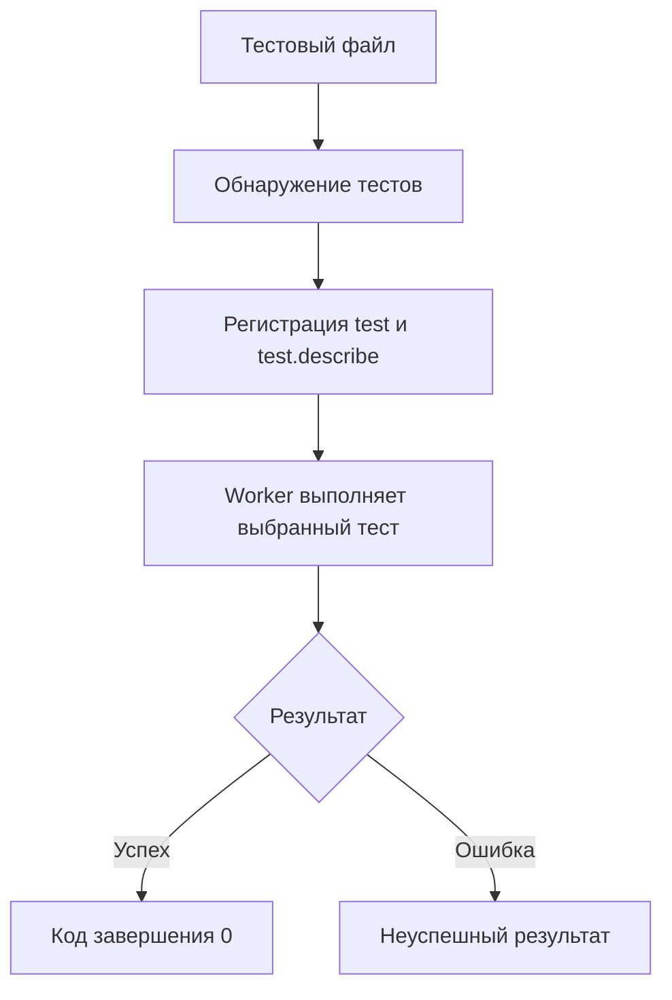

# Анатомия и модель выполнения теста

## Связь с предыдущей главой

Playwright Test отвечает за обнаружение и выполнение тестов. Теперь нужно увидеть, из каких частей состоит тест и в каком порядке тестовый раннер с ними работает.

## Цель главы

Научиться читать минимальный Playwright-тест и связывать его синтаксис с обнаружением, выполнением и результатом процесса.

## Главный вопрос

Как Playwright Test обнаруживает, группирует и выполняет тесты?

## Мотивация

Тестовый файл не является обычным скриптом, который последовательно выполняет всё при импорте. Вызов `test()` сначала объявляет сценарий, а тестовый раннер позже решает, когда и где выполнить его тело.

## Теория

`test(title, body)` регистрирует тест с названием и асинхронным телом. `test.describe()` группирует объявления и задаёт область для связанных настроек и hooks. Параметр объекта в теле теста содержит built-in fixtures; их архитектура будет отдельной темой.

Удобная структура сценария — Arrange, Act, Assert: подготовить состояние, выполнить действие, проверить результат. Это ориентир для читаемости, а не требование делить каждый тест комментариями.

## Внутренний механизм



Тестовый раннер загружает объявления, применяет фильтры и передаёт выбранный тест worker. Если ожидаемый Promise браузерного действия или проверки завершается ошибкой, оставшаяся часть тела теста обычно не выполняется, а Playwright Test переходит к применимым этапам освобождения ресурсов. Поэтому асинхронные операции нужно `await`: иначе тело может продолжиться до завершения действия, а тестовый раннер не свяжет его результат с правильным шагом.

Annotations позволяют помечать или изменять режим отдельных тестов, но здесь достаточно понимать их место в модели выполнения.

```text
examples/03-automation-qa/chapter-167/01-test-anatomy.spec.ts
```

## Главная ментальная модель

Объявление описывает тест тестовому раннеру, worker выполняет его тело, а завершённые Promises и проверки формируют результат.

## Практические примеры

Название `создаёт заказ с валидными данными` сообщает поведение лучше, чем `test 1`. Подготовка локального HTML относится к Arrange, нажатие кнопки — к Act, проверка статуса — к Assert.

## Automation QA

Понятная анатомия теста помогает отличить ошибку обнаружения от ошибки подготовки, действия или проверки. Это сокращает область расследования при падении CI-запуска.

## Концептуальные границы и компромиссы

Слишком строгая форма Arrange/Act/Assert может создавать искусственные блоки, а отсутствие видимого потока делает сценарий трудным для чтения. Группировка `describe` полезна при общей предметной области, но не должна создавать глубокую вложенность.

## Распространённые ошибки

- Забывать `await` перед браузерным действием или проверкой.
- Выполнять сценарий во время загрузки файла вместо объявления через `test()`.
- Использовать неинформативные названия.
- Считать `test.describe()` отдельным тестом.
- Игнорировать ненулевой exit code запуска.

## Практика

```text
practice/03-automation-qa/167-test-anatomy-and-execution-model.md
```

## Краткие итоги

- `test()` регистрирует название и тело теста.
- Обнаружение тестов предшествует выполнению.
- Worker выполняет выбранные тесты.
- Необработанная ошибка или неуспешная проверка делает тест неуспешным.
- Асинхронные операции должны быть ожидаемыми.

## Переход к следующей главе

Тело теста получает браузерные ресурсы. В главе 168 разделим роли `Browser`, `BrowserContext` и `Page`.
