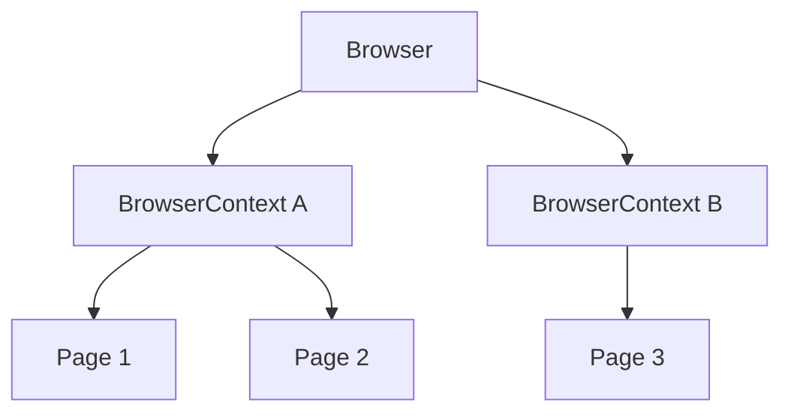

# Browser, BrowserContext и Page

## Связь с предыдущей главой

Тестовый раннер передаёт тесту браузерные fixtures. Чтобы управлять ими осознанно, нужно различать управляемый экземпляр браузера, изолированную сессию и страницу.

## Цель главы

Научиться связывать `Browser`, `BrowserContext` и `Page` с их ресурсами, состоянием и сроком жизни.

## Главный вопрос

Как Playwright моделирует браузер, изолированную сессию и вкладку?

## Мотивация

Если считать каждую `Page` отдельным браузером, легко неверно определить владельца cookies и storage. Это приводит к утечке состояния и неправильной очистке.

## Теория

`Browser` представляет запущенный экземпляр браузера, которым управляет Playwright, и создаёт контексты. Это логическая абстракция API, а не обещание одного процесса операционной системы: браузер может использовать несколько процессов. `BrowserContext` представляет изолированную браузерную сессию. `Page` представляет вкладку или popup-страницу внутри контекста.



Cookies, `localStorage` и `sessionStorage` изолируются границей контекста. Несколько страниц одного контекста принадлежат одной сессии. `BrowserContext` не является отдельным процессом или виртуальной машиной.

## Внутренний механизм

Playwright Test обычно управляет жизненным циклом built-in fixtures и даёт тесту свежий контекст. При ручном создании контекста создатель обязан закрыть его даже при ошибке:

```ts
const context = await browser.newContext();

try {
  const page = await context.newPage();
  await page.setContent("<h1>Профиль</h1>");
} finally {
  await context.close();
}
```

```text
examples/03-automation-qa/chapter-168/01-context-isolation.spec.ts
```

## Главная ментальная модель

Управляемый экземпляр `Browser` содержит изолированные сессии, а каждая сессия содержит страницы и владеет своим браузерным состоянием.

## Практические примеры

Два пользователя одного теста можно моделировать разными контекстами. Две страницы одного пользователя могут находиться в одном контексте. Детальная работа с popup и несколькими вкладками будет изучаться позже.

## Automation QA

Изоляция контекстов позволяет запускать тесты без общего cookie jar и дешевле, чем запускать отдельный браузерный процесс для каждого сценария.

## Концептуальные границы и компромиссы

Новый контекст даёт браузерную изоляцию, но не очищает данные серверной части. Ручное управление полезно для специальных сценариев, однако увеличивает ответственность за освобождение ресурсов.

## Распространённые ошибки

- Называть `BrowserContext` отдельным процессом.
- Считать `Page` владельцем всех cookies.
- Создавать контекст вручную и не закрывать его.
- Ожидать, что новый контекст удалит серверные данные.
- Разделять один изменяемый контекст между независимыми тестами.

## Практика

```text
practice/03-automation-qa/168-browser-browsercontext-and-page.md
```

## Краткие итоги

- `Browser` представляет управляемый экземпляр браузера, не гарантируя модель OS-процессов.
- `BrowserContext` задаёт изолированную сессию.
- `Page` представляет страницу внутри контекста.
- Контекст владеет cookies и storage.
- Ручные ресурсы требуют явного освобождения.

## Переход к следующей главе

Получив `Page`, тест должен выразить, с каким элементом взаимодействовать. Эту задачу решает `Locator` в главе 169.
