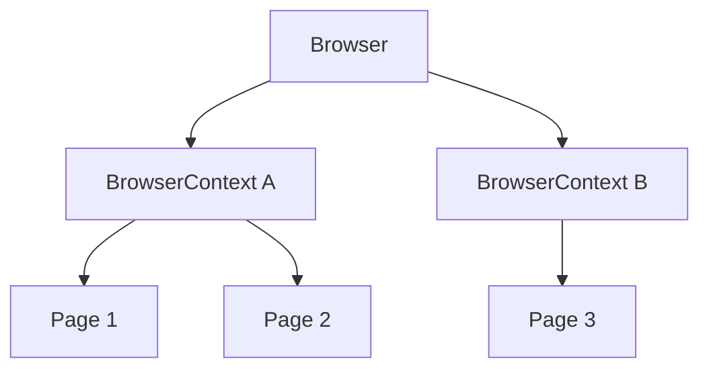

# Browser, BrowserContext и Page

## Связь с предыдущей главой

Тестовый раннер передаёт тесту браузерные fixtures. Чтобы управлять ими осознанно, нужно различать управляемый экземпляр браузера, изолированную сессию и страницу.

## Цель главы

Научиться связывать `Browser`, `BrowserContext` и `Page` с их ресурсами, состоянием и сроком жизни.

## Главный вопрос

Как Playwright моделирует браузер, изолированную сессию и вкладку?

## Мотивация

Если считать каждую `Page` отдельным браузером, легко неверно определить владельца cookies и storage. Это приводит к утечке состояния и неправильной очистке.

## Теория

### Три уровня и что каждый из них означает

`Browser` представляет запущенный экземпляр браузера, которым управляет Playwright, и создаёт контексты. Это логическая абстракция API, а не обещание одного процесса операционной системы: браузер может использовать несколько процессов.

`BrowserContext` представляет изолированную браузерную сессию — отдельный набор cookies, хранилищ и разрешений.

`Page` представляет вкладку или popup-страницу внутри контекста.



### Граница изоляции проходит по контексту

Это главное утверждение главы, и его стоит понимать буквально. Cookies, `localStorage` и `sessionStorage` принадлежат контексту, а не странице.

Две страницы одного контекста, открытые на одном origin, видят одно и то же хранилище: значение, записанное на первой, читается на второй. Страница в другом контексте прочитает `null` — для неё этой записи не существует.

Отсюда следует простое правило моделирования: разные пользователи — разные контексты, несколько вкладок одного пользователя — один контекст.

### Что даёт изоляция контекста, а что нет

Новый контекст — это чистое **браузерное** состояние. Он не трогает ничего за пределами браузера:

| Изолируется контекстом | Не изолируется |
| --- | --- |
| cookies | данные в базе стенда |
| `localStorage`, `sessionStorage` | состояние серверной сессии на сервере |
| разрешения, геолокация, HTTP-заголовки по умолчанию | файлы, созданные приложением |
| кеш этой сессии | общие тестовые данные |

Поэтому свежий контекст не отменяет необходимости отдельной стратегии тестовых данных: пользователь остаётся созданным в базе, а заказ — существующим.

### Почему контекст, а не новый браузер

Контекст создаётся заметно дешевле, чем запуск браузера, и при этом даёт нужную для тестов изоляцию. Это и есть причина, по которой раннер выдаёт каждому тесту свой контекст, а браузер переиспользует.

Внутри одного worker объект `Browser` — один и тот же для всех тестов, а контекст у каждого теста свой. Проверяется это напрямую: cookie, установленный в одном тесте, в следующем не виден, хотя браузер тот же.

### Кто владеет ресурсом

При работе через раннер жизненным циклом built-in fixtures управляет он: контекст создаётся перед тестом и закрывается после него, в том числе после падения.

Если контекст создан вручную, владельцем становится создатель, и закрывать его нужно даже при ошибке:

```ts
const context = await browser.newContext();

try {
  const page = await context.newPage();
  await page.setContent("<h1>Профиль</h1>");
} finally {
  await context.close();
}
```

Закрытие контекста закрывает все его страницы: после `close()` список страниц пуст, а каждая `Page` переходит в закрытое состояние. Обращение к ней после этого даст ошибку — это нормальный признак того, что ресурс освобождён.

### Когда контекст создают вручную

Встроенной `page` хватает большинству сценариев. Собственный контекст нужен, когда тесту требуется то, что нельзя получить от одной готовой страницы:

- два пользователя в одном сценарии — например, автор заказа и согласующий;
- заранее подготовленное состояние авторизации, загруженное в новую сессию;
- отдельные настройки сессии: другой язык, размер окна, разрешения;
- проверка того, что происходит при полностью чистой сессии.

Во всех этих случаях цена одна и та же — ответственность за освобождение ресурса переходит к вам.

## Внутренний механизм

Playwright Test обычно управляет жизненным циклом built-in fixtures и даёт тесту свежий контекст. При ручном создании контекста создатель обязан закрыть его даже при ошибке:

```ts
const context = await browser.newContext();

try {
  const page = await context.newPage();
  await page.setContent("<h1>Профиль</h1>");
} finally {
  await context.close();
}
```

```text
examples/03-automation-qa/chapter-168/01-context-isolation.spec.ts
```

## Главная ментальная модель

Управляемый экземпляр `Browser` содержит изолированные сессии, а каждая сессия содержит страницы и владеет своим браузерным состоянием.

## Практические примеры

Два пользователя одного теста можно моделировать разными контекстами. Две страницы одного пользователя могут находиться в одном контексте. Детальная работа с popup и несколькими вкладками будет изучаться позже.

## Automation QA

Изоляция контекстов позволяет запускать тесты без общего cookie jar и дешевле, чем запускать отдельный браузерный процесс для каждого сценария.

## Концептуальные границы и компромиссы

Новый контекст даёт браузерную изоляцию, но не очищает данные серверной части. Ручное управление полезно для специальных сценариев, однако увеличивает ответственность за освобождение ресурсов.

## Распространённые ошибки

- Называть `BrowserContext` отдельным процессом.
- Считать `Page` владельцем всех cookies.
- Создавать контекст вручную и не закрывать его.
- Ожидать, что новый контекст удалит серверные данные.
- Разделять один изменяемый контекст между независимыми тестами.

## Распространённые мифы

**Миф: `BrowserContext` — это отдельный процесс или виртуальная машина.**
Это логическая граница сессии внутри уже запущенного браузера, а не отдельная машина.

**Миф: cookies принадлежат странице.**
Они принадлежат контексту. Две страницы одного контекста делят и cookies, и хранилища.

**Миф: новый контекст даёт полностью чистое состояние.**
Чистым становится состояние браузера. Данные в базе стенда и серверные сессии остаются на месте.

**Миф: для изоляции тестов нужен отдельный браузер.**
Достаточно контекста — он дешевле и даёт ту же изоляцию браузерного состояния. Браузер внутри worker переиспользуется.

**Миф: страницы нужно закрывать отдельно перед закрытием контекста.**
`context.close()` закрывает все его страницы.

## Частые вопросы

**Как смоделировать двух пользователей в одном тесте?**
Двумя контекстами: у каждого своя сессия и свои cookies. Одной страницей на двоих это сделать нельзя.

**Почему тест видит данные, созданные предыдущим тестом?**
Потому что они живут не в браузере, а на стенде. Контекст их не очищает — нужна стратегия тестовых данных.

**Что произойдёт, если не закрыть созданный вручную контекст?**
Ресурсы останутся занятыми до закрытия браузера. При большом наборе это заметно по росту потребления памяти.

**Можно ли переиспользовать один контекст между тестами ради скорости?**
Технически можно, но тесты перестают быть независимыми: состояние одного влияет на другой. Выигрыш во времени обычно не окупает потерю изоляции.

**Чем popup отличается от новой страницы?**
Ничем по природе: это тоже `Page`, и принадлежит она тому же контексту, а значит делит с ним сессию.

## Проверьте себя

1. На каком уровне проходит граница изоляции браузерного состояния?
2. Увидит ли страница другого контекста запись в `localStorage`?
3. Что изоляция контекста не очищает?
4. Один ли объект `Browser` у двух тестов внутри одного worker?
5. Что происходит со страницами при `context.close()`?

## Практика

```text
practice/03-automation-qa/168-browser-browsercontext-and-page.md
```

## Краткие итоги

- `Browser` представляет управляемый экземпляр браузера, не гарантируя модель OS-процессов.
- `BrowserContext` задаёт изолированную сессию.
- `Page` представляет страницу внутри контекста.
- Контекст владеет cookies и storage.
- Ручные ресурсы требуют явного освобождения.

## Переход к следующей главе

Получив `Page`, тест должен выразить, с каким элементом взаимодействовать. Эту задачу решает `Locator` в главе 169.
