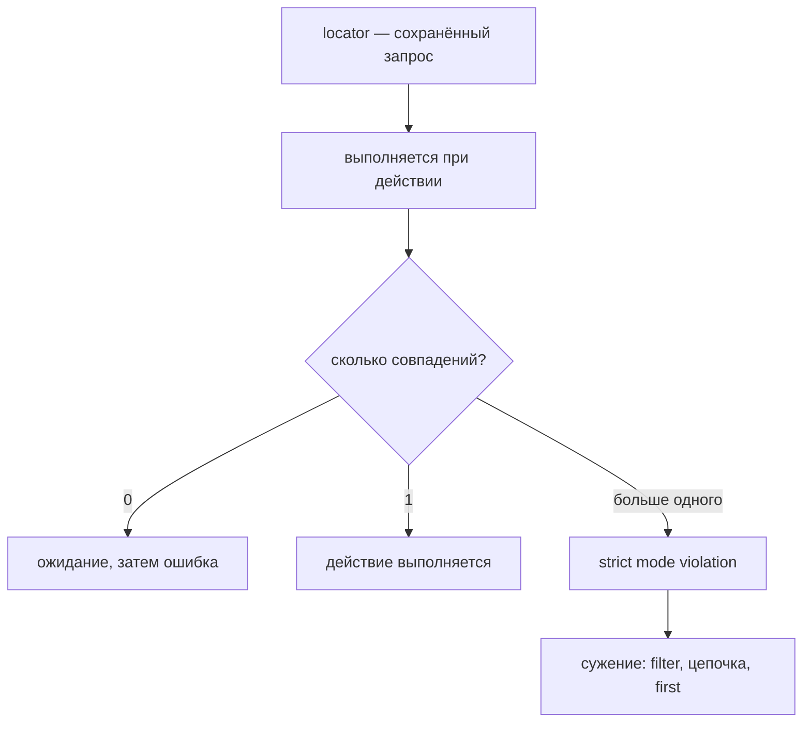

# Locator и стратегия поиска элементов

## Связь с предыдущей главой

`Page` представляет браузерную страницу. Следующий шаг — описать элемент не через случайную деталь DOM, а через устойчивое намерение пользователя.

## Цель главы

Научиться строить читаемые `Locator` и выбирать стратегию поиска по доступному пользовательскому контракту страницы.

## Главный вопрос

Как находить элементы устойчиво и сохранять намерение пользователя в тесте?

## Мотивация

CSS-цепочка `.content > div:nth-child(2) button` может сломаться после изменения вёрстки, хотя пользователь всё ещё видит кнопку «Оплатить». Хороший `Locator` фиксирует значимое поведение, а не расположение узла.

## Теория

### Locator — не элемент, а сохранённый запрос

`Locator` — ленивый переиспользуемый запрос. Он хранит способ поиска, а актуальный DOM проверяется в момент действия или проверки.

Это легко увидеть: локатор можно создать до того, как элемент появится на странице. Сразу после создания `count()` вернёт `0`, но тот же самый объект найдёт элемент, как только он отрисуется.

```ts
const later = page.getByRole("heading", { name: "Готово" });
// элемента ещё нет — count() вернёт 0
await expect(later).toBeVisible(); // дождётся появления
```

Второе следствие важнее: локатор переживает перерисовку. Если страница заменила содержимое блока, сохранённый локатор найдёт **новый** элемент, а не будет держать ссылку на исчезнувший. Именно поэтому результат разового поиска хранить не нужно — хранят сам локатор.

### Приоритет поиска задаёт пользовательский контракт

Способ поиска — это решение о том, за что тест держится. Порядок предпочтения идёт от смысла к технике:

| Способ | За что держится | Когда уместен |
| --- | --- | --- |
| `getByRole` | роль и доступное имя | основной путь для интерактивных элементов |
| `getByLabel` | связь поля с подписью | формы |
| `getByText` | видимый пользователю текст | статический контент, сообщения |
| `getByTestId` | явный договор команды | виджеты без семантики |
| `locator` с CSS/XPath | структура разметки | когда осмысленного контракта нет |

Чем выше в таблице, тем ближе тест к тому, что видит пользователь, и тем меньше он ломается от перестановки разметки.

### Как сопоставляются имя и текст

Здесь прячется частый источник неожиданностей. По умолчанию и `getByRole({ name })`, и `getByText` ищут **подстроку** без учёта регистра: запрос `сохранить` найдёт кнопку `Сохранить черновик`.

Опция `exact: true` переключает режим на полное совпадение с учётом регистра — при этом окружающие пробелы всё равно нормализуются:

```ts
page.getByRole("button", { name: "сохранить" });                  // найдёт «Сохранить черновик»
page.getByRole("button", { name: "Сохранить", exact: true });     // не найдёт
page.getByRole("button", { name: "Сохранить черновик", exact: true }); // найдёт
```

Нестрогое совпадение удобно, но делает локатор шире, чем кажется. Когда на странице есть «Сохранить» и «Сохранить и закрыть», неточное имя приведёт к неоднозначности.

### Strictness превращает неоднозначность в ошибку

Действие над `Locator` требует, чтобы запрос соответствовал ровно одному элементу. Если совпадений больше, Playwright не выбирает первый попавшийся, а сообщает об ошибке:

```text
strict mode violation: getByRole('button', { name: 'Открыть' }) resolved to 2 elements
```

Это защита, а не помеха. Молчаливый выбор первого элемента дал бы тест, который проверяет не то, что задумано, и делает это стабильно — худший вид ошибки.

Правильная реакция — сузить запрос до нужного элемента, а не заглушить сообщение через `.first()`.

### Сужение: filter и цепочка

Два инструмента сужения решают разные задачи.

`filter()` отбирает среди совпадений по содержимому:

```ts
const order = page.getByRole("listitem").filter({ hasText: "order-42" });
```

Цепочка ограничивает поиск потомками найденного родителя:

```ts
await order.getByRole("button", { name: "Открыть" }).click();
```

Вместе они читаются как предложение: «в строке заказа order-42 нажать кнопку Открыть». На странице десяток таких кнопок, но запрос однозначен.

Есть и `hasNotText` для обратного отбора. Методы `first()`, `last()` и `nth()` тоже доступны, но их стоит применять только когда порядок действительно является контрактом — например, «первая строка в списке, отсортированном по дате».

### Локатор — не массив

Группа совпадений не является JavaScript-массивом: локатор хранит запрос и обращается к DOM только при операции.

Разница видна на подсчёте. `count()` — это снимок текущего момента без ожидания: на ещё не отрисованном списке он вернёт `0`. Проверка `toHaveCount(2)` дождётся нужного состояния, потому что повторяет запрос.

```ts
await items.count();            // мгновенный снимок
await expect(items).toHaveCount(2); // ожидание с повтором
```

Отсюда правило: считать и сравнивать значения лучше через `expect`, а «сырые» методы вроде `count()`, `textContent()` и `isVisible()` использовать только там, где ожидание не нужно.

Локатор выполняется в момент действия, а не при объявлении:



## Внутренний механизм

Strictness требует, чтобы действие над `Locator` соответствовало одному элементу. `filter()` уточняет группу совпадений, а цепочка `Locator` ограничивает поиск родителем. Эта группа не является JavaScript-массивом: `Locator` хранит запрос и обращается к актуальному DOM только при операции. Методы `first()`, `last()` и `nth()` выбирают позицию лишь тогда, когда порядок действительно является контрактом.

```ts
const order = page.getByRole("listitem").filter({ hasText: "order-42" });
const openButton = order.getByRole("button", { name: "Открыть" });
await openButton.click();
```

```text
examples/03-automation-qa/chapter-169/01-resilient-locators.spec.ts
```

## Главная ментальная модель

Locator — сохранённый вопрос к текущему DOM: «найди элемент с таким пользовательским смыслом».

## Практические примеры

Для поля email подходит label, для кнопки — role и доступное имя, для технического виджета без семантики может быть оправдан test id. Универсального `Locator` для всех интерфейсов нет.

## Automation QA

Семантические `Locator` одновременно улучшают читаемость теста и обнаруживают проблемы доступности. Test id полезен как договор команды, если пользовательские признаки нестабильны.

## Концептуальные границы и компромиссы

Текст близок к пользовательскому опыту, но меняется при локализации. Test id устойчив к тексту, но не проверяет доступность. CSS точен технически, однако сильнее связывает тест с реализацией.

## Распространённые ошибки

- Выбирать CSS или XPath по привычке до анализа пользовательского контракта.
- Устранять strictness через `.first()` без понимания неоднозначности.
- Использовать длинные цепочки DOM.
- Считать test id всегда лучшим вариантом.
- Хранить результат одноразового поиска вместо `Locator`.

## Распространённые мифы

**Миф: `Locator` — это найденный элемент.**
Это сохранённый запрос. Элемент ищется заново при каждой операции, поэтому локатор переживает перерисовку страницы.

**Миф: поиск по имени требует точного совпадения.**
По умолчанию это поиск подстроки без учёта регистра. Полное совпадение включается опцией `exact`.

**Миф: strict mode violation исправляется через `.first()`.**
Так ошибка исчезает, но тест начинает работать с произвольным элементом. Сначала нужно понять, почему совпадений несколько.

**Миф: test id всегда лучше, потому что стабильнее.**
Он устойчив к тексту, но ничего не говорит о доступности и не проверяет то, что видит пользователь. Это договор команды, а не универсальный выбор.

**Миф: `count()` дождётся появления элементов.**
Это мгновенный снимок. Ожидание даёт `expect(...).toHaveCount()`.

## Частые вопросы

**С чего начинать выбор способа поиска?**
С вопроса «как этот элемент находит пользователь». Роль и доступное имя — ответ для большинства интерактивных элементов.

**Когда test id оправдан?**
Когда у элемента нет устойчивого пользовательского контракта: графический виджет, канва, динамически генерируемый блок без подписи.

**Почему один и тот же локатор иногда однозначен, а иногда нет?**
Потому что он проверяется на актуальном DOM. Пока на странице одна кнопка «Открыть», запрос однозначен; после появления второй — уже нет.

**Что делать с локализацией?**
Поиск по тексту привязывает тест к языку интерфейса. Если набор запускается в нескольких локалях, роль плюс test id надёжнее, чем текст.

**Стоит ли хранить локаторы в переменных?**
Да. Хранить нужно именно локатор, а не результат разового поиска: переиспользование безопасно, потому что запрос выполняется заново.

## Проверьте себя

1. Почему локатор можно создать до появления элемента?
2. Чем отличается поиск по имени с `exact: true` и без него?
3. Что сообщает strict mode violation и почему это полезно?
4. Чем `filter()` отличается от цепочки локаторов?
5. Почему `count()` может вернуть `0` там, где `toHaveCount()` проходит?

## Практика

```text
practice/03-automation-qa/169-locator-and-element-search-strategy.md
```

## Краткие итоги

- `Locator` лениво обращается к актуальному DOM.
- Role, label, text и test id выражают разные контракты.
- Strictness обнаруживает неоднозначный поиск.
- Цепочки и фильтрация намеренно сужают область поиска.
- Стратегия выбирается по смыслу интерфейса.

## Переход к следующей главе

Locator определяет цель взаимодействия. В главе 170 разберём, как Playwright проверяет готовность цели и выполняет пользовательские действия.
