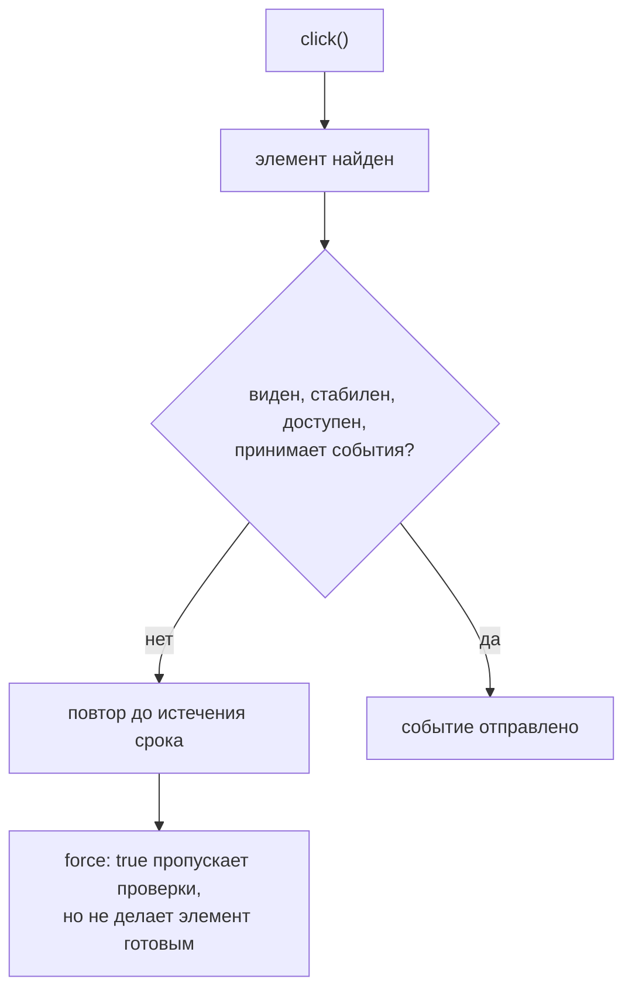

# Пользовательские действия

## Связь с предыдущей главой

Locator описывает элемент. Теперь тест должен взаимодействовать с ним так, чтобы действие отражало реальное поведение пользователя и завершалось предсказуемо.

## Цель главы

Научиться выбирать действия Playwright, понимать проверки actionability и корректно ожидать асинхронное взаимодействие.

## Главный вопрос

Как Playwright выполняет действия пользователя и проверяет готовность элемента?

## Мотивация

Найденный элемент не обязательно готов к клику: он может быть скрыт, перекрыт или двигаться. Прямое изменение DOM обходит эти условия и способно сделать тест зелёным при неработающем интерфейсе.

## Теория

### Действие — это попытка, а не команда DOM

Перед действием Playwright выполняет подходящие проверки пригодности. Для обычного клика цель должна однозначно разрешиться, быть видимой, стабильной (не в движении), принимать события и, когда это применимо, быть доступной.

Проверки повторяются, пока не выполнятся или пока не истечёт срок ожидания. Поэтому действие обычно не нуждается в предварительном ожидании: `click()` сам дождётся, пока кнопка появится и станет пригодной для клика.

Если условие так и не выполнилось, ошибка содержит журнал попыток — он и есть диагностика:

```text
locator.fill: Timeout 1500ms exceeded.
Call log:
  - waiting for locator('#i')
    - locator resolved to <input id="i" disabled/>
    - attempting fill action
      2 × waiting for element to be visible, enabled and editable
        - element is not enabled
```

Здесь сразу видно, что элемент найден, но отключён. Это не «тест упал», а «поле недоступно для ввода» — готовый отчёт о проблеме интерфейса.

### Основные действия и их намерение

- `click()` нажимает элемент;
- `fill()` заменяет текущее содержимое поля переданным значением;
- `press()` отправляет клавишу выбранному элементу;
- `check()` и `uncheck()` приводят флажок к требуемому состоянию;
- `selectOption()` выбирает вариант из списка;
- `hover()` наводит указатель;
- `focus()` переводит фокус.

Важно различать намерение и механику. `check()` **идемпотентен**: вызванный дважды, он оставит флажок отмеченным. `click()` по тому же элементу переключает состояние, поэтому повторный клик снимет отметку. Когда нужна гарантия состояния — `check()`; когда проверяется именно реакция на клик — `click()`.

### `fill()` против `pressSequentially()`

`fill()` не печатает — он устанавливает значение и порождает нужные события. Существующее содержимое при этом заменяется целиком.

`pressSequentially()` отправляет клавиши по одной, дописывая к текущему значению:

```ts
await input.fill("новое");              // значение: «новое»
await input.pressSequentially("+хвост"); // значение: «новое+хвост»
```

Поэтому посимвольный ввод нужен только там, где приложение реагирует на отдельные нажатия: автодополнение, маски ввода, счётчик символов, поиск по мере набора. В остальных случаях он лишь замедляет тест и добавляет источников нестабильности.

### Каждое действие возвращает Promise

`await` связывает завершение шага с продолжением теста. Без него тело теста пойдёт дальше, не дождавшись результата.

```ts
await page.getByLabel("Название").fill("Регрессия");
await page.getByRole("button", { name: "Сохранить" }).click();
await expect(page.getByText("Настройки сохранены")).toBeVisible();
```

Последняя строка — не формальность. Если действие запускает переход или асинхронное обновление, ожидание должно быть привязано к наблюдаемому результату, а не к паузе. Фиксированный `waitForTimeout` либо замедляет тест, либо оказывается слишком коротким на загруженном стенде.

### `force: true` отключает защиту, но не меняет физику

Это место, где интуиция обманывает чаще всего. `force: true` пропускает проверки пригодности — но не все и не всегда с ожидаемым результатом.

Элемент со `display: none` кликнуть не удастся даже с `force`: действие завершится ошибкой `Element is not visible`.

А вот перекрытый элемент ведёт себя опаснее. Без `force` клик честно падает: цель закрыта другим элементом. С `force` клик **проходит успешно** — событие отправляется в заданную точку, и получает его тот элемент, который лежит сверху. Обработчик кнопки при этом не срабатывает.

Результат: тест зелёный, действие не выполнено. Поэтому `force: true` — инструмент узкой технической проверки, а не способ починить падающий тест.

### Когда не нужно действовать через UI

Прямой `evaluate()` полезен для подготовки контролируемого состояния: выставить флаг, записать значение в хранилище, смоделировать редкую ситуацию. Но он не заменяет пользовательское действие в бизнес-сценарии — проверка «кнопка работает» через прямой вызов обработчика ничего не доказывает о кнопке.

Рабочее разделение простое: подготовка может использовать любые доступные средства, проверяемое действие выполняется так, как его выполнил бы пользователь.

Действие — это попытка с проверками готовности:



## Внутренний механизм

Каждое действие возвращает Promise. `await` связывает завершение шага с продолжением теста. Если действие запускает переход, последующее ожидание должно быть привязано к наблюдаемому результату.

```ts
await page.getByLabel("Название").fill("Регрессия");
await page.getByRole("button", { name: "Сохранить" }).click();
await expect(page.getByText("Настройки сохранены")).toBeVisible();
```

### Что проверяется перед действием

```text
1. элемент найден по локатору
2. он видим (есть в отрисовке, не display:none)
3. он стабилен — перестал двигаться между двумя кадрами
4. он принимает события — точка клика не перекрыта другим элементом
5. он доступен для взаимодействия — не disabled, поле не readonly
6. действие выполняется
```

Эти проверки повторяются до успеха или до истечения срока. Именно они делают
ненужной паузу перед `click()`: ожидание уже встроено в действие.

`force: true` пропускает шаги 3–5, но не шаг 2. На скрытом элементе он даёт
`Element is not visible`, а на **перекрытом** — «успешно» кликает, и событие
достаётся верхнему элементу. Обработчик кнопки не срабатывает, тест зелёный.

### Заменить или дописать, переключить или установить

| Вызов | Что делает | Повторный вызов |
| --- | --- | --- |
| `fill()` | заменяет значение целиком | результат тот же |
| `pressSequentially()` | дописывает по символам, как с клавиатуры | текст удваивается |
| `check()` | устанавливает нужное состояние | результат тот же |
| `click()` по флажку | переключает | возвращает к исходному |

Правый столбец и есть критерий выбора: тест должен давать одинаковый
результат при повторном запуске, поэтому для состояния берут `check()`, а для
значения — `fill()`.
```text
examples/03-automation-qa/chapter-170/01-user-actions.spec.ts
```

## Главная ментальная модель

Действие — не команда DOM, а попытка пользователя взаимодействовать с готовым элементом.

## Практические примеры

Для флажка следует использовать `check()`, а не кликать вслепую: операция приводит элемент к требуемому состоянию. Для списка подходит `selectOption()`. Клавиатурный ввод оправдан, если именно клавиатурное поведение является предметом проверки.

## Automation QA

Проверки пригодности превращают техническую проблему интерфейса в диагностируемое падение теста. Это ценнее, чем обходить перекрытие через `force: true`.

## Концептуальные границы и компромиссы

`force: true` иногда нужен для специальной технической проверки, но отключает часть защитных условий. Прямой `evaluate()` полезен для подготовки контролируемого состояния, однако не заменяет пользовательское действие в бизнес-сценарии.

## Распространённые ошибки

- Забывать `await` — действие уходит в фон, следующая строка выполняется на старом состоянии, и тест либо падает с `Test ended`, либо оказывается зелёным, ничего не нажав.

- Использовать `force: true` как стандартное исправление — он отключает проверки готовности, а не решает проблему. На перекрытом элементе клик «проходит успешно» и достаётся верхнему элементу: обработчик кнопки не срабатывает, тест зелёный.

- Менять DOM вместо взаимодействия через UI — установка значения скриптом обходит обработчики и валидацию, поэтому проверяется состояние разметки, а не поведение приложения.

- Применять `pressSequentially()` для любого ввода — он дописывает текст по символам к уже имеющемуся значению и работает медленно. Заменяет значение `fill()`; посимвольный ввод нужен только там, где важны обработчики нажатий.

- Кликать по флажку без проверки требуемого состояния — `click()` переключает, поэтому повторный запуск даёт обратный результат. Для нужного состояния есть идемпотентные `check()` и `uncheck()`.

## Распространённые мифы

**Миф: перед действием нужно ждать элемент вручную.**
Действие само повторяет проверки пригодности до истечения срока ожидания. Отдельное ожидание обычно избыточно.

**Миф: `force: true` заставляет клик сработать.**
Невидимый элемент не кликнется и с `force`. А перекрытый получит «успешный» клик, который достанется элементу сверху, — тест пройдёт, действие не выполнится.

**Миф: `fill()` печатает текст.**
Он устанавливает значение целиком. Посимвольный ввод даёт `pressSequentially()`.

**Миф: `check()` и `click()` по флажку — одно и то же.**
`check()` приводит к состоянию и идемпотентен, `click()` переключает. Два `check()` подряд оставят отметку, два клика — снимут.

**Миф: падение действия по истечении срока ожидания неинформативно.**
В сообщении есть журнал попыток, где указано, какое именно условие не выполнилось.

## Частые вопросы

**Как понять причину падения действия?**
Прочитать журнал вызовов в сообщении: он показывает, был ли найден элемент и какая проверка не прошла — видимость, доступность, стабильность.

**Когда `pressSequentially()` действительно нужен?**
Когда поведение зависит от отдельных нажатий: автодополнение, маска ввода, поиск по мере набора, счётчик символов.

**Что использовать для выпадающего списка?**
`selectOption()` для нативного `select`. Кастомный виджет — это набор обычных элементов, и с ним работают через клики по роли и имени.

**Можно ли обойтись `evaluate()` вместо клика?**
Для подготовки состояния — да. Для проверяемого действия — нет: так проверяется обработчик, а не интерфейс.

**Почему тест проходит, но результата в приложении нет?**
Типичная причина — `force: true` по перекрытому элементу: событие ушло не туда, а ошибки не возникло.

## Проверьте себя

1. Какие условия проверяет Playwright перед обычным кликом?
2. Чем `check()` отличается от `click()` по флажку?
3. Что произойдёт при `force: true` на невидимом элементе и что — на перекрытом?
4. Чем `fill()` отличается от `pressSequentially()` по результату?
5. Где проходит граница между подготовкой состояния и проверяемым действием?

### Ответы

1. Что элемент существует, виден, стабилен, принимает события и доступен для взаимодействия. Только после этого выполняется клик.
2. `check()` проверяет итоговое состояние: если флажок уже установлен, ничего не делает. `click()` переключает состояние, каким бы оно ни было.
3. На невидимом элементе клик выполнится в никуда: событие уйдёт, а приложение не отреагирует. На перекрытом — попадёт в тот элемент, который сверху.
4. `fill()` задаёт значение поля целиком и сразу. `pressSequentially()` печатает по символу, вызывая события клавиатуры, — это важно для подсказок и масок ввода.
5. Подготовка приводит приложение в нужное состояние и не является предметом проверки. Проверяемое действие — то, ради которого написан тест; его не прячут в помощники.

## Практика

```text
practice/03-automation-qa/170-user-actions.md
```

## Краткие итоги

- Действия моделируют пользовательское взаимодействие.
- Проверки пригодности определяют готовность элемента.
- Выбор метода зависит от типа контроля.
- Асинхронные действия требуют `await`.
- Обход защит должен быть исключением.

## Переход к следующей главе

После действия тест должен проверить наблюдаемый результат. В главе 171 для этого появятся проверки, умеющие ждать.
