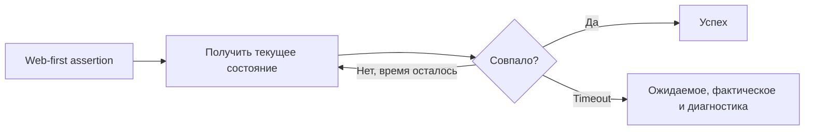

# Web-first assertions

## Связь с предыдущей главой

Пользовательское действие меняет интерфейс асинхронно. Проверка должна учитывать, что ожидаемое состояние может появиться не в момент чтения, а немного позже.

## Цель главы

Научиться выбирать web-first assertions и отличать проверки `Locator` с повторными попытками от немедленных проверок значений.

## Главный вопрос

Почему проверки UI должны ожидать наблюдаемое состояние, а не читать его один раз?

## Мотивация

Если сразу прочитать `textContent` после клика, тест может увидеть промежуточное состояние. Ручная пауза лишь угадывает длительность. Проверка должна ждать именно тот результат, который важен сценарию.

## Теория

### Проверка, которая наблюдает, а не спрашивает

Web-first assertion принимает `Locator`, повторно проверяет актуальный DOM и завершается при совпадении либо после истечения timeout.

Разница с обычным сравнением видна на одном примере. Пусть статус меняется с «Черновик» на «Готово» через 400 мс:

```ts
const snapshot = await page.locator("#status").textContent(); // «Черновик»
expect(snapshot).toBe("Готово");                              // упадёт немедленно

await expect(page.locator("#status")).toHaveText("Готово");   // дождётся «Готово»
```

Первая проверка сравнивает **значение**, полученное один раз. Вторая получает **локатор** и повторяет запрос, пока состояние не совпадёт. Именно передача локатора, а не значения, и делает проверку web-first.

### Набор проверок и что каждая описывает

| Проверка | Требование |
| --- | --- |
| `toBeVisible`, `toBeHidden` | элемент виден пользователю или нет |
| `toHaveText`, `toContainText` | текст элемента |
| `toHaveValue` | значение поля ввода |
| `toBeEnabled`, `toBeDisabled` | доступность действия |
| `toBeChecked` | состояние переключателя |
| `toHaveCount` | количество совпадений |
| `toHaveURL`, `toHaveTitle` | состояние страницы |

Все они повторяются до таймаута. Обычный `expect(value).toBe(expected)` повтора не делает — он сравнивает то, что уже лежит в переменной.

### `toHaveText` сравнивает целиком, `toContainText` — по части

Это место, где чаще всего ошибаются. `toHaveText` требует совпадения **всего** текста элемента: для `«Заказ принят в работу»` проверка `toHaveText("принят")` не пройдёт, а `toContainText("принят")` пройдёт.

Пробелы при этом нормализуются: лишние отступы и переносы строк в разметке совпадению не мешают. Для частичного совпадения по шаблону подойдёт регулярное выражение:

```ts
await expect(status).toContainText("принят");   // подстрока
await expect(status).toHaveText(/принят/);      // шаблон
await expect(status).toHaveText("Заказ принят в работу"); // полностью
```

Если локатор соответствует нескольким элементам, `toHaveText` принимает массив и сравнивает тексты по порядку — это удобный способ проверить список целиком.

### Строгость действует и в проверках

Проверка, требующая одного элемента, подчиняется тем же правилам strictness, что и действие. `toBeVisible` на локаторе с двумя совпадениями не выберет первый, а сообщит об ошибке:

```text
expect(locator).toBeVisible() failed
Error: strict mode violation: getByRole('listitem') resolved to 2 elements
```

Исключение — проверки, которые по смыслу работают с группой: `toHaveCount` и `toHaveText` с массивом.

### Отрицание тоже ждёт

`not` не отключает повторные попытки, а меняет условие выхода: проверка ждёт, пока состояние **перестанет** совпадать.

На отсутствующем элементе проходят все три записи — `not.toBeVisible()`, `toBeHidden()` и `toHaveCount(0)`. Разница в намерении: `toBeHidden` читается как «элемент есть, но скрыт», `toHaveCount(0)` — как «таких элементов нет». Выбирайте ту, которая точнее описывает требование.



### Диагностика падения

Сообщение содержит ожидаемое значение, фактическое, использованную границу времени и журнал попыток:

```text
expect(locator).toHaveText(expected) failed
Locator:  locator('#status')
Expected: "Готово"
Received: "Черновик"
Timeout:  600ms
```

Собственный цикл ожидания такого отчёта не даст: он завершится общей фразой вроде «условие не выполнилось». Это и есть практическая причина не писать ручные циклы для стандартных состояний элемента.

## Внутренний механизм


```ts
await expect(page.getByLabel("Статус")).toHaveText("Готово");
await expect(page.getByLabel("Email")).toHaveValue("qa@example.com");
await expect(page.getByRole("button", { name: "Отправить" })).toBeEnabled();
await expect(page.getByRole("listitem")).toHaveCount(3);
```

```text
examples/03-automation-qa/chapter-171/01-web-first-assertion.spec.ts
```

## Главная ментальная модель

Web-first assertion не спрашивает DOM один раз, а наблюдает за ним до требуемого состояния в пределах границы ожидания.

## Практические примеры

После сохранения формы проверяйте бизнес-результат: статус, сообщение или доступность следующего действия. Проверка внутреннего CSS-класса слабее, если пользовательское состояние можно выразить напрямую.

## Automation QA

Диагностика проверки показывает ожидаемое и фактическое значения, а также связанный `Locator`. Это помогает расследовать расхождение быстрее, чем собственный цикл проверок с общей ошибкой.

## Концептуальные границы и компромиссы

Повторные попытки полезны для асинхронного UI, но не исправляют неверное ожидание. Проверка должна описывать требование, а не просто любое состояние, которое удобно проверить.

## Распространённые ошибки

- Считать, что любой вызов `expect` автоматически повторяется.
- Читать значение один раз и ждать, что обычный `toBe` обновит его.
- Проверять промежуточное состояние вместо бизнес-результата.
- Писать ручной цикл для стандартного состояния элемента.
- Использовать слишком общий `Locator`.

## Распространённые мифы

**Миф: любой `expect` повторяется.**
Повтор делает только проверка, получившая локатор или страницу. `expect(await locator.textContent()).toBe(...)` сравнивает уже снятое значение один раз.

**Миф: `toHaveText` ищет подстроку.**
Он сравнивает весь текст элемента. Для части текста нужны `toContainText` или регулярное выражение.

**Миф: лишние пробелы в разметке ломают `toHaveText`.**
Пробелы нормализуются, поэтому переносы строк и отступы совпадению не мешают.

**Миф: `not` отключает ожидание.**
Проверка с `not` ждёт, пока условие перестанет выполняться, и тоже подчиняется таймауту.

**Миф: strict mode относится только к действиям.**
Проверка на одном элементе тоже падает при нескольких совпадениях. Исключение — проверки, работающие с группой.

## Частые вопросы

**Когда уместен обычный `toBe`?**
Когда значение уже получено и не меняется: разобранный ответ API, вычисленное число, результат функции. Для состояния страницы нужен web-first.

**Как проверить список целиком?**
`toHaveText` с массивом строк сравнивает тексты всех совпадений по порядку. Для количества — `toHaveCount`.

**Что выбрать для исчезающего элемента: `toBeHidden` или `toHaveCount(0)`?**
Обе проходят на отсутствующем элементе. Выбирайте по смыслу требования: «скрыт» или «отсутствует».

**Почему проверка прошла, а функциональность сломана?**
Частая причина — проверка промежуточного признака вместо результата: наличие спиннера, CSS-класса или атрибута вместо статуса, который видит пользователь.

**Нужно ли ждать перед проверкой?**
Нет. Web-first assertion сама повторяет запрос — отдельное ожидание перед ней избыточно.

## Проверьте себя

1. Что именно делает проверку web-first — тип матчера или то, что в неё передали?
2. Почему `toHaveText("принят")` не проходит на тексте «Заказ принят в работу»?
3. Что произойдёт с `toBeVisible` при двух совпадениях локатора?
4. Ждёт ли проверка с `not` и чего именно?
5. Какие четыре факта содержит сообщение об упавшей проверке?

## Практика

```text
practice/03-automation-qa/171-web-first-assertions.md
```

## Краткие итоги

- Locator assertions повторно проверяют актуальное состояние.
- Немедленная проверка готового значения не повторяет чтение.
- Проверка должна выражать наблюдаемый результат.
- Timeout ограничивает ожидание.
- Диагностика связывает ожидаемое и фактическое значения с `Locator`.

## Переход к следующей главе

Web-first assertions умеют ждать своё условие, а действия — готовность элемента. В главе 172 разделим эти механизмы и случаи явного ожидания.
