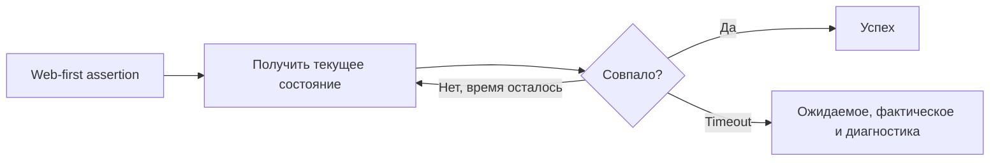

# Web-first assertions

## Связь с предыдущей главой

Пользовательское действие меняет интерфейс асинхронно. Проверка должна учитывать, что ожидаемое состояние может появиться не в момент чтения, а немного позже.

## Цель главы

Научиться выбирать web-first assertions и отличать проверки `Locator` с повторными попытками от немедленных проверок значений.

## Главный вопрос

Почему проверки UI должны ожидать наблюдаемое состояние, а не читать его один раз?

## Мотивация

Если сразу прочитать `textContent` после клика, тест может увидеть промежуточное состояние. Ручная пауза лишь угадывает длительность. Проверка должна ждать именно тот результат, который важен сценарию.

## Теория

Web-first assertion принимает `Locator`, повторно проверяет актуальный DOM и завершается при совпадении либо после истечения timeout. Например: `toBeVisible`, `toHaveText`, `toContainText`, `toHaveValue`, `toBeEnabled`, `toBeDisabled`, `toBeChecked`, `toHaveCount`.

Проверки `toHaveURL` и `toHaveTitle` описывают состояние страницы. Обычная проверка `expect(value).toBe(expected)` сравнивает уже полученное значение один раз и сама по себе не становится web-first.

## Внутренний механизм



```ts
await expect(page.getByLabel("Статус")).toHaveText("Готово");
await expect(page.getByLabel("Email")).toHaveValue("qa@example.com");
await expect(page.getByRole("button", { name: "Отправить" })).toBeEnabled();
await expect(page.getByRole("listitem")).toHaveCount(3);
```

```text
examples/03-automation-qa/chapter-171/01-web-first-assertion.spec.ts
```

## Главная ментальная модель

Web-first assertion не спрашивает DOM один раз, а наблюдает за ним до требуемого состояния в пределах границы ожидания.

## Практические примеры

После сохранения формы проверяйте бизнес-результат: статус, сообщение или доступность следующего действия. Проверка внутреннего CSS-класса слабее, если пользовательское состояние можно выразить напрямую.

## Automation QA

Диагностика проверки показывает ожидаемое и фактическое значения, а также связанный `Locator`. Это помогает расследовать расхождение быстрее, чем собственный цикл проверок с общей ошибкой.

## Концептуальные границы и компромиссы

Повторные попытки полезны для асинхронного UI, но не исправляют неверное ожидание. Проверка должна описывать требование, а не просто любое состояние, которое удобно проверить.

## Распространённые ошибки

- Считать, что любой вызов `expect` автоматически повторяется.
- Читать значение один раз и ждать, что обычный `toBe` обновит его.
- Проверять промежуточное состояние вместо бизнес-результата.
- Писать ручной цикл для стандартного состояния элемента.
- Использовать слишком общий `Locator`.

## Практика

```text
practice/03-automation-qa/171-web-first-assertions.md
```

## Краткие итоги

- Locator assertions повторно проверяют актуальное состояние.
- Немедленная проверка готового значения не повторяет чтение.
- Проверка должна выражать наблюдаемый результат.
- Timeout ограничивает ожидание.
- Диагностика связывает ожидаемое и фактическое значения с `Locator`.

## Переход к следующей главе

Web-first assertions умеют ждать своё условие, а действия — готовность элемента. В главе 172 разделим эти механизмы и случаи явного ожидания.
