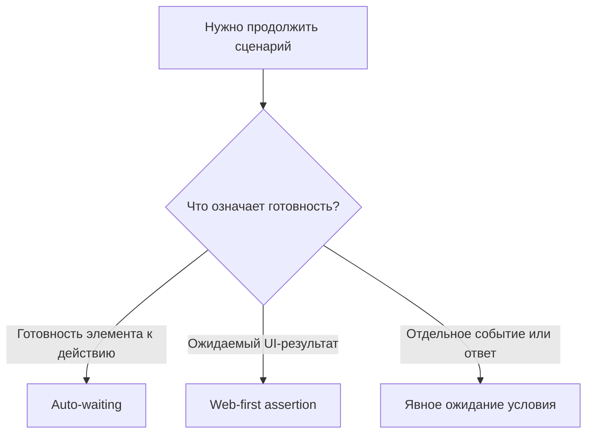

# Auto-waiting и явные ожидания

## Связь с предыдущей главой

Web-first assertions повторяют проверку состояния. Playwright также автоматически ожидает готовность перед действиями, но эти механизмы решают разные задачи.

## Цель главы

Научиться определять наблюдаемое условие синхронизации и использовать явное ожидание только там, где оно действительно нужно.

## Главный вопрос

Когда Playwright ждёт автоматически и когда тесту действительно нужно явное условие?

## Мотивация

Пауза на две секунды не знает, завершилась ли операция. На быстрой машине она теряет время, на медленной — не гарантирует успех. Надёжный тест ждёт событие или состояние, которое означает готовность.

## Теория

### Три уровня синхронизации

Playwright ждёт за вас в двух местах, и только третье требует вашего участия.

**Auto-waiting** работает перед действием: `click()` сам дождётся, пока элемент появится, станет видимым и начнёт принимать события. Отдельное ожидание перед действием не нужно.

**Web-first assertion** ждёт ожидаемый результат: `toBeVisible`, `toHaveText` и остальные повторяют проверку до совпадения.

**Явное ожидание** нужно, когда сценарий должен синхронизироваться с условием, которое не выражается ни действием, ни проверкой результата: состояние элемента, переход по URL, конкретный ответ сервера, событие.



### Главный вопрос синхронизации

Правильная формулировка — «какое наблюдаемое событие разрешает следующий шаг?», а не «сколько времени обычно проходит?».

Ответ на первый вопрос даёт условие, которое одинаково работает и на быстрой машине, и на загруженном CI. Ответ на второй даёт число, которое рано или поздно окажется неверным — обычно в самый неудобный момент.

### `waitForTimeout` синхронизирует с часами, а не с приложением

Пауза не связана с состоянием системы вообще. Она либо длиннее нужного — и тогда набор тестов медленно деградирует, либо короче — и тогда тест падает нестабильно.

Практическое следствие: `waitForTimeout()` допустим в разовой отладке, но не в коде теста. Почти всегда вместо него есть наблюдаемое условие.

### `networkidle` не означает «приложение готово»

Ожидание тишины в сети выглядит универсальным решением, но им не является. Современное приложение может держать открытые соединения — тогда тишина не наступит. Может и наоборот: сеть замолчала, а интерфейс ещё не отрисовал результат.

Готовность функции приложения выражается через то, что видит пользователь: появившийся результат, доступную кнопку, изменившийся статус.

### Ожидание события создаётся ДО действия, которое его вызывает

Это самая частая ошибка синхронизации, и она даёт «плавающие» падения.

`waitForResponse` подписывается на будущие события. Если создать его после клика, ответ может прийти раньше подписки — и ожидание истечёт по таймауту, хотя запрос давно завершился:

```ts
const responsePromise = page.waitForResponse("**/api/work-items");  // подписка
await page.getByRole("button", { name: "Сформировать" }).click();   // действие
await responsePromise;                                              // ожидание
```

Порядок здесь не стилистический. При обратном порядке ошибка выглядит так:

```text
page.waitForResponse: Timeout 900ms exceeded while waiting for event "response"
```

и выглядит как проблема приложения, хотя это гонка в самом тесте.

### `locator.waitFor` и когда он нужен

Ожидание состояния элемента полезно, когда следующий шаг зависит от исчезновения или появления чего-то, что само по себе не является проверяемым результатом:

```ts
await page.locator("#loading").waitFor({ state: "hidden" });
```

Доступны состояния `attached`, `detached`, `visible` и `hidden`. Но прежде чем писать такое ожидание, стоит проверить: часто нужное уже выражается проверкой результата, и тогда отдельный `waitFor` только дублирует гарантию.

Переход по URL лучше выражать соответствующей проверкой `toHaveURL`, а не ручным ожиданием: так условие останется видимым в отчёте.

## Внутренний механизм

Playwright многократно проверяет релевантное условие до успеха или timeout. `waitForTimeout()` проверяет только прохождение времени, поэтому не связывает тест с состоянием приложения. `networkidle` также не является универсальным признаком готовности: приложение может держать фоновые соединения или завершить сеть до обновления UI.

```text
examples/03-automation-qa/chapter-172/01-condition-based-wait.spec.ts
```

## Главная ментальная модель

Синхронизация отвечает на вопрос «какое наблюдаемое событие разрешает следующий шаг?», а не «сколько времени обычно проходит?».

## Практические примеры

После нажатия «Сформировать» можно ожидать видимый результат. Если действие должно дождаться конкретного ответа серверной части до следующего независимого шага, Promise ожидания создаётся до действия, чтобы не пропустить событие.

## Automation QA

Условие должно соответствовать бизнес-потоку: доступность кнопки, новый URL, статус обработки или конкретное событие. Чем точнее условие, тем полезнее падение.

## Концептуальные границы и компромиссы

Явное ожидание делает зависимость видимой, но лишние ожидания дублируют встроенные гарантии. Ожидание состояния загрузки уместно для навигации, однако не доказывает готовность конкретной функции приложения.

## Распространённые ошибки

- Использовать `waitForTimeout()` как основную синхронизацию.
- Ждать `networkidle` для любого приложения.
- Дублировать auto-waiting перед каждым `click()`.
- Начинать ожидание события после действия, которое уже могло его вызвать.
- Ждать технический индикатор вместо требуемого результата.

## Распространённые мифы

**Миф: перед каждым действием нужно ожидание.**
Действие само проверяет готовность элемента. Дополнительное ожидание дублирует встроенную гарантию.

**Миф: `networkidle` — универсальный признак готовности.**
Приложение может держать фоновые соединения или завершить сеть раньше отрисовки. Это не признак готовности функции.

**Миф: `waitForTimeout` безопасен, если пауза «с запасом».**
Запас замедляет весь набор и всё равно однажды окажется мал. Пауза не связана с состоянием приложения.

**Миф: порядок в `waitForResponse` — дело вкуса.**
Подписка после действия пропускает событие. Это гонка, которая проявляется случайно.

**Миф: любое ожидание делает тест стабильнее.**
Ожидание неверного условия лишь сдвигает падение. Стабильность даёт правильно выбранное условие, а не их количество.

## Частые вопросы

**Как выбрать условие ожидания?**
Спросить, что пользователь считает признаком завершения: появившийся результат, новый статус, доступное действие. Это и есть условие.

**Когда явное ожидание ответа оправдано?**
Когда завершение конкретного запроса действительно является условием следующего шага. Проверка содержимого ответа — это уже другая задача, ближе к API testing.

**Чем `toHaveURL` лучше ручного ожидания URL?**
Условие остаётся проверкой: оно видно в отчёте, а при падении показывает ожидаемое и фактическое значения.

**Можно ли оставить `waitForTimeout` при отладке?**
Да, для разового наблюдения. В коде теста ему места нет.

**Что делать, если готовность выражается только спиннером?**
Ждать его исчезновения допустимо, но надёжнее дополнительно проверить сам результат: спиннер может исчезнуть раньше отрисовки данных.

## Проверьте себя

1. Какие два вида ожидания Playwright выполняет сам?
2. Почему `waitForTimeout` не является синхронизацией?
3. Что может пойти не так с `networkidle` в обе стороны?
4. Почему `waitForResponse` создаётся до действия?
5. В каком случае `locator.waitFor` дублирует уже имеющуюся гарантию?

## Практика

```text
practice/03-automation-qa/172-auto-waiting-and-explicit-waits.md
```

## Краткие итоги

- Действия ожидают actionability автоматически.
- Web-first assertions повторяют проверку результата.
- Явное ожидание привязано к отдельному наблюдаемому условию.
- Произвольная пауза не является стратегией синхронизации.
- `networkidle` не доказывает готовность приложения.

## Переход к следующей главе

Любое ожидание должно иметь предел. В главе 173 разберём разные границы timeout и их диагностический смысл.
