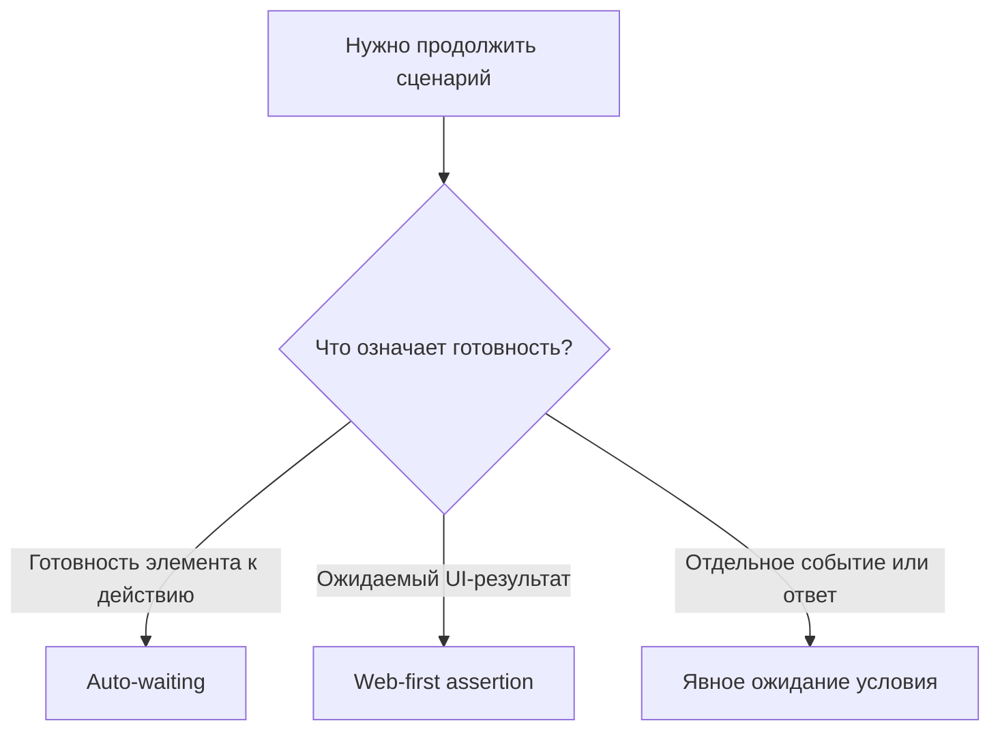

# Auto-waiting и явные ожидания

## Связь с предыдущей главой

Web-first assertions повторяют проверку состояния. Playwright также автоматически ожидает готовность перед действиями, но эти механизмы решают разные задачи.

## Цель главы

Научиться определять наблюдаемое условие синхронизации и использовать явное ожидание только там, где оно действительно нужно.

## Главный вопрос

Когда Playwright ждёт автоматически и когда тесту действительно нужно явное условие?

## Мотивация

Пауза на две секунды не знает, завершилась ли операция. На быстрой машине она теряет время, на медленной — не гарантирует успех. Надёжный тест ждёт событие или состояние, которое означает готовность.

## Теория

Auto-waiting перед действием проверяет actionability цели. Web-first assertion наблюдает ожидаемый результат. Явное ожидание требуется, когда сценарий должен синхронизироваться с отдельным условием: состоянием элемента, URL, определённым ответом или событием.

`locator.waitFor()` полезен для состояния элемента. URL лучше проверять через соответствующую web-first assertion. Ожидание ответа допустимо, когда именно завершение конкретного запроса является условием сценария, но это ещё не API testing.



## Внутренний механизм

Playwright многократно проверяет релевантное условие до успеха или timeout. `waitForTimeout()` проверяет только прохождение времени, поэтому не связывает тест с состоянием приложения. `networkidle` также не является универсальным признаком готовности: приложение может держать фоновые соединения или завершить сеть до обновления UI.

```text
examples/03-automation-qa/chapter-172/01-condition-based-wait.spec.ts
```

## Главная ментальная модель

Синхронизация отвечает на вопрос «какое наблюдаемое событие разрешает следующий шаг?», а не «сколько времени обычно проходит?».

## Практические примеры

После нажатия «Сформировать» можно ожидать видимый результат. Если действие должно дождаться конкретного ответа серверной части до следующего независимого шага, Promise ожидания создаётся до действия, чтобы не пропустить событие.

## Automation QA

Условие должно соответствовать бизнес-потоку: доступность кнопки, новый URL, статус обработки или конкретное событие. Чем точнее условие, тем полезнее падение.

## Концептуальные границы и компромиссы

Явное ожидание делает зависимость видимой, но лишние ожидания дублируют встроенные гарантии. Ожидание состояния загрузки уместно для навигации, однако не доказывает готовность конкретной функции приложения.

## Распространённые ошибки

- Использовать `waitForTimeout()` как основную синхронизацию.
- Ждать `networkidle` для любого приложения.
- Дублировать auto-waiting перед каждым `click()`.
- Начинать ожидание события после действия, которое уже могло его вызвать.
- Ждать технический индикатор вместо требуемого результата.

## Практика

```text
practice/03-automation-qa/172-auto-waiting-and-explicit-waits.md
```

## Краткие итоги

- Действия ожидают actionability автоматически.
- Web-first assertions повторяют проверку результата.
- Явное ожидание привязано к отдельному наблюдаемому условию.
- Произвольная пауза не является стратегией синхронизации.
- `networkidle` не доказывает готовность приложения.

## Переход к следующей главе

Любое ожидание должно иметь предел. В главе 173 разберём разные границы timeout и их диагностический смысл.
