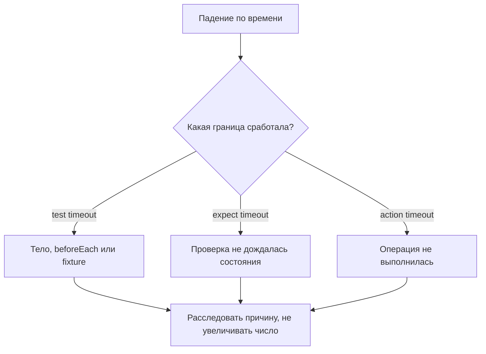

# Timeouts и границы ожидания

## Связь с предыдущей главой

Мы научились ждать наблюдаемое условие. Теперь нужно ограничить ожидание так, чтобы зависший сценарий завершался, а нормальная операция получала реалистичное время.

## Цель главы

Научиться различать области timeout, выбирать локальную границу по классу операции и расследовать причину до увеличения значения.

## Главный вопрос

Как задавать временные границы без маскировки медленных или зависших сценариев?

## Мотивация

Глобальное увеличение всех timeout может скрыть неправильный `Locator`, незавершённую навигацию или ошибку приложения. Слишком короткая граница создаёт ложные падения. Значение должно соответствовать конкретной операции.

## Теория

### Не один секундомер, а несколько независимых

Timeout отвечает на вопрос «сколько максимум ждать в одной попытке». Границ в запуске несколько, и они не складываются в общий бюджет:

| Граница | Что ограничивает |
| --- | --- |
| test timeout | тело теста, подготовку test-scoped fixtures и `beforeEach` |
| expect timeout | повторные попытки одной проверки |
| action timeout | одну браузерную операцию, если настроен |
| navigation timeout | переход по адресу, если настроен |
| `beforeAll` / `afterAll` | собственный бюджет, по умолчанию равный test timeout |

Локальное переопределение относится к известному медленному месту, глобальная настройка задаёт общий стандарт проекта.

### Что входит в бюджет теста, а что нет

Это стоит понимать точно. `beforeEach` и подготовка fixtures расходуют **тот же** бюджет, что и тело теста. При `timeout: 2000` подготовка на 1500 мс оставляет телу 500 мс — тест упадёт по таймауту, даже если само тело быстрое:

```text
Test timeout of 2000ms exceeded.
```

А вот `afterEach` и освобождение test-scoped fixtures получают **отдельный** бюджет того же размера. Очистка на 1500 мс успевает выполниться даже у теста, который уже исчерпал своё время. Это сделано намеренно: иначе падение по таймауту оставляло бы за собой неубранные ресурсы.

`beforeAll` и `afterAll` тоже имеют собственные границы и бюджетом отдельного теста не делятся.

### Побеждает самая короткая применимая граница

Внутри одного теста операции ограничены по-разному, и первой срабатывает наименьшая применимая:

```ts
test("пример", async ({ page }) => {
  test.setTimeout(10_000);
  await expect(page.getByText("Готово")).toBeVisible({ timeout: 700 });
});
```

Проверка упадёт примерно через 700 мс, а не через 10 секунд. То же с действием: `click({ timeout: 600 })` внутри длинного теста закончится через 600 мс.

Отсюда практическое правило чтения отчёта: важнее не число, а **какая именно граница сработала**. Сообщение `Test timeout of 2000ms exceeded` и `locator.click: Timeout 600ms exceeded` указывают на разные места и требуют разных действий.

### Timeout и retry решают разные задачи

Timeout — предел одной попытки ожидания. Retry повторяет более крупную единицу выполнения после ошибки.

Увеличение таймаута помогает, когда операция действительно дольше границы. Повтор помогает, когда операция иногда не удаётся по внешней причине. Подмена одного другим даёт либо медленный набор, либо замаскированный дефект.

### Как выбирать границы

Быстрая локальная реакция интерфейса и длительная бизнес-обработка — разные классы операций, и одно число им не подходит.

Рабочий порядок такой:

1. измерить нормальную длительность операции на типичной среде;
2. взять запас на разброс, а не на худший случай из наблюдений;
3. задать границу на уровне класса операций, а не отдельного вызова;
4. локальное переопределение оставить для документированных исключений.

Слишком короткая граница делает тест чувствительным к обычному шуму среды. Слишком длинная превращает падение в долгое ожидание и скрывает деградацию: приложение стало вдвое медленнее, а тесты всё ещё зелёные.

### Что делать при падении по таймауту

Увеличение границы — последнее действие, а не первое. Сначала проверяют, что именно не дождалось:

- правильный ли локатор и не изменилась ли разметка;
- действительно ли приложение пришло в ожидаемое состояние;
- не ждёт ли тест не того условия;
- не деградировала ли сеть или сам стенд.

Только подтверждённая измерением нормальная длительность оправдывает изменение границы.

### Что помогает управлять границами

Для известного медленного сценария вместо правки глобальной настройки удобнее локальные средства: `test.setTimeout()` задаёт бюджет конкретного теста, а `test.slow()` утраивает его — при стандартных 15 секундах тест получит 45. Такая запись остаётся видимой в коде и не влияет на остальной набор.



## Внутренний механизм

Вложенные операции могут иметь разные пределы. Пока выполняется тело теста, более короткая применимая граница может завершить операцию первой. Отдельные бюджеты hooks и освобождения ресурсов нельзя представлять как один общий секундомер всей группы тестов. Поэтому сообщение об ошибке и этап, на котором истекло время, важнее самого числа.

```ts
await expect(page.getByLabel("Статус")).toHaveText("Завершено", {
  timeout: 500,
});
```

```text
examples/03-automation-qa/chapter-173/01-scoped-timeout.spec.ts
```

## Главная ментальная модель

Timeout — предельный бюджет ожидания конкретной операции, а не способ сделать медленный тест надёжным.

## Практические примеры

Быстрая локальная UI-реакция и длительная бизнес-обработка относятся к разным классам операций. Границы выбирают по наблюдаемому поведению среды и подтверждают измерениями, а не копируют одно число повсюду.

## Automation QA

При timeout сначала проверяют `Locator`, состояние приложения, сеть и выбранное условие. Только подтверждённая нормальная длительность оправдывает изменение границы.

## Концептуальные границы и компромиссы

Локальный timeout документирует особенность шага, но множество случайных значений усложняет поддержку. Глобальная граница упрощает стандарт, но не заменяет классификацию операций.

## Распространённые ошибки

- Увеличивать все timeout после первой ошибки.
- Путать timeout с retry.
- Назначать одну границу всем операциям.
- Делать timeout короче нормальной вариативности среды.
- Игнорировать, какая именно граница сработала.

## Распространённые мифы

**Миф: у запуска один общий секундомер.**
Границ несколько, и они независимы. Бюджет теста, бюджет очистки и бюджеты hooks не складываются.

**Миф: `afterEach` не выполнится, если тест упал по таймауту.**
У очистки собственный бюджет. Она выполняется и после исчерпания времени тестом.

**Миф: `beforeEach` не влияет на время теста.**
Влияет напрямую: подготовка расходует тот же бюджет, что и тело.

**Миф: самая длинная граница определяет поведение.**
Срабатывает самая короткая применимая. `expect` с таймаутом 700 мс упадёт через 700 мс в тесте на 10 секунд.

**Миф: увеличение таймаута чинит флаки-тест.**
Оно откладывает падение. Если причина в неверном условии или деградации стенда, число не поможет.

## Частые вопросы

**Тест упал по времени — с чего начать?**
С определения границы: сообщение указывает, истёк ли бюджет теста, проверки или действия. Это три разных расследования.

**Почему тест падает, хотя тело выполняется быстро?**
Скорее всего, бюджет съедает `beforeEach` или подготовка fixture — они входят в то же время.

**Стоит ли задавать action timeout глобально?**
Полезно, если у проекта есть понятный стандарт скорости интерфейса. Но глобальная граница не отменяет классификацию операций.

**Как обозначить заведомо медленный сценарий?**
`test.slow()` утраивает бюджет конкретного теста, `test.setTimeout()` задаёт точное значение. Оба варианта видны в коде.

**Чем плох очень большой глобальный timeout?**
Падения становятся долгими, а деградация приложения перестаёт быть заметной: тесты проходят, просто медленнее.

## Проверьте себя

1. Какие операции расходуют бюджет теста, а какие получают собственный?
2. Что произойдёт при `expect` с таймаутом 700 мс внутри теста на 10 секунд?
3. Почему очистке дали отдельный бюджет?
4. Чем timeout отличается от retry по назначению?
5. Какие четыре проверки стоит сделать до увеличения границы?

## Практика

```text
practice/03-automation-qa/173-timeouts-and-wait-boundaries.md
```

## Краткие итоги

- Timeouts ограничивают разные уровни и этапы выполнения.
- Первая истёкшая граница завершает соответствующую операцию.
- Локальное переопределение должно иметь причину.
- Увеличение значения не исправляет неверное условие.
- Timeout и retry решают разные задачи.

## Переход к следующей главе

Граница теста включает подготовку и очистку. В главе 174 разместим hooks в жизненном цикле группы тестов.
