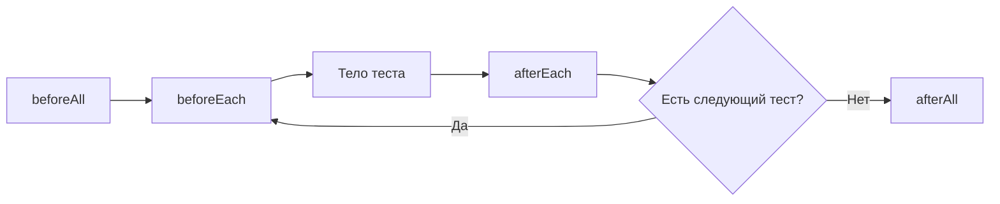

# Hooks и жизненный цикл теста

## Связь с предыдущей главой

Test timeout охватывает выполнение сценария и связанный жизненный цикл. Теперь разберём, где тестовый раннер выполняет общую подготовку и очистку.

## Цель главы

Научиться определять область и порядок hooks, использовать их для прозрачной подготовки и очистки и замечать скрытые зависимости.

## Главный вопрос

Как подготовка и очистка связываются с жизненным циклом группы тестов?

## Мотивация

Повторяющаяся подготовка загромождает тесты, но слишком умные hooks скрывают важные условия сценария. Нужно понимать, когда именно выполняется hook и каким состоянием он владеет.

## Теория

Внутри области `test.describe()`:

- `beforeAll()` выполняется перед тестами этой области в worker;
- `beforeEach()` выполняется перед каждым тестом;
- `afterEach()` выполняется после каждого теста;
- `afterAll()` выполняется после тестов области в worker.

Hooks наследуют область объявления. Они подходят для повторяемой технической подготовки и очистки, но существенные бизнес-условия лучше оставлять видимыми в тесте.

## Внутренний механизм

Для обычного успешного выполнения в одном worker порядок выглядит так:



Если `beforeEach` завершается ошибкой, тело теста не запускается, но применимые `afterEach` всё равно выполняются. `afterEach` запускается и после ошибки внутри тела, а `afterAll` — после завершения тестов области. Ошибка очистки также является значимой. Если worker перезапускается после неуспешного теста, `beforeAll` и `afterAll` могут выполниться снова в новом worker, поэтому они не означают «ровно один раз за весь глобальный запуск».

```text
examples/03-automation-qa/chapter-174/01-hook-order.spec.ts
```

## Главная ментальная модель

Hooks — рамка жизненного цикла вокруг тестов в конкретной области, а не скрытый второй сценарий.

## Практические примеры

`beforeEach` может подготовить независимую локальную страницу, а `afterEach` — проверить или очистить принадлежащий тесту ресурс. Дорогая операция не становится подходящей для `beforeAll` автоматически: общее изменяемое состояние связывает тесты.

## Automation QA

Hooks полезны для одинаковой технической подготовки, но не должны скрывать, какой пользователь или заказ требуется сценарию. Проектирование custom fixtures обеспечит более явное управление зависимостями в главе 177.

## Концептуальные границы и компромиссы

Hooks уменьшают повторение, но увеличивают неявный контекст. Чем дальше hook от теста и чем больше он меняет, тем труднее понять сценарий и причину ошибки.

## Распространённые ошибки

- Переносить важные бизнес-шаги в `beforeEach`.
- Хранить изменяемые данные между тестами через `beforeAll`.
- Предполагать, что очистка никогда не завершается ошибкой.
- Создавать глубокие вложенные `describe` с множеством hooks.
- Использовать hooks вместо осознанной модели владения.

## Практика

```text
practice/03-automation-qa/174-hooks-and-test-lifecycle.md
```

## Краткие итоги

- Hooks выполняются в области объявления.
- `beforeEach` и `afterEach` обрамляют каждый тест.
- `beforeAll` и `afterAll` обрамляют группу тестов.
- Подготовка и очистка могут завершиться ошибкой.
- Общее изменяемое состояние создаёт зависимость между тестами.

## Переход к следующей главе

Hooks показывают порядок подготовки, но надёжность требует ещё и независимого состояния. Этому посвящена глава 175.
