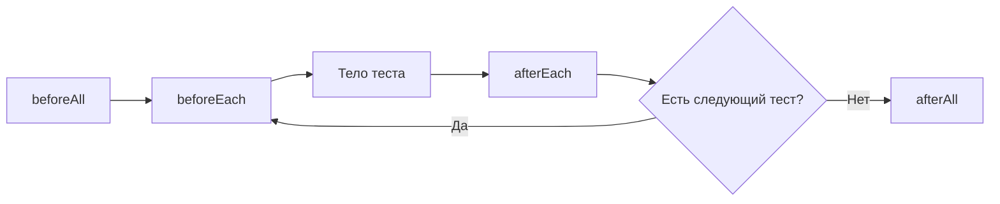

# Hooks и жизненный цикл теста

## Связь с предыдущей главой

Test timeout охватывает выполнение сценария и связанный жизненный цикл. Теперь разберём, где тестовый раннер выполняет общую подготовку и очистку.

## Цель главы

Научиться определять область и порядок hooks, использовать их для прозрачной подготовки и очистки и замечать скрытые зависимости.

## Главный вопрос

Как подготовка и очистка связываются с жизненным циклом группы тестов?

## Мотивация

Повторяющаяся подготовка загромождает тесты, но слишком умные hooks скрывают важные условия сценария. Нужно понимать, когда именно выполняется hook и каким состоянием он владеет.

## Теория

### Четыре hook и их область

Внутри области `test.describe()`:

- `beforeAll()` выполняется перед тестами этой области в worker;
- `beforeEach()` выполняется перед каждым тестом;
- `afterEach()` выполняется после каждого теста;
- `afterAll()` выполняется после тестов области в worker.

Hooks наследуют область объявления. Объявленные на верхнем уровне файла, они относятся ко всем тестам файла; объявленные внутри `describe` — только к тестам этой группы.

### Порядок при вложенности: внутрь и обратно

Подготовка идёт снаружи внутрь, очистка — изнутри наружу. Для файла с внешними hooks и вложенной группой порядок такой:

```text
beforeAll внешний
  beforeAll группы
    beforeEach внешний
      beforeEach вложенный
        тело теста
      afterEach вложенный
    afterEach внешний
  afterAll группы
afterAll внешний
```

Это то же правило, по которому работает вложенность вообще: что открыли последним, закрываете первым. Практический вывод — очистка во вложенной группе выполняется раньше внешней и не может рассчитывать на то, что внешняя уже отработала.



### Что происходит при ошибке

Если `beforeEach` завершается ошибкой, тело теста **не запускается**, но все применимые `afterEach` выполняются, и `afterAll` тоже. Очистка не пропускается из-за неудачной подготовки — иначе созданные до ошибки ресурсы остались бы висеть.

`afterEach` запускается и после ошибки внутри тела теста. Ошибка в самой очистке тоже значима: она отмечается как неуспех, потому что означает незавершённое освобождение ресурса.

### `beforeAll` — не «ровно один раз за запуск»

Это утверждение стоит проверить и запомнить. `beforeAll` выполняется один раз **на worker**, а worker может смениться.

После неуспешного теста раннер выводит worker из работы и запускает новый — даже без включённых повторов. Новый worker загружает файл заново и снова выполняет `beforeAll`:

```text
beforeAll, worker 0
  ... падение теста ...
afterAll
beforeAll, worker 1     ← выполнился второй раз
```

Отсюда два правила. Подготовка в `beforeAll` должна быть идемпотентной: повторное выполнение не должно ломаться и не должно создавать дубликаты. И на «ровно один раз за весь запуск» в `beforeAll` полагаться нельзя — для этого существует глобальная настройка запуска.

### Дорогая операция ещё не повод для `beforeAll`

Соблазн понятен: перенести медленную подготовку в `beforeAll` и выполнить её один раз. Но результат такой подготовки становится общим изменяемым состоянием, и тесты перестают быть независимыми.

Признак проблемы простой: если один тест меняет то, что создал `beforeAll`, второй тест уже зависит от порядка. Такой набор ломается при параллельном запуске, при повторе отдельного теста и при смене worker.

Безопасный вариант — делить только **неизменяемое**: справочные данные, скачанный файл, подготовленное состояние авторизации, которое потребители не меняют.

### Граница между hooks и телом теста

Hooks уменьшают повторение, но увеличивают неявный контекст. Чем дальше hook от теста и чем больше он меняет, тем труднее понять сценарий и причину падения.

Рабочее разделение: в hooks — одинаковая техническая подготовка и очистка, в теле теста — всё, что относится к сценарию. Если из теста не видно, какой пользователь или какой заказ ему нужен, важное условие спряталось в hook.

Более явный способ управлять зависимостями даёт механизм custom fixtures — он будет темой главы 177.

## Внутренний механизм

Для обычного успешного выполнения в одном worker порядок выглядит так:


Если `beforeEach` завершается ошибкой, тело теста не запускается, но применимые `afterEach` всё равно выполняются. `afterEach` запускается и после ошибки внутри тела, а `afterAll` — после завершения тестов области. Ошибка очистки также является значимой. Если worker перезапускается после неуспешного теста, `beforeAll` и `afterAll` могут выполниться снова в новом worker, поэтому они не означают «ровно один раз за весь глобальный запуск».

```text
examples/03-automation-qa/chapter-174/01-hook-order.spec.ts
```

## Главная ментальная модель

Hooks — рамка жизненного цикла вокруг тестов в конкретной области, а не скрытый второй сценарий.

## Практические примеры

`beforeEach` может подготовить независимую локальную страницу, а `afterEach` — проверить или очистить принадлежащий тесту ресурс. Дорогая операция не становится подходящей для `beforeAll` автоматически: общее изменяемое состояние связывает тесты.

## Automation QA

Hooks полезны для одинаковой технической подготовки, но не должны скрывать, какой пользователь или заказ требуется сценарию. Проектирование custom fixtures обеспечит более явное управление зависимостями в главе 177.

## Концептуальные границы и компромиссы

Hooks уменьшают повторение, но увеличивают неявный контекст. Чем дальше hook от теста и чем больше он меняет, тем труднее понять сценарий и причину ошибки.

## Распространённые ошибки

- Переносить важные бизнес-шаги в `beforeEach`.
- Хранить изменяемые данные между тестами через `beforeAll`.
- Предполагать, что очистка никогда не завершается ошибкой.
- Создавать глубокие вложенные `describe` с множеством hooks.
- Использовать hooks вместо осознанной модели владения.

## Распространённые мифы

**Миф: `beforeAll` выполняется ровно один раз за запуск.**
Он выполняется один раз на worker. После неуспешного теста worker сменяется, и hook выполняется снова.

**Миф: при падении подготовки очистка не нужна и не запускается.**
`afterEach` и `afterAll` выполняются и после ошибки в `beforeEach`. Ресурсы, созданные до ошибки, надо освободить.

**Миф: вложенный `afterEach` выполняется после внешнего.**
Очистка идёт изнутри наружу: сначала вложенный, потом внешний.

**Миф: ошибка в очистке не важна, тест ведь уже прошёл.**
Она отмечается как неуспех. Незавершённая очистка влияет на следующие тесты.

**Миф: перенос дорогой подготовки в `beforeAll` всегда ускоряет набор.**
Он создаёт общее изменяемое состояние и связывает тесты порядком. Выигрыш во времени оборачивается нестабильностью.

## Частые вопросы

**Что можно безопасно готовить в `beforeAll`?**
То, что потребители не меняют: справочные данные, скачанные файлы, неизменяемое состояние авторизации.

**Как сделать подготовку в `beforeAll` устойчивой к повтору?**
Писать её идемпотентно: проверять наличие перед созданием, использовать устойчивые идентификаторы вместо накопления новых записей.

**Где должна жить очистка тестовых данных?**
У того, кто их создал. Если данные создал тест — в `afterEach` или в teardown fixture; если инфраструктура — в её собственном механизме.

**Сколько уровней `describe` допустимо?**
Столько, сколько остаётся читаемым. Глубокая вложенность с hooks на каждом уровне делает порядок выполнения неочевидным.

**Чем fixture лучше hook?**
Fixture объявляет зависимость в сигнатуре теста: видно, что тесту нужно, и ресурс готовится только для тех, кто его запросил.

## Проверьте себя

1. В каком порядке выполняются hooks при вложенных `describe`?
2. Что выполняется, если `beforeEach` завершился ошибкой?
3. Почему `beforeAll` может выполниться дважды за один запуск?
4. Какое требование это накладывает на код в `beforeAll`?
5. По какому признаку видно, что в hook спрятано важное условие сценария?

## Практика

```text
practice/03-automation-qa/174-hooks-and-test-lifecycle.md
```

## Краткие итоги

- Hooks выполняются в области объявления.
- `beforeEach` и `afterEach` обрамляют каждый тест.
- `beforeAll` и `afterAll` обрамляют группу тестов.
- Подготовка и очистка могут завершиться ошибкой.
- Общее изменяемое состояние создаёт зависимость между тестами.

## Переход к следующей главе

Hooks показывают порядок подготовки, но надёжность требует ещё и независимого состояния. Этому посвящена глава 175.
