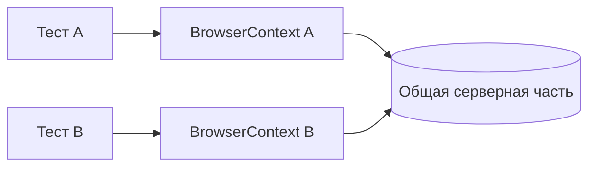

# Изоляция UI-тестов и состояние браузера

## Связь с предыдущей главой

Hooks управляют повторяемыми этапами жизненного цикла. Теперь нужно определить, какое состояние принадлежит отдельному тесту и почему оно не должно протекать в соседний сценарий.

## Цель главы

Научиться различать браузерное и серверное состояние, проектировать независимые UI-тесты и обнаруживать зависимость от порядка запуска.

## Главный вопрос

Почему каждый тест должен владеть своим состоянием и не зависеть от порядка запуска?

## Мотивация

Тест может проходить после другого теста из-за оставшейся авторизации и падать при одиночном запуске. Такая последовательность скрывает обязательную подготовку и ломается при параллельном выполнении.

## Теория

### Изоляция проходит по браузеру, а не по системе

Свежий `BrowserContext` изолирует cookies, `localStorage`, `sessionStorage` и другие данные браузерной сессии. IndexedDB также относится к клиентскому состоянию, но его детальная работа здесь не требуется.

Серверная часть хранит пользователей, заказы и другие общие данные независимо от контекста. Playwright Test даёт каждому тесту свой контекст — и на этом его участие в изоляции заканчивается.



### Две половины состояния

Разделение удобно держать в голове как таблицу:

| Изолирует раннер | Требует вашей стратегии |
| --- | --- |
| cookies и хранилища браузера | записи в базе стенда |
| разрешения и настройки сессии | серверные сессии и очереди |
| кеш этой сессии | файлы, созданные приложением |

Отсюда типичное недоразумение: «тесты независимы, у каждого свой контекст» — и при этом второй тест видит заказ, созданный первым. Контекст тут ни при чём: заказ живёт на сервере.

### Что значит «тест независим»

Практическая проверка состоит из трёх запусков. Тест должен проходить:

1. отдельно, сам по себе;
2. в произвольном порядке относительно других;
3. одновременно с другими тестами.

Внутри файла тесты выполняются в порядке объявления, но полагаться на это нельзя: файлы распределяются по worker, отдельный тест может быть запущен по фильтру, а после падения запуск может быть повторён. Порядок — не контракт.

### Каждый тест получает своё состояние сам

Правило простое: тест не берёт состояние от соседа, а получает его явно — через подготовку, fixture или уникальные данные.

Уникальность данных — самый дешёвый способ убрать пересечение между параллельными тестами. Вместо общего заказа `order-1` тест создаёт запись с идентификатором, который принадлежит только ему. Тогда параллельный запуск перестаёт быть источником гонок.

### Повторное использование состояния авторизации

Полная повторная авторизация через интерфейс дорога: на большом наборе она может занимать больше времени, чем сами проверки. Поэтому состояние авторизации готовят один раз и загружают в новый контекст.

Механика в том, что сессия выражается данными браузера и их можно перенести:

```ts
const state = await authorizedContext.storageState();
const context = await browser.newContext({ storageState: state });
```

Новый контекст получает cookies сохранённого состояния, тогда как обычный новый контекст не получает ничего. Тесты остаются в разных контекстах — общим становится только стартовое состояние.

Условие безопасности одно: такое состояние должно быть **неизменяемым для потребителей**. Как только один тест меняет пользователя, чьё состояние переиспользуют остальные, изоляция теряется. Подробная работа со `storageState` и архитектура fixtures — темы глав 177 и 178.

### У очистки должен быть владелец

Очистка принадлежит тому, кто создал данные. Формулировка кажется очевидной, но именно её нарушение даёт стенд, который «постепенно засоряется».

Рабочие варианты владения:

- тест создал — тест и убирает, в `afterEach` или teardown fixture;
- инфраструктура создала — она же убирает в собственном механизме;
- данные уникальны и недороги — допустимо не убирать вовсе, если стенд регулярно пересоздаётся.

Недопустим только четвёртый вариант: владельца нет, и каждый надеется на соседа.

## Внутренний механизм

Playwright Test обычно создаёт отдельный контекст для каждого теста. Порядок запуска может изменяться, поэтому каждый тест должен явно получить необходимое состояние и не полагаться на результат соседа.

```text
examples/03-automation-qa/chapter-175/01-browser-state-isolation.spec.ts
```

Состояние авторизации можно подготавливать контролируемо и иногда переиспользовать намеренно, но подробная работа со `storageState` и архитектура fixtures принадлежат следующим главам.

## Главная ментальная модель

Каждый тест владеет своей браузерной сессией и подготовкой, но разделяет внешнюю систему, где данные требуют отдельной стратегии.

## Практические примеры

Тест редактирования профиля сам получает авторизованное состояние. Тест создания заказа использует уникальный идентификатор. Очистка принадлежит тому сценарию или инфраструктурному механизму, который создал данные.

## Automation QA

Проверка независимости проста: тест должен проходить отдельно, в произвольном порядке и рядом с другими тестами. Концептуально это также готовит набор к параллельному выполнению.

## Концептуальные границы и компромиссы

Полная повторная авторизация может быть дорогой, поэтому контролируемое повторное использование состояния допустимо. Оно должно быть неизменяемым для потребителей и не превращать тесты в последовательную цепочку.

## Распространённые ошибки

- Создавать пользователя в одном тесте и использовать в следующем.
- Считать свежий контекст очисткой серверной части.
- Использовать одинаковые изменяемые данные параллельно.
- Полагаться на порядок файлов или тестов.
- Оставлять очистку без явного владельца.

## Распространённые мифы

**Миф: свежий контекст делает тест независимым.**
Он изолирует браузерное состояние. Данные на стенде остаются общими и требуют отдельной стратегии.

**Миф: тесты выполняются в порядке объявления, на это можно опереться.**
Внутри файла порядок объявления соблюдается, но файлы распределяются по worker, тест может запускаться по фильтру или повторно. Порядок — не контракт.

**Миф: переиспользование состояния авторизации ломает изоляцию.**
Не ломает, пока состояние неизменяемо для потребителей. Проблема возникает, когда тест меняет общего пользователя.

**Миф: если тест проходит в наборе, он независим.**
Это проверяется тремя запусками: отдельно, в другом порядке и параллельно.

**Миф: очистку можно оставить «на потом».**
Без явного владельца её не делает никто, и стенд накапливает мусор до первого загадочного падения.

## Частые вопросы

**Тест проходит один и падает в наборе. Где искать?**
В общем состоянии на стенде: одинаковые тестовые данные, общий пользователь, незавершённая очистка соседа.

**Как быстро убрать пересечение параллельных тестов?**
Сделать данные уникальными для каждого теста. Это дешевле, чем синхронизировать доступ к общей записи.

**Можно ли переиспользовать одного пользователя во всех тестах?**
Да, если тесты его не меняют. Как только появляется сценарий редактирования профиля, ему нужен собственный пользователь.

**Что делать, если очистка сама может упасть?**
Писать её устойчивой к отсутствию данных и не скрывать ошибку: неудачная очистка — сигнал, а не мелочь.

**Нужно ли очищать браузерное состояние вручную?**
Нет. Контекст теста создаётся заново, а его закрытие выполняет раннер.

## Проверьте себя

1. Что изолирует раннер автоматически, а что остаётся вашей задачей?
2. Из каких трёх запусков состоит проверка независимости теста?
3. Почему нельзя опираться на порядок выполнения тестов?
4. При каком условии переиспользование состояния авторизации безопасно?
5. Какие варианты владения очисткой допустимы и какой — нет?

## Практика

```text
practice/03-automation-qa/175-ui-test-isolation-and-browser-state.md
```

## Краткие итоги

- Свежий `BrowserContext` изолирует браузерное состояние.
- Серверное состояние остаётся общим.
- Тест не должен зависеть от результата другого теста.
- Уникальные данные и очистка защищают серверную часть.
- Намеренное повторное использование состояния требует контроля.

## Переход к следующей главе

Мы умеем писать изолированный UI-тест и понимаем владельцев его состояния. Глава 176 начнёт следующий модуль и разберёт built-in fixtures как управляемые ресурсы Playwright Test.
