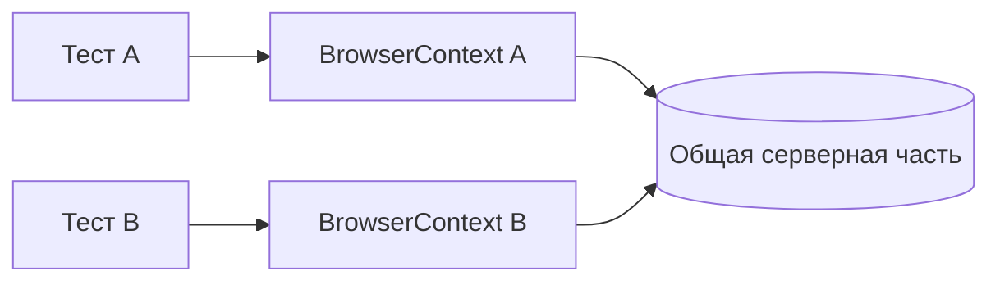

# Изоляция UI-тестов и состояние браузера

## Связь с предыдущей главой

Hooks управляют повторяемыми этапами жизненного цикла. Теперь нужно определить, какое состояние принадлежит отдельному тесту и почему оно не должно протекать в соседний сценарий.

## Цель главы

Научиться различать браузерное и серверное состояние, проектировать независимые UI-тесты и обнаруживать зависимость от порядка запуска.

## Главный вопрос

Почему каждый тест должен владеть своим состоянием и не зависеть от порядка запуска?

## Мотивация

Тест может проходить после другого теста из-за оставшейся авторизации и падать при одиночном запуске. Такая последовательность скрывает обязательную подготовку и ломается при параллельном выполнении.

## Теория

Свежий `BrowserContext` изолирует cookies, `localStorage`, `sessionStorage` и другие данные браузерной сессии. IndexedDB также относится к клиентскому состоянию, но его детальная работа здесь не требуется.

Серверная часть хранит пользователей, заказы и другие общие данные независимо от контекста. Поэтому браузерная изоляция не заменяет уникальные тестовые данные и очистку серверных ресурсов.



## Внутренний механизм

Playwright Test обычно создаёт отдельный контекст для каждого теста. Порядок запуска может изменяться, поэтому каждый тест должен явно получить необходимое состояние и не полагаться на результат соседа.

```text
examples/03-automation-qa/chapter-175/01-browser-state-isolation.spec.ts
```

Состояние авторизации можно подготавливать контролируемо и иногда переиспользовать намеренно, но подробная работа со `storageState` и архитектура fixtures принадлежат следующим главам.

## Главная ментальная модель

Каждый тест владеет своей браузерной сессией и подготовкой, но разделяет внешнюю систему, где данные требуют отдельной стратегии.

## Практические примеры

Тест редактирования профиля сам получает авторизованное состояние. Тест создания заказа использует уникальный идентификатор. Очистка принадлежит тому сценарию или инфраструктурному механизму, который создал данные.

## Automation QA

Проверка независимости проста: тест должен проходить отдельно, в произвольном порядке и рядом с другими тестами. Концептуально это также готовит набор к параллельному выполнению.

## Концептуальные границы и компромиссы

Полная повторная авторизация может быть дорогой, поэтому контролируемое повторное использование состояния допустимо. Оно должно быть неизменяемым для потребителей и не превращать тесты в последовательную цепочку.

## Распространённые ошибки

- Создавать пользователя в одном тесте и использовать в следующем.
- Считать свежий контекст очисткой серверной части.
- Использовать одинаковые изменяемые данные параллельно.
- Полагаться на порядок файлов или тестов.
- Оставлять очистку без явного владельца.

## Практика

```text
practice/03-automation-qa/175-ui-test-isolation-and-browser-state.md
```

## Краткие итоги

- Свежий `BrowserContext` изолирует браузерное состояние.
- Серверное состояние остаётся общим.
- Тест не должен зависеть от результата другого теста.
- Уникальные данные и очистка защищают серверную часть.
- Намеренное повторное использование состояния требует контроля.

## Переход к следующей главе

Мы умеем писать изолированный UI-тест и понимаем владельцев его состояния. Глава 176 начнёт следующий модуль и разберёт built-in fixtures как управляемые ресурсы Playwright Test.
