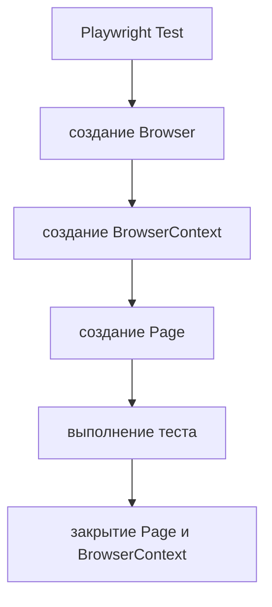

# Built-in fixtures

## Связь с предыдущей главой

Глава 175 показала, что каждый тест должен владеть своей браузерной сессией. Теперь разберём механизм Playwright Test, который создаёт эту сессию, передаёт её тесту и освобождает после выполнения.

## Цель главы

Понять назначение built-in fixtures `page`, `context` и `browser`, их связи и границы жизненного цикла.

## Главный вопрос

Какие ресурсы Playwright Test предоставляет тесту и кто управляет их жизненным циклом?

## Мотивация

В обычном Playwright-скрипте инженер сам запускает браузер, создаёт контекст и закрывает ресурсы. В Playwright Test эти повторяемые операции выполняет тестовый раннер. Тест запрашивает только нужные ресурсы через параметры функции.

## Теория

Built-in fixture — ресурс, который уже определён Playwright Test. `browser` представляет запущенный браузер, `context` — изолированную сессию, а `page` — вкладку внутри контекста.

Fixture не является глобальной переменной. Playwright Test разрешает зависимость перед тестом, передаёт готовое значение и выполняет teardown после того, как потребитель закончил работу.

`page` и `context` имеют test scope: для каждого теста создаются свежие экземпляры. `browser` обычно имеет worker scope и может обслуживать несколько тестов одного worker, не объединяя их контексты.



## Внутренний механизм

Playwright Test читает имена fixtures из параметра теста, строит необходимые зависимости и подготавливает их до вызова тела теста. Если тест запрашивает только `page`, тестовый раннер всё равно создаёт её через связанный `context` и существующий `browser`.

```text
examples/03-automation-qa/chapter-176/01-built-in-fixtures.ui.ts
```

Ручное закрытие переданных `page`, `context` или `browser` обычно не требуется: их очисткой управляет Playwright Test. Ресурс, который тест создал вручную через `browser.newContext()`, уже принадлежит тесту и должен быть закрыт им.

## Главная ментальная модель

Тест объявляет потребность, Playwright Test предоставляет ресурс и отвечает за жизненный цикл только того, что создал сам.

## Практические примеры

Пример запрашивает `browser`, `context` и `page`, а затем проверяет связи между ними и видимый результат на странице. Ручное создание контекстов разбирается в практике как отдельная задача на владение ресурсами.

## Automation QA

Built-in fixtures уменьшают инфраструктурный шум в тестах. Инженер видит сценарий, а стандартная подготовка браузера остаётся предсказуемой и одинаковой для всего набора.

## Концептуальные границы и компромиссы

Built-in fixtures управляют ресурсами Playwright, но не создают бизнес-данные и не знают правил проекта. Для проектных зависимостей нужен отдельный механизм, который не следует смешивать с глобальными переменными.

## Распространённые ошибки

- Закрывать переданный `browser` внутри теста.
- Считать `browser` и `context` одним уровнем изоляции.
- Хранить `page` в глобальной переменной.
- Не закрывать вручную созданный `BrowserContext`.
- Полагать, что fixture автоматически очищает серверные данные.

## Краткие итоги

- `page`, `context` и `browser` предоставляет Playwright Test.
- `page` принадлежит `context`, а `context` использует `browser`.
- Test-scoped ресурсы создаются заново для каждого теста.
- Playwright Test очищает собственные fixtures.
- Ручной ресурс закрывает тот код, который его создал.

## Что нужно запомнить

- Fixture связывает объявленную потребность с управляемым ресурсом.
- `page` и `context` изолируют отдельный тест.
- `browser` может жить дольше одного теста.
- Владение определяет ответственность за освобождение ресурса.
- Built-in fixtures не заменяют подготовку бизнес-состояния.

## Quick Check

1. Кто создаёт переданную тесту `page`?
2. Почему общий `browser` не означает общие cookies?
3. Какой scope обычно имеет `context`?
4. Кто закрывает контекст, созданный через `browser.newContext()`?
5. Что built-in fixtures не очищают?

## Практика

```text
practice/03-automation-qa/176-built-in-fixtures.md
```

## Переход к следующей главе

Built-in fixtures покрывают стандартные браузерные ресурсы. Глава 177 покажет, как определить собственные fixtures и сделать их зависимости и очистку явными.
