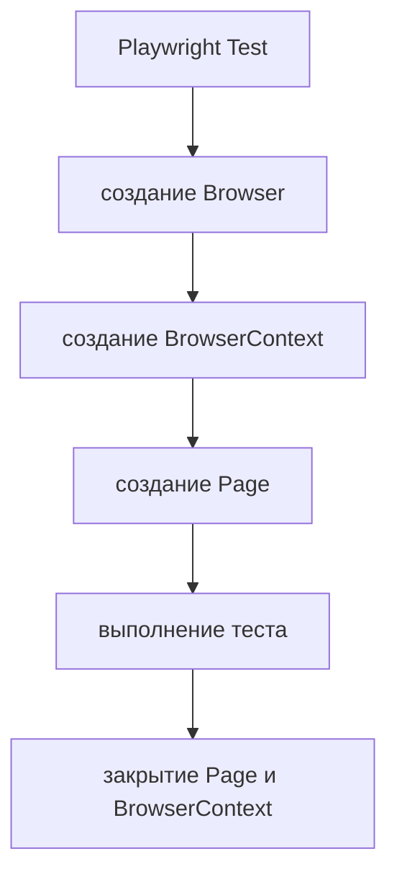

# Встроенные фикстуры

## Связь с предыдущей главой

Глава 175 показала, что каждый тест должен владеть своей браузерной сессией. Теперь разберём механизм Playwright Test, который создаёт эту сессию, передаёт её тесту и освобождает после выполнения.

## Цель главы

Понять назначение built-in fixtures `page`, `context` и `browser`, их связи и границы жизненного цикла.

## Главный вопрос

Какие ресурсы Playwright Test предоставляет тесту и кто управляет их жизненным циклом?

## Мотивация

В обычном Playwright-скрипте инженер сам запускает браузер, создаёт контекст и закрывает ресурсы. В Playwright Test эти повторяемые операции выполняет тестовый раннер. Тест запрашивает только нужные ресурсы через параметры функции.

## Теория

### Фикстура — это объявленная потребность

Фикстура — ресурс, который тест **запрашивает**, а не создаёт.

Запрос выражается именем параметра: если функция теста принимает `{ page }`, раннер понимает, что нужна страница, готовит её заранее и передаёт готовое значение.

Это принципиально отличается от глобальной переменной. У глобальной переменной нет ни момента создания, привязанного к тесту, ни гарантированной очистки, ни зависимости, которую можно проследить. У фикстуры есть всё перечисленное.

### Иерархия: браузер → контекст → страница

Три встроенные фикстуры образуют цепочку владения:

| Фикстура | Что представляет | Что изолирует |
| --- | --- | --- |
| `browser` | Запущенный процесс браузера | Ничего между тестами |
| `context` | Изолированную сессию | Куки, хранилища, разрешения |
| `page` | Вкладку внутри контекста | Состояние одной вкладки |

Изоляцию между тестами создаёт именно **контекст**, а не браузер. Два теста могут выполняться в одном процессе браузера и при этом не видеть куки друг друга, потому что их контексты разные.

Это объясняет частый вопрос «почему общий браузер не приводит к общей авторизации»: браузер — только процесс, состояние живёт в контексте.

### Область жизни: тест и рабочий процесс

У фикстур есть область жизни.

- `page` и `context` живут **в пределах теста**: создаются заново для каждого теста.
- `browser` обычно живёт **в пределах рабочего процесса**: один процесс браузера обслуживает несколько тестов одного рабочего процесса.

Область рабочего процесса выбрана для браузера не случайно: запуск процесса дорогой, а переиспользовать его безопасно именно потому, что состояние хранится уровнем ниже — в контексте.

### Владение определяет ответственность

Правило простое и не имеет исключений: **освобождает ресурс тот, кто его создал**.

- Ресурс, переданный тесту как фикстура, создал раннер — он же его и закроет. Закрывать `page`, `context` или `browser` внутри теста не нужно.
- Ресурс, созданный тестом вручную через `browser.newContext()`, принадлежит тесту — закрыть его обязан тест.

Нарушение первой половины правила выглядит особенно коварно: закрытый тестом `browser` ломает не текущий тест, а следующие тесты того же рабочего процесса.

### Как раннер разрешает зависимости

Раннер читает имена параметров функции теста, строит недостающие звенья цепочки и готовит их до вызова тела теста.

Если тест запросил только `page`, раннер всё равно создаст для неё контекст и использует существующий браузер. Обратное неверно: запрос `browser` не создаёт ни контекста, ни страницы — они не нужны.


```mermaid
flowchart TD
    A[Playwright Test] --> B[создание Browser]
    B --> C[создание BrowserContext]
    C --> D[создание Page]
    D --> E[выполнение теста]
    E --> F[закрытие Page и BrowserContext]
```

### Чего встроенные фикстуры не делают

Встроенные фикстуры управляют ресурсами **браузера** и только ими. Они не знают ничего о проекте, поэтому не:

- создают бизнес-данные;
- выполняют вход в приложение;
- удаляют записи, созданные тестом на сервере;
- знают правила предметной области.

Серверное состояние остаётся внешней границей: свежий контекст не отменяет заказ, созданный предыдущим тестом.

## Внутренний механизм

Playwright Test читает имена фикстур из параметра теста, строит необходимые зависимости и подготавливает их до вызова тела теста. Если тест запрашивает только `page`, раннер всё равно создаёт её через связанный `context` и существующий `browser`.

### Запрошено одно, подготовлено три

```text
test("…", async ({ page }) => { … })

раннер видит имя page  →  нужен context  →  нужен browser
подготовка:  browser (уже есть в процессе) → context (новый) → page (новая)
освобождение: page → context → browser остаётся жить
```

Раннер читает **имена** свойств в деструктуризации параметра и подготавливает
только их вместе с зависимостями. Не запрошенная фикстура не выполняется вовсе —
поэтому добавление фикстуры в проект не удлиняет тесты, которые её не просят.

Обратная сторона: опечатка в имени не даёт ошибки на этапе разбора. Свойство
просто окажется `undefined`, и падение придёт позже, при обращении к нему.

### Кто закрывает, тот и создал

| Ресурс | Кто создал | Кто закрывает |
| --- | --- | --- |
| `page`, `context`, `request` | раннер | раннер |
| `browser` | раннер, один на процесс | раннер, после всех тестов процесса |
| `browser.newContext()` в тесте | тест | тест, в том числе при падении |

Закрытие переданного `browser` внутри теста роняет остальные тесты процесса:
объект общий. Незакрытый собственный контекст, наоборот, переживает тест и
удерживает страницы, загрузки и незаписанную трассировку.
```text
examples/03-automation-qa/chapter-176/01-built-in-fixtures.ui.ts
```

Ручное закрытие переданных `page`, `context` или `browser` обычно не требуется: их очисткой управляет Playwright Test. Ресурс, который тест создал вручную через `browser.newContext()`, уже принадлежит тесту и должен быть закрыт им.

## Главная ментальная модель

Тест объявляет потребность, Playwright Test предоставляет ресурс и отвечает за жизненный цикл только того, что создал сам.

## Практические примеры

Пример запрашивает `browser`, `context` и `page`, а затем проверяет связи между ними и видимый результат на странице. Ручное создание контекстов разбирается в практике как отдельная задача на владение ресурсами.

## Automation QA

Встроенные фикстуры уменьшают инфраструктурный шум в тестах. Инженер видит сценарий, а стандартная подготовка браузера остаётся предсказуемой и одинаковой для всего набора.

Практическое следствие для чтения тестов: по списку параметров сразу видно, что тесту нужно. Тест с параметром `{ page }` работает с одной вкладкой; тест, запросивший `browser`, почти наверняка создаёт контексты вручную — и значит должен их закрывать. Этот сигнал полезен на разборе кода.

## Концептуальные границы и компромиссы

Встроенные фикстуры управляют ресурсами Playwright, но не создают бизнес-данные и не знают правил проекта. Для проектных зависимостей нужен отдельный механизм, который не следует смешивать с глобальными переменными.

Переиспользование браузера ускоряет набор, но означает, что утечки на уровне процесса — незакрытые контексты, накопленные вкладки — переживают отдельный тест и проявляются позже.

## Распространённые мифы

**Миф: общий `browser` означает общее состояние авторизации.**
Куки и хранилище принадлежат контексту. Разные контексты в одном браузере независимы.

**Миф: `page` нужно закрывать в конце теста.**
Переданную раннером страницу закрывает раннер. Ручное закрытие в лучшем случае бесполезно, в худшем мешает сбору артефактов.

**Миф: свежий контекст означает чистое состояние приложения.**
Свежим становится только состояние браузера. Данные на сервере остаются такими, какими их оставил предыдущий тест.

**Миф: фикстура — это просто удобная обёртка над `beforeEach`.**
У фикстуры есть граф зависимостей, область жизни и гарантированная очистка в обратном порядке. `beforeEach` не даёт ни одного из этих свойств.

## Частые вопросы

**Когда нужен `browser`, а не `page`?**
Когда тесту нужно несколько независимых контекстов одновременно: два пользователя, две роли, проверка изоляции. Во всех остальных случаях достаточно `page`.

**Что будет, если закрыть `browser` внутри теста?**
Текущий тест, скорее всего, завершится, а следующие тесты того же рабочего процесса упадут на попытке создать контекст. Симптом проявится не там, где ошибка.

**Почему тест падает, а артефакты пустые?**
Частая причина — ресурсы закрыты вручную раньше времени. Playwright собирает трассировку и скриншот при завершении, и закрытая страница лишает его источника.

**Можно ли создать несколько страниц в одном контексте?**
Да, через `context.newPage()`. Они разделяют куки и хранилище — это нужно для сценариев с несколькими вкладками одного пользователя.

## Распространённые ошибки

- Закрывать переданный `browser` внутри теста — этот объект общий для всех тестов рабочего процесса, поэтому остальные тесты в нём падают с закрытым браузером.

- Считать `browser` и `context` одним уровнем изоляции — браузер один на процесс, контекст создаётся на каждый тест. Изоляцию по куки и хранилищу даёт именно контекст.

- Хранить `page` в глобальной переменной — после теста страница закрывается, и обращение к сохранённой ссылке даёт `Target page, context or browser has been closed`.

- Не закрывать вручную созданный `BrowserContext` — такие контексты не принадлежат фикстуре, поэтому их никто не освободит: остаются открытые страницы, незаписанная трассировка и висящий процесс.

- Полагать, что фикстура автоматически очищает серверные данные — она возвращает чистый браузер, а не чистый стенд. Данные удаляет только собственная очистка теста.

## Краткие итоги

- `page`, `context` и `browser` предоставляет Playwright Test.
- `page` принадлежит `context`, а `context` использует `browser`.
- Ресурсы в пределах теста создаются заново для каждого теста.
- Playwright Test очищает собственные фикстуры.
- Ручной ресурс закрывает тот код, который его создал.

## Что нужно запомнить

- Фикстура связывает объявленную потребность с управляемым ресурсом.
- `page` и `context` изолируют отдельный тест.
- `browser` может жить дольше одного теста.
- Владение определяет ответственность за освобождение ресурса.
- Встроенные фикстуры не заменяют подготовку бизнес-состояния.

## Быстрая проверка

1. Кто создаёт переданную тесту `page`?
2. Почему общий `browser` не означает общие куки?
3. Какую область жизни обычно имеет `context`?
4. Кто закрывает контекст, созданный через `browser.newContext()`?
5. Что встроенные фикстуры не очищают?

### Ответы

1. Раннер: он создаёт контекст, открывает в нём страницу и закрывает всё после теста.
2. Куки и хранилище принадлежат контексту, а не браузеру. Разные контексты внутри одного браузера полностью изолированы.
3. Область теста: на каждый тест создаётся свой контекст.
4. Тот, кто его создал, — то есть вы. Раннер закрывает только то, что создал сам.
5. Состояние на сервере: созданные записи, изменённые настройки, загруженные файлы.

## Практика

```text
practice/03-automation-qa/176-built-in-fixtures.md
```

## Переход к следующей главе

Встроенные фикстуры покрывают стандартные браузерные ресурсы. Глава 177 покажет, как определить собственные фикстуры и сделать их зависимости и очистку явными.
