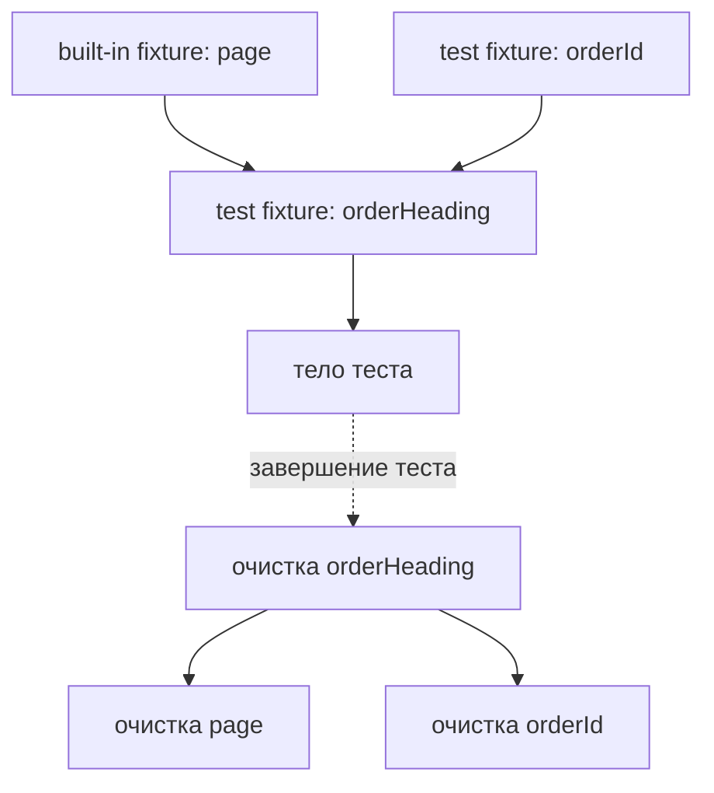

# Custom fixtures и граф зависимостей

## Связь с предыдущей главой

Built-in fixtures дают тесту браузерные ресурсы. Проекту также нужны подготовленные страницы, роли и другие повторяемые зависимости, жизненным циклом которых должен владеть понятный механизм.

## Цель главы

Научиться создавать custom fixtures через `test.extend()`, различать test scope и worker scope, читать граф зависимостей и гарантировать очистку.

## Главный вопрос

Как создавать собственные fixtures с явными зависимостями и гарантированным освобождением ресурсов?

## Мотивация

Повторение setup в каждом тесте создаёт шум, а скрытая подготовка в глобальных переменных связывает сценарии. Custom fixture позволяет объявить зависимость рядом с её setup и teardown и передавать готовое значение только тем тестам, которым оно нужно.

## Теория

### `test.extend()` создаёт типизированный контракт

`test.extend()` возвращает расширенный объект `test`. Generic-параметры описывают, какие значения появятся у fixtures, поэтому потребитель получает проверяемый TypeScript-контракт: опечатка в имени fixture становится ошибкой компиляции, а не загадочным `undefined` во время выполнения.

Расширение не изменяет исходный `test`: это новый объект. Поэтому расширения можно выстраивать слоями — базовый набор проекта, затем специализация для группы тестов.

### Три части fixture: setup, use, teardown

Тело fixture-функции делится моментом вызова `await use(value)`:

```text
async ({ зависимости }, use) => {
  // setup: выполняется до теста
  await use(value)   // здесь выполняется тело теста
  // teardown: выполняется после теста
}
```

Три свойства, которые нужно запомнить:

1. Код **до** `use` — подготовка.
2. Во время `use` выполняется тело теста; fixture ждёт.
3. Код **после** `use` — очистка, и она выполняется **даже если тест упал**.

Отсюда самая частая ошибка новичка: забыть `await use(value)`. Тогда тест получает `undefined`, а очистка выполняется до теста, а не после.

### Граф зависимостей и порядок очистки

Playwright Test строит направленный граф из параметров fixture-функций.

Правила обхода:

- зависимость подготавливается **раньше** потребителя;
- teardown выполняется в **обратном** порядке;
- fixture не запускается, пока её не запросил тест или другая fixture.

Последнее правило экономит время: объявленная, но не запрошенная fixture не стоит ничего.



Обратный порядок — не формальность, а необходимость: потребитель может пользоваться зависимостью в своём teardown, поэтому зависимость обязана пережить его.

### Область жизни: test, worker, automatic

| Область | Когда создаётся | Для чего подходит |
| --- | --- | --- |
| test (по умолчанию) | Для каждого теста | Данные сценария, Page Objects |
| worker | Один раз на процесс | Дорогой и безопасно разделяемый ресурс |
| automatic | Без явного запроса | Обязательная сквозная подготовка или диагностика |

Опасность worker scope в одном: он переживает тест. Любое изменяемое состояние сценария, положенное в worker fixture, протечёт в следующий тест и создаст зависимость от порядка — ровно тот дефект, который разбирался в главе 232.

Automatic fixture выполняется всегда, даже если тест её не просил. Это удобно для сквозной диагностики и опасно для подготовки данных: setup перестаёт быть видимым в сигнатуре теста.

### Когда fixture ухудшает тест

Fixture убирает повторение — и вместе с ним может убрать смысл.

Признак, что абстракция зашла слишком далеко: **по телу теста больше нельзя понять, что именно проверяется**. Если ключевое действие бизнес-сценария выполнено внутри fixture, отчёт о падении укажет на подготовку, а не на проверку.

Рабочая граница: fixture готовит **условия**, тест выполняет **действие** и проверяет **результат**.

### Fixtures — не DI-контейнер

Внешне механизм похож на внедрение зависимостей, и это сходство сбивает с толку.

Отличие в области ответственности: fixtures подчинены жизненному циклу тестового запуска и существуют, чтобы обслуживать выполнение тестов. Они не предназначены для описания архитектуры приложения и не должны превращаться в реестр всех объектов проекта.

## Внутренний механизм

Playwright Test строит граф из параметров fixture-функций. Зависимости подготавливаются раньше потребителей, а teardown выполняется в обратном порядке. Независимая fixture не запускается, пока тест или другая fixture её не запросит, если только она не объявлена automatic.

```text
examples/03-automation-qa/chapter-177/01-custom-fixture.ui.ts
```

Fixtures похожи на управляемое предоставление зависимостей, но не являются универсальным DI container. Они подчиняются жизненному циклу Playwright Test и должны обслуживать тестовое выполнение, а не скрывать всю архитектуру приложения.

## Главная ментальная модель

Граф fixtures — это граф владения: зависимость создаётся до потребителя и освобождается после него в обратном порядке.

## Практические примеры

Fixture `orderId` создаёт уникальный идентификатор, а `orderHeading` зависит от `page` и `orderId`. Тест запрашивает `orderHeading`, поэтому Playwright Test автоматически разрешает нужную часть графа. Независимые зависимости одного уровня не обязаны завершаться в определённом порядке, но каждая из них освобождается после зависимой fixture.

## Automation QA

Custom fixtures подходят для подготовленных Page Objects, ролей и ресурсов с явной очисткой. Существенные шаги бизнес-сценария лучше оставлять в тесте, чтобы отчёт сохранял смысл проверки.

Типичный удачный набор для проекта: fixture с готовым API-клиентом, fixture с данными сценария и точной очисткой, fixture с авторизованной страницей для роли. Все три готовят условия и ни одна не выполняет проверяемое действие.

Полезный приём — размещать очистку в той же fixture, что и создание. Тогда ответ на вопрос «кто удалит эти данные» находится в одном месте с ответом на вопрос «кто их создал».

## Концептуальные границы и компромиссы

Fixture уменьшает повторение, но чрезмерная композиция делает setup невидимым. Worker scope подходит для дорогого безопасно разделяемого ресурса, однако опасен для общего изменяемого состояния.

Глубокий граф fixtures усложняет диагностику: падение в подготовке приходится прослеживать через несколько уровней. Практический ориентир — граф, который читается за один взгляд; если он не помещается в голову, его стоит разложить на независимые ветви.

## Распространённые мифы

**Миф: fixture — это `beforeEach` с другим синтаксисом.**
`beforeEach` не имеет графа зависимостей, области жизни и гарантированного обратного порядка очистки. Это разные механизмы с разными свойствами.

**Миф: worker scope всегда быстрее, поэтому лучше.**
Быстрее — да, безопаснее — нет. Worker scope допустим только для ресурса, который тесты не изменяют или изменяют безопасно.

**Миф: если объявить fixture, она будет выполняться.**
Fixture выполняется только когда её запросили. Исключение — automatic, и именно поэтому automatic нужно использовать редко.

**Миф: очистка не выполнится, если тест упал.**
Код после `use` выполняется и при падении теста. Именно на этом свойстве строится надёжная очистка.

## Частые вопросы

**Что произойдёт, если не вызвать `use`?**
Тест получит `undefined` вместо значения, а код, который вы считали очисткой, выполнится до теста. Симптом обычно выглядит как «fixture не работает».

**Можно ли изменить значение fixture внутри теста?**
Технически да, но это делает тест зависимым от порядка, если fixture имеет worker scope. Для test scope изменение безвредно: значение всё равно создаётся заново.

**Как передать параметр в fixture?**
Через отдельную fixture с настройкой, которую тест или project переопределяет. Это сохраняет граф явным, в отличие от чтения глобальной переменной внутри fixture.

**Где должна жить очистка серверных данных?**
В той же fixture, которая эти данные создала. Разнесение создания и удаления по разным местам почти всегда заканчивается забытыми данными.

## Распространённые ошибки

- Не вызвать `await use(value)`.
- Поместить очистку до или вместо `use`.
- Хранить данные отдельного теста в worker fixture.
- Без необходимости делать fixture automatic.
- Скрывать в setup ключевые действия бизнес-сценария.
- Называть fixtures универсальным DI container.

## Краткие итоги

- `test.extend()` создаёт типизированные custom fixtures.
- Setup находится до `use`, teardown — после него.
- Зависимости образуют направленный граф.
- Teardown выполняется в обратном порядке.
- Область fixture должна соответствовать времени жизни данных.

## Что нужно запомнить

- Test scope изолирует значение между тестами.
- Worker scope требует неизменяемого или безопасно разделяемого ресурса.
- Automatic fixture должна быть редким осознанным выбором.
- Очистка принадлежит fixture, создавшей ресурс.
- Fixtures не должны скрывать намерение теста.

## Quick Check

1. Что выполняется до `use`?
2. Когда запускается код после `use`?
3. Как определяется порядок зависимостей fixtures?
4. Почему данные отдельного теста опасно хранить в worker scope?
5. Когда automatic fixture ухудшает читаемость?

## Практика

```text
practice/03-automation-qa/177-custom-fixtures-and-dependency-graph.md
```

## Переход к следующей главе

Fixtures дают управляемый жизненный цикл зависимостей. Глава 178 применит эту модель к авторизованному состоянию, которое можно переиспользовать без общей изменяемой Page.
