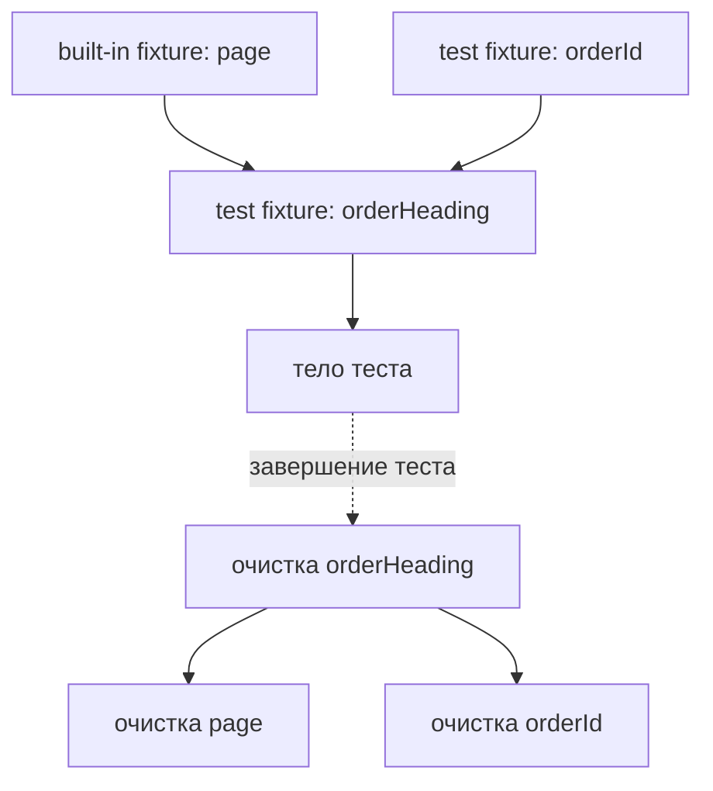

# Custom fixtures и граф зависимостей

## Связь с предыдущей главой

Built-in fixtures дают тесту браузерные ресурсы. Проекту также нужны подготовленные страницы, роли и другие повторяемые зависимости, жизненным циклом которых должен владеть понятный механизм.

## Цель главы

Научиться создавать custom fixtures через `test.extend()`, различать test scope и worker scope, читать граф зависимостей и гарантировать очистку.

## Главный вопрос

Как создавать собственные fixtures с явными зависимостями и гарантированным освобождением ресурсов?

## Мотивация

Повторение setup в каждом тесте создаёт шум, а скрытая подготовка в глобальных переменных связывает сценарии. Custom fixture позволяет объявить зависимость рядом с её setup и teardown и передавать готовое значение только тем тестам, которым оно нужно.

## Теория

`test.extend()` создаёт расширенный объект `test`. Generic-параметры описывают значения fixtures, поэтому потребитель получает проверяемый TypeScript-контракт.

Fixture-функция получает зависимости, функцию `use` и служебную информацию. Код до `await use(value)` является setup. Тело теста выполняется во время `use`. Код после него является teardown и запускается даже после падения тела теста.

Test-scoped fixture создаётся для одного теста. Worker-scoped fixture создаётся для worker и не должна хранить изменяемое состояние отдельного сценария. Automatic fixture запускается без явного параметра теста; она уместна только для действительно обязательной сквозной подготовки или диагностики.



## Внутренний механизм

Playwright Test строит граф из параметров fixture-функций. Зависимости подготавливаются раньше потребителей, а teardown выполняется в обратном порядке. Независимая fixture не запускается, пока тест или другая fixture её не запросит, если только она не объявлена automatic.

```text
examples/03-automation-qa/chapter-177/01-custom-fixture.ui.ts
```

Fixtures похожи на управляемое предоставление зависимостей, но не являются универсальным DI container. Они подчиняются жизненному циклу Playwright Test и должны обслуживать тестовое выполнение, а не скрывать всю архитектуру приложения.

## Главная ментальная модель

Граф fixtures — это граф владения: зависимость создаётся до потребителя и освобождается после него в обратном порядке.

## Практические примеры

Fixture `orderId` создаёт уникальный идентификатор, а `orderHeading` зависит от `page` и `orderId`. Тест запрашивает `orderHeading`, поэтому Playwright Test автоматически разрешает нужную часть графа. Независимые зависимости одного уровня не обязаны завершаться в определённом порядке, но каждая из них освобождается после зависимой fixture.

## Automation QA

Custom fixtures подходят для подготовленных Page Objects, ролей и ресурсов с явной очисткой. Существенные шаги бизнес-сценария лучше оставлять в тесте, чтобы отчёт сохранял смысл проверки.

## Концептуальные границы и компромиссы

Fixture уменьшает повторение, но чрезмерная композиция делает setup невидимым. Worker scope подходит для дорогого безопасно разделяемого ресурса, однако опасен для общего изменяемого состояния.

## Распространённые ошибки

- Не вызвать `await use(value)`.
- Поместить очистку до или вместо `use`.
- Хранить данные отдельного теста в worker fixture.
- Без необходимости делать fixture automatic.
- Скрывать в setup ключевые действия бизнес-сценария.
- Называть fixtures универсальным DI container.

## Краткие итоги

- `test.extend()` создаёт типизированные custom fixtures.
- Setup находится до `use`, teardown — после него.
- Зависимости образуют направленный граф.
- Teardown выполняется в обратном порядке.
- Область fixture должна соответствовать времени жизни данных.

## Что нужно запомнить

- Test scope изолирует значение между тестами.
- Worker scope требует неизменяемого или безопасно разделяемого ресурса.
- Automatic fixture должна быть редким осознанным выбором.
- Очистка принадлежит fixture, создавшей ресурс.
- Fixtures не должны скрывать намерение теста.

## Quick Check

1. Что выполняется до `use`?
2. Когда запускается код после `use`?
3. Как определяется порядок зависимостей fixtures?
4. Почему данные отдельного теста опасно хранить в worker scope?
5. Когда automatic fixture ухудшает читаемость?

## Практика

```text
practice/03-automation-qa/177-custom-fixtures-and-dependency-graph.md
```

## Переход к следующей главе

Fixtures дают управляемый жизненный цикл зависимостей. Глава 178 применит эту модель к авторизованному состоянию, которое можно переиспользовать без общей изменяемой Page.
