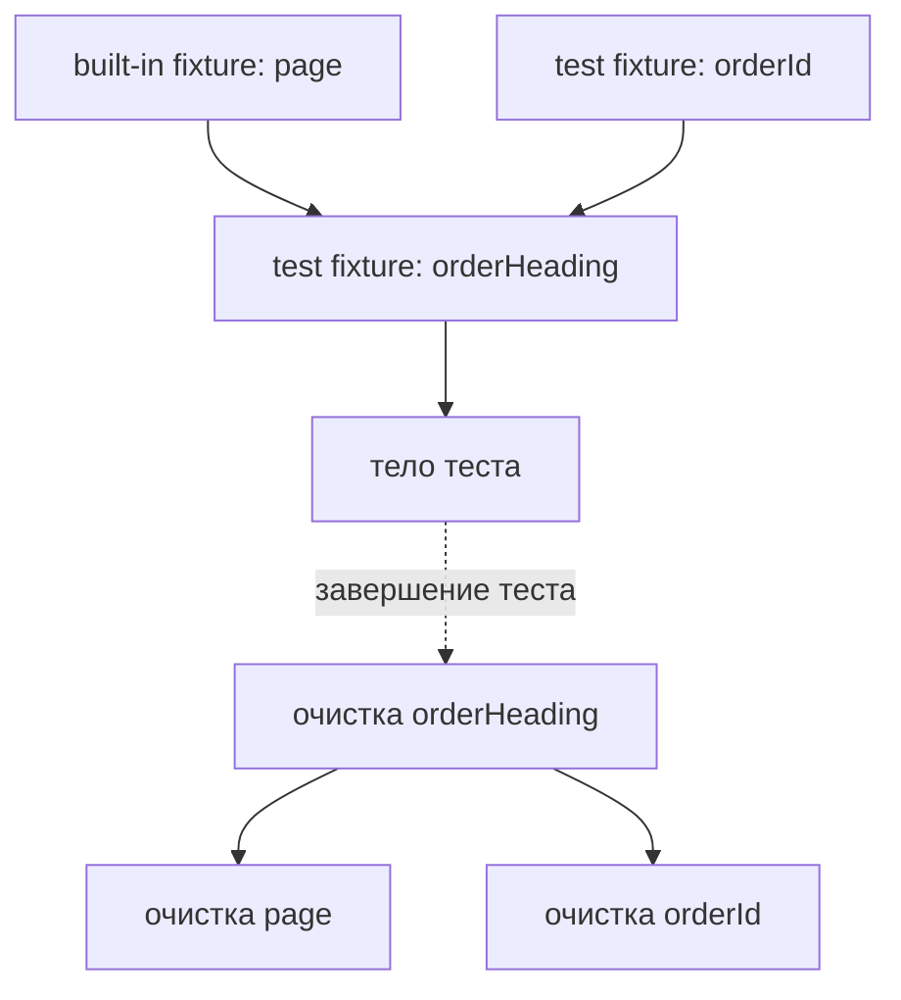

# Собственные фикстуры и граф зависимостей

## Связь с предыдущей главой

Built-in fixtures дают тесту браузерные ресурсы. Проекту также нужны подготовленные страницы, роли и другие повторяемые зависимости, жизненным циклом которых должен владеть понятный механизм.

## Цель главы

Научиться создавать custom fixtures через `test.extend()`, различать test scope и worker scope, читать граф зависимостей и гарантировать очистку.

## Главный вопрос

Как создавать собственные фикстуры с явными зависимостями и гарантированным освобождением ресурсов?

## Мотивация

Повторение setup в каждом тесте создаёт шум, а скрытая подготовка в глобальных переменных связывает сценарии. Custom fixture позволяет объявить зависимость рядом с её setup и teardown и передавать готовое значение только тем тестам, которым оно нужно.

## Теория

### `test.extend()` создаёт типизированный контракт

`test.extend()` возвращает расширенный объект `test`. Параметры-типы описывают, какие значения появятся у фикстур, поэтому потребитель получает проверяемый контракт TypeScript: опечатка в имени фикстуры становится ошибкой компиляции, а не загадочным `undefined` во время выполнения.

Расширение не изменяет исходный `test`: это новый объект. Поэтому расширения можно выстраивать слоями — базовый набор проекта, затем специализация для группы тестов.

### Три части фикстуры: подготовка, передача, освобождение

Тело функции-фикстуры делится моментом вызова `await use(value)`:

```text
async ({ зависимости }, use) => {
  // setup: выполняется до теста
  await use(value)   // здесь выполняется тело теста
  // teardown: выполняется после теста
}
```

Три свойства, которые нужно запомнить:

1. Код **до** `use` — подготовка.
2. Во время `use` выполняется тело теста; фикстура ждёт.
3. Код **после** `use` — очистка, и она выполняется **даже если тест упал**.

Отсюда самая частая ошибка новичка: забыть `await use(value)`. Тогда тест получает `undefined`, а очистка выполняется до теста, а не после.

### Граф зависимостей и порядок очистки

Playwright Test строит направленный граф из параметров функций-фикстур.

Правила обхода:

- зависимость подготавливается **раньше** потребителя;
- освобождение выполняется в **обратном** порядке;
- фикстура не запускается, пока её не запросил тест или другая фикстура.

Последнее правило экономит время: объявленная, но не запрошенная фикстура не стоит ничего.


```mermaid
flowchart TD
    A[built-in fixture: page] --> C[test fixture: orderHeading]
    B[test fixture: orderId] --> C
    C --> D[тело теста]
    D -. завершение теста .-> E[очистка orderHeading]
    E --> F[очистка page]
    E --> G[очистка orderId]
```

Обратный порядок — не формальность, а необходимость: потребитель может пользоваться зависимостью при собственном освобождении, поэтому зависимость обязана пережить его.

### Область жизни: тест, рабочий процесс, автоматическая

| Область | Когда создаётся | Для чего подходит |
| --- | --- | --- |
| тест (по умолчанию) | Для каждого теста | Данные сценария, объекты страниц |
| рабочий процесс | Один раз на процесс | Дорогой и безопасно разделяемый ресурс |
| автоматическая | Без явного запроса | Обязательная сквозная подготовка или диагностика |

Опасность области рабочего процесса в одном: она переживает тест. Любое изменяемое состояние сценария, положенное в такую фикстуру, протечёт в следующий тест и создаст зависимость от порядка — ровно тот дефект, который разбирался в главе 232.

Автоматическая фикстура выполняется всегда, даже если тест её не просил. Это удобно для сквозной диагностики и опасно для подготовки данных: подготовка перестаёт быть видимой в сигнатуре теста.

### Когда фикстура ухудшает тест

Фикстура убирает повторение — и вместе с ним может убрать смысл.

Признак, что абстракция зашла слишком далеко: **по телу теста больше нельзя понять, что именно проверяется**. Если ключевое действие бизнес-сценария выполнено внутри фикстуры, отчёт о падении укажет на подготовку, а не на проверку.

Рабочая граница: фикстура готовит **условия**, тест выполняет **действие** и проверяет **результат**.

### Фикстуры — не контейнер внедрения зависимостей

Внешне механизм похож на внедрение зависимостей, и это сходство сбивает с толку.

Отличие в области ответственности: фикстуры подчинены жизненному циклу тестового запуска и существуют, чтобы обслуживать выполнение тестов. Они не предназначены для описания архитектуры приложения и не должны превращаться в реестр всех объектов проекта.

## Внутренний механизм

Playwright Test строит граф из параметров функций-фикстур. Зависимости подготавливаются раньше потребителей, а освобождение выполняется в обратном порядке. Независимая фикстура не запускается, пока тест или другая фикстура её не запросит, если только она не объявлена автоматической.

### Граф, а не порядок объявления

```text
test.extend({ session, client, config })   // объявлены в таком порядке

фактическая подготовка:  config → client → session
освобождение:            session → client → config
```

Playwright разрешает фикстуры по **зависимостям**, а не по тому, в каком
порядке они перечислены. Объявленная первой фикстура, которой нужен `config`,
дождётся его подготовки.

Практическое следствие для диагностики: ошибка в подготовке фикстуры не даёт
телу теста выполниться ни на одну строку. Поэтому «в журнале нет ни одного
события сценария» — это признак падения в подготовке, а не в проверке.

### Три части фикстуры и место освобождения

```ts
async function client({ config }, use) {
  const value = createClient(config);   // 1. подготовка

  await use(value);                     // 2. тест работает здесь

  await value.close();                  // 3. освобождение
}
```

`use` делит функцию на две половины: всё до него — подготовка, всё после —
освобождение. Другого способа задать очистку нет, поэтому код, поставленный до
`use`, выполнится как подготовка, каким бы он ни был по смыслу.

Освобождение выполняется и после падения теста, и после падения другой
фикстуры, но только у тех фикстур, которые успели пройти `use`.
```text
examples/03-automation-qa/chapter-177/01-custom-fixture.ui.ts
```

Фикстуры похожи на управляемое предоставление зависимостей, но не являются универсальным контейнером внедрения зависимостей. Они подчиняются жизненному циклу Playwright Test и должны обслуживать тестовое выполнение, а не скрывать всю архитектуру приложения.

## Главная ментальная модель

Граф фикстур — это граф владения: зависимость создаётся до потребителя и освобождается после него в обратном порядке.

## Практические примеры

Фикстура `orderId` создаёт уникальный идентификатор, а `orderHeading` зависит от `page` и `orderId`. Тест запрашивает `orderHeading`, поэтому Playwright Test автоматически разрешает нужную часть графа. Независимые зависимости одного уровня не обязаны завершаться в определённом порядке, но каждая из них освобождается после зависимой фикстуры.

## Automation QA

Собственные фикстуры подходят для подготовленных объектов страниц, ролей и ресурсов с явной очисткой. Существенные шаги бизнес-сценария лучше оставлять в тесте, чтобы отчёт сохранял смысл проверки.

Типичный удачный набор для проекта: фикстура с готовым клиентом API, фикстура с данными сценария и точной очисткой, фикстура с авторизованной страницей для роли. Все три готовят условия и ни одна не выполняет проверяемое действие.

Полезный приём — размещать очистку в той же фикстуре, что и создание. Тогда ответ на вопрос «кто удалит эти данные» находится в одном месте с ответом на вопрос «кто их создал».

## Концептуальные границы и компромиссы

Фикстура уменьшает повторение, но чрезмерная композиция делает подготовку невидимой. Область рабочего процесса подходит для дорогого безопасно разделяемого ресурса, однако опасна для общего изменяемого состояния.

Глубокий граф фикстур усложняет диагностику: падение в подготовке приходится прослеживать через несколько уровней. Практический ориентир — граф, который читается за один взгляд; если он не помещается в голову, его стоит разложить на независимые ветви.

## Распространённые мифы

**Миф: фикстура — это `beforeEach` с другим синтаксисом.**
`beforeEach` не имеет графа зависимостей, области жизни и гарантированного обратного порядка очистки. Это разные механизмы с разными свойствами.

**Миф: область рабочего процесса всегда быстрее, поэтому лучше.**
Быстрее — да, безопаснее — нет. Область рабочего процесса допустима только для ресурса, который тесты не изменяют или изменяют безопасно.

**Миф: если объявить фикстуру, она будет выполняться.**
Фикстура выполняется только когда её запросили. Исключение — автоматическая, и именно поэтому автоматические фикстуры нужно использовать редко.

**Миф: очистка не выполнится, если тест упал.**
Код после `use` выполняется и при падении теста. Именно на этом свойстве строится надёжная очистка.

## Частые вопросы

**Что произойдёт, если не вызвать `use`?**
Тест получит `undefined` вместо значения, а код, который вы считали очисткой, выполнится до теста. Симптом обычно выглядит как «фикстура не работает».

**Можно ли изменить значение фикстуры внутри теста?**
Технически да, но это делает тест зависимым от порядка, если фикстура живёт в области рабочего процесса. Для области теста изменение безвредно: значение всё равно создаётся заново.

**Как передать параметр в фикстуру?**
Через отдельную фикстуру с настройкой, которую переопределяет тест или проект. Это сохраняет граф явным, в отличие от чтения глобальной переменной внутри фикстуры.

**Где должна жить очистка серверных данных?**
В той же фикстуре, которая эти данные создала. Разнесение создания и удаления по разным местам почти всегда заканчивается забытыми данными.

## Распространённые ошибки

- Не вызвать `await use(value)` — тест не получит значение, а фикстура не завершится: запуск подвиснет до таймаута вместо понятной ошибки.

- Поместить очистку до или вместо `use` — код после `use` и есть освобождение. Всё, что стоит до него, выполняется как подготовка, поэтому такая «очистка» удаляет данные ещё до теста.

- Хранить данные отдельного теста в фикстуре области рабочего процесса — она создаётся один раз на процесс, поэтому её значение делят все тесты процесса и порядок их запуска начинает влиять на результат.

- Без необходимости делать фикстуру автоматической — автоматическая фикстура выполняется для каждого теста файла, даже для тех, кому она не нужна, и удлиняет каждый прогон.

- Скрывать в подготовке ключевые действия бизнес-сценария — проверяемое действие, выполненное фикстурой, исчезает из теста: отчёт покажет падение подготовки вместо падения проверки.

- Называть фикстуры универсальным контейнером внедрения зависимостей — они решают только задачу подготовки и освобождения ресурсов теста и разрешаются по графу зависимостей, а не по порядку объявления.

## Краткие итоги

- `test.extend()` создаёт типизированные собственные фикстуры.
- Подготовка находится до `use`, освобождение — после него.
- Зависимости образуют направленный граф.
- Освобождение выполняется в обратном порядке.
- Область фикстуры должна соответствовать времени жизни данных.

## Что нужно запомнить

- Область теста изолирует значение между тестами.
- Область рабочего процесса требует неизменяемого или безопасно разделяемого ресурса.
- Автоматическая фикстура должна быть редким осознанным выбором.
- Очистка принадлежит фикстуре, создавшей ресурс.
- Фикстуры не должны скрывать намерение теста.

## Быстрая проверка

1. Что выполняется до `use`?
2. Когда запускается код после `use`?
3. Как определяется порядок зависимостей фикстур?
4. Почему данные отдельного теста опасно хранить в области рабочего процесса?
5. Когда автоматическая фикстура ухудшает читаемость?

### Ответы

1. Код подготовки: всё, что написано до вызова `use`.
2. После завершения теста, использующего фикстуру, — и выполняется даже при падении.
3. По тому, какие фикстуры указаны в параметрах: раннер строит граф и создаёт их в нужном порядке.
4. Область рабочего процесса переживает отдельный тест и разделяется несколькими тестами. Данные одного теста станут видны другим, и изоляция пропадёт.
5. Когда от неё зависит результат теста, а в самом тесте она не упомянута. Читатель не видит, почему тест проходит.

## Практика

```text
practice/03-automation-qa/177-custom-fixtures-and-dependency-graph.md
```

## Переход к следующей главе

Фикстуры дают управляемый жизненный цикл зависимостей. Глава 178 применит эту модель к авторизованному состоянию, которое можно переиспользовать без общей изменяемой страницы.
