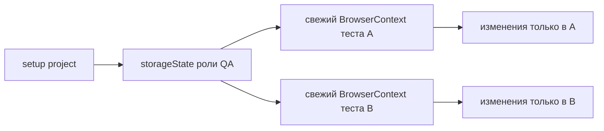

# Authentication state и управляемые сессии

## Связь с предыдущей главой

Custom fixtures сделали подготовку и очистку зависимостей явными. Авторизация — дорогая подготовка, которую иногда полезно выполнить заранее, но её повторное использование не должно связывать тесты одной изменяемой сессией.

## Цель главы

Понять `storageState`, setup project, разделение ролей, срок жизни учётных данных и ограничения повторного использования сохранённого состояния браузера.

## Главный вопрос

Как повторно использовать авторизованное состояние, не связывая тесты общей изменяемой сессией?

## Мотивация

UI-вход перед каждым тестом замедляет набор и дублирует шаги, не относящиеся к проверяемому поведению. Один общий `Page` сокращает время подготовки, но разрушает изоляцию. `storageState` сохраняет данные сессии и позволяет каждому тесту загрузить их в свежий `BrowserContext`.

## Теория

`storageState` сериализует cookies и поддерживаемые значения browser storage контекста. Файл состояния — чувствительный артефакт: он может содержать действующие токены сессии и не должен попадать в Git.

Setup project — отдельный проект Playwright, который создаёт состояние до зависимых проектов. Зависимый проект указывает файл через `use.storageState`, после чего каждый тест всё равно получает свежий контекст с одинаковым начальным снимком.

Для разных ролей нужны отдельные файлы состояния и понятный владелец обновления. Учётные данные и сохранённое состояние должны иметь ограниченный срок жизни и создаваться в контролируемом окружении.



## Внутренний механизм

Playwright загружает снимок при создании нового `BrowserContext`. Контексты начинают с одинаковых cookies, но дальнейшие изменения не синхронизируются между ними. При этом серверная учётная запись остаётся общей: два теста могут конфликтовать через серверные данные даже при разных контекстах.

```text
examples/03-automation-qa/chapter-178/auth.setup.ts
examples/03-automation-qa/chapter-178/01-authentication-state.ui.ts
```

## Главная ментальная модель

`storageState` — начальный снимок для новых независимых контекстов, а не одна общая живая браузерная сессия.

## Практические примеры

Setup project создаёт состояние роли QA. Зависимый проект загружает его в контекст с test scope и проверяет наличие cookie сессии без повторного UI-входа.

## Automation QA

Ролевые состояния ускоряют сценарии кабинета оператора, администратора и клиента. Тестовые учётные записи при этом должны иметь контролируемые права и данные, а секреты — поступать из окружения.

## Концептуальные границы и компромиссы

Повторное использование состояния сокращает время подготовки, но может скрыть проблемы процесса входа и конфликт серверных данных. Отдельные проверки авторизации всё равно должны выполнять реальный вход.

## Распространённые ошибки

- Коммитить файл состояния с токенами.
- Использовать один общий `Page` вместо снимка состояния.
- Считать `storageState` изоляцией серверной учётной записи.
- Использовать одно состояние для ролей с разными правами.
- Не обновлять истёкшее состояние.
- Проверять процесс входа с заранее авторизованным контекстом.

## Краткие итоги

- `storageState` сохраняет состояние аутентификации браузера.
- Setup project готовит состояние до зависимых тестов.
- Каждый тест загружает снимок в свежий контекст.
- Роли требуют отдельных и защищённых состояний.
- Серверные данные остаются общей внешней границей.

## Что нужно запомнить

- Файл состояния может содержать секреты.
- Снимок не является общей живой Page.
- Изоляция контекстов не гарантирует изоляцию аккаунта.
- Учётные данные должны иметь владельца и срок жизни.
- Тесты входа не должны обходить проверяемую авторизацию.

## Quick Check

1. Что сохраняет `storageState`?
2. Зачем нужен setup project?
3. Почему два контекста с одним состоянием остаются разными?
4. Где возможен конфликт между такими тестами?
5. Почему файл состояния нельзя коммитить?

## Практика

```text
practice/03-automation-qa/178-authentication-state-and-managed-sessions.md
```

## Переход к следующей главе

Мы научились управлять подготовленной сессией. Глава 179 отделит пользовательский язык теста от деталей страницы через Page Object.
