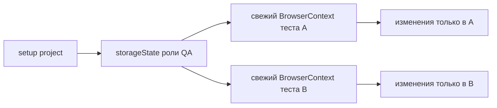

# Authentication state и управляемые сессии

## Связь с предыдущей главой

Custom fixtures сделали подготовку и очистку зависимостей явными. Авторизация — дорогая подготовка, которую иногда полезно выполнить заранее, но её повторное использование не должно связывать тесты одной изменяемой сессией.

## Цель главы

Понять `storageState`, setup project, разделение ролей, срок жизни учётных данных и ограничения повторного использования сохранённого состояния браузера.

## Главный вопрос

Как повторно использовать авторизованное состояние, не связывая тесты общей изменяемой сессией?

## Мотивация

UI-вход перед каждым тестом замедляет набор и дублирует шаги, не относящиеся к проверяемому поведению. Один общий `Page` сокращает время подготовки, но разрушает изоляцию. `storageState` сохраняет данные сессии и позволяет каждому тесту загрузить их в свежий `BrowserContext`.

## Теория

### Что такое storageState

`storageState` сериализует состояние аутентификации контекста: cookies и поддерживаемые значения browser storage.

Результат — обычный файл. Из этого следуют два важных свойства:

- файл можно создать один раз и переиспользовать много раз;
- файл содержит **действующие токены сессии**, то есть является секретом.

Второе свойство определяет всё обращение с ним: не коммитить, ограничивать срок жизни, создавать в контролируемом окружении.

### Снимок, а не живая сессия

Ключевое различие, которое чаще всего понимают неверно.

`storageState` — это **начальный снимок** для нового контекста, а не общая живая сессия. Playwright загружает снимок при создании `BrowserContext`, после чего контексты живут независимо:

- оба начинают с одинаковых cookies;
- изменения в одном контексте **не** видны другому;
- обновление токена в одном тесте не обновляет файл состояния.

Именно поэтому переиспользование снимка не разрушает изоляцию, в отличие от общей `Page`.

### Setup project готовит состояние заранее

Setup project — отдельный проект Playwright, выполняющийся до зависимых проектов.

Схема работы:

1. Setup project выполняет настоящий вход и сохраняет состояние в файл.
2. Зависимый проект указывает этот файл через `use.storageState`.
3. Каждый тест зависимого проекта получает свежий контекст с этим снимком.

Выигрыш измеримый: вход выполняется один раз за запуск, а не перед каждым тестом.

### Роли требуют отдельных состояний

Одно состояние на все роли — частая и дорогая ошибка: тест администратора и тест клиента начинают делить учётную запись, а вместе с ней и серверные данные.

Правильная схема — отдельный файл на роль, у каждого файла понятный владелец обновления. Проекты Playwright при этом разделяются по ролям, что заодно делает состав тестов роли видимым в конфигурации.

### Чего storageState не изолирует

Свежий контекст изолирует **браузер**. Он ничего не делает с сервером.

Два теста с одним состоянием работают под **одной учётной записью**. Если оба меняют профиль, корзину или настройки этой учётной записи, они конфликтуют — несмотря на разные контексты.

Это тот же общий ресурс без владельца из главы 235, просто спрятанный за словом «авторизация». Решения те же: пул учётных записей по слоту параллельного выполнения или данные, создаваемые тестом для себя.

### Срок жизни и обновление

Сохранённое состояние устаревает: токены имеют срок действия.

Признак истёкшего состояния узнаваем — тесты массово начинают падать на первом же действии, требующем авторизации, причём одинаково. Поэтому состояние пересоздаётся каждым запуском, а не хранится между запусками «чтобы не тратить время».

### Тесты входа не используют снимок

Отдельная категория проверок — сам процесс входа: форма, ошибки, блокировка, восстановление пароля.

Эти тесты обязаны выполнять реальный вход. Запуск их с заранее авторизованным контекстом означает проверку функциональности, которая уже обойдена.



## Внутренний механизм

Playwright загружает снимок при создании нового `BrowserContext`. Контексты начинают с одинаковых cookies, но дальнейшие изменения не синхронизируются между ними. При этом серверная учётная запись остаётся общей: два теста могут конфликтовать через серверные данные даже при разных контекстах.

```text
examples/03-automation-qa/chapter-178/auth.setup.ts
```

```text
examples/03-automation-qa/chapter-178/01-authentication-state.ui.ts
```

## Главная ментальная модель

`storageState` — начальный снимок для новых независимых контекстов, а не одна общая живая браузерная сессия.

## Практические примеры

Setup project создаёт состояние роли QA. Зависимый проект загружает его в контекст с test scope и проверяет наличие cookie сессии без повторного UI-входа.

## Automation QA

Ролевые состояния ускоряют сценарии кабинета оператора, администратора и клиента. Тестовые учётные записи при этом должны иметь контролируемые права и данные, а секреты — поступать из окружения.

Практический ориентир при выборе: снимок состояния окупается, когда вход дорог и повторяется в десятках тестов. Если тестов немного или вход быстрый, честный вход в fixture проще и не создаёт артефакта с секретом.

Полезная проверка конфигурации: временно удалите файл состояния и запустите набор. Если тесты падают с понятной ошибкой подготовки — setup project настроен верно; если падают загадочно на первом действии — подготовка не связана с зависимыми проектами явно.

## Концептуальные границы и компромиссы

Повторное использование состояния сокращает время подготовки, но может скрыть проблемы процесса входа и конфликт серверных данных. Отдельные проверки авторизации всё равно должны выполнять реальный вход.

Дополнительная цена — артефакт с секретом внутри запуска. Его нужно создавать в безопасном месте, не логировать и не сохранять как артефакт сборки.

## Распространённые мифы

**Миф: тесты с одним `storageState` делят сессию.**
Они делят только начальный снимок. Дальше контексты независимы.

**Миф: разные контексты означают полную изоляцию.**
Изолируется браузер. Учётная запись на сервере остаётся общей, и конфликт данных возможен.

**Миф: состояние можно сохранить в репозиторий, оно же тестовое.**
В файле лежат действующие токены. Тестовые они или нет, это секрет с ненулевым сроком жизни.

**Миф: снимок ускоряет любой набор.**
Если вход дешёвый или тестов мало, выигрыш не покрывает усложнение конфигурации и появление артефакта с секретом.

## Частые вопросы

**Как часто пересоздавать состояние?**
Каждый запуск. Это делает поведение предсказуемым и снимает вопрос об истечении токена.

**Что делать, если тесту нужно изменить профиль пользователя?**
Дать ему собственную учётную запись: из пула по слоту или созданную на лету. Общая запись с изменяемым профилем неизбежно приведёт к конфликту.

**Можно ли смешивать тесты разных ролей в одном проекте?**
Технически можно, задав состояние на уровне теста, но конфигурация становится менее читаемой. Разделение по проектам делает состав ролей видимым.

**Почему тест видит себя неавторизованным, хотя состояние загружено?**
Частые причины: состояние истекло, приложение хранит сессию не в cookies и storage, либо домен состояния не совпадает с адресом приложения.

## Распространённые ошибки

- Коммитить файл состояния с токенами.
- Использовать один общий `Page` вместо снимка состояния.
- Считать `storageState` изоляцией серверной учётной записи.
- Использовать одно состояние для ролей с разными правами.
- Не обновлять истёкшее состояние.
- Проверять процесс входа с заранее авторизованным контекстом.

## Краткие итоги

- `storageState` сохраняет состояние аутентификации браузера.
- Setup project готовит состояние до зависимых тестов.
- Каждый тест загружает снимок в свежий контекст.
- Роли требуют отдельных и защищённых состояний.
- Серверные данные остаются общей внешней границей.

## Что нужно запомнить

- Файл состояния может содержать секреты.
- Снимок не является общей живой Page.
- Изоляция контекстов не гарантирует изоляцию аккаунта.
- Учётные данные должны иметь владельца и срок жизни.
- Тесты входа не должны обходить проверяемую авторизацию.

## Quick Check

1. Что сохраняет `storageState`?
2. Зачем нужен setup project?
3. Почему два контекста с одним состоянием остаются разными?
4. Где возможен конфликт между такими тестами?
5. Почему файл состояния нельзя коммитить?

## Практика

```text
practice/03-automation-qa/178-authentication-state-and-managed-sessions.md
```

## Переход к следующей главе

Мы научились управлять подготовленной сессией. Глава 179 отделит пользовательский язык теста от деталей страницы через Page Object.
