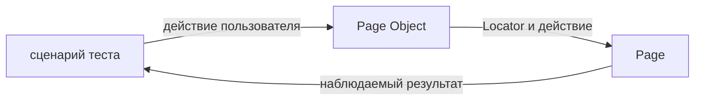

# Page Object

## Связь с предыдущей главой

Fixtures и authentication state подготавливают окружение теста. Но сценарий всё ещё может повторять селекторы и технические шаги конкретной страницы, затрудняя изменения интерфейса.

## Цель главы

Понять границу Page Object, владение Locators, пользовательские действия, место проверок и признаки чрезмерной абстракции.

## Главный вопрос

Как отделить язык тестового сценария от деталей конкретной страницы?

## Мотивация

Если каждый тест самостоятельно ищет поля входа и нажимает кнопки, изменение интерфейса требует правок во многих файлах. Page Object собирает знания о странице и предоставляет небольшой API на языке действий пользователя.

## Теория

Page Object — объект, представляющий одну страницу или значимую область пользовательского потока. Он получает `Page`, владеет связанными Locators и предоставляет операции вроде `loginAs()` или `openOrder()`.

Тест отвечает за смысл сценария и проверяемый результат. Page Object отвечает за способ взаимодействия с UI. Технические проверки, подтверждающие готовность самого объекта, могут быть частью метода, но ключевые ожидания бизнес-сценария обычно лучше оставлять видимыми в тесте.



## Внутренний механизм

Page Object не меняет механизм выполнения Playwright. Это TypeScript-класс или объект, который хранит ссылку на `Page` и создаёт Locators при конструировании. Locators остаются ленивыми и разрешаются в момент действия или проверки.

```text
examples/03-automation-qa/chapter-179/01-page-object.ui.ts
```

Публичные методы должны выражать устойчивые пользовательские действия. Внутренние селекторы и промежуточные клики можно скрыть, если это не удаляет важный шаг из смысла теста.

## Главная ментальная модель

Тест говорит, что делает пользователь и что должно произойти; Page Object знает, как выполнить действие на конкретной странице.

## Практические примеры

`LoginPage.loginAs(email)` заполняет форму и отправляет её. Тест отдельно проверяет появление статуса, потому что именно результат входа является предметом сценария.

## Automation QA

Page Objects локализуют изменения селекторов, улучшают язык тестов и позволяют повторно использовать стабильные действия. Они особенно полезны в больших наборах с несколькими потоками через одну страницу.

## Концептуальные границы и компромиссы

Слишком маленький Page Object лишь переименовывает каждый `click`, а слишком большой превращается в объект, отвечающий за всё приложение. Граница должна следовать ответственности страницы, а не удобству одного теста.

## Распространённые ошибки

- Возвращать наружу все внутренние Locators без причины.
- Помещать целый end-to-end сценарий в один метод.
- Создавать один объект для нескольких несвязанных страниц.
- Кэшировать найденные DOM-элементы вместо Locators.
- Скрывать все ключевые проверки бизнес-сценария внутри объекта.
- Наследовать страницы только ради повторного селектора.

## Краткие итоги

- Page Object инкапсулирует детали конкретной страницы.
- Публичный API выражает действия пользователя.
- Locators принадлежат объекту страницы.
- Бизнес-смысл и ключевые проверки остаются в тесте.
- Размер объекта определяется ответственностью.

## Что нужно запомнить

- Page Object — не контейнер всех UI-операций.
- Locator остаётся ленивым внутри объекта.
- Устойчивый API важнее полного скрытия Playwright.
- Место проверок выбирается по их назначению.
- Читаемость теста является критерием качества.

## Quick Check

1. Какую проблему решает Page Object?
2. Чем метод, выражающий действие пользователя, отличается от обёртки над `click()`?
3. Где обычно остаётся ключевая проверка бизнес-сценария?
4. Почему не стоит кэшировать DOM-элемент?
5. Как распознать чрезмерный Page Object?

## Практика

```text
practice/03-automation-qa/179-page-object.md
```

## Переход к следующей главе

Одна страница часто состоит из повторяющихся самостоятельных компонентов интерфейса. Глава 180 покажет, как вынести их в Component Objects и собирать страницу через композицию.
