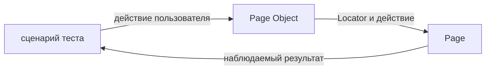

# Page Object

## Связь с предыдущей главой

Fixtures и authentication state подготавливают окружение теста. Но сценарий всё ещё может повторять селекторы и технические шаги конкретной страницы, затрудняя изменения интерфейса.

## Цель главы

Понять границу Page Object, владение Locators, пользовательские действия, место проверок и признаки чрезмерной абстракции.

## Главный вопрос

Как отделить язык тестового сценария от деталей конкретной страницы?

## Мотивация

Если каждый тест самостоятельно ищет поля входа и нажимает кнопки, изменение интерфейса требует правок во многих файлах. Page Object собирает знания о странице и предоставляет небольшой API на языке действий пользователя.

## Теория

### Что моделирует Page Object

Page Object — объект, представляющий одну страницу или значимую область пользовательского потока.

Он решает ровно одну задачу: **локализовать знание о том, как устроена страница**. Когда разметка меняется, правка происходит в одном месте, а не в каждом тесте, который эту страницу открывал.

Обратите внимание на формулировку «одна страница или значимая область». Граница проходит по ответственности интерфейса, а не по удобству отдельного теста.

### Разделение ответственности

| Кто | За что отвечает |
| --- | --- |
| Тест | Смысл сценария и проверяемый результат |
| Page Object | Способ взаимодействия с конкретной страницей |

Это разделение — главный критерий при любом сомнении. Вопрос «класть ли это в Page Object» превращается в вопрос «это про смысл проверки или про устройство страницы».

### Locators принадлежат объекту

Page Object получает `Page` и создаёт свои Locators при конструировании.

Важное свойство: Locator **ленив**. Он не ищет элемент в момент создания, а описывает, как его найти. Поиск происходит в момент действия или проверки.

Отсюда следует практическое правило: хранить в полях нужно **Locators**, а не найденные элементы. Закэшированный элемент устаревает при первой же перерисовке, Locator — никогда.

### Публичный API говорит действиями пользователя

Метод `loginAs(email)` выражает действие. Метод `clickSubmitButton()` выражает клик.

Разница не косметическая. Первый метод переживёт изменение интерфейса — например, замену кнопки на отправку по Enter. Второй придётся переписывать вместе с разметкой, а значит он не дал ничего, кроме лишнего слоя.

Практический признак хорошего метода: его название можно произнести, описывая работу пользователя, не упоминая элементов интерфейса.

### Где остаются проверки

Технические проверки, подтверждающие готовность самого объекта — например, что страница загрузилась, — могут жить внутри метода.

Ключевые ожидания бизнес-сценария остаются **в тесте**. Причина практическая: когда проверка спрятана внутри Page Object, отчёт о падении говорит о методе подготовки, а читателю нужно знать, какое требование нарушено.

Проверка отвечает на вопрос «что должно быть верно», и ответ на него — предмет теста.

### Признаки чрезмерной абстракции

Page Object легко довести до состояния, в котором он мешает. Признаки:

- метод — обёртка над одним `click()` с другим именем;
- объект охватывает несколько несвязанных страниц;
- один метод выполняет целый end-to-end сценарий;
- наружу выставлены все внутренние Locators «на всякий случай»;
- наследование введено ради одного общего селектора.

Общее у всех пунктов одно: абстракция перестала скрывать сложность и начала её добавлять.

### Page Object и время жизни

Объект создаётся для конкретной `Page` и живёт столько же, сколько тест.

Хранить Page Object в переменной модуля нельзя: он держит ссылку на страницу, которая после теста закрыта. Готовить его удобно в fixture — там и создание, и связь с жизненным циклом теста выражены явно.



## Внутренний механизм

Page Object не меняет механизм выполнения Playwright. Это TypeScript-класс или объект, который хранит ссылку на `Page` и создаёт Locators при конструировании. Locators остаются ленивыми и разрешаются в момент действия или проверки.

```text
examples/03-automation-qa/chapter-179/01-page-object.ui.ts
```

Публичные методы должны выражать устойчивые пользовательские действия. Внутренние селекторы и промежуточные клики можно скрыть, если это не удаляет важный шаг из смысла теста.

## Главная ментальная модель

Тест говорит, что делает пользователь и что должно произойти; Page Object знает, как выполнить действие на конкретной странице.

## Практические примеры

`LoginPage.signInAs(login, password)` заполняет форму и отправляет её. Тест отдельно проверяет появление списка задач, потому что именно результат входа является предметом сценария.

Второй тест того же примера проверяет сообщение об ошибке при неверных данных: здесь предметом проверки становится текст, который видит пользователь, и он тоже остаётся в тесте.

## Automation QA

Page Objects локализуют изменения селекторов, улучшают язык тестов и позволяют повторно использовать стабильные действия. Они особенно полезны в больших наборах с несколькими потоками через одну страницу.

Полезный приём при проектировании: напишите сначала тест так, как он должен читаться, а потом создайте методы, которых для этого не хватает. Тогда API получается из потребности сценария, а не из перечисления элементов на странице.

Приём для code review: прочитайте тело теста вслух. Если получается описание работы пользователя — граница выбрана верно. Если получается перечисление кликов — Page Object не выполнил свою задачу.

## Концептуальные границы и компромиссы

Слишком маленький Page Object лишь переименовывает каждый `click`, а слишком большой превращается в объект, отвечающий за всё приложение. Граница должна следовать ответственности страницы, а не удобству одного теста.

Page Object окупается на повторном использовании. Для страницы, которая встречается в одном тесте, прямые Locators честнее: абстракция без второго потребителя — это только лишний файл.

## Распространённые мифы

**Миф: Page Object обязателен для любого UI-теста.**
Он окупается при повторном использовании. Единственный сценарий прекрасно живёт без него.

**Миф: чем больше методов, тем лучше объект.**
Метод, который лишь переименовывает клик, добавляет слой и ничего не скрывает. Полезны методы, выражающие действие целиком.

**Миф: все проверки надо унести в Page Object, чтобы тесты были короче.**
Тест станет короче и бессмысленнее: из него исчезнет то, что он проверяет.

**Миф: Locator можно сохранить в поле один раз, а элемент — нет, потому что Playwright их кэширует.**
Наоборот: Locator сохранять нужно, он ленив. Найденный элемент устаревает.

**Миф: общий базовый класс страниц уменьшает дублирование.**
Он связывает несвязанные страницы. Общие области интерфейса выносятся композицией — об этом глава 180.

## Частые вопросы

**Нужен ли Page Object, если тест один?**
Обычно нет. Заводите его, когда появляется второй потребитель или когда набор действий страницы становится заметным.

**Должен ли метод возвращать другой Page Object при переходе?**
Это допустимый стиль, но он связывает объекты между собой. Явный переход в тесте часто читается лучше и не создаёт графа зависимостей между страницами.

**Где хранить данные для заполнения формы?**
Не в Page Object. Он знает, как заполнить форму, а что именно заполнить — решает сценарий или построитель тестовых данных.

**Можно ли обращаться к Locators объекта из теста?**
Иногда полезно — например, для проверки в тесте. Но выставлять наружу всё подряд не нужно: публичным становится то, что действительно используется.

## Распространённые ошибки

- Возвращать наружу все внутренние Locators без причины.
- Помещать целый end-to-end сценарий в один метод.
- Создавать один объект для нескольких несвязанных страниц.
- Кэшировать найденные DOM-элементы вместо Locators.
- Скрывать все ключевые проверки бизнес-сценария внутри объекта.
- Наследовать страницы только ради повторного селектора.
- Хранить Page Object в переменной модуля.

## Краткие итоги

- Page Object инкапсулирует детали конкретной страницы.
- Публичный API выражает действия пользователя.
- Locators принадлежат объекту и остаются ленивыми.
- Бизнес-смысл и ключевые проверки остаются в тесте.
- Размер объекта определяется ответственностью.

## Что нужно запомнить

- Page Object — не контейнер всех UI-операций.
- Locator остаётся ленивым внутри объекта.
- Устойчивый API важнее полного скрытия Playwright.
- Место проверок выбирается по их назначению.
- Читаемость теста является критерием качества.

## Quick Check

1. Какую проблему решает Page Object?
2. Чем метод, выражающий действие пользователя, отличается от обёртки над `click()`?
3. Где обычно остаётся ключевая проверка бизнес-сценария?
4. Почему не стоит кэшировать DOM-элемент?
5. Как распознать чрезмерный Page Object?

## Практика

```text
practice/03-automation-qa/179-page-object.md
```

## Переход к следующей главе

Одна страница часто состоит из повторяющихся самостоятельных компонентов интерфейса. Глава 180 покажет, как вынести их в Component Objects и собирать страницу через композицию.
