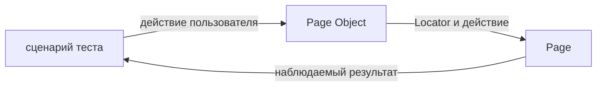

# Объект страницы

## Связь с предыдущей главой

Fixtures и authentication state подготавливают окружение теста. Но сценарий всё ещё может повторять селекторы и технические шаги конкретной страницы, затрудняя изменения интерфейса.

## Цель главы

Понять границу Page Object, владение Locators, пользовательские действия, место проверок и признаки чрезмерной абстракции.

## Главный вопрос

Как отделить язык тестового сценария от деталей конкретной страницы?

## Мотивация

Если каждый тест самостоятельно ищет поля входа и нажимает кнопки, изменение интерфейса требует правок во многих файлах. Page Object собирает знания о странице и предоставляет небольшой API на языке действий пользователя.

## Теория

### Что моделирует объект страницы

Объект страницы — объект, представляющий одну страницу или значимую область пользовательского потока.

Он решает ровно одну задачу: **локализовать знание о том, как устроена страница**. Когда разметка меняется, правка происходит в одном месте, а не в каждом тесте, который эту страницу открывал.

Обратите внимание на формулировку «одна страница или значимая область». Граница проходит по ответственности интерфейса, а не по удобству отдельного теста.

### Разделение ответственности

| Кто | За что отвечает |
| --- | --- |
| Тест | Смысл сценария и проверяемый результат |
| Объект страницы | Способ взаимодействия с конкретной страницей |

Это разделение — главный критерий при любом сомнении. Вопрос «класть ли это в объект страницы» превращается в вопрос «это про смысл проверки или про устройство страницы».

### Локаторы принадлежат объекту

Объект страницы получает `Page` и создаёт свои локаторы при конструировании.

Важное свойство: Locator **ленив**. Он не ищет элемент в момент создания, а описывает, как его найти. Поиск происходит в момент действия или проверки.

Отсюда следует практическое правило: хранить в полях нужно **локаторы**, а не найденные элементы. Закэшированный элемент устаревает при первой же перерисовке, локатор — никогда.

### Публичный API говорит действиями пользователя

Метод `loginAs(email)` выражает действие. Метод `clickSubmitButton()` выражает клик.

Разница не косметическая. Первый метод переживёт изменение интерфейса — например, замену кнопки на отправку клавишей ввода. Второй придётся переписывать вместе с разметкой, а значит он не дал ничего, кроме лишнего слоя.

Практический признак хорошего метода: его название можно произнести, описывая работу пользователя, не упоминая элементов интерфейса.

### Где остаются проверки

Технические проверки, подтверждающие готовность самого объекта — например, что страница загрузилась, — могут жить внутри метода.

Ключевые ожидания бизнес-сценария остаются **в тесте**. Причина практическая: когда проверка спрятана внутри объекта страницы, отчёт о падении говорит о методе подготовки, а читателю нужно знать, какое требование нарушено.

Проверка отвечает на вопрос «что должно быть верно», и ответ на него — предмет теста.

### Признаки чрезмерной абстракции

Объект страницы легко довести до состояния, в котором он мешает. Признаки:

- метод — обёртка над одним `click()` с другим именем;
- объект охватывает несколько несвязанных страниц;
- один метод выполняет целый сквозной сценарий;
- наружу выставлены все внутренние локаторы «на всякий случай»;
- наследование введено ради одного общего селектора.

Общее у всех пунктов одно: абстракция перестала скрывать сложность и начала её добавлять.

### Объект страницы и время жизни

Объект создаётся для конкретной `Page` и живёт столько же, сколько тест.

Хранить объект страницы в переменной модуля нельзя: он держит ссылку на страницу, которая после теста закрыта. Готовить его удобно в фикстуре — там и создание, и связь с жизненным циклом теста выражены явно.


```mermaid
flowchart LR
    A[сценарий теста] -->|действие пользователя| B[Page Object]
    B -->|Locator и действие| C[Page]
    C -->|наблюдаемый результат| A
```

## Внутренний механизм

Объект страницы не меняет механизм выполнения Playwright. Это класс или объект TypeScript, который хранит ссылку на `Page` и создаёт локаторы при конструировании. Локаторы остаются ленивыми и разрешаются в момент действия или проверки.

### Что происходит в конструкторе, а что при действии

```text
new WorkItemsPage(page)     → созданы объекты локаторов, DOM не читался
await pageObject.open()     → переход, ожидание
await pageObject.rowFor(id) → локатор построен
await …click()              → DOM прочитан, проверки готовности, действие
```

Конструктор объекта страницы не обращается к браузеру: локатор — это запрос.
Поэтому объект страницы можно создавать до перехода на страницу, и он не
устаревает после перерисовки.

Из этого же следует, почему кешировать `elementHandle` внутри объекта нельзя:
он привязан к узлу, а не к запросу, и после обновления списка становится
недействительным.

### Где живёт объект страницы

Объект держит ссылку на `Page`, а страница закрывается вместе с тестом. Значит,
время жизни объекта не может быть больше времени жизни теста: переменная модуля
или общий экземпляр на весь файл дадут обращение к закрытому контексту.

Естественное место создания — фикстура: там же, где живёт `page`, и с тем же
освобождением.
```text
examples/03-automation-qa/chapter-179/01-page-object.ui.ts
```

Публичные методы должны выражать устойчивые пользовательские действия. Внутренние селекторы и промежуточные клики можно скрыть, если это не удаляет важный шаг из смысла теста.

## Главная ментальная модель

Тест говорит, что делает пользователь и что должно произойти; объект страницы знает, как выполнить действие на конкретной странице.

## Практические примеры

`LoginPage.signInAs(login, password)` заполняет форму и отправляет её. Тест отдельно проверяет появление списка задач, потому что именно результат входа является предметом сценария.

Второй тест того же примера проверяет сообщение об ошибке при неверных данных: здесь предметом проверки становится текст, который видит пользователь, и он тоже остаётся в тесте.

## Automation QA

Объекты страниц локализуют изменения селекторов, улучшают язык тестов и позволяют повторно использовать стабильные действия. Они особенно полезны в больших наборах с несколькими потоками через одну страницу.

Полезный приём при проектировании: напишите сначала тест так, как он должен читаться, а потом создайте методы, которых для этого не хватает. Тогда API получается из потребности сценария, а не из перечисления элементов на странице.

Приём для разбора кода: прочитайте тело теста вслух. Если получается описание работы пользователя — граница выбрана верно. Если получается перечисление кликов — объект страницы не выполнил свою задачу.

## Концептуальные границы и компромиссы

Слишком маленький объект страницы лишь переименовывает каждый `click`, а слишком большой превращается в объект, отвечающий за всё приложение. Граница должна следовать ответственности страницы, а не удобству одного теста.

Объект страницы окупается на повторном использовании. Для страницы, которая встречается в одном тесте, прямые локаторы честнее: абстракция без второго потребителя — это только лишний файл.

## Распространённые мифы

**Миф: объект страницы обязателен для любого UI-теста.**
Он окупается при повторном использовании. Единственный сценарий прекрасно живёт без него.

**Миф: чем больше методов, тем лучше объект.**
Метод, который лишь переименовывает клик, добавляет слой и ничего не скрывает. Полезны методы, выражающие действие целиком.

**Миф: все проверки надо унести в объект страницы, чтобы тесты были короче.**
Тест станет короче и бессмысленнее: из него исчезнет то, что он проверяет.

**Миф: Locator можно сохранить в поле один раз, а элемент — нет, потому что Playwright их кэширует.**
Наоборот: Locator сохранять нужно, он ленив. Найденный элемент устаревает.

**Миф: общий базовый класс страниц уменьшает дублирование.**
Он связывает несвязанные страницы. Общие области интерфейса выносятся композицией — об этом глава 180.

## Частые вопросы

**Нужен ли объект страницы, если тест один?**
Обычно нет. Заводите его, когда появляется второй потребитель или когда набор действий страницы становится заметным.

**Должен ли метод возвращать другой объект страницы при переходе?**
Это допустимый стиль, но он связывает объекты между собой. Явный переход в тесте часто читается лучше и не создаёт графа зависимостей между страницами.

**Где хранить данные для заполнения формы?**
Не в объекте страницы. Он знает, как заполнить форму, а что именно заполнить — решает сценарий или построитель тестовых данных.

**Можно ли обращаться к локаторам объекта из теста?**
Иногда полезно — например, для проверки в тесте. Но выставлять наружу всё подряд не нужно: публичным становится то, что действительно используется.

## Распространённые ошибки

- Возвращать наружу все внутренние локаторы без причины — тест снова начинает зависеть от разметки, и смысл объекта страницы исчезает: правка вёрстки опять требует правки тестов.

- Помещать целый сквозной сценарий в один метод — падение внутри такого метода не говорит, на каком шаге оно случилось, а переиспользовать часть сценария нельзя.

- Создавать один объект для нескольких несвязанных страниц — класс растёт без границ, и по нему нельзя понять, какое состояние приложения он описывает.

- Кэшировать найденные элементы DOM вместо локаторов — `elementHandle` перестаёт быть действительным после перерисовки, а локатор находит элемент заново при каждой операции.

- Скрывать все ключевые проверки бизнес-сценария внутри объекта — тест превращается в список вызовов, и по его названию нельзя понять, что он утверждает.

- Наследовать страницы только ради повторного селектора — общий предок связывает несвязанные экраны. Повторно используемую часть интерфейса описывает отдельный компонент.

- Хранить объект страницы в переменной модуля — переменная переживёт тест, а его страница будет закрыта: обращение даст ошибку о закрытом контексте.

## Краткие итоги

- Объект страницы инкапсулирует детали конкретной страницы.
- Публичный API выражает действия пользователя.
- Локаторы принадлежат объекту и остаются ленивыми.
- Бизнес-смысл и ключевые проверки остаются в тесте.
- Размер объекта определяется ответственностью.

## Что нужно запомнить

- Объект страницы — не контейнер всех операций с интерфейсом.
- Locator остаётся ленивым внутри объекта.
- Устойчивый API важнее полного скрытия Playwright.
- Место проверок выбирается по их назначению.
- Читаемость теста является критерием качества.

## Быстрая проверка

1. Какую проблему решает объект страницы?
2. Чем метод, выражающий действие пользователя, отличается от обёртки над `click()`?
3. Где обычно остаётся ключевая проверка бизнес-сценария?
4. Почему не стоит кэшировать DOM-элемент?
5. Как распознать чрезмерный объект страницы?

### Ответы

1. Расползание селекторов и шагов по тестам: при изменении страницы правку приходится вносить в каждом месте.
2. Метод действия называется на языке пользователя и может состоять из нескольких шагов. Обёртка над одним кликом лишь добавляет уровень, ничего не объясняя.
3. В самом тесте. Иначе по коду теста не видно, что именно проверяется, и падение приходится разбирать в инфраструктуре.
4. Страница перерисовывается, и сохранённая ссылка устаревает. Локатор описывает поиск и выполняется заново при каждом обращении.
5. По методам, повторяющим API Playwright один к одному, по прячущимся внутри проверкам и по тому, что для чтения теста приходится открывать класс страницы.

## Практика

```text
practice/03-automation-qa/179-page-object.md
```

## Переход к следующей главе

Одна страница часто состоит из повторяющихся самостоятельных компонентов интерфейса. Глава 180 покажет, как вынести их в объекты компонентов и собирать страницу через композицию.
