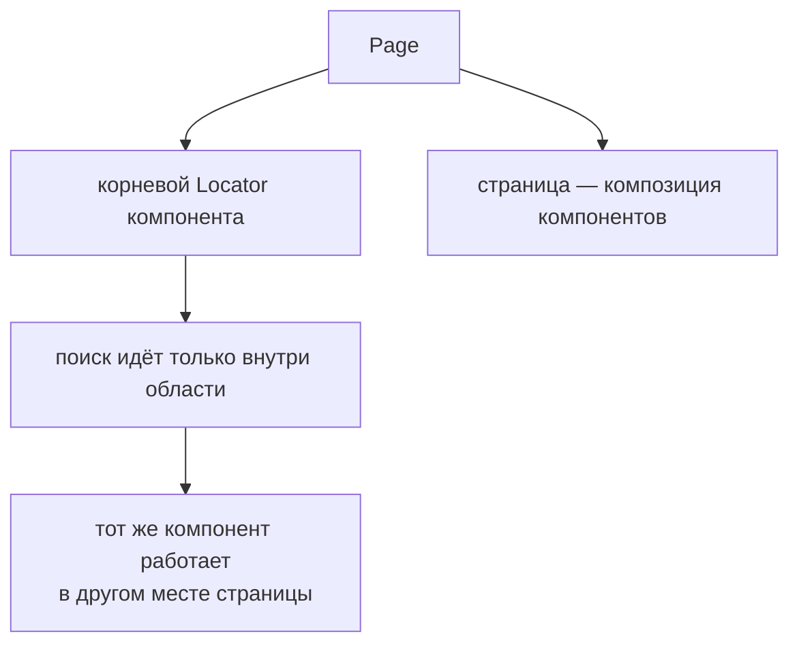

# Объекты компонентов и композиция страниц

## Связь с предыдущей главой

Page Object отделил сценарий от деталей страницы. Повторяющиеся заголовки, навигация, таблицы и модальные окна могут встречаться на разных страницах, поэтому копирование их Locators создаёт новое дублирование.

## Цель главы

Научиться моделировать независимый UI-компонент через корневой Locator и собирать страницы композицией без наследования.

## Главный вопрос

Как переиспользовать независимые части интерфейса без наследования страниц?

## Мотивация

Одинаковая навигация встречается на нескольких страницах. Базовый класс страницы кажется быстрым решением, но связывает несвязанные страницы общей иерархией. Component Object описывает сам компонент интерфейса, а Page Object включает его через композицию.

## Теория

### Компонент — это ограниченная область DOM

Объект компонента представляет часть интерфейса с собственной ответственностью: шапку, навигацию, таблицу, модальное окно, карточку.

Отличие от объекта страницы — в масштабе и в способе задания границы. Объект страницы охватывает страницу и получает `Page`. Объект компонента охватывает область и получает **корневой локатор**.

### Корневой Locator задаёт границу поиска

Это центральная идея главы.

Когда компонент ищет элемент как `root.getByRole("button", { name: "Открыть" })`, поиск идёт **внутри** корневого Locator, а не по всему документу. Кнопки с тем же именем за пределами компонента не влияют на результат.

Практические следствия:

- одинаковые компоненты на одной странице различимы: у каждого свой корень;
- компонент не ломается от появления похожего текста в другой части страницы;
- цепочка локаторов сохраняет ленивость и автоматические ожидания — это обычные локаторы.

### Компоненту не нужна вся страница

Передавать компоненту `Page` технически возможно, но это лишает его главного свойства.

Получив `Page`, компонент может искать где угодно — и рано или поздно начнёт. Получив корневой Locator, он физически ограничен своей областью. Ограничение здесь — это гарантия, а не неудобство.

Дополнительный выигрыш: компонент, зависящий только от Locator, легко переиспользовать на другой странице, где та же область живёт в другом месте разметки.

### Композиция вместо наследования

Соблазн выглядит так: несколько страниц имеют одинаковую навигацию, значит нужен базовый класс страницы с её локаторами.

Проблема в том, что наследование связывает **страницы между собой**. Изменение базового класса затрагивает все страницы, включая те, которым эта навигация не нужна. Иерархия начинает отражать историю кода, а не структуру интерфейса.

Композиция решает ту же задачу без связывания: страница **содержит** компонент. Компонент один, страниц много, зависимость направлена в одну сторону.

### Когда компонент оправдан

Не каждая область интерфейса заслуживает класса. Полезные признаки:

- у области есть **собственное поведение**, а не только разметка;
- граница области **устойчива** и понятна без чтения кода;
- область **повторяется** на нескольких страницах или в нескольких сценариях.

Если ни один признак не выполняется, компонент добавит файл и уровень косвенности, не убрав ни одной сложности.

### Где проходит граница страницы и компонента

Рабочий критерий: **компонент отвечает за то, как устроена его область; страница отвечает за то, из каких областей она собрана и как они связаны**.

Сценарий, который начинается в одном компоненте и заканчивается в другом, принадлежит странице. Действие целиком внутри области — компоненту.

Компонент ограничивает область поиска:



## Внутренний механизм

Цепочка локаторов сохраняет область поиска. Вызов `root.getByRole(...)` ищет элемент внутри корневого локатора, а не во всём документе. Компонент использует то же автоматическое ожидание и те же проверки, умеющие ждать, что и любой локатор.

### Область поиска передаётся вместе с корнем

```text
page.getByRole("button", { name: "Открыть" })        → ищет во всём документе
root.getByRole("button", { name: "Открыть" })        → только внутри root
root = page.getByRole("listitem").filter({ hasText: "order-42" })
```

Цепочка локаторов сужает область, а не уточняет селектор. Поэтому компонент,
получивший корневой локатор, физически не может задеть такой же элемент в
соседней строке таблицы или в другом диалоге.

Это и есть механизм изоляции компонента: не соглашение и не приватность, а
область поиска.

### Композиция против наследования

| Приём | Что связывает |
| --- | --- |
| компонент с корневым локатором | ничего: он переносим на любой экран |
| общий базовый класс страниц | связывает несвязанные экраны между собой |

Одна и та же таблица встречается на нескольких страницах. Через наследование
общей стала бы страница, а нужно, чтобы общей была таблица — поэтому объект
страницы **создаёт** компоненты и отдаёт им корневые локаторы, а не наследует
их поведение.

Автоматическое ожидание при этом работает как обычно: компонент пользуется теми
же локаторами и теми же проверками, что и тест.
```text
examples/03-automation-qa/chapter-180/01-component-composition.ui.ts
```

Объект страницы создаёт компоненты из именованных областей страницы и передаёт им корневые локаторы. Тест взаимодействует с ними через страницу, не наследуя общий базовый класс.

## Главная ментальная модель

Страница собирается из объектов-компонентов так же, как интерфейс собирается из независимых областей DOM.

## Практические примеры

Заголовок, боковая панель, таблица данных и модальное окно могут иметь отдельные объекты. Корневой Locator каждого объекта ограничивает селекторы и делает одинаковые компоненты на странице различимыми.

В примере страница задач собирает два компонента: шапку с текущим пользователем и форму фильтра. Каждый получает свою область, а тест работает с ними через страницу.

## Automation QA

Объекты компонентов уменьшают дублирование в объектах страниц и позволяют команде менять один компонент интерфейса в одном месте. Тест при этом сохраняет язык пользовательского сценария.

Приём, который сильно упрощает жизнь: задавайте областям **доступные имена** в самом приложении. Форма с `aria-label`, навигация как `nav`, шапка как `header` — тогда корневой Locator выражается ролью и именем, а не структурой разметки. Это делает компонент устойчивым к перестановке блоков.

Если повлиять на приложение нельзя, корневой Locator по `data-testid` остаётся приемлемым вариантом: он всё равно лучше привязки к вёрстке.

## Концептуальные границы и компромиссы

Не каждый `div` заслуживает отдельного класса. Компонент полезен, когда у области есть собственное поведение, устойчивая граница или повторное использование. Слишком мелкая декомпозиция усложняет навигацию по коду.

Обратная крайность тоже реальна: компонент, выросший до половины страницы, теряет смысл границы и становится вторым объектом страницы с другим именем.

## Распространённые мифы

**Миф: общий базовый класс страниц — нормальный способ переиспользовать навигацию.**
Он связывает страницы, которые между собой не связаны. Композиция даёт то же переиспользование без иерархии.

**Миф: компоненту нужна `Page`, иначе он не сможет работать.**
Достаточно корневого Locator. Всё, что компоненту нужно, находится внутри его области — в этом и смысл границы.

**Миф: два одинаковых компонента на странице невозможно различить.**
Они различаются корневыми локаторами. Проблема возникает только при глобальном поиске.

**Миф: чем мельче компоненты, тем лучше архитектура.**
Дробление ради дробления увеличивает число файлов и переходов при чтении, не снижая сложности.

## Частые вопросы

**Как выбрать корневой Locator?**
По доступной роли и имени области, если приложение их предоставляет. Это самый устойчивый вариант. `data-testid` — запасной, привязка к вёрстке — нежелательный.

**Может ли компонент содержать другой компонент?**
Да, вложенность естественна: таблица содержит строки, строка — действия. Корневой Locator вложенного компонента строится от корня внешнего.

**Куда положить сценарий, проходящий через два компонента?**
На страницу. Компоненты не должны знать друг о друге — это вернуло бы связанность, ради устранения которой всё делалось.

**Компонент используется только на одной странице. Нужен ли он?**
Если у области есть собственное поведение и устойчивая граница — да, он улучшает читаемость. Если это просто группа элементов — прямые локаторы в объекте страницы проще.

## Распространённые ошибки

- Передавать компоненту всю `Page`, хотя достаточно корневого Locator — компонент получает доступ ко всей странице и начинает искать элементы вне своей области. Корневой локатор делает границу компонента явной.

- Создавать компонент для каждого элемента — обёртка над одной кнопкой добавляет файл и уровень вызова, но ничего не инкапсулирует.

- Использовать наследование объектов страниц для общего компонента интерфейса — таблица или диалог встречаются на разных экранах, и наследование связало бы эти экраны между собой. Общее выносят композицией.

- Искать элементы компонента глобально — поиск от `page` найдёт такой же элемент в другой строке таблицы или в другом диалоге. Поиск ведут от корневого локатора компонента.

- Позволять компоненту управлять несвязанными областями страницы — граница размывается, и два компонента начинают конкурировать за одни элементы.

- Связывать компоненты друг с другом напрямую — порядок действий между областями интерфейса принадлежит сценарию. Прямая связь делает компонент непереносимым на другой экран.

## Краткие итоги

- Объект компонента моделирует независимую область интерфейса.
- Корневой Locator задаёт границу поиска.
- Объект страницы включает компоненты через композицию.
- Композиция уменьшает связанность по сравнению с наследованием.
- Декомпозиция должна следовать реальным UI-границам.

## Что нужно запомнить

- Компонент владеет только своей областью.
- Цепочка локаторов сохраняет границу корневого локатора.
- Повторное использование не требует базового класса страницы.
- Объект компонента должен иметь осмысленное поведение.
- Чрезмерное дробление ухудшает поддержку.

## Быстрая проверка

1. Зачем объект компонента нужен при наличии объекта страницы?
2. Как корневой Locator ограничивает поиск?
3. Почему композиция предпочтительнее наследования страниц?
4. Когда отдельный компонент избыточен?
5. Чем определяется граница объекта страницы и объекта компонента?

### Ответы

1. Один и тот же блок — таблица, фильтр, карточка — встречается на нескольких страницах. Компонент описывает его один раз вместо повторения в каждой странице.
2. Все поиски компонента выполняются внутри корневого элемента. Одинаковые блоки на одной странице перестают конфликтовать, и строгий режим не нарушается.
3. Страницы редко отличаются только добавлением: у них разный набор блоков. Наследование заставляет придумывать общий базовый класс, а композиция просто собирает страницу из нужных частей.
4. Когда блок встречается на одной странице и не имеет собственного поведения. Тогда это просто группа локаторов внутри страницы.
5. Страница — это адрес и то, что на нём открывается. Компонент — часть страницы, у которой есть своё поведение и которая может встречаться в разных местах.

## Практика

```text
practice/03-automation-qa/180-component-objects-and-page-composition.md
```

## Переход к следующей главе

Объект компонента ограничивает поиск областью DOM. Глава 181 разберёт более жёсткую границу: отдельный документ внутри `iframe`.
