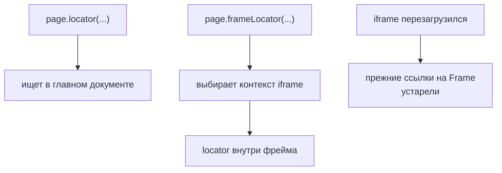

# Frames

## Связь с предыдущей главой

Component Objects ограничивают поиск частью одного документа. `iframe` содержит отдельный документ и собственный browsing context, поэтому обычный Locator основной страницы не может найти его внутренние элементы.

## Цель главы

Понять различие `Frame` и `FrameLocator`, навигацию frame, ожидания внутри него и ошибки потери контекста.

## Главный вопрос

Как работать с элементами внутри iframe, не теряя границу контекста?

## Мотивация

Платёжные формы, редакторы и встроенные компоненты часто загружаются в `iframe`. Элемент виден пользователю, но поиск от основной `Page` возвращает пустой результат, потому что DOM принадлежит другому документу.

## Теория

### iframe — отдельный документ, а не контейнер

Главное свойство iframe: внутри него живёт **свой** документ со своим URL и своим жизненным циклом. Поиск от основной `Page` внутрь не заходит.

Это проверяется одной строкой. На странице с платёжным iframe, где внутри есть кнопка «Оплатить»:

```ts
await page.getByRole("button", { name: "Оплатить" }).count();        // 0
await page.frameLocator("iframe[title=\"оплата\"]")
          .getByRole("button", { name: "Оплатить" }).count();        // 1
```

Попытка кликнуть от `page` не даст осмысленной ошибки — будет обычный таймаут «элемент не найден». Поэтому первое, что стоит проверять при загадочном ненахождении элемента, — не лежит ли он во frame.

### `Frame` и `FrameLocator` решают разные задачи

`Frame` представляет browsing context внутри страницы и подходит для работы с URL, жизненным циклом и навигацией frame.

`FrameLocator` выражает путь к iframe через `Locator` и удобен для поиска и действий над его DOM.

| Задача | Что использовать |
| --- | --- |
| найти элемент внутри iframe, выполнить действие, проверить | `FrameLocator` |
| узнать URL загруженного документа | `Frame` |
| перечислить все frames страницы | `page.frames()` |
| навигировать вложенный документ отдельно | `Frame` |

Выбор зависит от задачи, а не от предпочтения одного API.

### Граница контекста должна быть видна в коде

`page.frameLocator(selector)` сохраняет границу: дальнейшие `getByRole()` и `getByLabel()` выполняются внутри выбранного frame.

```ts
const payment = page.frameLocator("iframe[title=\"оплата\"]");
await payment.getByLabel("Номер карты").fill("4111111111111111");
await payment.getByRole("button", { name: "Оплатить" }).click();
await expect(payment.getByText("Платёж принят")).toBeVisible();
```

Проверка тоже остаётся внутри той же границы. Смешивать локаторы основной страницы и `FrameLocator` в одной цепочке нельзя: это разные документы.

### `FrameLocator` ленив так же, как обычный локатор

Он хранит путь, а не найденный frame. Его можно создать до перехода на страницу, и он сработает после загрузки.

Более того, он переживает навигацию самого frame: если содержимое iframe заменилось новым документом, тот же `FrameLocator` найдёт элемент уже в нём. Проверено — локатор, созданный до `goto`, находит кнопку в первом документе frame, а после навигации frame на другой адрес находит кнопку нового документа.

Практический вывод: хранить нужно `FrameLocator`, а не результат разового поиска.

### Frame имеет собственный жизненный цикл

`page.frames()` возвращает все frames страницы, включая главный: у страницы с одним iframe их будет два.

Frame может навигировать независимо от основной страницы. При навигации содержимое frame заменяется, поэтому Playwright повторно разрешает `Locator` в актуальном документе.

Отсюда следует, что появление frame и его элементов нужно ожидать по наблюдаемым условиям — обычной web-first проверкой внутри frame, а не фиксированной задержкой.

### Идентичность iframe и cross-origin

Устойчивый тест начинается с устойчивого выбора самого iframe. Индекс в списке frames такой идентичностью не является: порядок зависит от того, какие frames успели создаться, и меняется при изменении страницы.

Надёжнее выбирать iframe по атрибутам, которые несут смысл: `title`, `name` или заданный командой test id.

Playwright может автоматизировать cross-origin frame — ограничение same-origin policy относится к скриптам внутри страницы, а не к управлению браузером снаружи. Но документ и origin такого frame остаются отдельной границей: cookies, хранилище и навигация у него свои.

Сначала выбирается документ, потом элемент в нём:



## Внутренний механизм

Основная `Page` содержит дерево frames. Каждый frame имеет собственный документ, URL и жизненный цикл. При навигации содержимое frame заменяется, поэтому Playwright повторно разрешает Locator в актуальном документе.

```text
examples/03-automation-qa/chapter-181/01-frame-locator.ui.ts
```

Пример выбирает платёжный iframe по доступному имени, затем работает с полем и кнопкой через `FrameLocator`. Проверка также остаётся внутри той же границы.

## Главная ментальная модель

`iframe` — отдельная страница внутри страницы; сначала выбирается её контекст, затем элемент внутри него.

## Практические примеры

Для действий с формой удобен `FrameLocator`. Для проверки URL загруженного документа или списка frames может понадобиться `Frame`. Выбор зависит от задачи, а не от предпочтения одного API.

## Automation QA

Frames встречаются в оплате, компонентах идентификации и встроенных отчётах. Явная граница контекста помогает отличить проблему селектора от проблемы загрузки frame.

## Концептуальные границы и компромиссы

Frame не следует скрывать настолько глубоко, чтобы инженер не понимал источник элемента. Playwright может автоматизировать cross-origin frame, но его документ и origin остаются отдельной границей от основной страницы.

## Распространённые мифы

**Миф: iframe — обычный контейнер, и поиск от `page` до него дойдёт.**
Внутри iframe отдельный документ. `page.getByRole()` вернёт ноль совпадений, а клик просто истечёт по таймауту.

**Миф: cross-origin iframe нельзя автоматизировать.**
Можно: ограничение same-origin относится к скриптам страницы, а не к управлению браузером. Отдельной границей остаются origin, cookies и навигация frame.

**Миф: `FrameLocator` нужно создавать заново после перезагрузки frame.**
Он ленив и хранит путь: тот же объект находит элемент в новом документе frame.

**Миф: frames удобно выбирать по индексу.**
Порядок зависит от того, какие frames успели создаться. Это не идентичность, а случайность.

**Миф: `Frame` и `FrameLocator` — два способа сделать одно и то же.**
Первый про жизненный цикл и URL вложенного документа, второй про поиск и действия в его DOM.

## Частые вопросы

**Элемент точно есть на странице, но тест его не находит. Что проверить первым?**
Не лежит ли он внутри iframe. Это самая частая причина «невидимого» элемента при верном селекторе.

**Как дождаться загрузки frame?**
Обычной проверкой внутри него: `expect(frame.getByRole(...)).toBeVisible()`. Фиксированная задержка не связана с состоянием документа.

**Сколько элементов вернёт `page.frames()` для страницы с одним iframe?**
Два: главный frame страницы и вложенный.

**Можно ли построить цепочку из локатора страницы и элемента frame?**
Нет. Это разные документы, и цепочка обрывается на границе. Начинать нужно с `frameLocator`.

**Как выбрать iframe устойчиво?**
По осмысленному атрибуту: `title`, `name` или согласованный командой test id.

## Распространённые ошибки

- Искать внутренний элемент от основной `page`.
- Выбирать iframe по нестабильному индексу.
- Смешивать Locator основной страницы и `FrameLocator`.
- Использовать фиксированную задержку для загрузки frame.
- Считать iframe обычным DOM-контейнером.

## Краткие итоги

- `iframe` содержит отдельный документ.
- `FrameLocator` сохраняет границу DOM выбранного frame.
- `Frame` предоставляет доступ к жизненному циклу и навигации вложенного документа.
- Ожидания должны относиться к наблюдаемому условию внутри frame.
- Устойчивый селектор начинается с самого iframe.

## Что нужно запомнить

- Основная `Page` не ищет внутри iframe автоматически.
- Frame может навигировать независимо.
- Locators разрешаются в актуальном документе.
- Индекс frame редко является устойчивой идентичностью.
- Граница контекста должна быть видна в коде.

## Quick Check

1. Почему `page.getByRole()` не находит элемент iframe?
2. Когда нужен `FrameLocator`?
3. Когда полезен `Frame`?
4. Что происходит при навигации frame?
5. Почему ожидание по таймеру ненадёжно?

## Практика

```text
practice/03-automation-qa/181-frames.md
```

## Переход к следующей главе

Frame остаётся частью одной `Page`. Глава 182 разберёт ситуацию, когда действие создаёт новую `Page` в том же `BrowserContext`.
