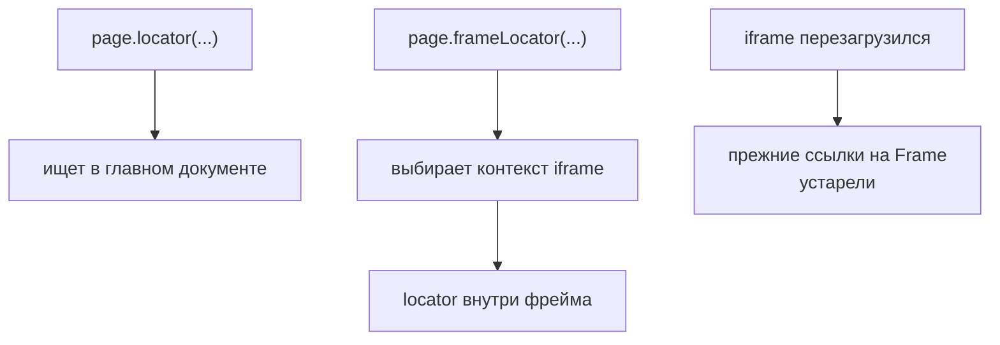

# Фреймы

## Связь с предыдущей главой

Component Objects ограничивают поиск частью одного документа. `iframe` содержит отдельный документ и собственный browsing context, поэтому обычный Locator основной страницы не может найти его внутренние элементы.

## Цель главы

Понять различие `Frame` и `FrameLocator`, навигацию frame, ожидания внутри него и ошибки потери контекста.

## Главный вопрос

Как работать с элементами внутри `iframe`, не теряя границу контекста?

## Мотивация

Платёжные формы, редакторы и встроенные компоненты часто загружаются в `iframe`. Элемент виден пользователю, но поиск от основной `Page` возвращает пустой результат, потому что DOM принадлежит другому документу.

## Теория

### `iframe` — отдельный документ, а не контейнер

Главное свойство `iframe`: внутри него живёт **свой** документ со своим адресом и своим жизненным циклом. Поиск от основной `Page` внутрь не заходит.

Это проверяется одной строкой. На странице с платёжным `iframe`, где внутри есть кнопка «Оплатить»:

```ts
await page.getByRole("button", { name: "Оплатить" }).count();        // 0
await page.frameLocator("iframe[title=\"оплата\"]")
          .getByRole("button", { name: "Оплатить" }).count();        // 1
```

Попытка кликнуть от `page` не даст осмысленной ошибки — будет обычное истечение срока ожидания «элемент не найден». Поэтому первое, что стоит проверять при загадочном ненахождении элемента, — не лежит ли он во фрейме.

### `Frame` и `FrameLocator` решают разные задачи

`Frame` представляет контекст просмотра внутри страницы и подходит для работы с адресом, жизненным циклом и переходами фрейма.

`FrameLocator` выражает путь к `iframe` через `Locator` и удобен для поиска и действий над его DOM.

| Задача | Что использовать |
| --- | --- |
| найти элемент внутри `iframe`, выполнить действие, проверить | `FrameLocator` |
| узнать URL загруженного документа | `Frame` |
| перечислить все фреймы страницы | `page.frames()` |
| навигировать вложенный документ отдельно | `Frame` |

Выбор зависит от задачи, а не от предпочтения одного API.

### Граница контекста должна быть видна в коде

`page.frameLocator(selector)` сохраняет границу: дальнейшие `getByRole()` и `getByLabel()` выполняются внутри выбранного фрейма.

```ts
const payment = page.frameLocator("iframe[title=\"оплата\"]");
await payment.getByLabel("Номер карты").fill("4111111111111111");
await payment.getByRole("button", { name: "Оплатить" }).click();
await expect(payment.getByText("Платёж принят")).toBeVisible();
```

Проверка тоже остаётся внутри той же границы. Смешивать локаторы основной страницы и `FrameLocator` в одной цепочке нельзя: это разные документы.

### `FrameLocator` ленив так же, как обычный локатор

Он хранит путь, а не найденный фрейм. Его можно создать до перехода на страницу, и он сработает после загрузки.

Более того, он переживает переход самого фрейма: если содержимое `iframe` заменилось новым документом, тот же `FrameLocator` найдёт элемент уже в нём. Проверено — локатор, созданный до `goto`, находит кнопку в первом документе фрейма, а после перехода фрейма на другой адрес находит кнопку нового документа.

Практический вывод: хранить нужно `FrameLocator`, а не результат разового поиска.

### Фрейм имеет собственный жизненный цикл

`page.frames()` возвращает все фреймы страницы, включая главный: у страницы с одним `iframe` их будет два.

Фрейм может переходить по адресам независимо от основной страницы. При переходе содержимое фрейма заменяется, поэтому Playwright повторно разрешает `Locator` в актуальном документе.

Отсюда следует, что появление фрейма и его элементов нужно ожидать по наблюдаемым условиям — обычной проверкой, умеющей ждать, внутри фрейма, а не фиксированной задержкой.

### Идентичность `iframe` и чужой источник

Устойчивый тест начинается с устойчивого выбора самого `iframe`. Индекс в списке фреймов такой идентичностью не является: порядок зависит от того, какие фреймы успели создаться, и меняется при изменении страницы.

Надёжнее выбирать `iframe` по атрибутам, которые несут смысл: `title`, `name` или заданный командой тестовый идентификатор.

Playwright может автоматизировать `iframe` с чужим источником — ограничение политики одного источника относится к скриптам внутри страницы, а не к управлению браузером снаружи. Но документ и источник такого фрейма остаются отдельной границей: куки, хранилище и переходы у него свои.

Сначала выбирается документ, потом элемент в нём:


```mermaid
flowchart TD
    A["page.locator(...)"] --> B["ищет в главном документе"]
    C["page.frameLocator(...)"] --> D["выбирает контекст iframe"]
    D --> E["locator внутри фрейма"]
    F["iframe перезагрузился"] --> G["прежние ссылки на Frame<br/>устарели"]
```

## Внутренний механизм

Основная `Page` содержит дерево фреймов. Каждый фрейм имеет собственный документ, адрес и жизненный цикл. При переходе содержимое фрейма заменяется, поэтому Playwright повторно разрешает локатор в актуальном документе.

### Две границы, которые легко перепутать

| Что спрашивают | Чем отвечают |
| --- | --- |
| действие с элементом внутри фрейма | `frameLocator()` — переживает перезагрузку фрейма |
| адрес документа, список фреймов | `page.frames()` — снимок объектов `Frame` |

`frameLocator()` хранит **запрос**: он заново находит и фрейм, и элемент в нём
при каждой операции. Объект `Frame`, наоборот, указывает на конкретный документ
и после перехода внутри фрейма устаревает.

`page.frames()` включает и главный фрейм, поэтому «фреймов два» обычно означает
одну встроенную область, а не две.

### Почему поиск от страницы даёт ноль

```text
page.getByRole("button")        → ищет в документе главного фрейма
                                  внутрь iframe не заходит: count 0

page.frameLocator("iframe[title='Оплата']").getByRole("button")
                                → сначала документ фрейма, потом элемент в нём
```

Ошибка не выглядит как ошибка границы: локатор ничего не находит, и падение
приходит по истечении срока с сообщением о ненайденном элементе. По нему нельзя
отличить «элемента нет» от «ищем не в том документе» — поэтому при работе с
оплатой, входом и встроенными отчётами фрейм проверяют первым делом.

```text
examples/03-automation-qa/chapter-181/01-frame-locator.ui.ts
```

Пример выбирает платёжный `iframe` по доступному имени, затем работает с полем и кнопкой через `FrameLocator`. Проверка также остаётся внутри той же границы.

## Главная ментальная модель

`iframe` — отдельная страница внутри страницы; сначала выбирается её контекст, затем элемент внутри него.

## Практические примеры

Для действий с формой удобен `FrameLocator`. Для проверки адреса загруженного документа или списка фреймов может понадобиться `Frame`. Выбор зависит от задачи, а не от предпочтения одного интерфейса.

## Automation QA

Фреймы встречаются в оплате, компонентах идентификации и встроенных отчётах. Явная граница контекста помогает отличить проблему селектора от проблемы загрузки фрейма.

## Концептуальные границы и компромиссы

Фрейм не следует скрывать настолько глубоко, чтобы инженер не понимал источник элемента. Playwright может автоматизировать фрейм с чужим источником, но его документ и источник остаются отдельной границей от основной страницы.

## Распространённые мифы

**Миф: `iframe` — обычный контейнер, и поиск от `page` до него дойдёт.**
Внутри `iframe` отдельный документ. `page.getByRole()` вернёт ноль совпадений, а клик просто истечёт по сроку ожидания.

**Миф: `iframe` с чужим источником нельзя автоматизировать.**
Можно: ограничение политики одного источника относится к скриптам страницы, а не к управлению браузером. Отдельной границей остаются источник, куки и переходы фрейма.

**Миф: `FrameLocator` нужно создавать заново после перезагрузки фрейма.**
Он ленив и хранит путь: тот же объект находит элемент в новом документе фрейма.

**Миф: фреймы удобно выбирать по индексу.**
Порядок зависит от того, какие фреймы успели создаться. Это не идентичность, а случайность.

**Миф: `Frame` и `FrameLocator` — два способа сделать одно и то же.**
Первый про жизненный цикл и URL вложенного документа, второй про поиск и действия в его DOM.

## Частые вопросы

**Элемент точно есть на странице, но тест его не находит. Что проверить первым?**
Не лежит ли он внутри `iframe`. Это самая частая причина «невидимого» элемента при верном селекторе.

**Как дождаться загрузки фрейма?**
Обычной проверкой внутри него: `expect(frame.getByRole(...)).toBeVisible()`. Фиксированная задержка не связана с состоянием документа.

**Сколько элементов вернёт `page.frames()` для страницы с одним `iframe`?**
Два: главный фрейм страницы и вложенный.

**Можно ли построить цепочку из локатора страницы и элемента фрейма?**
Нет. Это разные документы, и цепочка обрывается на границе. Начинать нужно с `frameLocator`.

**Как выбрать `iframe` устойчиво?**
По осмысленному атрибуту: `title`, `name` или согласованный командой тестовый идентификатор.

## Распространённые ошибки

- Искать внутренний элемент от основной `page` — поиск не заходит в `iframe`, поэтому `count()` даёт 0, а проверка падает по таймауту с сообщением о ненайденном элементе.

- Выбирать `iframe` по нестабильному индексу — порядок фреймов меняется от рекламы, аналитики и порядка загрузки. Фрейм выбирают по `name`, `title` или по устойчивой части URL.

- Смешивать Locator основной страницы и `FrameLocator` — это разные области поиска: цепочка, начатая от страницы, внутрь фрейма не продолжается.

- Использовать фиксированную задержку для загрузки фрейма — `frameLocator` сам дожидается появления фрейма и элемента в нём, а пауза лишь добавляет время и не даёт гарантии.

- Считать `iframe` обычным контейнером DOM — это отдельный документ со своим деревом и своей навигацией. Фрейм может перезагрузиться независимо от страницы, и локатор фрейма это переживает.

## Краткие итоги

- `iframe` содержит отдельный документ.
- `FrameLocator` сохраняет границу DOM выбранного фрейма.
- `Frame` предоставляет доступ к жизненному циклу и навигации вложенного документа.
- Ожидания должны относиться к наблюдаемому условию внутри фрейма.
- Устойчивый селектор начинается с самого `iframe`.

## Что нужно запомнить

- Основная `Page` не ищет внутри `iframe` автоматически.
- Фрейм может переходить по адресам независимо.
- Локаторы разрешаются в актуальном документе.
- Индекс фрейма редко является устойчивой идентичностью.
- Граница контекста должна быть видна в коде.

## Быстрая проверка

1. Почему `page.getByRole()` не находит элемент `iframe`?
2. Когда нужен `FrameLocator`?
3. Когда полезен `Frame`?
4. Что происходит при переходе фрейма на другой адрес?
5. Почему ожидание по таймеру ненадёжно?

### Ответы

1. Содержимое `iframe` — отдельный документ. Поиск по странице в него не заходит.
2. Когда нужно искать элементы внутри `iframe` и работать с ними: он задаёт область поиска.
3. Когда нужен сам объект документа внутри `iframe`: переходы, ожидание загрузки, выполнение скрипта в его контексте.
4. Прежний объект фрейма становится недействительным, а локаторы, ведущие в него, перестают находить элементы.
5. Готовность фрейма зависит от загрузки его документа, а не от прошедшего времени. Ждать нужно появления элемента внутри.

## Практика

```text
practice/03-automation-qa/181-frames.md
```

## Переход к следующей главе

Фрейм остаётся частью одной `Page`. Глава 182 разберёт ситуацию, когда действие создаёт новую `Page` в том же `BrowserContext`.
