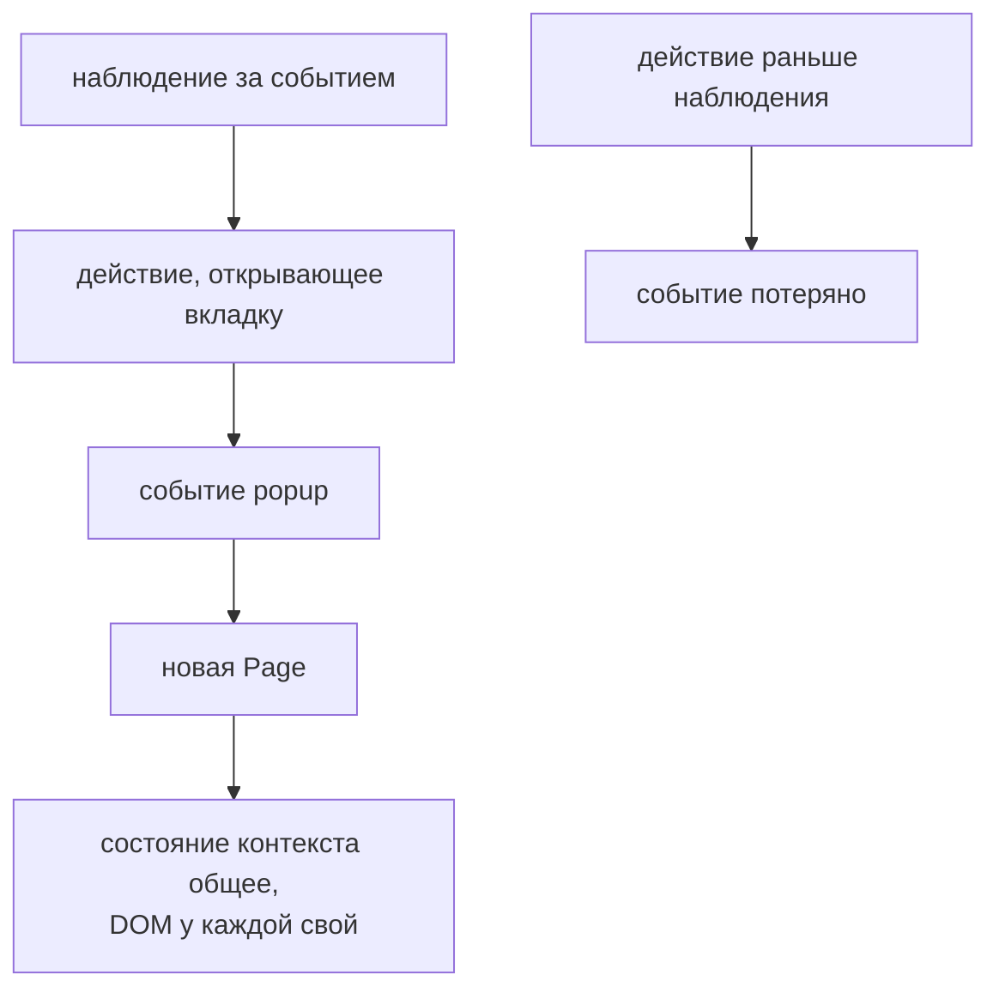

# Вкладки, окна и всплывающие окна

## Связь с предыдущей главой

Frame создаёт отдельный документ внутри одной `Page`. Ссылка с новым окном или `window.open()` создаёт самостоятельную `Page`, которой нужны собственные Locators и понятный жизненный цикл.

## Цель главы

Научиться синхронизировать действие с событием `Page`, работать с popup среди нескольких страниц одного контекста и закрывать созданные ресурсы.

## Главный вопрос

Как синхронизировать действие с появлением новой страницы?

## Мотивация

Если сначала нажать кнопку, а затем подписаться на событие, popup может появиться раньше начала ожидания. Тест зависнет или потеряет ссылку на новую страницу. Ожидание должно быть установлено до действия-триггера.

## Теория

### Всплывающее окно — это новая `Page`

Всплывающее окно — новая `Page`, открытая существующей страницей. У неё свой DOM, свой адрес и своя история переходов.

Исходная страница при этом никуда не девается и остаётся на прежнем адресе. Поэтому после открытия новой вкладки тест работает с **двумя** объектами, и путать их нельзя: поиск элемента новой вкладки в исходной `page` вернёт ноль совпадений.

### Наблюдение начинается раньше действия

Обе операции ожидания возвращают Promise. Сначала создаётся Promise ожидания, затем выполняется действие, после чего Promise разрешается новой `Page`:

```ts
const popupPromise = page.waitForEvent("popup");        // наблюдение
await page.getByRole("link", { name: "Открыть отчёт" }).click(); // триггер
const popup = await popupPromise;                       // результат
```

Порядок обязателен. Подписка после клика пропускает уже произошедшее событие и падает по истечении срока ожидания:

```text
page.waitForEvent: Timeout 800ms exceeded while waiting for event "popup"
```

Ошибка выглядит как «окно не открылось», хотя вкладка открылась — тест просто начал смотреть слишком поздно.

### Два уровня наблюдения

Выбор зависит от того, что известно о происхождении новой страницы:

| Ожидание | Что наблюдает | Когда уместно |
| --- | --- | --- |
| `page.waitForEvent("popup")` | новую страницу, открытую **этой** страницей | известен источник открытия |
| `context.waitForEvent("page")` | любую новую страницу контекста | источник неизвестен или их несколько |

Первый вариант точнее и потому предпочтителен: он не поймает страницу, открытую другим сценарием в том же контексте.

### Событие не означает готовность содержимого

Событие сообщает о **добавлении** новой страницы в контекст, а не о полной готовности любого её элемента. `BrowserContext` владеет коллекцией объектов `Page`, и событие отмечает именно момент появления в этой коллекции.

Дальше работают обычные средства: локаторы и проверки, умеющие ждать, дождутся нужного состояния новой страницы. Если требуется дождаться именно завершения загрузки документа, для этого есть `waitForLoadState()`, но чаще достаточно проверки ожидаемого содержимого.

### Состояние делится, DOM — нет

Страницы одного `BrowserContext` используют общее хранилище куки: авторизация, выполненная в исходной вкладке, действует и во всплывающем окне. Браузерное хранилище при этом по-прежнему ограничено источником — как и в браузере у пользователя.

А вот DOM у каждой страницы свой. Это и есть причина, по которой всплывающее окно нельзя проверять «заодно» с исходной страницей: локаторы одной страницы ничего не знают о другой.

### Не каждый новый URL — новая страница

Обычный переход заменяет документ текущей страницы и новой `Page` не создаёт. Ссылка без `target="_blank"`, переход внутри SPA, перенаправление — всё это остаётся в той же вкладке, и ждать события `popup` для них бессмысленно: ожидание просто истечёт.

API выбирается по фактическому поведению браузера, а не по тому, что «открылась новая страница» с точки зрения пользователя. Проверить это просто: после действия посмотреть, изменился ли `page.url()` или выросло ли число элементов в `context.pages()`.

### Владелец обязателен

Полученная вручную дополнительная страница принадлежит тесту. `context.pages()` полезен для диагностики, но выбор «последней вкладки» по индексу обычно менее устойчив, чем ожидание события.

Закрытие должно быть гарантировано — через `finally` или освобождение фикстуры, а не последней строкой тела теста: при падении проверки до неё выполнение не дойдёт.

Наблюдение устанавливается раньше действия:



## Внутренний механизм

`BrowserContext` владеет коллекцией объектов `Page`. Событие сообщает о добавлении новой страницы, а не о полной готовности любого её элемента. Дальнейшие локаторы и проверки, умеющие ждать, ожидают нужное состояние страницы.

### Подписка и действие образуют пару

```text
const popup = page.waitForEvent("popup");   // 1. наблюдение установлено
await link.click();                          // 2. действие
const page2 = await popup;                   // 3. результат наблюдения
```

Событие доставляется подписчикам, существующим на момент его возникновения.
Промис, созданный на шаге 1, уже подписан — поэтому событие, случившееся во
время шага 2, не теряется.

Переставьте строки 1 и 2 местами, и подписка опоздает: окно уже открыто,
событие прошло, ожидание истекает по таймауту. Приложение при этом полностью
исправно.

### Что общего у вкладок и что своё

| Общее для контекста | Своё у каждой страницы |
| --- | --- |
| куки, хранилище, разрешения | DOM, локаторы, история переходов |
| перехватчики `context.route` | обработчики `page.on(...)` |

Исходная страница после открытия всплывающего окна остаётся на своём адресе и
не меняется. Поэтому её локаторы не видят элементов нового окна: это два
объекта `Page`, и тест хранит их в разных переменных.

Отдельный случай — обычный переход: он заменяет документ **той же** страницы, и
новой `Page` не появляется. Средство выбирают по тому, что реально делает
браузер, а не по тому, что изменился адрес.

```text
examples/03-automation-qa/chapter-182/01-popup-event.ui.ts
```

Пример начинает `waitForEvent` до клика, получает всплывающее окно, проверяет его содержимое и закрывает новую страницу в `finally`.

## Главная ментальная модель

Действие и ожидаемое событие образуют одну синхронизированную пару: сначала наблюдение, затем триггер.

## Практические примеры

Экспорт отчёта может открыть предварительный просмотр в новой вкладке. Поток, похожий на OAuth, может создать всплывающее окно. В обоих случаях тест хранит отдельные переменные для исходной и новой страницы.

## Automation QA

Явное владение всплывающим окном предотвращает случайные проверки не той вкладки и утечки ресурсов. `context.pages()` полезен для диагностики, но выбор «последней вкладки» по индексу обычно менее устойчив, чем ожидание события.

## Концептуальные границы и компромиссы

Не каждый новый адрес означает новую страницу: обычный переход заменяет документ текущей страницы. Средство выбирается по фактическому поведению браузера.

## Распространённые мифы

**Миф: после открытия вкладки можно продолжать работать с исходной `page`.**
У новой страницы свой DOM. Локаторы исходной страницы её элементов не видят.

**Миф: порядок подписки и клика не важен.**
Подписка после действия пропускает событие и даёт истечение срока, похожее на дефект приложения.

**Миф: событие `popup` означает, что страница загружена.**
Оно означает появление страницы в контексте. Готовность содержимого проверяется обычными ожиданиями.

**Миф: любой переход на новый адрес создаёт новую страницу.**
Обычный переход заменяет документ текущей вкладки. Новая страница появляется только при реальном открытии окна или вкладки.

**Миф: авторизацию во всплывающем окне нужно выполнять заново.**
Куки общие для всего контекста, поэтому всплывающее окно наследует сессию.

## Частые вопросы

**Когда использовать `context.waitForEvent("page")`?**
Когда источник открытия неизвестен или страниц может быть несколько. Для известной ссылки точнее `page.waitForEvent("popup")`.

**Почему ожидание всплывающего окна истекло, хотя вкладка видимо открылась?**
Две частые причины: подписка создана после клика либо переход произошёл в той же вкладке и новой страницы не было.

**Можно ли брать последнюю страницу из `context.pages()`?**
Для диагностики — да. Как единственная синхронизация это ненадёжно: момент появления страницы в списке не связан с вашим действием.

**Кто закрывает полученную страницу?**
Тест или фикстура, получившая её. Закрытие должно выполняться и при падении — в `finally` или при освобождении.

**Чем всплывающее окно отличается от `iframe`?**
Всплывающее окно — отдельная страница со своим DOM и своими переходами. `iframe` — вложенный документ внутри той же страницы.

## Распространённые ошибки

- Подписываться на событие после клика — всплывающее окно открывается сразу, событие уже прошло, и ожидание истекает по таймауту. Подписку создают до действия.

- Использовать `context.pages().at(-1)` как единственную синхронизацию — список страниц читается мгновенно и не ждёт появления новой. Результат зависит от того, успел ли браузер открыть окно.

- Продолжать искать элементы всплывающего окна в исходной странице — это отдельный объект `Page`. Исходная страница остаётся на своём адресе, и её локаторы ничего не найдут.

- Забывать закрыть вручную полученную дополнительную страницу — она живёт до конца контекста, удерживает ресурсы и попадает в трассировку как активная.

- Считать событие гарантией полной загрузки бизнес-содержимого — событие говорит только о появлении страницы. Готовность проверяют ожиданием конкретного элемента или ответа.

## Краткие итоги

- Всплывающее окно является новой `Page`.
- Несколько объектов `Page` могут принадлежать одному `BrowserContext`.
- Ожидание события начинается до действия.
- После события готовность проверяется локаторами и проверками.
- Дополнительная страница требует явного владельца.

## Что нужно запомнить

- `page.waitForEvent("popup")` привязан к исходной странице.
- `context.waitForEvent("page")` наблюдает весь контекст.
- Каждая страница имеет отдельный DOM.
- Страницы контекста используют общие куки, а браузерное хранилище разделяют только в пределах одного источника.
- Очистка должна быть гарантирована через `finally` или освобождение фикстуры.

## Быстрая проверка

1. Почему ожидание создаётся до клика?
2. Чем всплывающее окно отличается от фрейма?
3. Когда ждать событие у `context`?
4. Гарантирует ли событие `popup` готовность нужного элемента?
5. Кто закрывает полученную страницу?

### Ответы

1. Иначе вкладка успеет открыться до начала ожидания, и оно будет ждать следующую такую.
2. Всплывающее окно — это отдельная страница со своим жизненным циклом. Фрейм — документ внутри той же страницы.
3. Когда неизвестно, какая именно страница откроет новую, или новая страница открывается не по клику в конкретной странице.
4. Нет. Оно означает лишь, что страница создана; её содержимое ещё может грузиться.
5. Тот, кто её открыл в тесте, если она не закрывается вместе с контекстом. Обычно достаточно закрытия контекста.

## Практика

```text
practice/03-automation-qa/182-tabs-windows-and-popups.md
```

## Переход к следующей главе

Всплывающее окно создаёт новую страницу. Глава 183 рассмотрит взаимодействия браузера вне обычного потока DOM: диалоги, загрузку и скачивание файлов.
