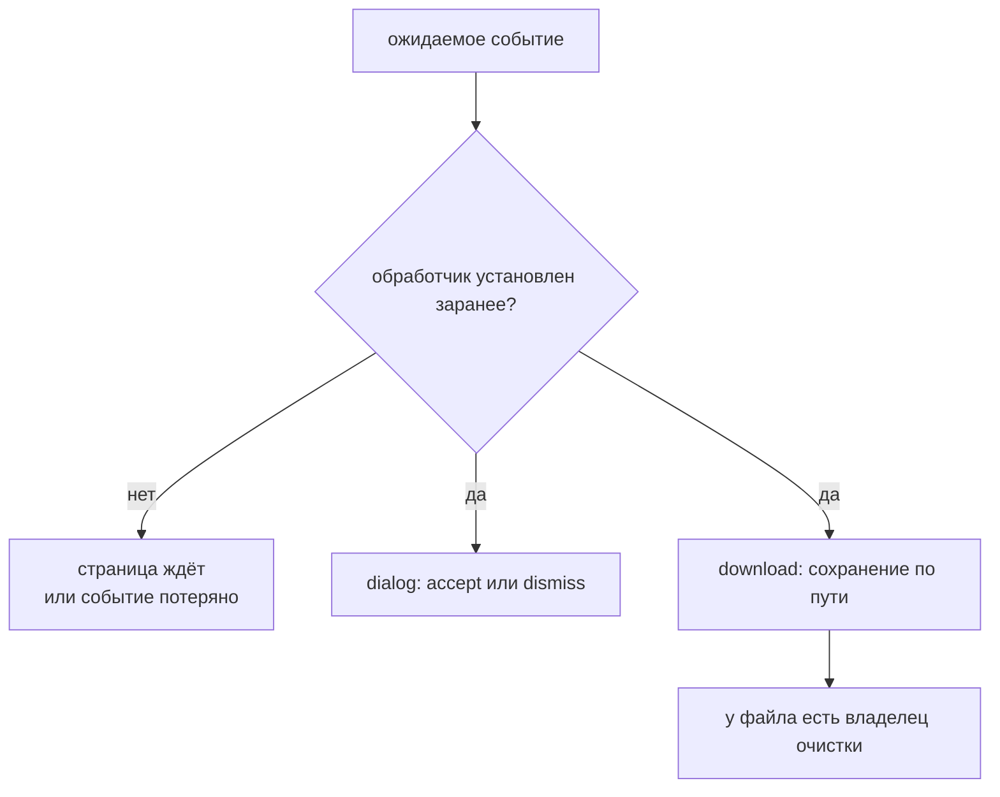

# Диалоги и работа с файлами

## Связь с предыдущей главой

Popup требует ожидания события браузера до действия. JavaScript dialogs и download используют ту же модель синхронизации, а upload передаёт браузеру локальный файл вместо обычного ввода текста.

## Цель главы

Научиться обрабатывать события dialog, загружать файлы, ожидать download и управлять временными артефактами.

## Главный вопрос

Как автоматизировать взаимодействия браузера, которые не являются обычными DOM-действиями?

## Мотивация

`alert`, file chooser и download управляются браузером, а не обычным DOM после клика. Если тест неправильно обрабатывает событие или не определяет владельца файла, сценарий может остановиться либо оставить артефакты.

## Теория

### Диалоговое окно блокирует страницу, пока его не закроют

`alert`, `confirm` и `prompt` останавливают выполнение на странице. Событие `dialog` предоставляет объект `Dialog` с типом, сообщением и действиями `accept()` или `dismiss()`.

Поведение по умолчанию устроено так, чтобы тест не зависал: **без обработчика Playwright автоматически отклоняет диалоговое окно**. Для `confirm` это означает, что приложение получит `false`, как если бы пользователь нажал «Отмена».

### Зарегистрировал обработчик — обязан закрыть

Это самое неочевидное правило главы, и оно легко проверяется. Как только тест подписался на событие, автоматическое отклонение выключается. Обработчик, который ничего не вызвал, оставляет диалог открытым — и действие, вызвавшее его, никогда не завершится:

```ts
page.on("dialog", (dialog) => {
  console.log(dialog.message());   // обработчик есть, но accept/dismiss не вызван
});

await page.getByRole("button", { name: "Удалить" }).click();
// locator.click: Timeout 1500ms exceeded
```

Падение выглядит как проблема с кнопкой, хотя причина — незакрытый диалог. Правильная форма всегда содержит решение:

```ts
page.on("dialog", (dialog) => dialog.accept());
```

Регистрация должна происходить **до** действия, вызывающего диалог: подписка после клика событие не поймает.

### Отправка файла: обычное поле и диалог выбора файла

Для существующего `<input type="file">` используется `setInputFiles()`. Никакого системного окна при этом не открывается — Playwright подставляет файл напрямую, и приложение видит обычное событие `change`.

```ts
await page.getByLabel("Вложение").setInputFiles("fixtures/report.csv");
await page.getByLabel("Вложение").setInputFiles([]);   // очистить выбор
```

Файл должен быть локальным тестовым ресурсом без секретов и лежать в репозитории проекта, а не на машине конкретного инженера.

Если приложение создаёт диалог выбора файла динамически — например, по клику на произвольный элемент, — ожидание события `filechooser` начинается до клика по элементу-триггеру, по той же схеме «сначала наблюдение, затем действие».

### Скачивание: событие, имя, сохранение

Событие скачивания также ожидается до действия:

```ts
const downloadPromise = page.waitForEvent("download");
await page.getByRole("button", { name: "Выгрузить" }).click();
const download = await downloadPromise;
```

Объект `Download` сообщает предлагаемое имя файла через `suggestedFilename()` и позволяет сохранить файл в контролируемый путь через `saveAs()`.

### Владение скачанным файлом

Здесь важна деталь, которая объясняет, зачем вообще нужен `saveAs()`. Скачанный файл сначала попадает во временное место, принадлежащее **браузерному контексту**. Это проверяется прямо: после `context.close()` временный файл исчезает, а файл, перенесённый через `saveAs()`, остаётся.

Отсюда правило: если файл нужен после теста — для проверки содержимого, для приложения к отчёту — его нужно явно сохранить. Целевой путь берут из каталога результатов конкретного теста, а не из общего постоянного места: так артефакты разных тестов не пересекаются и не накапливаются.

### Что проверять и кто убирает

Проверка одного лишь имени файла почти ничего не доказывает: имя может быть верным при пустом или битом содержимом. Для отчёта проверяют то, ради чего он существует, — наличие строк, заголовки колонок, формат.

Владение файлом включает его удаление. Временный артефакт удаляет тест или фикстура, которая его создала, и делает это независимо от результата проверки — иначе упавший тест оставит мусор именно тогда, когда стенд и так в плохом состоянии.

При этом проверка скачивания в браузере не заменяет проверку всей отчётной системы: она подтверждает, что интерфейс отдаёт файл, а не что отчёт корректно формируется во всех случаях.

События браузера требуют заранее установленного обработчика:



## Внутренний механизм

Эти средства не обходят поведение браузера. Playwright подписывается на события браузерного протокола и связывает их с действием теста. Локальный файл для отправки читает процесс раннера, а скачанный файл сначала принадлежит браузерному контексту и затем копируется через `saveAs()`.

### Диалог без обработчика и обработчик без ответа

```text
нет обработчика        → Playwright сам отклоняет диалог, confirm() даёт false
есть обработчик,
  вызван accept()      → диалог закрыт, действие продолжается
  ничего не вызвано    → действие висит до истечения срока
```

Средняя и нижняя строки различаются одной строкой кода, а по симптомам —
полностью. Зарегистрированный обработчик берёт ответственность на себя: пока он
не вызвал `accept()` или `dismiss()`, вызвавший диалог клик не завершается.

Верхняя строка опаснее: тест проходит, но сценарий выполнен как отказ.

### Кто владеет файлом

| Файл | Владелец | Когда исчезает |
| --- | --- | --- |
| отправляемый через `setInputFiles()` | процесс раннера | не исчезает, это фикстура проекта |
| скачанный, до `saveAs()` | браузерный контекст | при `context.close()` |
| перенесённый через `saveAs()` | тест | никогда — удалять должен тест |

Отсюда два практических вывода. Проверять содержимое скачанного файла нужно до
закрытия контекста или после переноса. А перенесённый файл обязан попадать в
каталог результатов теста — общий путь при параллельном запуске перезаписывают
соседи.

```text
examples/03-automation-qa/chapter-183/01-dialog-and-files.ui.ts
```

## Главная ментальная модель

Событие браузера требует заранее установленного наблюдения, а каждый созданный файловый артефакт требует явного владельца очистки.

## Практические примеры

Диалоговое окно подтверждает сохранение профиля. Отправка передаёт локальный тестовый файл. Скачанный файл сохраняется в изолированный путь результата теста, проверяется и удаляется независимо от результата проверки.

## Automation QA

Файловые сценарии должны использовать небольшие контролируемые тестовые ресурсы. Для скачанного файла проверяют не только имя, но и содержимое или формат, соответствующий цели теста.

## Концептуальные границы и компромиссы

Проверка скачивания в браузере не заменяет проверку всей отчётной системы. Временные файлы допустимы, если путь изолирован, очистка гарантирована, а секретные данные не сохраняются без необходимости.

## Распространённые мифы

**Миф: без обработчика тест зависнет на диалоге.**
Playwright сам отклонит диалог. Для `confirm` приложение получит `false`.

**Миф: обработчик можно оставить «наблюдающим».**
Как только обработчик зарегистрирован, автоматическое отклонение выключается. Не вызвав `accept()` или `dismiss()`, вы подвесите вызвавшее действие.

**Миф: `setInputFiles` открывает системное окно выбора файла.**
Файл подставляется напрямую, окно не появляется. Ожидание `filechooser` нужно только при динамически создаваемом выборе.

**Миф: скачанный файл лежит там, где его оставил браузер, и никуда не денется.**
Он принадлежит браузерному контексту и удаляется при его закрытии. Сохраняет файл `saveAs()`.

**Миф: достаточно проверить имя скачанного файла.**
Имя не доказывает содержимого. Проверяют то, ради чего файл нужен.

## Частые вопросы

**Клик по кнопке удаления не завершается. Где искать?**
Проверьте, нет ли зарегистрированного обработчика диалога, который не вызывает `accept()` или `dismiss()`.

**Как подтвердить `prompt` с текстом?**
`dialog.accept("значение")` передаёт введённый текст. Для `confirm` аргумент не нужен.

**Куда сохранять скачанный файл?**
В каталог результатов конкретного теста. Общий постоянный путь приводит к пересечению артефактов разных тестов.

**Какие файлы годятся для загрузки в тестах?**
Небольшие контролируемые ресурсы из репозитория проекта. Личные файлы с машины инженера недопустимы: они не воспроизводятся в CI и могут содержать лишнее.

**Кто удаляет временный файл?**
Тот, кто его создал, — тест или фикстура, и обязательно независимо от результата проверок.

## Распространённые ошибки

- Регистрировать обработчик диалогового окна после клика — без обработчика Playwright отклоняет диалог сам, поэтому `confirm` вернёт `false`, а действие выполнится не так, как ожидал тест.

- Загружать личный файл с машины разработчика — в CI такого файла нет, и тест падает по причине, которой нет в репозитории. Файл создают в прогоне или хранят как фикстуру проекта.

- Проверять только факт скачивания без содержимого — событие загрузки говорит о начале передачи, а не о том, что файл верный. Проверяют имя и содержимое сохранённого файла.

- Сохранять артефакты в общий постоянный путь — параллельные процессы пишут в один файл и перетирают результаты друг друга. Путь строят по идентификатору теста.

- Не выполнять очистку после неуспешной проверки — временный файл загрузки принадлежит контексту и удаляется при его закрытии, а перенесённый через `saveAs()` остаётся навсегда.

- Путать диалог выбора файла с обычным текстовым полем — системное окно недоступно со страницы. Файл передают через `setInputFiles()` или ожидание события выбора файла.

## Краткие итоги

- Диалоговое окно обрабатывается через событие браузера.
- Отправка использует локальный контролируемый тестовый ресурс.
- Ожидание скачивания начинается до действия-триггера.
- `saveAs()` переносит скачанный файл в управляемый путь.
- Временные файлы требуют гарантированной очистки.

## Что нужно запомнить

- Обработчик должен быть зарегистрирован до события.
- Зарегистрированный обработчик обязан закрыть диалоговое окно.
- Тестовые ресурсы не должны содержать секреты.
- Путь результата теста должен быть изолирован.
- Владение файлом включает его удаление.

## Быстрая проверка

1. Когда регистрируется обработчик диалогового окна?
2. Для чего нужен `setInputFiles()`?
3. Почему промис ожидания скачивания создают до клика?
4. Что проверять кроме предлагаемого имени файла?
5. Кто удаляет временный файл?

### Ответы

1. До действия, которое вызывает диалог. Незарегистрированный диалог закрывается автоматически, и действие может не состояться.
2. Чтобы передать файл полю загрузки напрямую, не открывая системное окно выбора.
3. Загрузка может начаться до того, как ожидание создано, и событие будет пропущено.
4. Что файл действительно сохранён, каков его размер и содержимое — хотя бы первые строки или количество записей.
5. Тот, кто его создал в тесте, — в очистке, которая выполняется и при падении.

## Практика

```text
practice/03-automation-qa/183-dialogs-and-files.md
```

## Переход к следующей главе

Диалоговые окна и файлы управляются событиями браузера. Глава 184 применит наблюдение и контроль к сетевым запросам и ответам страницы.
