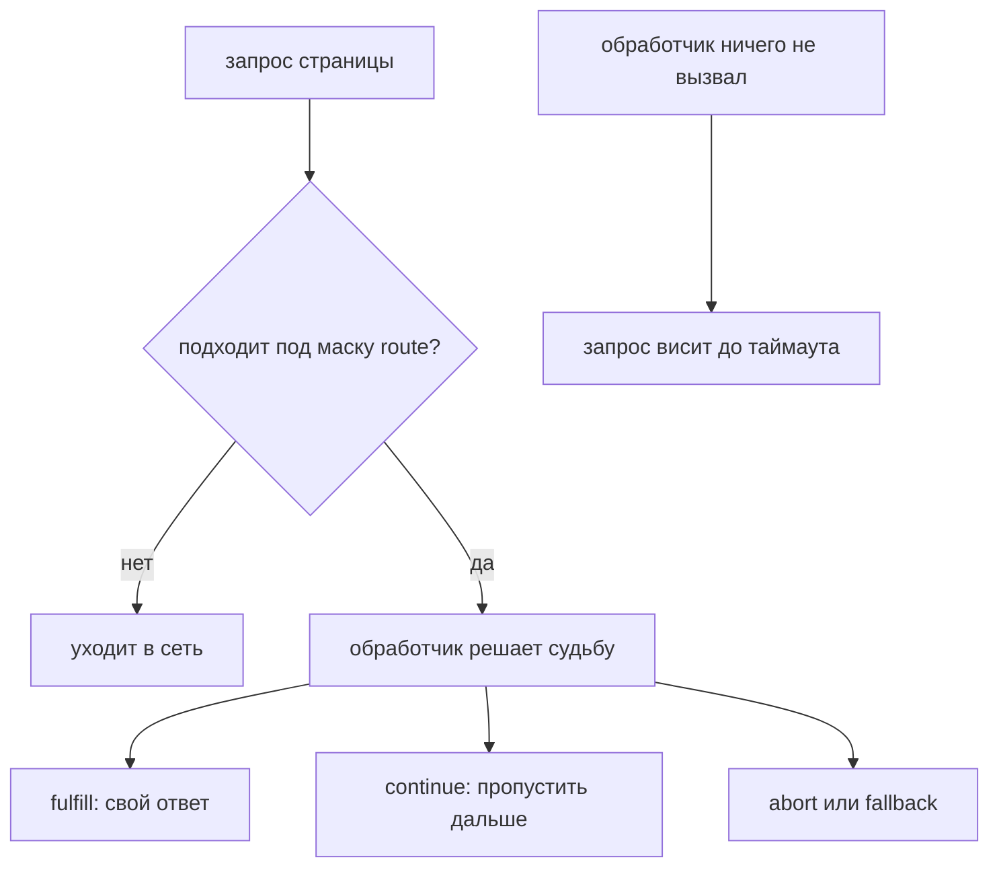

# Network interception и mocking

## Связь с предыдущей главой

Глава 183 показала, как синхронизироваться с событиями браузера. Сетевое взаимодействие страницы также наблюдаемо, а network interception позволяет контролировать отдельный запрос до отправки.

## Цель главы

Понять события request и response, network interception, подмену и изменение ответа, прерывание запроса и границу между UI- и API-тестом.

## Главный вопрос

Когда тесту нужно наблюдать или контролировать сетевое взаимодействие страницы?

## Мотивация

UI может зависеть от редкой ошибки backend, нестабильного внешнего сервиса или трудно создаваемого ответа. Route позволяет детерминированно передать странице нужный сетевой результат, но чрезмерный mocking способен скрыть настоящую интеграцию.

## Теория

### Наблюдение и управление — разные намерения

События `request` и `response` позволяют наблюдать фактический сетевой поток страницы. Они ничего не меняют и полезны для диагностики и проверок, где сетевой факт является частью цели.

`page.route()` или `context.route()` — это уже управление: обработчик встаёт **до** сетевой отправки подходящего запроса и решает его судьбу.

Путать эти намерения не стоит. Если задача — понять, что вообще происходит, начинают с наблюдения; подменять ответ имеет смысл только тогда, когда известно, что именно подменяется.

### Четыре способа завершить перехваченный запрос

| Метод | Что делает |
| --- | --- |
| `route.fulfill()` | возвращает подменённый ответ, до сети запрос не доходит |
| `route.continue()` | отправляет запрос дальше, возможно с изменениями |
| `route.fallback()` | передаёт запрос следующему подходящему обработчику |
| `route.abort()` | прерывает запрос |

`abort()` для приложения выглядит как сетевая ошибка: у картинки сработает `onerror`, у `fetch` — отклонённый Promise. Это и делает его удобным для проверки поведения интерфейса при недоступном ресурсе.

### Незавершённый обработчик подвешивает запрос

Пока обработчик не завершит запрос одним из четырёх способов, запрос остаётся **приостановленным**. Обработчик, который просто что-то залогировал и вышел, останавливает загрузку:

```ts
await page.route("**/api/**", (route) => {
  console.log(route.request().url());   // ошибка: route не завершён
});
```

Приложение при этом не получает ни ответа, ни ошибки — оно ждёт. Тест падает по таймауту на проверке результата, и причина выглядит как «медленный backend». Правильная форма наблюдения через route всегда заканчивается вызовом:

```ts
await page.route("**/api/**", (route) => {
  console.log(route.request().url());
  return route.continue();
});
```

Для чистого наблюдения лучше вообще не использовать route, а подписаться на события `request` и `response` — они запрос не задерживают.

### Порядок обработчиков: последний зарегистрированный первый

Это неочевидно и влияет на поведение. Обработчики проверяются **в обратном порядке регистрации**: зарегистрированный последним получает запрос первым. `fallback()` передаёт его следующему.

При этом обработчики `page.route()` имеют приоритет над `context.route()`: сначала отрабатывают все подходящие обработчики страницы, и только если все они вызвали `fallback()`, запрос доходит до обработчиков контекста.

Практический вывод: перекрывающиеся маски создают неявный порядок. Чем уже маска, тем меньше шансов, что два обработчика будут спорить за один запрос.

### Маска должна быть узкой

Маска `**/*` ловит вообще всё: документ, стили, картинки, шрифты, аналитику. Проверено на простой странице — перехватываются `/`, `/app.css`, `/logo.png`, хотя сценарий касался только данных.

Последствия предсказуемы: случайно подменённая или прерванная статика ломает страницу способом, не связанным с проверяемым поведением, а расследование уходит в сторону.

Маску пишут по конкретному ресурсу — `**/api/v1/work-items*`, — и ограничивают область действия route тем участком сценария, где он нужен.

### Подмена — это модель, а не истина о backend

Подмена должна быть минимальной и соответствовать проверяемому контракту. UI-тест с подменённым ответом проверяет реакцию интерфейса на известный ответ, но не доказывает работоспособность реального backend.

Отсюда рабочее разделение:

- **подмена уместна** для редких и труднодостижимых состояний: пустой список, ошибка сервера, медленный ответ, недоступный необязательный ресурс;
- **подмена неуместна** для критических успешных сценариев: они должны проходить с реальным backend в подходящем наборе тестов.

Опасность подменённого ответа в том, что он устаревает молча. Если контракт изменился, а фикстура осталась прежней, тест продолжает проходить и подтверждает поведение, которого в реальности уже нет.

### Проверка остаётся о пользователе

Сетевая подготовка — это подготовка, а не результат. Проверять стоит то, что увидел пользователь: появившееся сообщение об ошибке, пустое состояние списка, доступность повторной попытки.

Проверка внутреннего запроса без связи с пользовательским результатом даёт тест, который ломается при любом изменении реализации и ничего не говорит о поведении продукта. Network interception остаётся частью UI-теста и не заменяет API client, contract testing или отдельную стратегию REST, которые начинаются со следующего модуля.

Перехваченный запрос обязан быть завершён:



## Внутренний механизм

Обработчик route выполняется до сетевой отправки подходящего запроса. Пока обработчик не завершит запрос через `fulfill`, `continue`, `fallback` или `abort`, запрос остаётся приостановленным. Слишком широкая маска может перехватить ресурсы, не относящиеся к сценарию.

```text
examples/03-automation-qa/chapter-184/01-network-control.ui.ts
```

Пример полностью локален: обращения к `book.test` перехватываются до внешней сети. Отдельные тесты демонстрируют наблюдение, изменение и прерывание запроса.

## Главная ментальная модель

Network interception — контролируемая граница между Page и сетевым транспортом: тест либо наблюдает запрос, либо явно решает его судьбу.

## Практические примеры

Подменённый ответ воспроизводит пустой список или ошибку. Изменение запроса добавляет тестовый заголовок. Прерывание проверяет UI-поведение при недоступном необязательном ресурсе.

## Automation QA

Контроль сети полезен для редких состояний UI и изоляции внешних интеграций. Критические успешные сценарии должны также проходить с реальным backend в подходящем наборе тестов.

## Концептуальные границы и компромиссы

Network interception остаётся частью UI-теста. Оно не заменяет API client, contract testing или отдельную стратегию REST, которые начинаются со следующего модуля.

## Распространённые мифы

**Миф: обработчик route можно использовать просто для логирования.**
Незавершённый route подвешивает запрос. Для наблюдения есть события `request` и `response`.

**Миф: обработчики route срабатывают в порядке регистрации.**
Порядок обратный: последний зарегистрированный проверяется первым, а `page.route()` имеет приоритет над `context.route()`.

**Миф: широкая маска безопасна, лишнее просто пройдёт мимо.**
Она перехватывает стили, картинки и шрифты. Случайно подменённая статика ломает страницу не по теме теста.

**Миф: зелёный тест с подменой доказывает работу backend.**
Он доказывает реакцию интерфейса на заданный ответ. Реальный backend проверяется отдельно.

**Миф: подменённый ответ не требует сопровождения.**
Он устаревает молча: контракт изменился, фикстура осталась, тест продолжает проходить.

## Частые вопросы

**Когда подмена действительно оправдана?**
Для состояний, которые трудно получить честно: ошибка сервера, пустой список, недоступный внешний сервис, медленный ответ.

**Как посмотреть сетевой поток, ничего не меняя?**
Подписаться на события `request` и `response`. Они не задерживают запросы и не требуют завершения.

**Почему приложение «зависло» после добавления route?**
Скорее всего, обработчик не вызвал `fulfill`, `continue`, `fallback` или `abort`.

**Что вернуть в подменённом ответе?**
Минимум, соответствующий реальному контракту. Лишние выдуманные поля создают ложное представление о формате.

**Чем `abort()` отличается от `fulfill()` с кодом ошибки?**
`abort()` — сетевой сбой без ответа, `fulfill()` с кодом 500 — полученный ответ с ошибкой. Интерфейс может реагировать на них по-разному, и выбирать нужно осознанно.

## Распространённые ошибки

- Перехватывать все запросы слишком широкой маской.
- Возвращать подменённый ответ, не соответствующий реальному контракту.
- Забывать завершить обработку route.
- Считать UI-тест с подменой интеграционной проверкой backend.
- Проверять внутренний запрос без связи с пользовательским результатом.
- Оставлять route активным для несвязанных шагов.

## Краткие итоги

- События request и response позволяют наблюдать сетевой поток.
- Route управляет подходящим запросом до отправки.
- `fulfill`, изменение и `abort` решают разные задачи.
- UI-тест с подменой не проверяет реальный backend.
- Область route должна быть узкой и понятной.

## Что нужно запомнить

- Каждый перехваченный запрос должен быть завершён.
- Подмена является частью модели теста, а не истиной о backend.
- Наблюдение и управление — разные намерения.
- Проверка UI должна оставаться связанной с сетевой подготовкой.
- API-тестирование принадлежит следующему модулю.

## Quick Check

1. Чем событие отличается от route?
2. Когда использовать `fulfill()`?
3. Что делает `abort()`?
4. Почему широкая маска route опасна?
5. Что не доказывает UI-тест с подменой?

## Практика

```text
practice/03-automation-qa/184-network-interception-and-mocking.md
```

## Переход к следующей главе

Мы изучили основные браузерные сценарии UI-слоя. Глава 185 соединит fixtures, authentication state, Page Objects и Component Objects в проверяемый поток зависимостей.
