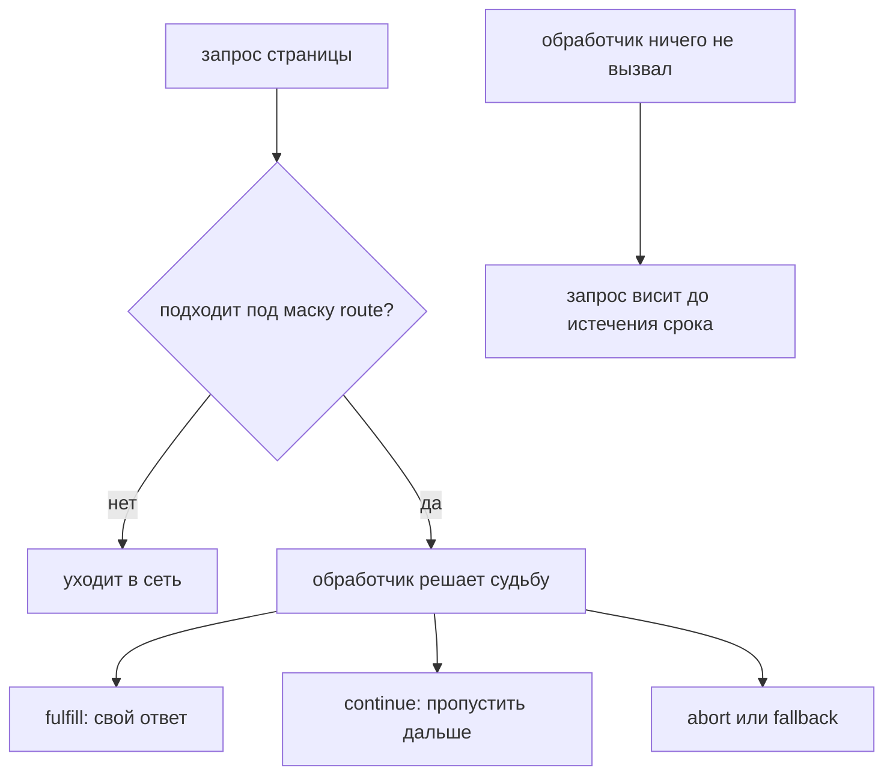

# Перехват сетевых запросов и подмена ответов

## Связь с предыдущей главой

Глава 183 показала, как синхронизироваться с событиями браузера. Сетевое взаимодействие страницы также наблюдаемо, а network interception позволяет контролировать отдельный запрос до отправки.

## Цель главы

Понять события request и response, network interception, подмену и изменение ответа, прерывание запроса и границу между UI- и API-тестом.

## Главный вопрос

Когда тесту нужно наблюдать или контролировать сетевое взаимодействие страницы?

## Мотивация

UI может зависеть от редкой ошибки backend, нестабильного внешнего сервиса или трудно создаваемого ответа. Route позволяет детерминированно передать странице нужный сетевой результат, но чрезмерный mocking способен скрыть настоящую интеграцию.

## Теория

### Наблюдение и управление — разные намерения

События `request` и `response` позволяют наблюдать фактический сетевой поток страницы. Они ничего не меняют и полезны для диагностики и проверок, где сетевой факт является частью цели.

`page.route()` или `context.route()` — это уже управление: обработчик встаёт **до** сетевой отправки подходящего запроса и решает его судьбу.

Путать эти намерения не стоит. Если задача — понять, что вообще происходит, начинают с наблюдения; подменять ответ имеет смысл только тогда, когда известно, что именно подменяется.

### Четыре способа завершить перехваченный запрос

| Метод | Что делает |
| --- | --- |
| `route.fulfill()` | возвращает подменённый ответ, до сети запрос не доходит |
| `route.continue()` | отправляет запрос дальше, возможно с изменениями |
| `route.fallback()` | передаёт запрос следующему подходящему обработчику |
| `route.abort()` | прерывает запрос |

`abort()` для приложения выглядит как сетевая ошибка: у картинки сработает `onerror`, у `fetch` — отклонённый Promise. Это и делает его удобным для проверки поведения интерфейса при недоступном ресурсе.

### Незавершённый обработчик подвешивает запрос

Пока обработчик не завершит запрос одним из четырёх способов, запрос остаётся **приостановленным**. Обработчик, который просто что-то залогировал и вышел, останавливает загрузку:

```ts
await page.route("**/api/**", (route) => {
  console.log(route.request().url());   // ошибка: route не завершён
});
```

Приложение при этом не получает ни ответа, ни ошибки — оно ждёт. Тест падает по сроку ожидания на проверке результата, и причина выглядит как «медленная серверная часть». Правильная форма наблюдения через `route` всегда заканчивается вызовом:

```ts
await page.route("**/api/**", (route) => {
  console.log(route.request().url());
  return route.continue();
});
```

Для чистого наблюдения лучше вообще не использовать `route`, а подписаться на события `request` и `response` — они запрос не задерживают.

### Порядок обработчиков: последний зарегистрированный первый

Это неочевидно и влияет на поведение. Обработчики проверяются **в обратном порядке регистрации**: зарегистрированный последним получает запрос первым. `fallback()` передаёт его следующему.

При этом обработчики `page.route()` имеют приоритет над `context.route()`: сначала отрабатывают все подходящие обработчики страницы, и только если все они вызвали `fallback()`, запрос доходит до обработчиков контекста.

Практический вывод: перекрывающиеся маски создают неявный порядок. Чем уже маска, тем меньше шансов, что два обработчика будут спорить за один запрос.

### Маска должна быть узкой

Маска `**/*` ловит вообще всё: документ, стили, картинки, шрифты, аналитику. Проверено на простой странице — перехватываются `/`, `/app.css`, `/logo.png`, хотя сценарий касался только данных.

Последствия предсказуемы: случайно подменённая или прерванная статика ломает страницу способом, не связанным с проверяемым поведением, а расследование уходит в сторону.

Маску пишут по конкретному ресурсу — `**/api/v1/work-items*`, — и ограничивают область действия перехватчика тем участком сценария, где он нужен.

### Подмена — это модель, а не истина о серверной части

Подмена должна быть минимальной и соответствовать проверяемому контракту. Тест интерфейса с подменённым ответом проверяет реакцию интерфейса на известный ответ, но не доказывает работоспособность реальной серверной части.

Отсюда рабочее разделение:

- **подмена уместна** для редких и труднодостижимых состояний: пустой список, ошибка сервера, медленный ответ, недоступный необязательный ресурс;
- **подмена неуместна** для критических успешных сценариев: они должны проходить с реальной серверной частью в подходящем наборе тестов.

Опасность подменённого ответа в том, что он устаревает молча. Если контракт изменился, а фикстура осталась прежней, тест продолжает проходить и подтверждает поведение, которого в реальности уже нет.

### Проверка остаётся о пользователе

Сетевая подготовка — это подготовка, а не результат. Проверять стоит то, что увидел пользователь: появившееся сообщение об ошибке, пустое состояние списка, доступность повторной попытки.

Проверка внутреннего запроса без связи с пользовательским результатом даёт тест, который ломается при любом изменении реализации и ничего не говорит о поведении продукта. Перехват остаётся частью теста интерфейса и не заменяет клиент API, контрактное тестирование или отдельную стратегию REST, которые начинаются со следующего модуля.

Перехваченный запрос обязан быть завершён:


```mermaid
flowchart TD
    A["запрос страницы"] --> B{"подходит под маску route?"}
    B -- "нет" --> C["уходит в сеть"]
    B -- "да" --> D["обработчик решает судьбу"]
    D --> E["fulfill: свой ответ"]
    D --> F["continue: пропустить дальше"]
    D --> G["abort или fallback"]
    H["обработчик ничего не вызвал"] --> I["запрос висит до истечения срока"]
```

## Внутренний механизм

Обработчик `route` выполняется до сетевой отправки подходящего запроса. Пока обработчик не завершит запрос через `fulfill`, `continue`, `fallback` или `abort`, запрос остаётся приостановленным. Слишком широкая маска может перехватить ресурсы, не относящиеся к сценарию.

### Порядок обработчиков обратный регистрации

```text
зарегистрировали: A (context.route), B (page.route), C (page.route)
проверяются:      C → B → A
```

Последний зарегистрированный обработчик получает запрос первым, а обработчики
страницы имеют приоритет над обработчиками контекста. Поэтому подмена,
добавленная внутри теста, перекрывает общую подмену из фикстуры — и это работает
в нужную сторону.

`fallback()` передаёт запрос следующему обработчику в этой очереди, `continue()`
отправляет его в сеть сразу, минуя остальных.

### Запрос приостановлен, пока обработчик молчит

```text
запрос → подходит под маску → обработчик выполняется
                             ├─ fulfill / continue / abort → судьба решена
                             └─ ничего не вызвано → запрос висит до таймаута
```

Обработчик — не наблюдатель, а звено: запрос физически остановлен на время его
работы. Асинхронный обработчик, забывший завершить запрос, подвешивает загрузку
страницы.

Про маску стоит помнить, что `**/*` ловит вообще всё: стили, шрифты и картинки
тоже. Страница при этом отрисовывается не так, как у пользователя, и проверки
начинают падать по причинам, не связанным со сценарием.

```text
examples/03-automation-qa/chapter-184/01-network-control.ui.ts
```

Пример полностью локален: обращения к `book.test` перехватываются до внешней сети. Отдельные тесты демонстрируют наблюдение, изменение и прерывание запроса.

## Главная ментальная модель

Перехват — контролируемая граница между страницей и сетевым транспортом: тест либо наблюдает запрос, либо явно решает его судьбу.

## Практические примеры

Подменённый ответ воспроизводит пустой список или ошибку. Изменение запроса добавляет тестовый заголовок. Прерывание проверяет UI-поведение при недоступном необязательном ресурсе.

## Automation QA

Контроль сети полезен для редких состояний интерфейса и изоляции внешних интеграций. Критические успешные сценарии должны также проходить с реальной серверной частью в подходящем наборе тестов.

## Концептуальные границы и компромиссы

Перехват остаётся частью теста интерфейса. Он не заменяет клиент API, контрактное тестирование или отдельную стратегию REST, которые начинаются со следующего модуля.

## Распространённые мифы

**Миф: обработчик `route` можно использовать просто для записи в журнал.**
Незавершённый перехват подвешивает запрос. Для наблюдения есть события `request` и `response`.

**Миф: обработчики `route` срабатывают в порядке регистрации.**
Порядок обратный: последний зарегистрированный проверяется первым, а `page.route()` имеет приоритет над `context.route()`.

**Миф: широкая маска безопасна, лишнее просто пройдёт мимо.**
Она перехватывает стили, картинки и шрифты. Случайно подменённая статика ломает страницу не по теме теста.

**Миф: зелёный тест с подменой доказывает работу серверной части.**
Он доказывает реакцию интерфейса на заданный ответ. Реальная серверная часть проверяется отдельно.

**Миф: подменённый ответ не требует сопровождения.**
Он устаревает молча: контракт изменился, фикстура осталась, тест продолжает проходить.

## Частые вопросы

**Когда подмена действительно оправдана?**
Для состояний, которые трудно получить честно: ошибка сервера, пустой список, недоступный внешний сервис, медленный ответ.

**Как посмотреть сетевой поток, ничего не меняя?**
Подписаться на события `request` и `response`. Они не задерживают запросы и не требуют завершения.

**Почему приложение «зависло» после добавления перехватчика?**
Скорее всего, обработчик не вызвал `fulfill`, `continue`, `fallback` или `abort`.

**Что вернуть в подменённом ответе?**
Минимум, соответствующий реальному контракту. Лишние выдуманные поля создают ложное представление о формате.

**Чем `abort()` отличается от `fulfill()` с кодом ошибки?**
`abort()` — сетевой сбой без ответа, `fulfill()` с кодом 500 — полученный ответ с ошибкой. Интерфейс может реагировать на них по-разному, и выбирать нужно осознанно.

## Распространённые ошибки

- Перехватывать все запросы слишком широкой маской — маска вида `**/*` ловит и стили, и картинки, поэтому страница перестаёт отображаться так, как у пользователя.

- Возвращать подменённый ответ, не соответствующий реальному контракту — тест начинает проверять выдуманные данные и остаётся зелёным после того, как настоящий сервис изменил формат.

- Забывать завершить обработку перехваченного запроса — обработчик без `fulfill()`, `continue()` или `fallback()` подвешивает запрос, и страница ждёт его до таймаута.

- Считать тест интерфейса с подменой интеграционной проверкой серверной части — при подмене сервер не участвует вовсе. Такой тест проверяет только поведение клиента.

- Проверять внутренний запрос без связи с пользовательским результатом — факт отправки запроса не означает, что пользователь увидел результат. Проверку доводят до состояния интерфейса.

- Оставлять перехватчик активным для несвязанных шагов — он продолжает действовать до конца контекста и меняет ответы там, где тест этого не ожидает. Обработчики проверяются в обратном порядке регистрации, и `page.route` имеет приоритет над `context.route`.

## Краткие итоги

- События `request` и `response` позволяют наблюдать сетевой поток.
- `route` управляет подходящим запросом до отправки.
- `fulfill`, изменение и `abort` решают разные задачи.
- Тест интерфейса с подменой не проверяет реальную серверную часть.
- Область перехвата должна быть узкой и понятной.

## Что нужно запомнить

- Каждый перехваченный запрос должен быть завершён.
- Подмена является частью модели теста, а не истиной о серверной части.
- Наблюдение и управление — разные намерения.
- Проверка UI должна оставаться связанной с сетевой подготовкой.
- API-тестирование принадлежит следующему модулю.

## Быстрая проверка

1. Чем событие отличается от перехвата?
2. Когда использовать `fulfill()`?
3. Что делает `abort()`?
4. Почему широкая маска перехвата опасна?
5. Что не доказывает UI-тест с подменой?

### Ответы

1. Событие только сообщает о запросе или ответе и ни на что не влияет. Маршрут перехватывает запрос и решает его судьбу.
2. Когда нужно ответить заранее заданными данными, не обращаясь к серверу, — чтобы воспроизвести редкое состояние.
3. Прерывает запрос: приложение получает сетевую ошибку. Так проверяют поведение при недоступном сервисе.
4. Она перехватывает и посторонние запросы: статику, аналитику, служебные обращения. Тест начинает проверять не то, а падения становятся необъяснимыми.
5. Что сервер действительно возвращает такие данные. Проверен только интерфейс на заданном ответе.

## Практика

```text
practice/03-automation-qa/184-network-interception-and-mocking.md
```

## Переход к следующей главе

Мы изучили основные браузерные сценарии слоя интерфейса. Глава 185 соединит фикстуры, состояние аутентификации, объекты страниц и объекты компонентов в проверяемый поток зависимостей.
