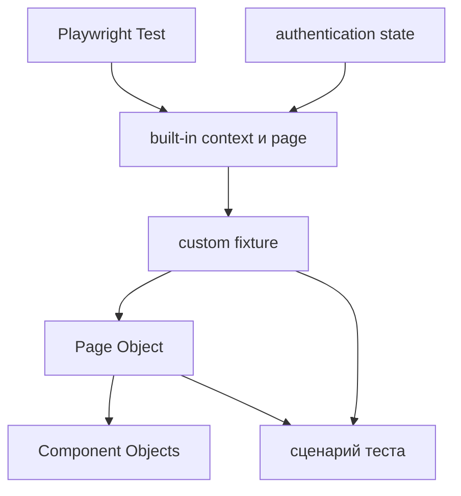

# Интеграция UI-слоя

## Связь с предыдущей главой

Главы 176–184 дали отдельные механизмы: fixtures управляют жизненным циклом, authentication state подготавливает сессию, Page Objects и Component Objects задают UI-границы, а браузерные API обслуживают специальные сценарии. Теперь важно соединить их без скрытых зависимостей.

## Цель главы

Собрать единый поток зависимостей UI-слоя и сформулировать критерии проверки владения ресурсами, аутентификации и читаемости теста.

## Главный вопрос

Как fixtures, Page Objects, components и browser state образуют единый UI-слой?

## Мотивация

Наличие правильных классов и fixtures не гарантирует поддерживаемую архитектуру. Циклические зависимости, общее изменяемое состояние и скрытые шаги бизнес-сценария могут сделать тесты сложнее исходного процедурного кода.

## Теория

Поток зависимостей начинается с Playwright Test. Built-in fixtures предоставляют браузерные ресурсы. Custom fixtures подготавливают управляемые проектные значения и создают Page Objects. Page Objects компонуют Component Objects. Тест получает готовую границу, выполняет бизнес-действия и оставляет ключевые проверки видимыми.

Authentication state является входными данными для свежего контекста, а не глобальной Page. Page Objects и Component Objects принадлежат test scope, если используют test-scoped `page`. Очистка остаётся у fixture или теста, создавшего ресурс.



## Внутренний механизм

Playwright Test разрешает граф fixtures перед телом теста. Page Object не имеет отдельного жизненного цикла: он живёт столько же, сколько fixture, которая его создала, и использует её `page`. Component Object разделяет время жизни владельца, но ограничивает только свою DOM-область.

```text
examples/03-automation-qa/chapter-185/01-integrated-ui-layer.ui.ts
```

Архитектурная проверка оценивает направление зависимостей, владение ресурсами, отсутствие общего изменяемого состояния, ясность публичных методов и видимость смысла бизнес-сценария в тесте.

## Главная ментальная модель

UI-слой — направленная цепочка управляемых зависимостей; тест находится на вершине пользовательского смысла, а детали работы с браузером остаются ниже.

## Практические примеры

Fixture создаёт `OrdersPage` из test-scoped `page` и значения роли. `OrdersPage` содержит `HeaderComponent`. Тест вызывает бизнес-действие и проверяет наблюдаемый результат через публичную границу объекта.

## Automation QA

Такой UI-слой позволяет добавлять сценарии без копирования селекторов и setup. При падении инженер может пройти поток зависимостей сверху вниз и найти владельца каждого состояния или ресурса.

## Концептуальные границы и компромиссы

Не существует единственной универсальной структуры папок. Важнее направление зависимостей и владение ресурсами. Маленькому набору не нужна сложная иерархия fixtures, а большой проект не должен превращать fixtures в скрытый сценарий.

## Распространённые ошибки

- Создавать Page Object как глобальный singleton.
- Передавать test-scoped `page` в worker fixture.
- Делать Component Objects зависимыми от тестового раннера.
- Скрывать все проверки в UI-слое.
- Создавать циклические зависимости fixtures.
- Оценивать архитектуру только по количеству классов.

## Критерии архитектурной проверки

- У каждого ресурса есть владелец подготовки и очистки.
- Поток зависимостей направлен от тестового раннера к сценарию теста без циклов.
- Page Objects выражают страницы, Component Objects — ограниченные компоненты интерфейса.
- Authentication state не создаёт общую изменяемую Page.
- Ключевые бизнес-действия и проверки читаются из тела теста.
- Абстракции уменьшают реальное дублирование или сложность.

## Краткие итоги

- Fixtures управляют созданием и временем жизни зависимостей.
- Page Objects скрывают детали страниц.
- Component Objects задают переиспользуемые UI-границы.
- Authentication state и браузерный контекст должны сохранять изоляцию.
- Архитектурная проверка оценивает владение, поток зависимостей и читаемость.

## Что нужно запомнить

- Архитектура начинается с зависимостей, а не папок.
- Test scope определяет время жизни UI-объектов.
- Смысл бизнес-сценария должен оставаться видимым.
- Общее изменяемое состояние разрушает изоляцию.
- Абстракция оправдана только решаемой проблемой.

## Quick Check

1. Кто создаёт Page Object с test scope?
2. Какое время жизни имеет его Component Object?
3. Где находится authentication state в потоке зависимостей?
4. Что оценивает архитектурная проверка?
5. Почему количество классов не является метрикой качества?

## Практика

```text
practice/03-automation-qa/185-ui-layer-integration.md
```

## Переход к следующей главе

UI-слой завершён. Глава 186 начнёт отдельный модуль и разберёт свойства HTTP и REST, которые определяют поведение API-теста.
