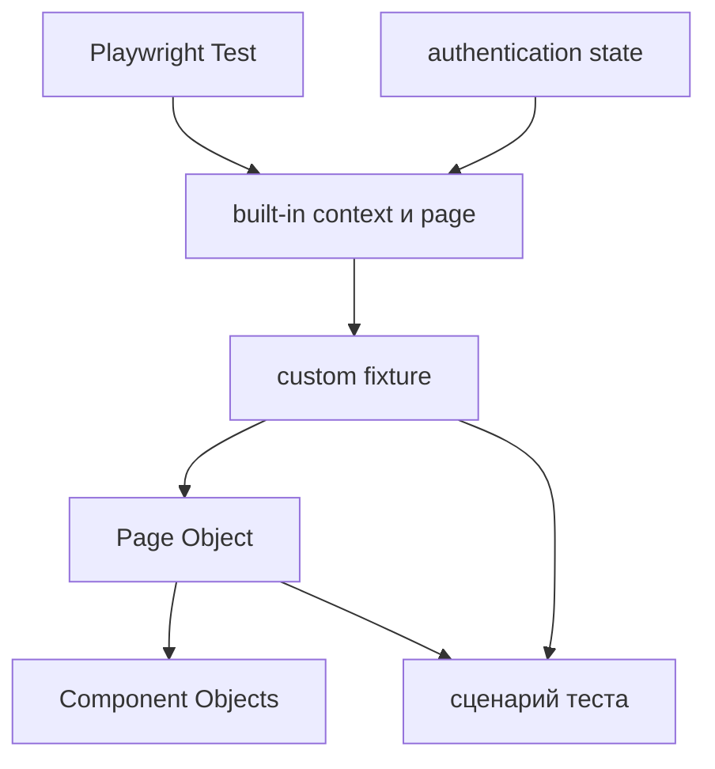

# Интеграция UI-слоя

## Связь с предыдущей главой

Главы 176–184 дали отдельные механизмы: fixtures управляют жизненным циклом, authentication state подготавливает сессию, Page Objects и Component Objects задают UI-границы, а браузерные API обслуживают специальные сценарии. Теперь важно соединить их без скрытых зависимостей.

## Цель главы

Собрать единый поток зависимостей UI-слоя и сформулировать критерии проверки владения ресурсами, аутентификации и читаемости теста.

## Главный вопрос

Как fixtures, Page Objects, components и browser state образуют единый UI-слой?

## Мотивация

Наличие правильных классов и fixtures не гарантирует поддерживаемую архитектуру. Циклические зависимости, общее изменяемое состояние и скрытые шаги бизнес-сценария могут сделать тесты сложнее исходного процедурного кода.

## Теория

### Поток зависимостей сверху вниз

Поток зависимостей начинается с Playwright Test. Built-in fixtures предоставляют браузерные ресурсы. Custom fixtures подготавливают управляемые проектные значения и создают Page Objects. Page Objects компонуют Component Objects. Тест получает готовую границу, выполняет бизнес-действия и оставляет ключевые проверки видимыми.



Направление здесь важнее состава. Каждый уровень знает только о нижележащем: Page Object не знает о тестовом раннере, Component Object не знает о Page Object, который его создал.

### Время жизни определяется fixture, а не объектом

Playwright Test разрешает граф fixtures перед телом теста. Page Object не имеет отдельного жизненного цикла: он живёт столько же, сколько fixture, которая его создала, и использует её `page`.

Component Object разделяет время жизни владельца, но ограничивает только свою DOM-область.

Отсюда строгое следствие: объект, построенный на test-scoped `page`, сам принадлежит test scope. Передать его в worker fixture нельзя — он переживёт свою страницу и станет ссылкой на закрытый ресурс.

| Область | Что в ней уместно |
| --- | --- |
| worker scope | дорогие неизменяемые ресурсы: клиент, конфигурация, справочные данные |
| test scope | всё, что использует `page`: Page Objects, Component Objects, данные теста |

### Authentication state — вход в граф, а не общий объект

Состояние авторизации является входными данными для свежего контекста, а не глобальной `Page`.

Разница принципиальна. Общая авторизованная страница на несколько тестов — это общее изменяемое состояние: любой тест может увести её на другой адрес или изменить данные пользователя. Сохранённое состояние, загружаемое в новый контекст, таким свойством не обладает: каждый тест получает свою копию сессии.

### У каждого ресурса есть владелец

Очистка остаётся у fixture или теста, создавшего ресурс. Это правило распространяется на всё: браузерный контекст, тестовые данные на стенде, скачанные файлы, дополнительные вкладки.

Признак нарушения простой: если на вопрос «кто это уберёт?» нет однозначного ответа, ресурс не убирается вообще.

### Абстракция оправдывается задачей, а не количеством

Не существует единственной универсальной структуры папок. Важнее направление зависимостей и владение ресурсами.

Маленькому набору не нужна сложная иерархия fixtures: три теста с одним Page Object работают лучше, чем три уровня абстракции над ними. Большой проект, наоборот, не должен превращать fixtures в скрытый сценарий, где подготовка делает больше, чем видно из теста.

Полезный вопрос при добавлении слоя: какую конкретную проблему он убирает — дублирование селекторов, повторяющуюся подготовку, сложность сценария? Если ответа нет, слой добавлять рано.

### Смысл сценария остаётся в тесте

Даже при развитом UI-слое тело теста должно читаться как бизнес-сценарий: какой пользователь, что делает, какой результат ожидается.

Признаки того, что смысл утёк вниз:

- из теста не видно, какие данные ему нужны;
- все проверки спрятаны в методах Page Object, а в тесте остались только действия;
- чтобы понять сценарий, приходится открывать три файла.

Page Object скрывает **как** выполняется действие, но не **что** проверяется. Ключевые проверки остаются видимыми в тесте — именно они объясняют, зачем он существует.

### Как читать падение через слои

Ценность выстроенного потока проявляется при расследовании: по нему можно идти сверху вниз и на каждом шаге задавать один вопрос — кто владеет этим состоянием.

Упал тест → какие fixtures он запросил → что каждая из них подготовила → какой Page Object использовал → какой Component Object ограничивал область поиска. Цепочка конечна и не имеет циклов, поэтому расследование сходится.

Циклические зависимости fixtures ломают именно это свойство: граф перестаёт быть направленным, и вопрос «кто владеет» теряет ответ.

## Внутренний механизм

Playwright Test разрешает граф fixtures перед телом теста. Page Object не имеет отдельного жизненного цикла: он живёт столько же, сколько fixture, которая его создала, и использует её `page`. Component Object разделяет время жизни владельца, но ограничивает только свою DOM-область.

```text
examples/03-automation-qa/chapter-185/01-integrated-ui-layer.ui.ts
```

Архитектурная проверка оценивает направление зависимостей, владение ресурсами, отсутствие общего изменяемого состояния, ясность публичных методов и видимость смысла бизнес-сценария в тесте.

## Главная ментальная модель

UI-слой — направленная цепочка управляемых зависимостей; тест находится на вершине пользовательского смысла, а детали работы с браузером остаются ниже.

## Практические примеры

Fixture создаёт `OrdersPage` из test-scoped `page` и значения роли. `OrdersPage` содержит `HeaderComponent`. Тест вызывает бизнес-действие и проверяет наблюдаемый результат через публичную границу объекта.

## Automation QA

Такой UI-слой позволяет добавлять сценарии без копирования селекторов и setup. При падении инженер может пройти поток зависимостей сверху вниз и найти владельца каждого состояния или ресурса.

## Концептуальные границы и компромиссы

Не существует единственной универсальной структуры папок. Важнее направление зависимостей и владение ресурсами. Маленькому набору не нужна сложная иерархия fixtures, а большой проект не должен превращать fixtures в скрытый сценарий.

## Распространённые мифы

**Миф: архитектура UI-слоя — это структура папок.**
Папки вторичны. Архитектуру задают направление зависимостей и владение ресурсами.

**Миф: Page Object удобно сделать одним общим объектом на набор.**
Это общее изменяемое состояние. Объект, построенный на test-scoped `page`, принадлежит тесту.

**Миф: чем больше классов, тем лучше архитектура.**
Слой оправдан решаемой проблемой. Абстракция без проблемы добавляет стоимость чтения и ничего не убирает.

**Миф: все проверки стоит убрать в Page Object ради краткости теста.**
Page Object скрывает механику действия, а не смысл проверки. Ключевые проверки остаются видимыми.

**Миф: authentication state можно держать как общую авторизованную страницу.**
Тогда тесты делят изменяемую `Page`. Состояние загружают в свежий контекст для каждого теста.

## Частые вопросы

**Что нельзя передавать в worker fixture?**
Всё, что построено на test-scoped `page`: Page Objects, Component Objects, локаторы. Они переживут свою страницу.

**Когда пора вводить Component Object?**
Когда один и тот же участок интерфейса используется на нескольких страницах или его внутренняя структура мешает читать Page Object.

**Как понять, что fixture стала скрытым сценарием?**
Если из теста не видно, какие данные и какой пользователь ему нужны, существенное условие спрятано в подготовке.

**Что делать при циклической зависимости fixtures?**
Выделить общую часть в отдельную fixture. Цикл означает, что две сущности претендуют на одну ответственность.

**С чего начинать расследование падения в развитом UI-слое?**
Сверху вниз по запрошенным fixtures, задавая на каждом уровне вопрос о владельце состояния.

## Распространённые ошибки

- Создавать Page Object как глобальный singleton.
- Передавать test-scoped `page` в worker fixture.
- Делать Component Objects зависимыми от тестового раннера.
- Скрывать все проверки в UI-слое.
- Создавать циклические зависимости fixtures.
- Оценивать архитектуру только по количеству классов.

## Критерии архитектурной проверки

- У каждого ресурса есть владелец подготовки и очистки.
- Поток зависимостей направлен от тестового раннера к сценарию теста без циклов.
- Page Objects выражают страницы, Component Objects — ограниченные компоненты интерфейса.
- Authentication state не создаёт общую изменяемую Page.
- Ключевые бизнес-действия и проверки читаются из тела теста.
- Абстракции уменьшают реальное дублирование или сложность.

## Краткие итоги

- Fixtures управляют созданием и временем жизни зависимостей.
- Page Objects скрывают детали страниц.
- Component Objects задают переиспользуемые UI-границы.
- Authentication state и браузерный контекст должны сохранять изоляцию.
- Архитектурная проверка оценивает владение, поток зависимостей и читаемость.

## Что нужно запомнить

- Архитектура начинается с зависимостей, а не папок.
- Test scope определяет время жизни UI-объектов.
- Смысл бизнес-сценария должен оставаться видимым.
- Общее изменяемое состояние разрушает изоляцию.
- Абстракция оправдана только решаемой проблемой.

## Quick Check

1. Кто создаёт Page Object с test scope?
2. Какое время жизни имеет его Component Object?
3. Где находится authentication state в потоке зависимостей?
4. Что оценивает архитектурная проверка?
5. Почему количество классов не является метрикой качества?

## Практика

```text
practice/03-automation-qa/185-ui-layer-integration.md
```

## Переход к следующей главе

UI-слой завершён. Глава 186 начнёт отдельный модуль и разберёт свойства HTTP и REST, которые определяют поведение API-теста.
