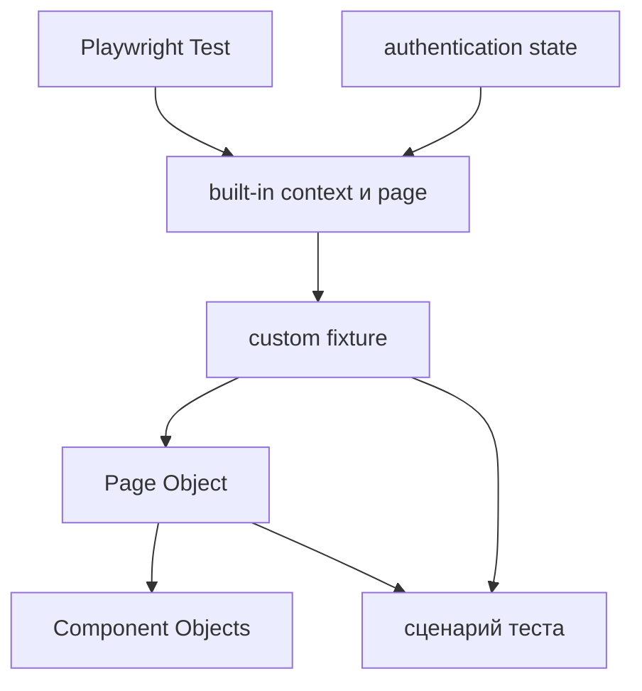

# Интеграция UI-слоя

## Связь с предыдущей главой

Главы 176–184 дали отдельные механизмы: fixtures управляют жизненным циклом, authentication state подготавливает сессию, Page Objects и Component Objects задают UI-границы, а браузерные API обслуживают специальные сценарии. Теперь важно соединить их без скрытых зависимостей.

## Цель главы

Собрать единый поток зависимостей UI-слоя и сформулировать критерии проверки владения ресурсами, аутентификации и читаемости теста.

## Главный вопрос

Как фикстуры, объекты страниц, компоненты и состояние браузера образуют единый слой интерфейса?

## Мотивация

Наличие правильных классов и fixtures не гарантирует поддерживаемую архитектуру. Циклические зависимости, общее изменяемое состояние и скрытые шаги бизнес-сценария могут сделать тесты сложнее исходного процедурного кода.

## Теория

### Поток зависимостей сверху вниз

Поток зависимостей начинается с Playwright Test. Встроенные фикстуры предоставляют браузерные ресурсы. Собственные фикстуры подготавливают управляемые проектные значения и создают объекты страниц. Объекты страниц компонуют объекты компонентов. Тест получает готовую границу, выполняет бизнес-действия и оставляет ключевые проверки видимыми.


```mermaid
flowchart TD
    A[Playwright Test] --> C[built-in context и page]
    B[authentication state] --> C
    C --> D[custom fixture]
    D --> E[Page Object]
    E --> F[Component Objects]
    D --> G[сценарий теста]
    E --> G
```

Направление здесь важнее состава. Каждый уровень знает только о нижележащем: объект страницы не знает о раннере, объект компонента не знает об объекте страницы, который его создал.

### Время жизни определяется фикстурой, а не объектом

Playwright Test разрешает граф фикстур перед телом теста. Объект страницы не имеет отдельного жизненного цикла: он живёт столько же, сколько фикстура, которая его создала, и использует её `page`.

Объект компонента разделяет время жизни владельца, но ограничивает только свою область DOM.

Отсюда строгое следствие: объект, построенный на странице в пределах теста, сам принадлежит области теста. Передать его в фикстуру рабочего процесса нельзя — он переживёт свою страницу и станет ссылкой на закрытый ресурс.

| Область | Что в ней уместно |
| --- | --- |
| область рабочего процесса | дорогие неизменяемые ресурсы: клиент, конфигурация, справочные данные |
| область теста | всё, что использует `page`: объекты страниц, объекты компонентов, данные теста |

### Состояние аутентификации — вход в граф, а не общий объект

Состояние авторизации является входными данными для свежего контекста, а не глобальной `Page`.

Разница принципиальна. Общая авторизованная страница на несколько тестов — это общее изменяемое состояние: любой тест может увести её на другой адрес или изменить данные пользователя. Сохранённое состояние, загружаемое в новый контекст, таким свойством не обладает: каждый тест получает свою копию сессии.

### У каждого ресурса есть владелец

Очистка остаётся у фикстуры или теста, создавшего ресурс. Это правило распространяется на всё: браузерный контекст, тестовые данные на стенде, скачанные файлы, дополнительные вкладки.

Признак нарушения простой: если на вопрос «кто это уберёт?» нет однозначного ответа, ресурс не убирается вообще.

### Абстракция оправдывается задачей, а не количеством

Не существует единственной универсальной структуры папок. Важнее направление зависимостей и владение ресурсами.

Маленькому набору не нужна сложная иерархия фикстур: три теста с одним объектом страницы работают лучше, чем три уровня абстракции над ними. Большой проект, наоборот, не должен превращать фикстуры в скрытый сценарий, где подготовка делает больше, чем видно из теста.

Полезный вопрос при добавлении слоя: какую конкретную проблему он убирает — дублирование селекторов, повторяющуюся подготовку, сложность сценария? Если ответа нет, слой добавлять рано.

### Смысл сценария остаётся в тесте

Даже при развитом UI-слое тело теста должно читаться как бизнес-сценарий: какой пользователь, что делает, какой результат ожидается.

Признаки того, что смысл утёк вниз:

- из теста не видно, какие данные ему нужны;
- все проверки спрятаны в методах объекта страницы, а в тесте остались только действия;
- чтобы понять сценарий, приходится открывать три файла.

Объект страницы скрывает **как** выполняется действие, но не **что** проверяется. Ключевые проверки остаются видимыми в тесте — именно они объясняют, зачем он существует.

### Как читать падение через слои

Ценность выстроенного потока проявляется при расследовании: по нему можно идти сверху вниз и на каждом шаге задавать один вопрос — кто владеет этим состоянием.

Упал тест → какие фикстуры он запросил → что каждая из них подготовила → какой объект страницы использовал → какой объект компонента ограничивал область поиска. Цепочка конечна и не имеет циклов, поэтому расследование сходится.

Циклические зависимости фикстур ломают именно это свойство: граф перестаёт быть направленным, и вопрос «кто владеет» теряет ответ.

## Внутренний механизм

Playwright Test разрешает граф фикстур перед телом теста. Объект страницы не имеет отдельного жизненного цикла: он живёт столько же, сколько фикстура, которая его создала, и использует её `page`. Объект компонента разделяет время жизни владельца, но ограничивает только свою область DOM.

### Время жизни идёт сверху вниз

```text
рабочий процесс │ browser
тест            │   context → page → объект страницы → объект компонента
                │                                         └ корневой локатор
```

Ни объект страницы, ни объект компонента не имеют собственного жизненного цикла:
они живут ровно столько, сколько живёт `page`, из которой созданы. Поэтому
единственное безопасное место их создания — фикстура теста.

Сохранённый в переменной модуля объект переживёт свой тест и при следующем
обращении даст ошибку о закрытом контексте — причём в другом тесте, что делает
причину неочевидной.

### Почему цикл в графе ломает расследование

Граф фикстур разрешается перед телом теста и обязан быть направленным.
Направленность даёт то самое свойство, ради которого выстраивают слои: на вопрос
«кто владеет этим состоянием» всегда есть ровно один ответ.

```text
тест → фикстура сценария → фикстура клиента → фикстура конфигурации
```

Цикл превращает цепочку в кольцо: раннер сообщает о нём вместо запуска теста, а
если цикл возник на уровне импортов модулей, то ещё хуже — модуль получит
недоинициализированное значение, и падение случится далеко от причины.

```text
examples/03-automation-qa/chapter-185/01-integrated-ui-layer.ui.ts
```

Архитектурная проверка оценивает направление зависимостей, владение ресурсами, отсутствие общего изменяемого состояния, ясность публичных методов и видимость смысла бизнес-сценария в тесте.

## Главная ментальная модель

UI-слой — направленная цепочка управляемых зависимостей; тест находится на вершине пользовательского смысла, а детали работы с браузером остаются ниже.

## Практические примеры

Фикстура создаёт `OrdersPage` из страницы в пределах теста и значения роли. `OrdersPage` содержит `HeaderComponent`. Тест вызывает бизнес-действие и проверяет наблюдаемый результат через публичную границу объекта.

## Automation QA

Такой слой интерфейса позволяет добавлять сценарии без копирования селекторов и подготовки. При падении инженер может пройти поток зависимостей сверху вниз и найти владельца каждого состояния или ресурса.

## Концептуальные границы и компромиссы

Не существует единственной универсальной структуры папок. Важнее направление зависимостей и владение ресурсами. Маленькому набору не нужна сложная иерархия фикстур, а большой проект не должен превращать фикстуры в скрытый сценарий.

## Распространённые мифы

**Миф: архитектура UI-слоя — это структура папок.**
Папки вторичны. Архитектуру задают направление зависимостей и владение ресурсами.

**Миф: объект страницы удобно сделать одним общим объектом на набор.**
Это общее изменяемое состояние. Объект, построенный на странице в пределах теста, принадлежит тесту.

**Миф: чем больше классов, тем лучше архитектура.**
Слой оправдан решаемой проблемой. Абстракция без проблемы добавляет стоимость чтения и ничего не убирает.

**Миф: все проверки стоит убрать в объект страницы ради краткости теста.**
Объект страницы скрывает механику действия, а не смысл проверки. Ключевые проверки остаются видимыми.

**Миф: состояние аутентификации можно держать как общую авторизованную страницу.**
Тогда тесты делят изменяемую `Page`. Состояние загружают в свежий контекст для каждого теста.

## Частые вопросы

**Что нельзя передавать в фикстуру рабочего процесса?**
Всё, что построено на странице в пределах теста: объекты страниц, объекты компонентов, локаторы. Они переживут свою страницу.

**Когда пора вводить объект компонента?**
Когда один и тот же участок интерфейса используется на нескольких страницах или его внутренняя структура мешает читать объект страницы.

**Как понять, что фикстура стала скрытым сценарием?**
Если из теста не видно, какие данные и какой пользователь ему нужны, существенное условие спрятано в подготовке.

**Что делать при циклической зависимости фикстур?**
Выделить общую часть в отдельную фикстуру. Цикл означает, что две сущности претендуют на одну ответственность.

**С чего начинать расследование падения в развитом UI-слое?**
Сверху вниз по запрошенным фикстурам, задавая на каждом уровне вопрос о владельце состояния.

## Распространённые ошибки

- Создавать объект страницы как единственный общий экземпляр на весь набор — объект хранит `page` конкретного теста, а после теста она закрыта: следующий тест получит ошибку о закрытом контексте.

- Передавать страницу в пределах теста в фикстуру рабочего процесса — фикстура процесса живёт дольше теста и переживает закрытие страницы. Такая ссылка становится недействительной.

- Делать объекты компонентов зависимыми от раннера — импорт `test` внутрь объекта страницы связывает UI-слой с конкретным инструментом запуска и мешает использовать его из подготовки данных.

- Скрывать все проверки в UI-слое — тест перестаёт сообщать, что именно он утверждает, а отчёт указывает на файл объекта страницы вместо проверяемого поведения.

- Создавать циклические зависимости фикстур — граф перестаёт разрешаться, и раннер сообщает о цикле вместо запуска теста.

- Оценивать архитектуру только по количеству классов — качество границы видно по тому, что происходит при изменении разметки: правится один объект страницы или десяток тестов.

## Критерии архитектурной проверки

- У каждого ресурса есть владелец подготовки и очистки.
- Поток зависимостей направлен от тестового раннера к сценарию теста без циклов.
- Объекты страниц выражают страницы, объекты компонентов — ограниченные компоненты интерфейса.
- Состояние аутентификации не создаёт общую изменяемую страницу.
- Ключевые бизнес-действия и проверки читаются из тела теста.
- Абстракции уменьшают реальное дублирование или сложность.

## Краткие итоги

- Фикстуры управляют созданием и временем жизни зависимостей.
- Объекты страниц скрывают детали страниц.
- Объекты компонентов задают переиспользуемые границы интерфейса.
- Состояние аутентификации и браузерный контекст должны сохранять изоляцию.
- Архитектурная проверка оценивает владение, поток зависимостей и читаемость.

## Что нужно запомнить

- Архитектура начинается с зависимостей, а не папок.
- Область теста определяет время жизни объектов интерфейса.
- Смысл бизнес-сценария должен оставаться видимым.
- Общее изменяемое состояние разрушает изоляцию.
- Абстракция оправдана только решаемой проблемой.

## Быстрая проверка

1. Кто создаёт объект страницы на время теста?
2. Какое время жизни имеет его объект компонента?
3. Где находится состояние аутентификации в потоке зависимостей?
4. Что оценивает архитектурная проверка?
5. Почему количество классов не является метрикой качества?

### Ответы

1. Фикстура с областью теста: объект создаётся для каждого теста и получает свою страницу.
2. То же, что у страницы, внутри которой он создан: он живёт, пока жив объект страницы.
3. Перед тестами: состояние готовится отдельным шагом и передаётся в контекст, из которого создаётся страница.
4. Направление зависимостей и то, можно ли заменить слой, не трогая остальные. Тест зависит от страниц, страницы — от Playwright, обратных связей быть не должно.
5. Классы можно наплодить и не уменьшив дублирования. Качество видно по тому, насколько дёшево добавить сценарий и насколько понятно падение.

## Практика

```text
practice/03-automation-qa/185-ui-layer-integration.md
```

## Переход к следующей главе

UI-слой завершён. Глава 186 начнёт отдельный модуль и разберёт свойства HTTP и REST, которые определяют поведение API-теста.
