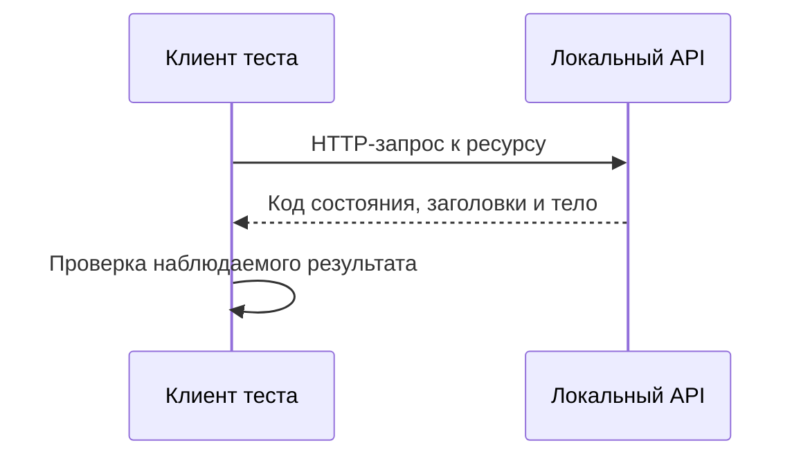

# HTTP и REST для API-тестирования

## Связь с предыдущей главой

Главы 176–185 завершили UI-слой: тест взаимодействовал с системой через браузер. Теперь мы переходим на другую границу и обращаемся к серверу напрямую через HTTP.

## Цель главы

Разделить HTTP как протокол, REST как архитектурный стиль и API-тест как проверку наблюдаемого поведения сервера.

## Главный вопрос

Какие свойства HTTP и REST определяют поведение API-теста?

## Мотивация

UI-тест показывает поведение системы глазами пользователя, но подготовка данных и проверка серверных правил через интерфейс часто медленны. API-тест отправляет запрос непосредственно серверу и получает ответ без браузерных действий.

## Теория

HTTP — протокол прикладного уровня, который описывает обмен сообщениями между клиентом и сервером. Клиент выбирает метод и URL, добавляет заголовки и при необходимости тело. Сервер обрабатывает сообщение и возвращает код состояния, заголовки и тело ответа.

REST не является отдельным протоколом. Это архитектурный стиль, в котором взаимодействие строится вокруг ресурсов и их представлений. JSON-over-HTTP API может использовать идеи REST, не реализуя все ограничения строго.

Ресурс — сущность, к которой обращается клиент: задача, пользователь или отчёт. URL идентифицирует ресурс или коллекцию, а HTTP method выражает намерение операции. Название маршрута само по себе не является требованием протокола.



## Внутренний механизм

HTTP-взаимодействие не хранит сценарий теста между запросами автоматически. Взаимодействие без состояния означает, что каждый запрос содержит информацию, необходимую серверу для его обработки. При этом серверные ресурсы могут сохраняться между запросами: stateless не означает отсутствие состояния данных.

Безопасный метод не должен изменять ожидаемое состояние ресурса. Идемпотентный метод при повторении с теми же данными должен приводить сервер к тому же итоговому состоянию. Идемпотентность не обещает одинаковый служебный ответ или отсутствие логирования каждого вызова.

```text
examples/03-automation-qa/chapter-186/01-http-rest.api.ts
```

Пример дважды отправляет одинаковый PUT для одного ресурса и проверяет итоговое представление. Он демонстрирует идемпотентный результат, а не универсальное правило реализации любого PUT.

## Главная ментальная модель

API-тест — это клиент, который отправляет HTTP-сообщение к ресурсу и проверяет договорённость, видимую в ответе и состоянии системы.

## Практические примеры

- GET читает представление ресурса и обычно считается безопасным и идемпотентным.
- POST часто запускает создание или команду, но точная семантика задаётся API-контрактом.
- PUT обычно передаёт полное желаемое представление по известному URL и является идемпотентным.
- PATCH описывает изменение части ресурса; его идемпотентность зависит от операции.
- DELETE обычно является идемпотентным по итоговому отсутствию ресурса, хотя повторный код состояния может отличаться.

## Automation QA

Понимание безопасных и идемпотентных методов помогает проектировать повторяемую подготовку, очистку и повторный запуск. Тест всё равно должен проверять фактический контракт конкретного сервиса, а не полагаться только на общие соглашения.

## Концептуальные границы и компромиссы

API-тест не проверяет браузерную разметку и пользовательское взаимодействие. UI-тест не заменяет точную проверку HTTP-контракта. Эти уровни дополняют друг друга и имеют разные причины падения.

## Распространённые ошибки

- Считать HTTP и REST синонимами.
- Называть любой JSON API полностью RESTful.
- Полагать, что stateless API не хранит серверные данные.
- Считать POST всегда создающим ресурс.
- Ожидать только код 200 от любой успешной операции.
- Путать идемпотентность с одинаковым ответом на каждый вызов.

## Краткие итоги

- HTTP задаёт формат обмена между клиентом и сервером.
- REST организует взаимодействие вокруг ресурсов и представлений.
- Метод выражает намерение, но точный контракт принадлежит API.
- Безопасность и идемпотентность методов важны для повторяемых тестов.
- API-тест проверяет серверную границу без UI-действий.

## Что нужно запомнить

- HTTP — протокол, REST — архитектурный стиль.
- Stateless interaction не исключает серверное состояние ресурсов.
- Идемпотентность относится к итоговому состоянию операции.
- Реальный контракт важнее упрощённых правил о методах.
- API- и UI-тесты отвечают на разные вопросы.

## Быстрая проверка

1. Чем HTTP отличается от REST?
2. Что в API называется ресурсом?
3. Почему stateless не означает отсутствие данных на сервере?
4. Как идемпотентность помогает тестовой автоматизации?
5. Что API-тест не проверяет в UI?

## Практика

```text
practice/03-automation-qa/186-http-and-rest-for-api-testing.md
```

## Переход к следующей главе

Теперь известна модель обмена. Глава 187 разберёт части HTTP-запроса и покажет, где именно тест может передать неверные данные.
