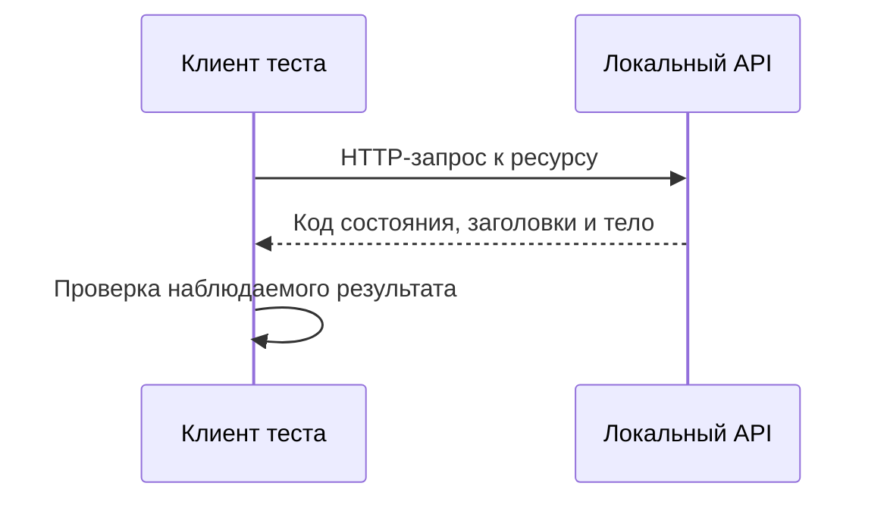

# HTTP и REST для API-тестирования

## Связь с предыдущей главой

Главы 176–185 завершили UI-слой: тест взаимодействовал с системой через браузер. Теперь мы переходим на другую границу и обращаемся к серверу напрямую через HTTP.

## Цель главы

Разделить HTTP как протокол, REST как архитектурный стиль и API-тест как проверку наблюдаемого поведения сервера.

## Главный вопрос

Какие свойства HTTP и REST определяют поведение API-теста?

## Мотивация

UI-тест показывает поведение системы глазами пользователя, но подготовка данных и проверка серверных правил через интерфейс часто медленны. API-тест отправляет запрос непосредственно серверу и получает ответ без браузерных действий.

## Теория

### HTTP: четыре части запроса и три части ответа

HTTP — протокол прикладного уровня, который описывает обмен сообщениями между клиентом и сервером.

Клиент выбирает метод и URL, добавляет заголовки и при необходимости тело. Сервер обрабатывает сообщение и возвращает код состояния, заголовки и тело ответа.



Эта структура одинакова для любого HTTP API. Различается только содержание — и его задаёт контракт конкретного сервиса, а не протокол.

### REST — это стиль, а не протокол

REST не является отдельным протоколом. Это архитектурный стиль, в котором взаимодействие строится вокруг ресурсов и их представлений.

Ресурс — сущность, к которой обращается клиент: задача, пользователь или отчёт. URL идентифицирует ресурс или коллекцию, а HTTP method выражает намерение операции.

На практике большинство сервисов, которые называют REST API, реализуют лишь часть ограничений стиля. JSON-over-HTTP API может использовать идеи REST, не реализуя все ограничения строго. Для тестировщика это означает простое правило: проверять надо фактический контракт сервиса, а не соответствие идеалу из учебника.

Название маршрута само по себе не является требованием протокола. `/api/v1/work-items` и `/api/v1/getWorkItems` одинаково допустимы с точки зрения HTTP — и одинаково требуют документации.

### Stateless не означает «без данных»

Взаимодействие без состояния означает, что каждый запрос содержит информацию, необходимую серверу для его обработки. HTTP-взаимодействие не хранит сценарий теста между запросами автоматически.

При этом серверные ресурсы прекрасно сохраняются между запросами: созданная задача никуда не денется. Stateless относится к **протоколу**, а не к данным.

Практический вывод для теста прямой: авторизацию, контекст и идентификаторы нужно передавать в каждом запросе, а созданные данные — убирать за собой. Ни то, ни другое сервер не сделает сам.

### Безопасные методы

Безопасный метод не должен изменять ожидаемое состояние ресурса. GET, HEAD и OPTIONS относятся к безопасным: их можно вызывать сколько угодно раз, не меняя систему.

Это свойство удобно в тестах: чтение состояния для проверки не влияет на сценарий и не требует очистки. Но полагаться на него безоговорочно нельзя — «безопасный» описывает **намерение** метода, а не гарантию реализации. Сервис, который на GET пишет в журнал или продлевает сессию, формально нарушает ожидание, и это обнаруживается только чтением контракта.

### Идемпотентность и что она обещает

Идемпотентный метод при повторении с теми же данными должен приводить сервер к тому же итоговому состоянию.

| Метод | Обычная семантика | Идемпотентность |
| --- | --- | --- |
| GET | чтение представления | да |
| POST | создание или команда | обычно нет |
| PUT | полное желаемое представление по известному URL | да |
| PATCH | изменение части ресурса | зависит от операции |
| DELETE | удаление ресурса | да по итоговому отсутствию |

Важна точность формулировки. Идемпотентность говорит об **итоговом состоянии**, а не об ответе: повторный DELETE может вернуть 404 вместо 204, и это не нарушение. Она также не обещает отсутствия побочных эффектов вроде записи в журнал или отправки уведомления при каждом вызове.

Указанные в таблице значения — соглашения. Точная семантика задаётся API-контрактом конкретного сервиса, и тест проверяет именно его.

### Почему это важно именно в автотестах

Понимание безопасных и идемпотентных методов напрямую влияет на три вещи.

**Подготовка данных.** Идемпотентная подготовка выдерживает повторный запуск: PUT с известным идентификатором можно выполнить дважды, POST — обычно нет.

**Очистка.** DELETE идемпотентен по результату, поэтому очистка может не проверять, существует ли ресурс: достаточно обработать возможный 404 как допустимый исход.

**Повторный запуск теста.** Сценарий, построенный на неидемпотентных операциях без уникальных данных, при повторе создаёт дубликаты — и падает не там, где сломалось приложение.

### Где заканчивается API-тест

API-тест не проверяет браузерную разметку и пользовательское взаимодействие. UI-тест не заменяет точную проверку HTTP-контракта.

Эти уровни дополняют друг друга и имеют разные причины падения. Сломанная вёрстка не уронит API-тест, а изменившийся формат ответа не обязательно уронит UI-тест — интерфейс может показать пустой список вместо ошибки. Именно поэтому оба уровня нужны, и каждый отвечает за своё.

## Внутренний механизм

HTTP-взаимодействие не хранит сценарий теста между запросами автоматически. Взаимодействие без состояния означает, что каждый запрос содержит информацию, необходимую серверу для его обработки. При этом серверные ресурсы могут сохраняться между запросами: stateless не означает отсутствие состояния данных.

Безопасный метод не должен изменять ожидаемое состояние ресурса. Идемпотентный метод при повторении с теми же данными должен приводить сервер к тому же итоговому состоянию. Идемпотентность не обещает одинаковый служебный ответ или отсутствие логирования каждого вызова.

```text
examples/03-automation-qa/chapter-186/01-http-rest.api.ts
```

Пример дважды отправляет одинаковый PUT для одного ресурса и проверяет итоговое представление. Он демонстрирует идемпотентный результат, а не универсальное правило реализации любого PUT.

## Главная ментальная модель

API-тест — это клиент, который отправляет HTTP-сообщение к ресурсу и проверяет договорённость, видимую в ответе и состоянии системы.

## Практические примеры

- GET читает представление ресурса и обычно считается безопасным и идемпотентным.
- POST часто запускает создание или команду, но точная семантика задаётся API-контрактом.
- PUT обычно передаёт полное желаемое представление по известному URL и является идемпотентным.
- PATCH описывает изменение части ресурса; его идемпотентность зависит от операции.
- DELETE обычно является идемпотентным по итоговому отсутствию ресурса, хотя повторный код состояния может отличаться.

## Automation QA

Понимание безопасных и идемпотентных методов помогает проектировать повторяемую подготовку, очистку и повторный запуск. Тест всё равно должен проверять фактический контракт конкретного сервиса, а не полагаться только на общие соглашения.

## Концептуальные границы и компромиссы

API-тест не проверяет браузерную разметку и пользовательское взаимодействие. UI-тест не заменяет точную проверку HTTP-контракта. Эти уровни дополняют друг друга и имеют разные причины падения.

## Распространённые мифы

**Миф: REST — это протокол.**
Протокол здесь HTTP. REST — архитектурный стиль, и большинство сервисов реализуют его частично.

**Миф: stateless означает, что сервер ничего не хранит.**
Это свойство протокола, а не данных. Созданные ресурсы сохраняются и требуют очистки.

**Миф: идемпотентный метод всегда возвращает одинаковый ответ.**
Обещается одинаковое итоговое состояние. Повторный DELETE может вернуть другой код.

**Миф: GET гарантированно ничего не меняет.**
«Безопасный» описывает намерение. Конкретная реализация может вести журнал или продлевать сессию.

**Миф: по имени маршрута видно, что он делает.**
Имя — соглашение команды. Семантику операции задаёт контракт, и её надо читать.

## Частые вопросы

**Зачем тестировщику различать безопасные и идемпотентные методы?**
От этого зависит, выдержит ли подготовка и очистка повторный запуск теста.

**Почему повторный DELETE с кодом 404 — не ошибка?**
Идемпотентность относится к итоговому состоянию: ресурса нет и после первого, и после второго вызова.

**Можно ли опираться на общие соглашения о методах?**
Как на отправную точку — да. Проверять всё равно нужно фактический контракт сервиса.

**Нужны ли API-тесты, если есть UI-тесты?**
Да. Они падают по разным причинам: API-тест видит изменение контракта, которое интерфейс может скрыть пустым состоянием.

**Что делать, если API не следует REST?**
Тестировать по фактическому контракту. Соответствие стилю — не предмет проверки.

## Распространённые ошибки

- Считать HTTP и REST синонимами.
- Называть любой JSON API полностью RESTful.
- Полагать, что stateless API не хранит серверные данные.
- Считать POST всегда создающим ресурс.
- Ожидать только код 200 от любой успешной операции.
- Путать идемпотентность с одинаковым ответом на каждый вызов.

## Краткие итоги

- HTTP задаёт формат обмена между клиентом и сервером.
- REST организует взаимодействие вокруг ресурсов и представлений.
- Метод выражает намерение, но точный контракт принадлежит API.
- Безопасность и идемпотентность методов важны для повторяемых тестов.
- API-тест проверяет серверную границу без UI-действий.

## Что нужно запомнить

- HTTP — протокол, REST — архитектурный стиль.
- Stateless interaction не исключает серверное состояние ресурсов.
- Идемпотентность относится к итоговому состоянию операции.
- Реальный контракт важнее упрощённых правил о методах.
- API- и UI-тесты отвечают на разные вопросы.

## Быстрая проверка

1. Чем HTTP отличается от REST?
2. Что в API называется ресурсом?
3. Почему stateless не означает отсутствие данных на сервере?
4. Как идемпотентность помогает тестовой автоматизации?
5. Что API-тест не проверяет в UI?

## Практика

```text
practice/03-automation-qa/186-http-and-rest-for-api-testing.md
```

## Переход к следующей главе

Теперь известна модель обмена. Глава 187 разберёт части HTTP-запроса и покажет, где именно тест может передать неверные данные.
