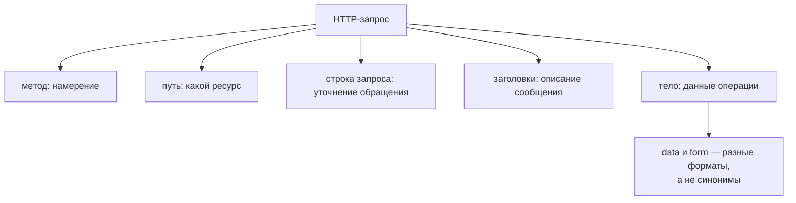

# Структура HTTP-запроса

## Связь с предыдущей главой

Глава 186 представила HTTP-запрос как сообщение клиента к ресурсу. Теперь нужно разобрать поля этого сообщения и ответственность каждого из них.

## Цель главы

Научиться выбирать URL, параметры, заголовки, `Content-Type` и тело запроса в соответствии с проверяемым контрактом.

## Главный вопрос

Из каких частей состоит запрос и какую ошибку может содержать каждая из них?

## Мотивация

Сервер может отклонить запрос не из-за бизнес-правила, а из-за неверного пути, заголовка или формата тела. Без разделения частей сообщения тесту трудно объяснить причину ответа.

## Теория

### Адрес: путь выбирает ресурс, строка запроса уточняет обращение

URL включает схему, узел, необязательный порт, путь и строку запроса.

Параметр пути подставляется в путь и идентифицирует конкретный ресурс: `/api/v1/work-items/<id>`. Параметр строки запроса уточняет выборку или режим операции: `?status=NEW&limit=5`.

Разница не стилистическая. Путь отвечает на вопрос «какой ресурс», строка запроса — «как именно его отдать». Фильтр в пути и идентификатор в строке запроса одинаково работают технически, но ломают читаемость контракта.

### Кодирование значений — не забота теста

Значения параметров должны кодироваться как данные, а не собираться небезопасной конкатенацией.

Playwright принимает `params` отдельным параметром и кодирует их сам:

```ts
await request.get("/echo", { params: { source: "api test", status: "NEW&OLD" } });
// уходит: /echo?source=api+test&status=NEW%26OLD
```

Пробел превратился в `+`, амперсанд — в `%26`. Собранная вручную строка `"?source=" + value` дала бы либо неверный запрос, либо случайный дополнительный параметр, если значение пришло из данных теста.

### Заголовки описывают сообщение

Заголовки передают метаданные: формат тела, допустимый формат ответа, учётные данные или correlation ID.

Имена заголовков регистронезависимы — `X-TEST-ROLE` и `x-test-role` это один и тот же заголовок, и сервер прочитает его одинаково. Правила сравнения **значений** при этом определяются конкретным заголовком: например, значения `Authorization` регистрозависимы.

Стоит различать два похожих заголовка:

| Заголовок | Что означает |
| --- | --- |
| `Content-Type` | формат тела, которое отправляет клиент |
| `Accept` | формат, который клиент готов принять |
| `Authorization` | учётные данные |
| `Cookie` | состояние cookies HTTP-клиента |

`Content-Type` не сообщает, что клиент готов принять; для этого используется `Accept`, если контракт его учитывает.

### Тело: `data`, `form` и почему это разные параметры

Тело запроса содержит данные операции. Playwright принимает `params`, `headers`, `data` и `form` как разные параметры запроса — и каждый из них влияет на то, как сформируется сообщение:

| Параметр | Что уходит на сервер | `Content-Type` |
| --- | --- | --- |
| `data` с объектом | JSON | `application/json` |
| `data` со строкой | строка как есть | `application/octet-stream` |
| `form` | пары ключ-значение | `application/x-www-form-urlencoded` |
| `multipart` | составное тело | `multipart/form-data; boundary=...` |

Строка во второй строке таблицы — распространённая ловушка. Ручной `JSON.stringify()` без необходимости добавляет лишнюю точку ошибки: тело уйдёт верное, а заголовок будет `application/octet-stream`, и сервис почти наверняка ответит ошибкой формата. При использовании `data` с объектом клиент сериализует JSON и задаёт подходящий `Content-Type` сам.

Данные формы имеют другую кодировку и применяются только тогда, когда этого требует контракт.

### Тело есть не у каждого запроса

Наличие тела определяется контрактом, а не только названием метода.

Для GET тело обычно не используют из-за неоднозначной поддержки клиентами, серверами и промежуточными узлами. Технически отправить его можно — Playwright передаст тело и с GET, и сервер его получит, — но полагаться на такое поведение в тесте не стоит: посредник вправе его отбросить.

### Как локализовать ошибку в запросе

При отрицательном ответе инженер сначала локализует ошибку по частям запроса — и делает это по одной части за раз:

1. **маршрут** — тот ли путь и та ли версия API;
2. **параметры** — правильные ли значения и не потерялись ли при кодировании;
3. **метаданные** — есть ли авторизация, верен ли `Content-Type`;
4. **формат тела** — JSON ли там, где ожидается JSON;
5. **данные** — верны ли сами значения.

Такой порядок уменьшает случайные изменения сразу нескольких полей — типичную причину того, что запрос «вдруг заработал», а почему, осталось неизвестным.

### Структура одна, содержание разное

Не каждый запрос имеет тело. Не каждый API использует одинаковые имена заголовков или URL. Структура сообщения стандартна, но содержание определяется контрактом конкретного сервиса — и именно поэтому тест начинается с чтения документации, а не с копирования похожего запроса из соседнего проекта.

Запрос собирается из частей с разными обязанностями:



## Внутренний механизм

Playwright принимает `params`, `headers`, `data` и `form` как разные параметры запроса. При использовании `data` с объектом он сериализует JSON и задаёт подходящий `Content-Type`. Ручной `JSON.stringify()` без необходимости добавляет лишнюю точку ошибки.

```text
examples/03-automation-qa/chapter-187/01-request-structure.api.ts
```

Пример отправляет заголовок, JSON-тело и параметры строки запроса учебному стенду и проверяет каждую часть по её наблюдаемому следу: заголовок — по идентификатору теста в созданной записи, тело — по её содержимому, параметры — по составу выборки.

## Главная ментальная модель

HTTP-запрос — составной конверт: адрес выбирает ресурс, параметры уточняют обращение, заголовки описывают сообщение, а тело переносит данные операции.

## Практические примеры

```ts
const response = await request.post(`${baseURL}/inspect`, {
  params: { source: "api test" },
  headers: { "x-test-role": "qa" },
  data: { title: "Новая задача" },
});
```

Пробел в значении параметра кодируется API-клиентом. Тестовый заголовок не содержит секрет. JSON-объект передаётся через `data`, поэтому тест не управляет сериализацией вручную.

## Automation QA

При отрицательном ответе инженер сначала локализует ошибку по частям запроса: маршрут, параметры, метаданные, формат и тело данных. Такой порядок уменьшает случайные изменения сразу нескольких полей.

## Концептуальные границы и компромиссы

Не каждый запрос имеет тело. Не каждый API использует одинаковые имена заголовков или URL. Структура сообщения стандартна, но содержание определяется контрактом конкретного сервиса.

## Распространённые мифы

**Миф: `JSON.stringify()` перед отправкой лишним не будет.**
Будет: строка уходит с `Content-Type: application/octet-stream`, и сервис отвечает ошибкой формата. Объект в `data` сериализуется сам.

**Миф: `Content-Type` сообщает, какой ответ хочет клиент.**
Он описывает отправленное тело. Ожидаемый формат ответа выражает `Accept`.

**Миф: параметры можно склеить строкой, если значения простые.**
Значение приходит из данных теста и может содержать пробел или `&`. Кодирование — работа клиента.

**Миф: у GET не может быть тела.**
Технически может, и Playwright его отправит. Но поддержка неоднозначна, и посредник вправе тело отбросить.

**Миф: имена заголовков чувствительны к регистру.**
Имена — нет. Правила сравнения значений зависят от конкретного заголовка.

## Частые вопросы

**Что класть в путь, а что в строку запроса?**
Идентификатор ресурса — в путь, фильтры и режимы выборки — в строку запроса.

**Когда нужен `form` вместо `data`?**
Только когда контракт требует `application/x-www-form-urlencoded`. Для JSON API используется `data` с объектом.

**Сервер отвечает 400, а тело выглядит верным. Где искать?**
Проверьте `Content-Type`: частая причина — вручную сериализованная строка вместо объекта.

**Как передать файл?**
Через `multipart` — клиент сформирует составное тело и границу сам.

**С чего начинать разбор неудачного запроса?**
С маршрута, затем параметры, метаданные, формат и только потом сами данные — меняя по одной части за раз.

## Распространённые ошибки

- Путать параметр пути и параметр строки запроса.
- Склеивать query без кодирования значений.
- Указывать JSON-тело с неверным `Content-Type`.
- Отправлять секреты в URL, где они попадают в логи.
- Одновременно использовать `data` и ручную сериализацию без причины.
- Проверять маршрут, параметры и тело одной неясной проверкой.

## Краткие итоги

- URL и path выбирают ресурс.
- Query уточняет выборку или режим.
- Заголовки описывают сообщение и служебный контекст.
- `Content-Type` определяет формат тела.
- JSON и form data требуют разных способов передачи.

## Что нужно запомнить

- Каждая часть запроса имеет отдельную ответственность.
- Query values нужно кодировать через API клиента.
- `Content-Type` описывает отправляемое тело.
- `data` позволяет Playwright корректно отправить JSON.
- Секреты не должны попадать в URL или диагностический вывод.

## Быстрая проверка

1. Чем параметр пути отличается от параметра строки запроса?
2. Что описывает `Content-Type`?
3. Когда нужно тело запроса?
4. Почему ручная сборка query опасна?
5. Что делает параметр `data`?

## Практика

```text
practice/03-automation-qa/187-http-request-structure.md
```

## Переход к следующей главе

После отправки составного сообщения сервер возвращает собственное составное сообщение. Глава 188 разберёт уровни HTTP-ответа и стратегию их проверки.
